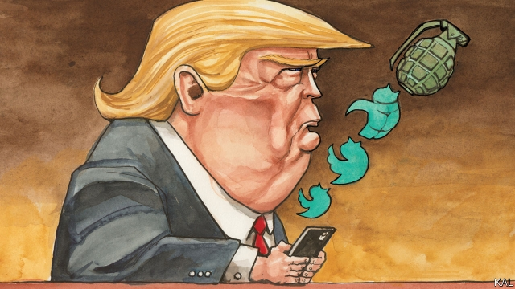
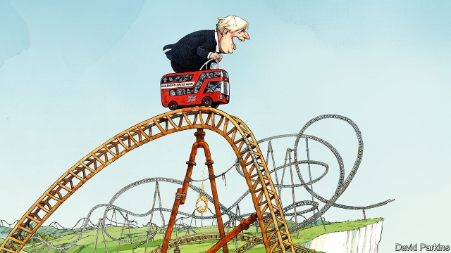
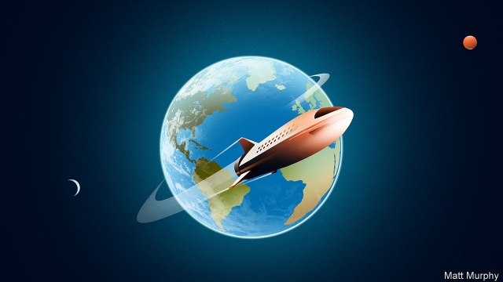

###### On happiness and politics, Zhao Ziyang, America, plastic, Boris Johnson, the Moon

# Letters to the editor 

 

> Aug 10th 2019 

I can think of at least one reason why the increase in happiness in European countries coincides with the rise of populist parties (“The satisfaction paradox”, July 13th). The rise in happiness that has been recorded in national surveys does not necessarily affect elections, as only a subset of the population turns out. And populist parties are more successful at elections with a lower turnout. The parallel rise of happiness and populist parties is not puzzling if the satisfied tend to stay at home on election day. 

DOMINIK SCHRAFFPost-doctoral researcherCentre for Comparative and International StudiesETH Zurich 

Take Poland, for example. It has enjoyed economic growth, low unemployment and rising living standards, and seen the populist Law and Justice Party romp home at elections. Voter turnout hovers around 50%. Why don’t half these Poles go to the polls? Do they stay away because they are happy, or are they unsatisfied? Some might believe that their single vote does not matter. Some might think that none of the parties represents their views. Whatever the reason, there is a growing realisation that if only some of those who stay away could be persuaded to vote, the rise of right-wing populists could be forestalled. 

PIOTR ZIENTARAAssociate professor of economicsUniversity of Gdansk 

Thomas Jefferson did not think of “the pursuit of happiness” in terms of our inward-looking contemporary scale of satisfaction. It is an elusive turn of phrase, but one closer to the classical philosophical notion of happiness as part of the individual’s civic existence. Through that lens, the pursuit, that is, the attainment or practice, of happiness reflects the virtuous life of the citizen within the body politic. This is the inverse of happiness as a quantity to be measured and exploited by politicians. 

DEREK O’LEARYBerkeley, California 

 

Your obituary of Li Peng (July 27th) described Zhao Ziyang, the general-secretary of the Communist Party at the time of the Tiananmen massacre in 1989, as a “seeming liberal”. Indeed, when he ran Sichuan province, Zhao allowed farm prices to fluctuate, causing production to increase. And in 1988 he invited Milton Friedman to be his only Western consultant after China experienced high inflation. Friedman said that Zhao was the best economist he had ever met in a socialist country. 

BERTRAND HORWITZAsheville, North Carolina 

 

Along with most other media, The Economist reminded its readers that three of the four congresswomen who were subjected to Donald Trump’s rants were born in America and the fourth is a naturalised citizen (Lexington, July 20th). It was commendable that you described his language as “racist” rather than “racially charged”. However, one point that is always overlooked is that Alexandria Ocasio-Cortez is not “of recent migrant stock”. Puerto Ricans have been citizens of the United States for many decades. Her mother did not emigrate to New York from Puerto Rico any more than I emigrated to New York from Iowa. We simply moved. 

It is unfortunate that Americans need to be reminded that Puerto Rico is a United States’ territory and that Puerto Ricans are American citizens. 

JOSEPH ENGLISHNew York 

One of the charges laid at the door of liberals is hypocrisy, the odious practice of preaching values and promoting solutions without accepting any of the consequences. For example, liberals (broadly speaking) are keen to allow asylum-seekers into their countries, but not into their own communities, where the only outsiders who are permanently welcome are those who can afford the house prices and private-school fees. 

My suggestion is that you bear some of the consequences of your values. Why not convert a small amount of space at each of your offices around the world into accommodation for asylum-seekers? Your good action would be widely publicised and set an example that might be replicated elsewhere. That is, if your desire to defeat Trumpian bigotry is genuine. 

THOMAS HODSONLondon 

 

Plastic pollution that remains local to its source, either on land or in shallow waters, is certainly less of a problem than the vast amount accumulating in our global oceans (Schumpeter, July 27th). Some plastics are denser than water and do not float. The lighter plastics can incorporate heavier particles in their polymer resins to ensure they don’t float either. Plastic bottles, which otherwise float like boats on the water surface, can be shaped to flood easily and thus sink rapidly. 

It seems the packaging companies and their heedless customers are avoiding a simple and inexpensive fix to the worst part of the plastic pollution problem. Plastics and plastic bottles should all be made to sink to the ocean floor. 

ION YADIGAROGLUPartnerTechnology Impact FundNew York 

 

You compared Boris Johnson to Winston Churchill, because both leaders “inherited” a serious crisis (“Here we go”, July 27th). I disagree. Mr Johnson did not inherit, but actively helped create this Brexit crisis. He deserves no comparison to Churchill. 

JOCHEM BORRENEindhoven, Netherlands 

If Mr Johnson were to lose power in the coming months he may not, as you suggest, be Britain’s “shortest-serving prime minister”. Counting only those who formed fully effective ministries, he could still beat George Canning, who served as prime minister for 119 days in 1827. By a more generous definition, the record could belong to the Earl of Bath, who held office for 48 hours in 1746. 

Horace Walpole commented that the earl “never transacted one rash thing...and left as much money in the Treasury as he found in it”. Sadly, Mr Johnson is also unlikely to match these accomplishments. 

JACOB WILLIAMSLondon 

Mr Johnson’s closest parallel may be neither Churchill nor Neville Chamberlain but Galba, the Roman emperor who succeeded Nero in 68AD but lasted only a few months. The pithy and scathing assessment of Tacitus was “omnium consensu capax imperii, nisi imperasset”. Rough translation: had he never become emperor everyone would have agreed that he had the capacity to reign. 

MARTIN EATONBromsgrove, Worcestershire 

 

You mentioned China’s plan to land someone on the Moon by 2035 (“The next 50 years in space”, July 20th). This may be a repeat visit by China. According to legend one Wan Hu became the world’s first astronaut more than 4,000 years ago by tying 47 fireworks to his chair. The shear impact of his landing on the Moon caused the formation of a large crater, which is named after him. 

TED PAULWeymouth, Dorset 
<<<<<<< HEAD

-- 

 单词注释:

1.politic['pɒlitik]:a. 精明的, 明智的, 策略的 

2.Ziyang[]:资阳（地名） 

3.boris['bɔris]:n. 鲍里斯（男子名） 

4.johnson['dʒɔnsn]:n. 约翰逊（姓氏） 

5.Aug[]:abbr. 八月（August） 

6.coincide[.kәuin'said]:vi. 一致, 符合 [化] 重合 

7.Populist['pɔpjulist]:n. 民粹派的成员 

8.paradox['pærәdɒks]:n. 似非而是的论点, 自相矛盾的话, 悖论, 怪人怪事 [化] 佯谬 

9.subset['sʌbset]:n. 子集 [计] 子集; 子设备 

10.turnout['tә:naut]:n. 聚集的人群, 出席者, 产量 [化] 输出; 产额 

11.dominik[]: [人名] 多米尼克 

12.Zurich['zuәrik]:n. 苏黎士 

13.Poland['pәulәnd]:n. 波兰 

14.romp[rɒmp]:n. 喧闹游玩, 顽皮女孩 vi. 喧闹玩耍, 轻快奔跑 

15.voter['vәutә]:n. 选民, 投票人 [法] 选民, 选举人, 投票人 

16.hover['hʌvә]:vi. 盘旋, 翱翔, 徘徊 vt. 孵 n. 翱翔 

17.realisation[.riәlai'zeiʃәn. ri:-. -li'z-]:n. 实现, 完成（等于realization） 

18.forestal[]:a. forest（森林）的变形 

19.piotr[]:n. (Piotr)人名；(波、俄)彼得 

20.Gdansk[^ә'dɑ:nsk]:格但斯克(旧称Danzig但泽, 波兰港市) 

21.thoma[]:n. (Thoma)人名；(阿尔巴、阿拉伯)索玛；(英、德、罗、匈、捷、塞、瑞典)托马 

22.jefferson['dʒefәsn]:n. 杰弗逊（姓氏） 

23.elusive[i'lu:siv]:a. 难懂的, 易忘的, 难以捉摸的 

24.philosophical[.filә'sɒfikl]:a. 哲学的, 冷静的, 达观的, 哲学上的, 哲学家似的 

25.civic['sivik]:a. 市的, 市民的, 公民的 [法] 公民的, 市民的, 公民资格的 

26.len[]:n. 伦恩（男子名） 

27.attainment[ә'teinmәnt]:n. 达到 

28.virtuous['vә:tʃuәs]:a. 品德高尚的, 公正的, 贞洁的, 有效力的 

29.derek['derik]:n. 德里克（男名） 

30.California[.kæli'fɒ:njә]:n. 加利福尼亚 

31.obituary[ә'bitjuәri]:a. 关于死亡的, 讣告的 n. 讣告 

32.peng[]:n. 执业工程师 

33.massacre['mæsәkә]:n. 大屠杀 vt. 大屠杀, 残杀 

34.Sichuan['si:tʃ'wɑ:n]:四川(位于中国西南部、长江上游) 

35.fluctuate['flʌktʃueit]:vi. 变动, 起伏, 动摇 vt. 使波动, 使动摇 

36.milton['miltәn]:n. 米尔顿（男子名, 英国诗人） 

37.Friedman[]:n. 弗里德曼（男子名） 

38.inflation[in'fleiʃәn]:n. 胀大, 夸张, 通货膨胀 [化] 充气吹胀; 膨胀 

39.economist[i:'kɒnәmist]:n. 经济学者, 经济家 [经] 经济学家 

40.Bertrand['b\\:trәnd]:n. 伯特兰(男子名) 

41.Carolina[.kærә'lainә]:n. 北(或南)卡罗来纳州 

42.economist[i:'kɒnәmist]:n. 经济学者, 经济家 [经] 经济学家 

43.congresswoman['kɒŋgreswumәn]:n. 国会女议员, 众议院女议员 

44.rant[rænt]:v. 咆哮, 痛骂 n. 咆哮, 大话 

45.naturalise['nætʃәrәlaiz]:vt. 授与...以国籍, 使入国籍, 移植, 移养, 采纳, 顺化, 归化 

46.lexington['leksiŋtәn]:n. 列克星敦市（位于美国肯塔基州） 

47.commendable[kә'mendәbl]:a. 值得赞美的, 很好的 

48.racist['reisist]:n. 种族主义者 [法] 种族主义的, 种族歧视 

49.racially['reiʃәli]:adv. 按人种, 人种上 

50.alway['ɔ:lwei]:adv. 永远；总是（等于always） 

51.alexandria[,æli^'zɑ:ndriә]:n. 亚历山大港（位于埃及）；亚历山大市（美国弗吉尼亚一城市）；亚历山大大帝 

52.migrant['maigrәnt]:n. 候鸟, 移居者 [法] 移居者 

53.Puerto[]:n. 垭口, 港口, 山口 n. (Puerto)人名；(西)普埃尔托 

54.rican[]:adj. 波多黎各岛的(人) n. 波尔图 [网络] 日佳 

55.emigrate['emigreit]:v. (使)移居, (使)移民 

56.york[jɔ:k]:n. 约克郡；约克王朝 

57.rico[]:abbr. 反诈骗腐败组织集团犯罪法（Racketeer Influenced and Corrupt Organizations Act） 

58.Iowa['aiәwә]:n. 衣阿华州 

59.Joseph['dʒәuzif]:n. 约瑟夫（男子名）；约瑟（圣经中雅各的第十一子） 

60.hypocrisy[hi'pɒkrәsi]:n. 伪善 [法] 伪善, 虚伪 

61.odious['әudiәs]:a. 可憎的, 可厌的, 丑恶的 

62.preach[pri:tʃ]:v. 传道, 讲道, 说教, 宣讲, 鼓吹 n. 说教, 布道 

63.broadly['brɒ:dli]:adv. 宽广地, 明白地, 无礼貌地 

64.outsider[' aut'saidә]:n. 外人, 局外人, 非会员, 外行, 门外汉, 比赛中获胜可能性不大的选手 [经] 外船公司 

65.publicise['pʌblisaiz]:vt. 公布, 为...做广告, 宣传 

66.replicate['replikeit]:vt. 折叠, 折转, 复制 n. 复现试验, 复制品, 高八度音 a. 复现的, 复制的, 折转的, 弯回的 

67.Trumpian[]:特朗普的 

68.bigotry['bigәtri]:n. 盲从, 偏见, 偏执的行为(或态度) 

69.les[lei]:abbr. 发射脱离系统（Launch Escape System） 

70.Schumpeter[]:n. 熊彼特（美籍奥匈帝国经济学家, 当代资产阶级经济学代表人物之一） 

71.dens[denz]:[医] 牙, 齿 

72.incorporate[in'kɒ:pәreit]:a. 合并的, 组成公司的, 一体化的 vt. 吸收, 合并, 使组成公司, 体现 vi. 合并, 混合, 组成公司 

73.polymer['pɒlimә]:n. 聚合物, 聚合体 [化] 多聚体; 高分子; 大分子; 聚合物 

74.resin['rezin]:n. 树脂 vt. 涂树脂于 

75.packaging['pækidʒiŋ]:n. 包装, 包装业, 包装术 [计] 组装; 封装 

76.heedless['hi:dlis]:a. 不注意的, 不留心的, 不谨慎的 

77.ion['aiәn]:n. 离子 [化] 离子 

78.winston['winstәn]:n. 温斯顿（姓氏, 男子名） 

79.Churchill['tʃә:tʃil]:n. 邱吉尔 

80.actively['æktivli]:adv. 活跃地, 积极地 

81.Brexit[]:[网络] 英国退出欧盟 

82.jochem[]:n. (Jochem)人名；(法)若尚；(德)约赫姆 

83.Netherlands['neðәlәndz]:n. 荷兰 

84.fully['fuli]:adv. 十分地, 完全地, 充分地 

85.george[dʒɔ:dʒ]:n. 乔治（男子名）；自动操纵装置；英国最高勋爵勋章上的圣乔治诛龙图 

86.canning['kæniŋ]:n. 罐头制造 [建] 装罐头 

87.earl[ә:l]:n. 伯爵 

88.horace['hɔrәs]:n. 贺拉斯（男子名） 

89.walpole['wɔ:lpәul]:n. 沃波尔（姓氏） 

90.earl[ә:l]:n. 伯爵 

91.transact[træn'sækt]:vt. 办理, 处理 vi. 作交易, 谈判 

92.rash[ræʃ]:a. 轻率的, 匆忙的, 鲁莽的 n. 皮疹 

93.treasury['treʒәri]:n. 国库, 宝库, 财政部, 国库券 [经] 库存, 国库, 金库 

94.accomplishment[ә'kʌmpliʃmәnt]:n. 成就, 完成 

95.jacob['dʒeikәb]:n. [圣经]雅各（以色列人的祖先）；雅各布（男子名） 

96.Neville['nevil]:n. 内维尔（男子名） 

97.chamberlain['tʃeimbәlin]:n. 内侍, 管家, 掌管财物的人 [法] 管家, 国王侍从, 收款员 

98.galba[]:n. (Galba)人名；(法)加尔巴；(匈)高尔鲍 土蜗属 

99.nero['niәrәu]:n. 尼禄（古罗马暴君） 

100.pithy['piθi]:a. 有髓的, 由髓组成的, 简洁有力的 

101.scathing['skeiðiŋ]:a. 伤害的, 损伤的, 严厉的 

102.Tacitus[tæsitəs]:n. 塔西佗（古罗马元老院议员） 

103.omnium['ɔmniәm]:n. [股]担保证券的总值 

104.capax[]:[网络] 资产支出；大河蚌；资本支出 

105.nisi['naisai]:[法] 除非, 不然则 

106.Martin['mɑ:tin]:n. 马丁, 圣马丁鸟 

107.Worcestershire['wjstәʃiә(r)]:伍斯特郡[英国英格兰原郡名] 

108.wan[wɒn]:a. 苍白的, 无血色的, 病态的, 暗淡的 v. (使)变苍白 [计] 广域网 

109.hu[]:abbr. 海南航空公司在国际航空运输协会中的二字代码；匈牙利（Hungary）；英国无国界卫生组织（Health Limited） 

110.crater['kreitә]:n. 火山口, 环行山, 弹坑 [化] 焊口; 火山石; 弧坑; 焰口 

111.ted[ted]:vt. 翻晒 

112.dorset['dɔ:sit]:n. 多塞特（人名）；多尔塞特棉粗平布 
=======
>>>>>>> 50f1fbac684ef65c788c2c3b1cb359dd2a904378

