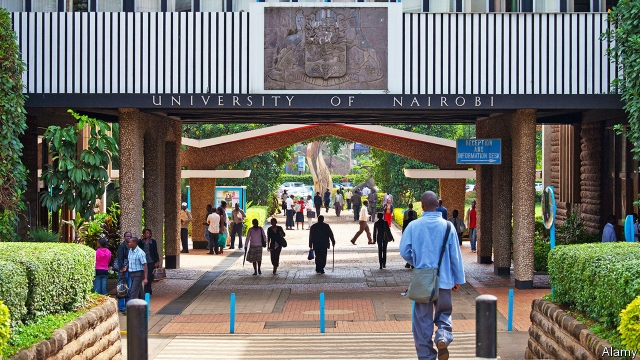
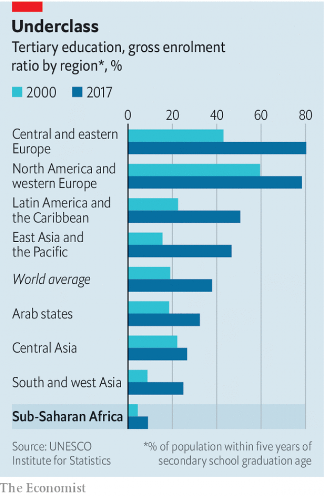

###### Tertiary education in Africa

# A booming population is putting strain on Africa’s universities 

 

> print-edition iconPrint edition | Middle East and Africa | Aug 10th 2019 

“IN RWANDA IT’S not easy to get a job,” says Jean-Paul Bahati, a student at Kepler, a college founded in Kigali in 2013. But the 22-year-old believes his course will help him stand out. He studies health-care management, a growing industry in Rwanda. Kepler’s degrees are accredited by Southern New Hampshire University (SNHU), which runs one of the largest online universities in America. The first six months are a crash course in skills such as critical thinking, English, communication and IT. “I like that Kepler knows what employers want,” says Mr Bahati. 

In recent decades millions of young people like Mr Bahati have swelled the number of students in sub-Saharan Africa. Today 8m are in tertiary education, a term that includes vocational colleges and universities. That is about 9% of young people—more than double the share in 2000 (4%), but far lower than in other regions (see chart). In South Asia the share is 25%, in Latin America and the Caribbean, 51%. 

Both the number and share of young people in tertiary education in sub-Saharan Africa will keep growing. The region has about 90m people aged 20-24, a figure projected to double over the next 30 years. Whereas 42% of that age group had completed secondary school in 2012, 59% are forecast to do so by 2030. If African countries are to meet the aspirations of educated young people, they must ensure there are opportunities for further study. 

 

So far they have struggled. State-run institutions that trained the post-colonial elites are finding it hard to serve a mass market. In much of the region public funding per student has fallen since the late 1990s as enrolment has surged. 

This reflects competing priorities. In the poorest African countries it costs 27 times more to fund a university place than one at primary school. Since students typically come from affluent families, university spending subsidises the children of elites. In Ghana, the higher-education spending that goes to the richest tenth of households is 135 times that spent on the poorest tenth. Policymakers find themselves deciding whether to spend scarce resources on helping poor children attend school or rich children go to university. 

The effects of spreading public funding thinly are apparent on campuses. African universities have 50% more students per professor than the global average. Students are more likely to study humanities degrees than science ones, which are more expensive to teach. Over 70% of graduates have arts degrees, versus 53% in Asia. 

More young people are heading abroad instead. In 2017 some 374,000 studied overseas, up from 156,000 two decades earlier. Many never return. One in nine Africans with a tertiary qualification lives in an OECD country, compared with one in 13 Latin Americans and one in 30 Asians. 

With the public sector struggling to meet demand for places and to offer a high-quality education, the private sector is filling the gap. From 1990 to 2014 the number of public universities in sub-Saharan Africa rose from 100 to 500, while private universities grew from 30 to more than 1,000. Many are small. In Kigali, the University of Rwanda has 30,000 students, while private ones have a few hundred each. But they are enrolling a growing proportion of students, notes Daniel Levy of the University of Albany. In 2000 about 10% of African students went to private institutions; by 2015 the share was 20%. In Rwanda more than half do so. 

Students at private universities often benefit from new ways of teaching. Consider Ashesi, which has grown steadily since its founding in 2002 in Accra. Much of Ghanaian higher education is based on rote learning, observes Patrick Awuah, its founder and a former Microsoft engineer, and was not “teaching students to think critically”. He based Ashesi on American liberal-arts colleges, where students combine humanities and sciences. 

Vocational outfits can innovate, too. ALX, a for-profit institution that opened its first campus in Nairobi last year, runs a six-month “boot-camp” in soft skills, then helps students find a six-month internship. Its gambit is that its brand becomes so strong that employers do not mind that its graduates lack a degree. 

“A traditional university model is very hard to make profitable,” says Fred Swaniker, the Ghanaian founder of ALX. He should know. In 2013 Mr Swaniker set up the African Leadership University (ALU), which was dubbed the “Harvard of Africa”. But its campuses in Mauritius ($15,000 per year for board and tuition) and Kigali ($9,000) are “too expensive”, he concedes. It has ditched plans to open dozens of campuses like these and is instead expanding the cheaper ($2,000 per year) ALX model. 

Another reason for the shift is regulation. Gaining accreditation is arduous. Rwanda made ALU buy 90 desktop computers, even though it gives students laptops. Kepler’s application ran to 1,100 pages. 

Yet the biggest barrier to expanding access to tertiary education is student financing. This is true for private and public universities, since in most African countries public ones charge upfront tuition fees. (Scholarships exist, but these are often granted on merit, not need, putting them out of reach of poor children with good but not stellar grades.) “The bottleneck is not the education model; it’s the financing,” says Teppo Jouttenus of Kepler. 

This is not just an injustice but a sign of economic inefficiency. The average gap between wages earned by graduates and non-graduates in sub-Saharan Africa is wider than in other regions. It would make sense if students could defer the expense. This would ensure that those who benefit the most from university cover the costs, leaving more public money for other things. 

Several African countries have introduced state loan schemes. But governments have struggled to chase up debts. The private sector is now trying to do a better job. Kepler and Akilah, an all-female college in Kigali, are working with CHANCEN International, a German foundation, to try out a model of student financing popular among economists—Income Share Agreements. CHANCEN pays the upfront costs of a select group of students. Once they graduate, alumni pay CHANCEN a share of their monthly income, up to a maximum of 180% of the original loan. If they do not get a job, they pay nothing. 

Kepler’s experiment began only in January. But models such as these should help more students gain qualifications, while encouraging institutions to think about their job prospects. That can only be good news for young Africans. ■ 

-- 

 单词注释:

1.tertiary['tә:ʃiәri]:a. 第三的, 第三位的, 第三产业的 n. 第三修道会会员, 第三纪 第三的; 三代的(指无机盐) 

2.Aug[]:abbr. 八月（August） 

3.rwanda[rj'ændә]:n. 卢旺达（东非国家）；卢旺达语 

4.bahati[]:n. (Bahati)人名；(刚(金))巴哈蒂 

5.kepler['keplә]:n. 开普勒（德国天文学家, 物理学家, 开普勒定律的发现者）；开普勒环形山（在月球东北象限, 直径为35公里） 

6.kigali[ki'ɡɑ:li]:n. 基加利（卢旺达的首都） 

7.rwanda[rj'ændә]:n. 卢旺达（东非国家）；卢旺达语 

8.accredit[ә'kredit]:vt. 信托, 确认, 归结于, 委派 [经] 发行信用证, 信托, 委托 

9.hampshire['hæmpʃiә]:n. 汉普郡（英国南部之一郡） 

10.snhu[]:[网络] 美国南新罕布什尔大学(Southern New Hampshire University)；美国南新大；美国新罕布什尔南方大学 

11.online[]:[计] 联机 

12.tertiary['tә:ʃiәri]:a. 第三的, 第三位的, 第三产业的 n. 第三修道会会员, 第三纪 第三的; 三代的(指无机盐) 

13.vocational[vәu'keiʃәnl]:a. 职业的 [法] 职业上的, 天职的 

14.Caribbean[.kæri'bi:әn]:n. 加勒比海 a. 加勒比海的, 加勒比人的 

15.aspiration[.æspә'reiʃәn]:n. 热望, 志向, 渴望 [医] 吸入; 吸[引], 吸引术 

16.elite[ei'li:t]:n. 精华, 精锐, 中坚分子 

17.enrolment[in'rәulmәnt]:n. 登记, 注册, 入伍, 入学, 入会, 注册人数, 入学人数 

18.surge[sә:dʒ]:n. 巨涌, 汹涌, 澎湃 vi. 汹涌, 澎湃, 颠簸, 猛冲, 突然放松 vt. 使汹涌奔腾, 急放 [计] 电压尖峰 

19.typically['tipikәli]:adv. 代表性地；作为特色地 

20.subsidise[]:vt. 给...补助金, 津贴, 资助 

21.Ghana['gɑ:nә]:n. 加纳 

22.policymaker['pɔlisi.meikә]:n. 政策制定者；决策人 

23.thinly['θinli]:adv. 薄, 细, 瘦 

24.humanity[hju:'mæniti]:n. 人性, 人类, 博爱 

25.versus['vә:sәs]:prep. 对... [法] 诉, 对, 相形 

26.oversea['әuvә'si:]:adv. 海外, 向国外, 向海外, 国外 a. 外国的, 在国外的, 在海外的, 舶来的 

27.Oecd[]:[经] 已开发国家组织 

28.sector['sektә]:n. 扇形, 部门, 部分, 函数尺, 象限仪, 段, 区段 vt. 把...分成扇形 [计] 扇面; 扇区; 段; 区段 

29.enrol[in'rәul]:vt. 登记, 使加入 vi. 参军, 注册 

30.daniel['dænjәl]:n. 丹尼尔（男子名） 

31.levy['levi]:n. 税款, 所征的人数, 征收 vi. 征税, 课税 vt. 征收, 强求, 召集 

32.Albany['ɒ:lbәni]:n. 奥尔巴尼(美国纽约州首府) 

33.Accra[ә'krɑ:]:n. 阿克拉(加纳首都) 

34.Ghanaian[^ɑ:'neiәn]:n. 加纳人 a. 加纳(人)的 

35.rote[rәut]:n. 机械性的背诵, 死记硬背 

36.patrick['pætrik]:n. 帕特里克（男子名） 

37.founder['faundә]:n. 创立者, 建立者 vt. 使沉没, 使摔倒, 弄跛, 浸水, 破坏 vi. 沉没, 摔到, 变跛, 倒塌, 失败 

38.Microsoft[]:n. (美国)微软公司 [电] 微软公司 

39.critically['kritikәli]:adv. 批评性地, 审慎地, 精密地 

40.vocational[vәu'keiʃәnl]:a. 职业的 [法] 职业上的, 天职的 

41.outfit['autfit]:n. 用具, 配备, 机构 vt. 配备, 供应 vi. 得到装备 

42.innovate['inәuveit]:vi. 改革, 创新 

43.alx[]:n. [魔兽世界]地名，阿拉希盆地（战场）。 

44.Nairobi[nai'rәubi]:n. 内罗比 

45.internship['intә:nʃip]:n. 实习医师的职务 [医] 实习医师职位, 实习医师期 

46.gambit['gæmbit]:n. 以取得优势的开局棋法, 开场白, 话题 

47.fred[fred]:n. 佛瑞德（男子名） 

48.ALU[]:[计] 运算器, 异步线路部件 

49.dub[dʌb]:vt. 配音, 轻点, 授予称号, 击 n. 一下击鼓声, 笨蛋 

50.Harvard['hɑ:vәd]:n. 哈佛大学 

51.Mauritius[mɒ:'riʃiәs]:n. 毛里求斯 

52.concede[kәn'si:d]:vt. 承认, 退让 vi. 让步 

53.accreditation[ә.kredi'teiʃәn]:n. 委派, 信托, 鉴定合格 [法] 立案, 备案, 任命 

54.arduous['ɑ:djuәs]:a. 费力的, 努力的, 险峻的 

55.desktop['desktɔp]:n. 桌面 [计] 桌面 

56.laptop[]:[计] 膝上型的 

57.upfront[ˌʌpˈfrʌnt]:a. 正直的, 坦率的; 最前面的, 首要的; 在前面的; 预先的 adv. 在最前面; 提前支付（工资） 

58.stellar['stelә]:a. 星的, 似星的, 星球的, 主要的 

59.bottleneck['bɒtlnek]:n. 瓶颈 [经] 瓶颈, 增产障碍 

60.teppo[]:[网络] 铁炮 

61.injustice[in'dʒʌstis]:n. 不公平, 非正义的行为 [法] 不公正, 不公平, 权利侵害 

62.inefficiency[.ini'fiʃәnsi]:n. 无效率, 无能 [化] 效率低; 效率差 

63.defer[di'fә:]:vi. 推迟, 延期, 听从 vt. 使推迟, 使延期 

64.akilah[]:n. 【女名】女子名 [网络] 女性；现在送精美名牌；阿基拉 

65.alumni[ә'lʌmni]:pl. 男毕业生, 男校友 

