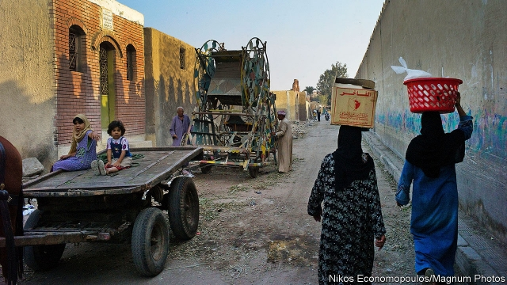
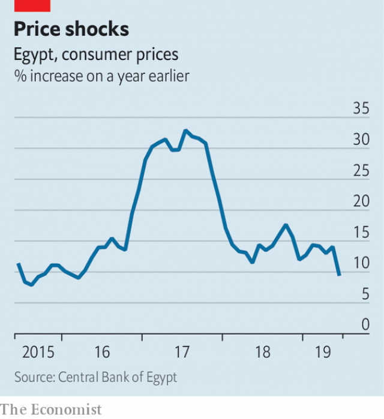

###### Poor on the Nile

# Egypt is reforming its economy, but poverty is rising 

 

> print-edition iconPrint edition | Middle East and Africa | Aug 10th 2019 

EXCEPT FOR the glow of a mobile phone behind the watermelons, the fruit-and-vegetable shop on a busy Cairo street looks deserted. The owner says his wares are 25% more expensive than last summer. As prices rise, buyers skimp: regulars who used to buy a kilogram of fruit now settle for half. He keeps the lights off between shoppers to save a few pounds. There are no lights either at the butcher’s next door, who reckons revenues are down by 20%. “I sell a lot of bones for soup,” he says. 

Last year Egypt vowed to halve poverty by 2020 and eliminate it by 2030. It is going in the wrong direction. On July 29th the national statistics agency released a long-delayed report on household finances. It found that 33% of Egypt’s 99m people were classified as poor last year, up from 28% in 2015. Even that dismal finding may not be dismal enough. The government has fixed the official poverty line at just 736 pounds ($45) a month, a figure that many economists say is too low. The World Bank said in April that 60% of Egyptians were “either poor or vulnerable”. 

The numbers are a stinging assessment of the economic reforms overseen by the president, Abdel-Fattah al-Sisi. Backed by the IMF, which approved a $12bn loan in 2016, his government cut fuel subsidies, let the currency depreciate and imposed a 14% value-added tax. These gave Egypt a primary surplus and cut its deficit to 8.3% of GDP, from 12.5% three years ago. 

But macroeconomic gains came at the expense of Egyptians themselves. Cuts to fuel subsidies have pushed up transport costs. For an Egyptian on the official poverty line, a short daily trip on Cairo’s metro would now consume 25% of their monthly income. Average household expenditures have increased by 43% since 2015. Income rose by just 33% during the same period, while household debt to banks jumped by 58%. Adjusted for inflation, which peaked at 33% in 2017 (see chart), Egyptians are earning less than they did three years ago. 

 

Though inflation has cooled, the IMF expects it to remain in double digits until at least 2021. The poorest Egyptians, who spend up to 48% of their income to eat, are hardest hit. Meat is an unaffordable luxury: a kilo of beef costs 9% of an average week’s pay. Even a humble plate of koshari, the mixture of lentils, chickpeas, rice and pasta that is a staple lunch for many, is becoming expensive. A small plate used to cost three pounds. Now restaurants charge at least five, and often more. 

Add to that a government determined to squeeze every pound out of its citizens. The price of almost every service, from driving licences to gun permits, has gone up. Public-school fees have jumped by 20-50%. Taxi drivers at the airport grouse about new charges: 2,000 pounds a month for a permit, plus parking fees that have quadrupled. Their passengers are being squeezed too, with a new $25 departure tax. For businesses, there is a proposed 0.25% levy on revenue that would be used to fund a new national health-care scheme. 

Many of these changes are long overdue. (Fuel subsidies were regressive, inefficient and unaffordable; hospitals need investment.) But Mr Sisi’s government seems oblivious to their impact on the poor. It points to the expanding economy—a 5.6% rise in GDP last year gave Egypt the fastest growth in the Middle East. But the jump is mostly due to a boom in oil and gas. Other sectors look stagnant. Though jobs are being created, many are in low-wage or informal sectors. 

Subsidies were the heart of Egypt’s social safety-net. Nothing has adequately replaced them. The main cash-transfer schemes for the poor, Takaful and Karama, cover an estimated 9.4m people, less than 10% of the population. A monthly payment to families with children barely covers a tin of baby formula. Ration cards give access to cut-rate staples, but no one can live on cooking oil and rice alone. 

Faced with bad news, the government has done what it does best: blame the messenger. The poverty report should have been released in February. It was delayed twice, with the authors told to revise their findings. Mr Sisi needs to move beyond fiscal reforms by cutting red tape, removing barriers to trade, and pushing the army out of business. Unless he does this, the only way for him to meet his goals on poverty will be to define it out of existence. ■ 
<<<<<<< HEAD

-- 

 单词注释:

1.Nile[nail]:n. 尼罗河 

2.Egypt['i:dʒipt]:n. 埃及 

3.Aug[]:abbr. 八月（August） 

4.Cairo['kaiәrәu]:n. 开罗 

5.ware[wєә]:n. 物品, 器具, 货物, 商品, 陶器 vt. 留心, 小心 a. 知道的, 意识到的, 留神的 

6.buyer['baiә]:n. 买主, 买方 [经] 买主, 买方, 买手 

7.shopper['ʃɒpә]:n. 购物者 [经] 顾客, 购物的人 

8.reckon['rekәn]:vt. 计算, 总计, 估计, 认为, 猜想 vi. 数, 计算, 估计, 依赖, 料想 

9.vow[vau]:n. 誓约, 誓言, 许愿 vi. 起誓, 发誓, 郑重宣言 vt. 立誓, 起誓要, 郑重地宣布 

10.halve[hɑ:v]:vt. 二等分, 对半分享, 把...减半 

11.statistic[stә'tistik]:n. 统计量 a. 统计的, 统计学的 

12.dismal['dizmәl]:a. 阴沉的, 凄凉的, 令人忧郁的 n. 低落的情绪, 沼泽 

13.economist[i:'kɒnәmist]:n. 经济学者, 经济家 [经] 经济学家 

14.vulnerable['vʌlnәrәbl]:a. 易受伤害的, 有弱点的, 易受影响的, 脆弱的, 成局的 [医] 易损的 

15.stinging['stiŋiŋ]:a. 刺人的, 刺一般的, 激烈的 

16.oversee[.әuvә'si:]:vt. 向下看, 了望, 监督, 偷看到 [法] 监察, 监督, 俯瞰 

17.IMF[]:国际货币基金组织 [经] 国际货币基金 

18.depreciate[di'pri:ʃieit]:vi. 贬值 vt. 降价, 贬低 

19.deficit['defisit]:n. 赤字, 不足额 [医] 短缺 

20.macroeconomic[-mik]:n. 整体经济 

21.metro['metrәu]:n. 地铁 

22.inflation[in'fleiʃәn]:n. 胀大, 夸张, 通货膨胀 [化] 充气吹胀; 膨胀 

23.les[lei]:abbr. 发射脱离系统（Launch Escape System） 

24.digit['didʒit]:n. 数字, 位数, 指头 [计] 数位; 位 

25.unaffordable[ˌʌnə'fɔ:dəbl]:a. 买不起的, 负担不起的 

26.koshari[]:[网络] 杂豆饭；可夏里 

27.lentil['lentil]:n. 兵豆 

28.chickpea['tʃikpi:]:n. 鹰嘴豆 

29.pasta['pæstә]:n. 意大利面食 [医] 糊剂, 泥膏剂 

30.staple['steipl]:n. 主要产物, 常用品, 主要要素, 原料, 订书钉, 钩环 a. 主要的, 重要的 vt. 分级, 钉住 

31.grouse[graus]:n. 松鸡, 牢骚 vi. 埋怨 

32.quadruple['kwɒdrupl]:a. 四倍的, 四重的, 四部分组成的 n. 四倍 vt. 使成四倍 vi. 成为四倍 

33.levy['levi]:n. 税款, 所征的人数, 征收 vi. 征税, 课税 vt. 征收, 强求, 召集 

34.regressive[ri'gresiv]:a. 后退的, 退化的, 回归的 [医] 退化的, 退行的, 消退的, 回归的 

35.oblivious[ә'bliviәs]:a. 遗忘的, 健忘的, 不知不觉的 [法] 忘却的, 健忘的, 不在意的 

36.sector['sektә]:n. 扇形, 部门, 部分, 函数尺, 象限仪, 段, 区段 vt. 把...分成扇形 [计] 扇面; 扇区; 段; 区段 

37.stagnant['stægnәnt]:a. 不流动的, 停滞的, 不景气的, 萧条的, 污浊的, 迟钝的 [经] 萧条的 

38.informal[in'fɒ:mәl]:a. 非正式的, 不拘礼的, 通俗的 [经] 非正式的, 日常使用的 

39.adequately['ædikwәtli]:adv. 足够地, 适当地 

40.takaful[]:[网络] 伊斯兰保险；回教保险；伊斯兰保险业 

41.karama[]: [地名] [肯尼亚] 卡拉马 

42.ration['ræʃәn]:n. 定额, 定量, 配给 vt. 配给, 定量供应 

43.sisi[]:n. (Sisi)人名；(意)西西 abbr. 短增量敏感指数（short increment sensitivity index） 

44.fiscal['fiskәl]:a. 财政的, 国库的 [经] 财政上的, 会计的, 国库的 
=======
>>>>>>> 50f1fbac684ef65c788c2c3b1cb359dd2a904378

