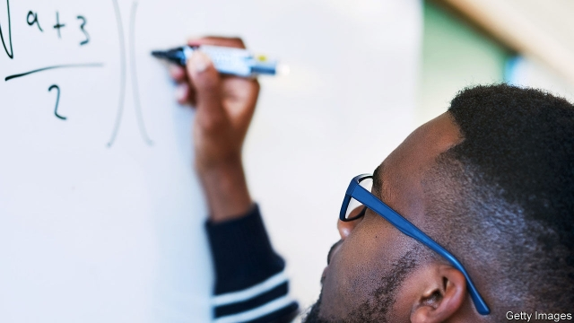

###### Go figure

# How Africa can encourage home-grown maths boffins 

 

> print-edition iconPrint edition | Middle East and Africa | Aug 10th 2019 

ALBERT AGISHA NTWALI was resigned to becoming a maths teacher at a secondary school. The 23-year-old from Bukavu in the Democratic Republic of Congo was a stellar undergraduate at his local university. But his career options seemed limited until a professor told him about the African Institute of Mathematical Science (AIMS), a network of postgraduate academies that offers scholarships to budding African mathematicians. Last year Mr Ntwali enrolled at the AIMS campus in Kigali, Rwanda’s capital. “Now I can join a company, become a data scientist, do a PhD…” He goes giddy listing the options. 

For decades there were few possibilities for African mathematicians to reach their potential on the continent. Many gave up studying; others went abroad. Wilfred Ndifon, a Cameroon-born biologist who oversees research at AIMS, recalls that after he completed his PhD at Princeton in 2009, he was put off from returning home by the lack of computing power. “Universities mostly used Excel,” he says. 

The institute is making scholars think twice about forsaking study or moving overseas. In 2003 the first campus was founded on the outskirts of Cape Town by Neil Turok, a South African physicist. Today there are five more, in Senegal, Ghana, Cameroon, Tanzania and Rwanda. Funding for each one comes partly from the host country’s government and partly from international donors. Nearly 2,000 students from 43 African countries have graduated. 

That number is set to rise quickly. The institute will open nine new campuses. And it is adding new degrees. In July the first cohort of students graduated in Kigali with a masters in machine intelligence. 

The course was founded by Moustapha Cisse, who runs Google’s AI research in Ghana. It is sponsored by Google and Facebook. One of the students, Ines Birimahire, a Rwandan, explains that she wants to apply machine learning to areas that Western researchers neglect. She is collecting audio data from radio stations to ensure that “natural language processing” software (such as Google Translate) can manipulate African languages. Another project involves collecting photos of cassava leaves to develop software that helps farmers identify diseases. 

Professor Ndifon argues it is vital that the institute does not just teach, but conducts research as well. African researchers bring “unique perspectives”, he argues. Google has funded Quantum Leap Africa, an artificial-intelligence centre, in Kigali, and AIMS has plans for seven new research chairs. Some of these will be dedicated to climate science; Professor Ndifon notes that African policymakers need better forecasting models. 

African mathematicians, like all ambitious masterminds, will still look for jobs at top global universities and companies abroad. The resources at elite colleges in Europe or America surpass those in Senegal or Rwanda. But the growth of AIMS means that there is at least a chance for more scholars to do world-class work nearer home. “Maths is a universal language,” says Mr Ntwali. AIMS is making sure more Africans are fluent in it. ■ 
<<<<<<< HEAD

-- 

 单词注释:

1.boffin['bɒfin]:n. 研究员, 科学工作者 

2.Aug[]:abbr. 八月（August） 

3.albert['ælbәt]:n. 艾伯特（男子名） 

4.Bukavu[bu:'kɑ:vu:]:布卡武[扎伊尔东部城市](旧称科斯特曼斯维尔) 

5.Congo['kɔŋ^әu]:n. 刚果, 刚果河, 工夫茶 [建] 刚果, 直接刚果红 

6.stellar['stelә]:a. 星的, 似星的, 星球的, 主要的 

7.postgraduate['pәust'^rædjuit, 'pәust'^rædʒuit]:a. 大学毕业后的, 大学研究院的 n. 研究生 

8.mathematician[.mæθәmә'tiʃәn]:n. 数学家 

9.enrol[in'rәul]:vt. 登记, 使加入 vi. 参军, 注册 

10.kigali[ki'ɡɑ:li]:n. 基加利（卢旺达的首都） 

11.datum['deitәm]:n. 论据, 材料, 资料, 已知数 [医] 材料, 资料, 论据 

12.giddy['gidi]:a. 眼花的, 头晕的 v. (使)眼花, (使)眩晕 

13.wilfred['wilfrid]:n. 威尔弗雷德（男子名） 

14.biologist[bai'ɒlәdʒist]:n. 生物学家 [医] 生物学家 

15.oversee[.әuvә'si:]:vt. 向下看, 了望, 监督, 偷看到 [法] 监察, 监督, 俯瞰 

16.phd[]:abbr. 哲学博士学位（Doctor of Philosophy） 

17.Princeton['prinstәn]:n. 普林斯顿 

18.computing[kәm'pju:tiŋ]:[计] 计算 

19.excel[ik'sel]:vt. 胜过, 优于, 擅长 vi. 胜过其他 

20.forsake[fә'seik]:vt. 放弃, 断念, 抛弃 [法] 遗弃, 抛弃, 摒绝 

21.oversea['әuvә'si:]:adv. 海外, 向国外, 向海外, 国外 a. 外国的, 在国外的, 在海外的, 舶来的 

22.cape[keip]:n. 岬, 海角, 披肩, 斗蓬 

23.neil[]:n. 尼尔（男子名） 

24.turok[]:n. (Turok)人名；(英、俄、捷)图罗克 

25.Senegal[,seni'^ɔ:l]:n. 塞内加尔 

26.Ghana['gɑ:nә]:n. 加纳 

27.Cameroon['kæmәru:n]:n. 喀麦隆 

28.Tanzania[.tænzә'ni:ә]:n. 坦桑尼亚 

29.rwanda[rj'ændә]:n. 卢旺达（东非国家）；卢旺达语 

30.donor['dәunә]:n. 捐赠人 [化] 给体; 供体 

31.quickly['kwikli]:adv. 很快地 

32.cohort['kәuhɒ:t]:n. 一群；步兵大队；支持者；共同特点的一群人 

33.moustapha[]:[网络] 穆斯塔法；镇长助理穆斯塔法 

34.cisse[]:n. (Cisse)人名；(塞内、马里)西塞 

35.AI[ai]:[计] 附加信息, 人工智能 [化] 人工智能 

36.google[]:谷歌；搜索引擎技术；谷歌公司 

37.facebook[]:n. 脸谱网 

38.ine[]:abbr. 西班牙国家统计局（Instituto Nacionalde Estatdistica）；国际网工程备忘录 

39.Rwandan[rj'ɑ:ndәn, -'æn-]:a. 卢旺达的 

40.manipulate[mә'nipjuleit]:vt. 操纵, 利用, 操作, 巧妙地处理, 假造 

41.cassava[kә'sɑ:vә]:n. 木薯 [医] 木薯 

42.quantum['kwɒntәm]:n. 量, 量子 [计] 量子 

43.dedicate['dedikeit]:vt. 献出, 贡献 

44.policymaker['pɔlisi.meikә]:n. 政策制定者；决策人 

45.ambitious[æm'biʃәs]:a. 有野心的, 抱负不凡的, 雄心勃勃的 

46.mastermind['mɑ:stәmaind]:n. 优秀策划者, 才子 vt. 指导, 主持, 策划 

47.elite[ei'li:t]:n. 精华, 精锐, 中坚分子 

48.surpass[sә'pɑ:s]:vt. 超越, 凌驾, 胜过 
=======
>>>>>>> 50f1fbac684ef65c788c2c3b1cb359dd2a904378

