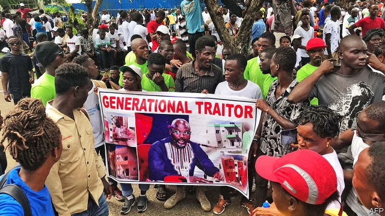
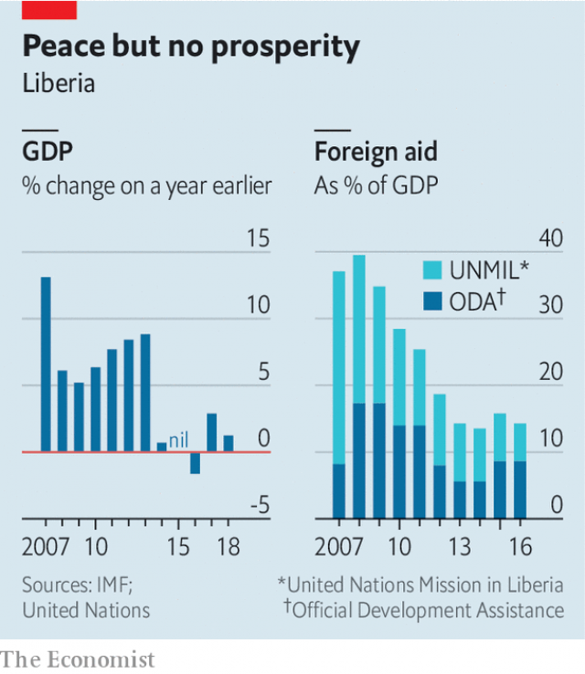

###### A country on edge

# Liberia’s economic crisis and corruption could lead to violence 

 

> print-edition iconPrint edition | Middle East and Africa | Aug 10th 2019 

UNDER THE corrugated-iron roof of the Bong Intellectual Centre, a tea house in Gbarnga in northern Liberia, the air is thick with anger. Dozens of people sit on plastic chairs, discussing politics. They complain that their businesses are failing, corruption is rising and food prices have doubled in recent months. “The hungry man is an angry man,” says Augustin Jalla, a 55-year-old social worker. “If something does not change there’s going to be an uprising.” 

That is alarming talk, in a country that suffered an on-and-off, 14-year-long civil war that killed about 250,000 people—almost a tenth of the population at the time—and destroyed the economy. Liberia’s conflict also devastated the region. The country’s former president, Charles Taylor, started or fuelled wars in three neighbouring countries: Sierra Leone, Guinea and Ivory Coast. 

After the fighting stopped in 2003, the world poured in aid to support Liberia’s transition to democracy and to prop up the administration of Ellen Johnson Sirleaf, a wily World Bank veteran who was elected president in 2005. By 2010 the west African nation was receiving $360 in aid per person. Helping to keep the peace was a UN mission that cost more than $500m a year. 

Since then, however, the world has lost interest. By 2017 aid had slumped to just $132 per person. In 2018 the UN’S peacekeepers packed away their blue helmets and went home. Left in their wake are a failing economy and a weak state that has been hollowed out by corruption and is still riven by enmities. 

Start with the economy. Between 2010 and 2014 growth was galloping along at 6-8% a year and was forecast to go into double digits. Then the country was hit by two enormous shocks. The first was an outbreak of Ebola in 2014 that killed almost 11,000 people in Liberia, scared off investors and aid workers and caused a recession. The second was the withdrawal of peacekeepers, whose average annual budget was equal to almost a quarter of Liberia’s GDP between 2007 and 2018. The IMF expects growth of 0.4% this year. 

Widespread corruption makes everything worse. Last year a poll by Afrobarometer found that half of Liberians had to pay backhanders for public services. 

 

In 2017 Liberians elected a former football star, George Weah, as president. Mr Weah promised to help the poor and give corruption the boot. He is doing neither. Scandals have blighted his first 18 months in office and soaring inflation, which peaked at 29% in December, is hurting the poor in a country where more than half the population lives on less than $2 a day. 

The president’s conduct has not helped. He has built about 50 houses in a compound in the capital. He says he used money he had earned during his days of football stardom. But citizens cannot be sure of this, since he has refused to publicly declare his assets. “It raises eyebrows,” says Anderson Miamen of Transparency International, a corruption watchdog. 

Governing a country as poor and fractious as Liberia is an unenviable task. But Mr Weah is simply not up to the job. He is said to forget key facts, bungle media interviews and drift off in meetings. 

In Gbarnga, Mr Taylor’s base during Liberia’s first civil war between 1989 and 1997, social workers say crime and hard-drug use are rising. David Brown, a 25-year-old salesman who voted for Mr Weah, says this is because people have lost hope. Keba Collins started her business selling handbags on the streets. Two years ago she was making the equivalent of $75,000 a year. Now her business is near to collapse—as are those of several of her friends—because of high inflation and the costs of corruption. Frustration over graft and poor governance led to people staging huge, peaceful protests in June (pictured). 

St Peter’s Lutheran Church in Monrovia, the capital, is filled with children and worshippers. But its windows, pockmarked by bulletholes, hint at a dark history: in 1990 government soldiers massacred 600 people here. Isaac Dowah, the pastor, points at two white stars marking the mass graves and frets: “We’re at a breaking point.” ■ 

