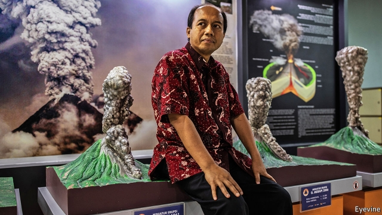

###### Under the volcanoes

# Obituary: Sutopo Purwo Nugroho died on July 7th 

 

> print-edition iconPrint edition | Obituary | Aug 10th 2019 

THREE TIMES the government asked him and he turned the job down, not wanting to become a mouthpiece for them; but in the end they pressed him, and in 2010 Sutopo Purwo Nugroho became the new spokesman for Indonesia’s Disaster Mitigation Agency (BNPB). Almost his first job was to persuade 350,000 people to move away from Mount Merapi on the island of Java. The great, stately, active volcano had been monitored for a long time. People believed it hosted a sultanate of sometimes peevish spirits who had to be soothed, not shunned, when they were angry. His job was to persuade the locals to forget that, and just leave. 

He gave the warning late on October 24th. By the evening of October 25th, when the mountain blew its top, the BNPB had overseen the evacuation of almost everyone. (The tight time-lapse was ideal; if he’d waited longer, the evacuees would have started to wander back.) He was there when grey ash started falling on the heads of the elderly villagers he was leading out. The sight made him cry. Worse, though, was the fact that more than 350 people ignored his warnings, preferring to stay on the right side of the spirits. 

Before he arrived at the agency, forecasts of natural disasters were a fairly random occurrence. Often they were missed, or the government panicked without reason, dragging along a public panicked by hoaxes posted online. Indonesia was a country of 17,000 islands, perched on the “Ring of Fire” at the edge of the Pacific, with 127 active volcanoes. They could erupt at any time, and the same sliding plates unleashed earthquakes, landslides and tsunamis, adding up to more than 2,300 emergencies a year. As his job went on, the tally got worse: 2018 was the deadliest for natural disasters in over a decade, with more than 4,600 people killed. Yet Indonesians barely knew what they faced. A poll of his many Twitter followers revealed that 86% had never had disaster training. 

So first of all he provided clarity, turning data from monitors on the ground into clear statements to the press. There were plenty of those, and 500 press releases in 2018 alone. Then he did some educating. He filled the BNPB building with dioramas, mud-crusted relics from landslides, notices tipped sideways and backdrops of devastation into which visitors could insert themselves, as rescuers, for selfies. (That might seem silly, but he liked to pose in them himself, smiling a bit self-consciously; it all helped to show schoolchildren, in particular, what being caught up in a disaster was like.) He shrugged off the occasional government grumble about being “too naughty”. After all, before he took the job he had already publicised the fact that cracks in a dam were caused by official negligence. They knew he would be a handful. 

Social media, though, was his trump card. Almost all Indonesians now had mobile phones. He ran seven WhatsApp groups to exchange data with monitors and journalists, who could always get “Pak Topo” when they needed him, and he used Twitter to keep the public up to speed. Among his posts of good meals, get-togethers, his spoiled cat Mozza and a gecko licking his toothbrush, he tweeted warnings. “Pyroclastic material from Mount Karangetang…can reach 700-1,200 degrees centigrade. Trust me when I say, don’t touch it.” “Celebrating Eid on Mount Bromo is safe. As long as you are not within 1km of the crater…its charms are waiting for you.” Expanding his brief, he urged people to clean their gutters, tweeting a picture of a python being pulled from a drain: “Don’t just write ‘No snakes’. Snakes can’t read.” He also told the young to work hard at school, as he had, getting over his hang-up that he was poor and ugly with diligence and lots of hair oil. 

For those who wanted them, he tweeted challenging scientific facts: diagrams of volcanoes changing shape before they erupted, and a long thread about volcanic mud. He was not a volcanologist, leaving that job to academic monitors in airless sheds at the foot of uneasy mountains; his training was in hydrology, and he had wasted many years at another agency trying to make rain. But he did spend most of his time at the BNPB staring at wall screens where white lights flashed on the dozens of volcanoes that were active or might become so (a good test for presidential candidates, he mused once, would be to try to name them all), and leaping to his ever-buzzing phone. He needed to watch both the earth moving and fake news accumulating, like steam, in the Twittersphere. 

Here, he worked fast. Incipient panics got short shrift: “No tsunami seen in Banggai. Please don’t spread hoaxes.” Fake images were denounced. (“This eruption is in South America. Ignore and don’t spread.”) Talk of “portents” was firmly shot down. (“The mountain peak is clouded with altocumulus lenticularis…due to a whirlwind at the top…No connection with mysticism or politics ahead of the election.”) As a result, he helped Indonesians feel safer. Jokowi, the president, publicly praised him, which was almost as good a moment as when he at last met the singer Raisa, on whom he had such a crush that he included her Twitter handle in more than 90 of his disaster tweets. He claimed his only motive was to get them retweeted to her 8m followers. Of course! 

With all this whirling round him, he was also cheerfully facing disaster of another sort. In 2018 he was diagnosed with Stage 4 lung cancer, though he had never smoked. He could not have foreseen it; Nature was unpredictable. Science helped him understand it, but could not cure it. Allah had planned it, just as He had planned that others should die in earthquakes and tsunamis. Many Indonesians, he had discovered, found it more comforting to think that way. So, after the first cruel shock, did he. His tweets of destroyed places now included MRI scans of his lungs. 

Among the 350 people he had not been able to save from Merapi was the guardian of the mountain. Slowly, his house had filled up with grey ash. Before the rest of the villagers made their way down to safety, he simply told them his time had come to go. ■ 

-- 

 单词注释:

1.volcanoe[]:[网络] 狙击步枪；火山的 

2.nugroho[]:n. (Nugroho)人名；(印尼)努格罗霍 

3.obituary[ә'bitjuәri]:a. 关于死亡的, 讣告的 n. 讣告 

4.Aug[]:abbr. 八月（August） 

5.mouthpiece['mauθpi:s]:n. 发话筒, 代言人, (电话)送话口 [机] 钳口垫片 

6.spokesman['spәuksmәn]:n. 发言人, 代言者 

7.mitigation[.miti'geiʃәn]:n. 缓和, 减轻 [法] 减, 减轻, 缓和 

8.merapi[]: [地名] [印度尼西亚] 默拉皮 

9.Java['dʒɑ:vә]:n. 爪哇, 爪哇咖啡 [计] Java 程序设计语言 

10.stately['steitli]:a. 庄严的, 宏伟的 

11.sultanate['sʌltәnit]:n. 苏丹的职务, 苏丹统治的领土 

12.peevish['pi:viʃ]:a. 易怒的, 暴躁的, 带怒气的, 撒娇的 

13.soothe[su:ð]:vt. 缓和, 使安静, 安慰, 奉承 vi. 起安慰作用 

14.shun[ʃʌn]:vt. 避开, 规避, 避免 

15.oversee[.әuvә'si:]:vt. 向下看, 了望, 监督, 偷看到 [法] 监察, 监督, 俯瞰 

16.evacuation[i.vækju'eiʃәn]:n. 撤退, 疏散 [化] 抽空; 排空 

17.evacuee[i.vækju'i:]:n. 被撤离者, 被疏散者 

18.panick[]:v. 恐慌, 使（受惊） 

19.hoax[hәuks]:vt. 欺骗, 哄骗, 愚弄 n. 愚弄人, 恶作剧 

20.online[]:[计] 联机 

21.Indonesia[.indәu'ni:ʒә]:n. 印尼 

22.perch[pә:tʃ]:n. 栖木, 高位, 杆, 河鲈 v. (使)栖息, 就位, 位于, (使)暂歇 

23.unleash[.ʌn'li:ʃ]:vt. 解开...的皮带, 发出, 发动 

24.landslide['lændslaid]:n. 山崩 [化] 滑坡 

25.tsunami[tsu'nɑ:mi]:n. 海啸 

26.tally['tæli]:n. 符木, 记账, 得分, 比分, 计数器, 标签, 符合, 对应物 vt. 记录, 点数, 计算, 加标签于, 使符合 vi. 记帐, 符合, 吻合, 记分 [计] 计数 

27.Indonesian[.indәu'ni:ʒәn]:a. 印尼的 n. 印尼人, 印尼语群 

28.twitter['twitә]:n. 啁啾, 唧唧喳喳声 vi. 啭, 啁啾, 颤抖 vt. 嘁嘁喳喳地讲, 抖动 

29.follower['fɒlәuә]:n. 从者, 属下, 追补者 [电] 随动机 

30.clarity['klærәti]:n. 清楚, 明晰 [化] 透明度; 透明性; 清晰性 

31.datum['deitәm]:n. 论据, 材料, 资料, 已知数 [医] 材料, 资料, 论据 

32.diorama[daiә'rɑ:mә]:n. 透视画, 西洋景, 立体模型 

33.relic['relik]:n. 遗物, 遗迹, 纪念物, 遗风, 残留物 

34.backdrop['bækdrɒp]:n. 背景幕, 背景 

35.devastation[.devә'steiʃәn]:n. 毁坏 

36.rescuer['reskjuә]:n. 救助者 

37.selfies[]:[网络] 自拍照 

38.schoolchild['sku:ltʃaild]:n. 学童 

39.grumble['grʌmbl]:n. 怨言, 满腹牢骚 vi. 抱怨, 发牢骚, 发隆隆声 vt. 抱怨 

40.publicise['pʌblisaiz]:vt. 公布, 为...做广告, 宣传 

41.negligence['neglidʒәns]:n. 疏忽, 粗心大意, 忽视 [经] 疏忽, 过失 

42.WhatsApp[]:[网络] 智能手机；联络电话；每月活跃用 

43.alway['ɔ:lwei]:adv. 永远；总是（等于always） 

44.pak[]:n. 巴基斯坦人 

45.topo['tɔpәu]:n. （等于toppo）威尼斯平底渔船 

46.mozza[]:[网络] 莫扎 

47.gecko['gekәu]:n. 壁虎 [医] 蛤蚧 

48.tweet[twi:t]:vi. 啁啾 n. 小鸟叫声 

49.pyroclastic[,paiərә?'klæstik,,pi-]:a. 火成碎屑的 n. 火成碎屑物 

50.eid[]:abbr. Expression Interactive Designer；Epson Imaging Devices；Emerging Infectious Diseases；eTrust Intrusion Detection 

51.bromo['brәjmәj]:[机] 溴代, 溴基 

52.charm[tʃɑ:m]:n. 吸引力, 魔力, 符咒 vt. 迷住, 使陶醉, 行魔法 vi. 用符咒, 有魅力 

53.gutter['gʌtә]:n. 排水沟, 槽, 贫民区 vt. 开沟于 vi. 流 [计] 装订线 

54.python['paiθɒn]:n. 大蟒, 巨蟒 [计] Python 程序设计语言；人生苦短，我用 Python 

55.diligence['dilidʒәns]:n. 勤奋 

56.volcanic[vɒl'kænik]:a. 火山的, 猛烈的 n. 火山岩 

57.volcanologist[vɔlkә'nɔlәdʒist]:n. 火山学家 

58.airless['єәlis]:a. 无空气的, 不通风的 [机] 无气, 无气式 

59.hydrology[hai'drɒlәdʒi]:n. 水文学 [医] 水文学 

60.presidential[.prezi'denʃәl]:a. 总统制的, 总统的, 首长的, 统辖的 [法] 总统的, 议长的, 总经理的 

61.muse[mju:z]:n. 沉思, 冥想 v. 沉思, 冥想, 若有所思地凝望或说 

62.fake[feik]:n. 假货, 欺骗, 诡计 a. 假的 vt. 假造, 仿造 vi. 伪装 

63.Twittersphere[]:[网络] 推特圈；推特空间；推特星球 

64.incipient[in'sipiәnt]:a. 起初的, 发端的, 初期的 [医] 初发的, 初期的 

65.Banggai[]:[网络] 乌鸦；班盖；曼涯 

66.fake[feik]:n. 假货, 欺骗, 诡计 a. 假的 vt. 假造, 仿造 vi. 伪装 

67.denounce[di'nauns]:vt. 告发, 抨击, 谴责 [法] 谴责, 斥责, 告发 

68.eruption[i'rʌpʃәn]:n. 爆发, 喷出物, 出疹 [化] 喷发 

69.portent['pɒ:tent]:n. 前兆, 预示, 异常之物 

70.altocumulus[.æltәu'kju:mjulәs]:n. 高积云 

71.whirlwind['hwә:lwind]:n. 旋风 

72.mysticism['mistisizm]:n. 神秘, 神秘教, 模糊思想 

73.politic['pɒlitik]:a. 精明的, 明智的, 策略的 

74.Jokowi[]:[网络] 佐科威；省长佐科威；雅加达市长 

75.raisa[]: [人名] 赖莎 

76.retweeted[]:[网络] 转发 

77.cheerfully['tʃiәfuli]:adv. 高高兴兴地 

78.diagnose['daiәgnәuz]:v. 诊断 

79.unpredictable[.ʌnpri'diktәbl]:a. 不可预知的 

80.Allah['ælә]:n. 安拉 

81.mri[]:abbr. 核磁共振成像（Magnatic Resonance Imaging）；机读信息（Machine Readable Information）；中等度肾功能不全（Moderate Renal Insufficiency） 

82.guardian['gɑ:diәn]:n. 看守者, 监护人, 保护人 a. 保护的 

