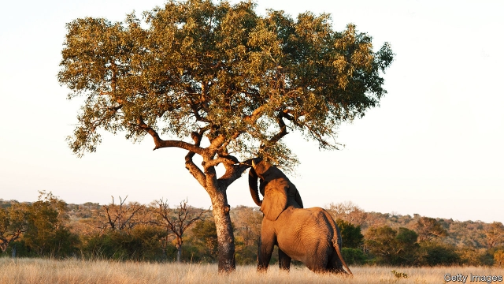

###### Ecology

# A tale of elephants, ants, trees and fire shows how complex nature is 

 

> print-edition iconPrint edition | Science and technology | Aug 10th 2019 

ECOLOGY IS A complicated thing. Given the facts that elephant damage often kills trees and bush fires often kill trees it would be reasonable to deduce that a combination of the two would make things worse. Counter-intuitively, though, as research just published in Biotropica, by Benjamin Wigley of Nelson Mandela University in South Africa shows, if a tree has already been damaged, fire can actually help to make things better. 

One common way in which elephants harm trees is by stripping them of their bark. Dr Wigley, who did indeed start from the obvious assumption, set off to find out how much worse bush fires would make the effects of this bark-stripping. To this end he set up a study in the Kruger National Park, a reserve on South Africa’s border with Mozambique. 

Since 1954, the Kruger has been the site of experiments in which plots of land have been burned at intervals, to discern the effects of fire on savannah ecology. Dr Wigley tapped into these experiments by looking at trees in three different zones. In one of these the vegetation was burned every year. In the second it was burned every other year. The third zone, by contrast, was actively shielded from fire. 

To keep things consistent, he looked at the fate of a single tree species, the marula (pictured), in all three zones. He picked marulas because they are particular victims of elephant activity. Their fruit are delicious, and prized by elephants and people alike. But elephants also seem to enjoy eating their bark. 

In July 2016 he and his colleagues identified 20 marulas in every zone and used a hammer and a soil corer to remove from each of them a circular section of bark 5cm in diameter. Having inflicted this damage, they monitored the wounds over the course of the following two years, to see what would happen. 

To their surprise, they discovered that the wounds of trees in fire zones recovered far better than those of trees that had seen no fires at all. Wounded trees in the annual burn zone regrew 98% of their lost bark during the two years of the study. Those living in the biennial burn zone regrew 92% of it. But those in the zone where fires were suppressed regrew only 72%. 

The researchers also found something else when they were measuring the trees’ wounds: ants. Ten of the 20 trees in the fire-suppression zone developed ant colonies in their wounds. The ants in question were a species that is known to damage trees and is presumed to impair tissue healing. By contrast, only five trees in the biennial burn zone and three in the annual zone developed ants’ nests in their wounds. 

It looks, therefore, as if bush fires are cauterising trees’ wounds by killing ants that might otherwise infest them. Though such fires are surely harmful to healthy trees, it seems, in an example of two negatives making a positive, as if they are actually helpful to sick ones. 

-- 

 单词注释:

1.Aug[]:abbr. 八月（August） 

2.benjamin['bendʒәmin]:[医] 安息香 

3.Wigley[]:n. (Wigley)人名；(英)威格利 

4.nelson['nelsn]:n. (摔跤用语)肩下握颈 

5.Mandela[mæn'delә]:纳尔逊曼德拉 Nelson, [1918, 南非黑人反种族隔离活动家] 

6.kruger['stefәnjsjәj'hænis'pɔ:lj]:n. 克鲁格（现代寻租理论的创始人）；格尔（南非政治家） 

7.Mozambique[.mәuzәm'bi:k]:n. 莫桑比克 

8.discern[di'zә:n]:v. 辨别, 看清楚, 了解 

9.savannah[sә'vænә]:n. 大草原, 热带草原（等于savanna） 

10.vegetation[.vedʒi'teiʃәn]:n. 植物 [医] 贽生物, 贽疣, 增殖体; 生长, 增殖 

11.actively['æktivli]:adv. 活跃地, 积极地 

12.specie['spi:ʃi]:n. 硬币 [经] 硬币 

13.marula[]: [地名] [津巴布韦] 马鲁拉 

14.marulas[]:[网络] 马拉斯 

15.corer['kɒ:rә]:n. (果实的)去心器 

16.inflict[in'flikt]:vt. 施以, 加害, 使承受 [法] 处, 加, 予以 

17.regrew[]:v. 再生, 继续生长( regrow的过去式 ) 

18.biennial[bai'eniәl]:n. 两年生植物, 两年一次的事 a. 两年生的, 两年一次的 

19.suppress[sә'pres]:vt. 镇压, 使止住, 禁止, 抑制, 查禁 [法] 镇压, 平定, 禁止出版 

20.presume[pri'zu:m]:vt. 假定, 推测, 擅自, 意味着 vi. 擅自行动, 相信 

21.impair[im'pєә]:vt. 损害, 减少, 削弱 [法] 损害, 伤害, 减少 

22.healing['hi:liŋ]:a. 治愈的, 恢复健康的 [计] 修复, 恢复 

23.cauterise['kɔ:təraɪz]:vt.& vi. （用腐蚀性物质或烙铁）烧灼以消毒 

24.infest[in'fest]:vt. 骚扰, 寄生于, 大批出没 [医] 传染, 感染 

