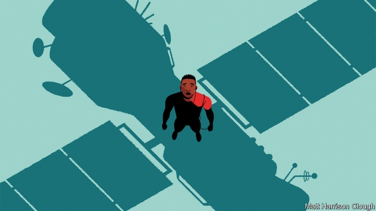
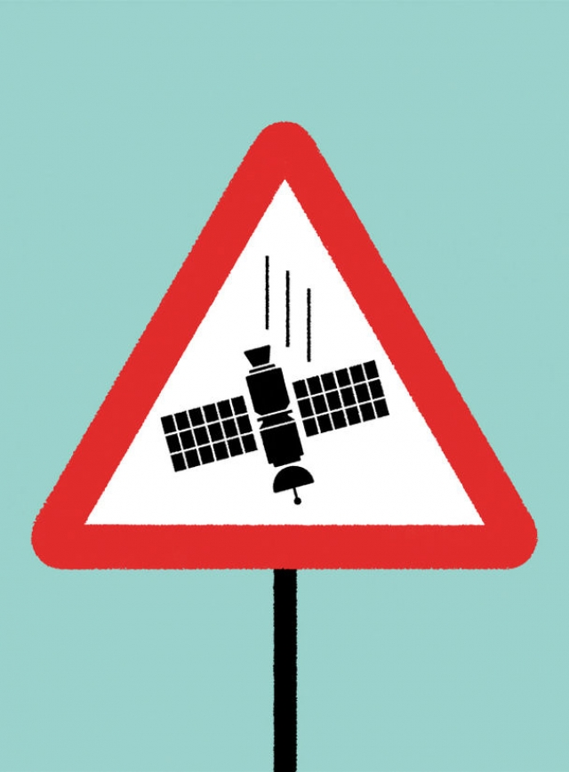

###### Space debris and safety

# No one has yet been killed by re-entering space junk 

 

> print-edition iconPrint edition | Science and technology | Aug 10th 2019 

EVERY DAY a tonne or two of defunct satellites, rocket parts and other man-made orbiting junk hurtles into the atmosphere. Four-fifths of it burns up to become harmless dust, but that still leaves a fair number of fragments large enough to be lethal. It is testament to how much of Earth’s surface is sea, and how sparsely populated the remainder remains, that the only recorded victims of this artificial hailstorm are five sailors aboard a Japanese vessel, who were injured in 1969, and a woman in Oklahoma who was grazed by a piece of falling rocket in 1997. But it is also testament to luck—and the odds of that luck holding are shortening. 

Population growth means that the fraction of Earth’s surface which space debris can hit harmlessly is shrinking. At the same time, more spacecraft are going up (111 successful launches in 2018, compared with 66 a decade earlier, and with many launches carrying multiple payloads). And payloads themselves are increasingly designed so that equipment which has fulfilled its purpose falls out of orbit years or decades sooner than it otherwise would, lest it collide with functioning spacecraft. 

In light of all this, more attention is being paid to the safe disposal of satellites and other space junk. To do that, space agencies and private companies alike want to steer craft to the least risky impact-destinations possible, and also reduce the number of fragments that will survive re-entry and endanger people and property. 

One tried and tested solution is to plunge a re-entering craft into a zone known as the South Pacific Ocean Uninhabited Area. This is the expanse between Chile and New Zealand. It is island-free, little sailed and little overflown. Such controlled re-entries are not a completely precise science. Any ships and planes heading into the vicinity at the time will be advised to steer clear of a potential impact area that may exceed 10,000km2—roughly the size of Lebanon. But if everyone takes these warnings seriously, then controlled re-entries are as safe as it gets, according to Holger Krag, head of the European Space Agency’s Space Debris Office in Darmstadt, Germany. 

Job done, you might think. Yet only a few controlled re-entries are carried out each year. The reason is cost. If a spacecraft is to be put into the steep descent needed to aim it reasonably precisely at a particular spot on Earth’s surface, it will need to carry two or three times as much fuel as is required for standard orbital adjustments. It will also require larger thrusters. That fuel and those thrusters add to a mission’s weight, and therefore its launch costs. Ground controllers are also necessary to supervise the re-entry. Ending a mission with a controlled re-entry can thus add more than €20m ($22m) to its cost. 

A cheaper alternative is a “semi-controlled” re-entry. Instead of diving towards a pre-arranged target, a satellite is lowered gradually into the atmosphere using either what thruster-fuel remains to it or a specially designed drag-sail. This sail intercepts air molecules that have leaked into space from the atmosphere, slowing down the satellite it is attached to and thus decreasing the craft’s altitude until it reaches a point where air resistance to the body itself pulls it into the atmosphere. 

The trade-off is that the danger zone associated with such a de-orbiting is much larger than that of a properly controlled re-entry. It is still possible to arrange for this zone to have lots of oceans and few big cities. But there is not the certainty of no casualties that the South Pacific Ocean Uninhabited Area brings with it. Also, though more economical than the fully controlled variety, semi-controlled re-entry is not free. Saving fuel for it shortens mission lengths. Adding a drag sail adds to launch weight. In practice, therefore, almost all spacecraft re-enter the atmosphere at random. But this has not prevented experts from working out the probability that the random re-entry of a given mission will cause casualties. And that is useful information, because it can be used to decide whether a mission should go ahead in the first place. 

Re-entry-survivability analysis, as it is known, is done using software that crunches data on the size, shape, configuration, composition and thickness of a satellite’s components. That provides an estimate of the number, weight, size and shape—and therefore potential harmfulness—of pieces that atmospheric friction will not reduce to dust. The probability of casualties can then be calculated in light of the population density under the spacecraft’s orbit. 

Hyperschall Technologie Göttingen (HTG), a German firm, charges about €50,000 for such an analysis. Its clients include three European satellite manufacturers—OHB System of Germany, Elecnor of Spain and Airbus—as well as several space agencies. For their money, these organisations get a bespoke assessment of the likely fate of a particular spacecraft, based on digital files of its design, and using programs with names like “Spacecraft Entry Survival Analysis Module” and “Debris Risk Assessment and Mitigation Analysis” that have been calibrated by experiments in the plasma wind tunnels owned by Germany’s space agency. 

 

If these calculations come back showing that the risk of a satellite killing or injuring someone during re-entry is greater than one in 10,000—which roughly half do—then permission to launch will probably be denied unless the craft is redesigned or can be rigged for a semi-controlled entry at more favourable odds. The idea of setting the acceptable risk at 10,000 to one, though derided by some as arbitrary, was adopted by America’s space agency, NASA, in 1995, by Japan in 1997, by France in 1998 and by a dozen or so other places in the years since. 

Having to do such calculations at all, though, is suboptimal. The best solution to the problem of re-entering space debris is to build spacecraft so that nothing will reach the ground in the first place. One way to “design for demise”, says Ettore Perozzi, an expert on debris at Italy’s space agency, is to build a spacecraft “like a chocolate bar”, so that it snaps easily into pieces. The idea is for specially positioned weak parts to fail early during re-entry, ripping the thing apart at an altitude of about 125km, rather than the standard 80km or so. This exposes the spacecraft’s guts to greater destructive heat for additional seconds. 

One promising means of getting a spacecraft to rip open early, according to Charlotte Bewick, head engineer for debris at OHB System, is to forge screws, nuts and other parts for couplings out of special “shape memory” alloys. When heated, these alloys return to a “remembered” shape they once held—which, in this case, will facilitate a rapid wiggling apart early in re-entry. Thales Alenia Space, a Franco-Italian firm, sees more promise in another way of accelerating a spacecraft’s break-up. It has patented a “demisable” coupling that, thanks to a special washer, comes apart quickly when heated. Engineers are testing prototypes in a plasma wind tunnel and reckon the winning design will contain a low-melting-point alloy of zinc. 

Another way to reduce what reaches the ground is to substitute refractory materials such as titanium and steel, used to make things like fuel tanks and fly wheels, with substances such as aluminium and graphite epoxy that vaporise more easily. According to Lilith Grassi, a debris expert at Thales Alenia, this approach is bearing fruit. 

Even these measures, though, will not bring every spacecraft into compliance with the one-in-10,000 rule. So engineers have thought up additional ways to lower the likelihood of a casualty. Those at OHB System, for example, have proposed fastening together with strong cabling any components expected to survive re-entry. That will prevent them from fanning out—meaning, as Dr Bewick puts it, that the surviving debris will hit Earth like a single bullet instead of a shotgun blast, thus reducing the chance that anyone will be struck. 

OHB System has yet to find a customer for a satellite fitted with such containment cabling. It would add weight, and thus cost. Moreover, some dislike the notion of increasing the amount of material that will strike Earth, even if that increase reduces the chance of a death. But a related approach is under study at Thales Alenia. This firm may begin encasing in a single package the lenses and other components of optical systems that currently often hit the ground as a spray. 

Something no one seems to be asking in all this, is what an appropriate level of safety for satellite re-entries actually is. The original reason for picking 10,000 to one as an acceptable risk level has been lost in the mists of time. To a given individual in Earth’s human population of 7.5bn, it translates into one chance in 75 trillion per re-entry. This is vanishingly small, even in a world where re-entries are numbered in the hundreds per year. 

On the other hand, any death delivered from outer space in this way would be headline news, and might result in calls for the rules to be tightened still further. So far, the satellite business has a pretty good safety record. It would like to keep things that way.■ 
<<<<<<< HEAD

-- 

 单词注释:

1.debris['deibri:]:n. 碎片, 残骸 [医] 碎屑 

2.Aug[]:abbr. 八月（August） 

3.tonne[tʌn]:n. 吨, 公吨 [经] 吨 

4.defunct[di'fʌŋkt]:a. 死的, 不能使用的 n. 死者 

5.hurtle['hә:tl]:vi. 猛冲, 碰撞, 突进 vt. 猛撞, 猛投 n. 投掷, 碰撞, 碰撞声 

6.lethal['li:θәl]:a. 致命的 n. 致死因子 

7.testament['testәmәnt]:n. 遗嘱, <<圣约书>> [法] 遗言, 遗嘱, 确实的证明 

8.sparsely[spɑ:slɪ]:adv. 稀疏地; 稀少地; 不足地; 贫乏地 

9.populate['pɔpjuleit]:vt. 使人口聚居在...中, 殖民于, 移民于, 居住于, 定居于 

10.remainder[ri'meindә]:n. 剩余物, 其他人, 残余, 余数 v. 削价出售(图书) a. 剩余的, 出售削价剩书的 [计] 余数 

11.hailstorm['heilstɒ:m]:n. 雹暴 

12.Oklahoma[.әuklә'hәumә]:n. 俄克拉何马 

13.graze[greiz]:n. 吃草, 放牧, 擦伤, 轻擦 v. (使)吃草, 放牧, 轻擦, 擦伤 

14.odds[ɒdz]:n. 可能性, 几率, 机会, 胜算, 不平等 

15.shorten['ʃɒ:tn]:vt. 弄短, 缩短, 减少 vi. 缩小, 变短 

16.harmlessly[]:adv. 无害地；无恶意地 

17.payload['peilәud]:n. 商务载重, 工资负担, 净载重量, 有效负荷, 弹头 [化] 负荷量 

18.collide[kә'laid]:vi. 碰撞, 互撞, 抵触 

19.risky['riski]:a. 危险的 

20.endanger[in'deindʒә]:vt. 危及 [法] 使危险, 危及 

21.uninhabited['ʌnin'hæbitid]:a. 无人居住的, 杳无人迹的 

22.expanse[ik'spæns]:n. 宽阔区域, 宽阔, 天空 

23.Chile['tʃili]:n. 智利 [化] 番椒; 辣椒 

24.zealand['zi:lәnd]:n. 西兰岛（丹麦最大的岛） 

25.overfly[,әuvә'flai]:vt. 飞行在...上空, 飞越, 在(外国)上空飞行侦察 

26.vicinity[vi'siniti]:n. 附近, 邻近, 附近地区, 近处 [法] 附近, 邻近, 附近地区 

27.Lebanon['lebәnәn]:n. 黎巴嫩 

28.holger[]:霍尔格（男名） 

29.debris['deibri:]:n. 碎片, 残骸 [医] 碎屑 

30.Darmstadt['dɑ:mstæt]:达姆施塔特[德意志联邦共和国中部城市] 

31.descent[di'sent]:n. 降落, 家系, 侵袭, 血统 [医] 下降, 世代, 血统 

32.reasonably['ri:znәbli]:adv. 适度地, 相当地 

33.precisely[pri'saisli]:adv. 精确地, 明确地, 刻板地, 拘泥地, 正好, 恰恰, 对, 正是如此, 确实如此, 不错 

34.orbital['ɒ:bitәl]:a. 轨道的, 眼眶的 [化] 轨道 

35.thruster['θrʌstә]:n. 向上钻营的人, 推进器 

36.controller[kәn'trәulә]:n. 控制器, 管理者 [计] 控制器 

37.supervise['sju:pәvaiz]:v. 监督, 管理, 指导 

38.intercept[.intә'sept]:n. 截取, 妨碍, 截距 vt. 拦截, 阻止, 截取 

39.casualty['kæʒjuәlti]:n. 意外事故, 伤亡, 受害者 [化] 事故 

40.fully['fuli]:adv. 十分地, 完全地, 充分地 

41.crunch[krʌntʃ]:v. 嘎吱嘎吱的咬嚼, 压碎, 嘎吱嘎吱地踏过 n. 咬碎, 咬碎声 

42.datum['deitәm]:n. 论据, 材料, 资料, 已知数 [医] 材料, 资料, 论据 

43.configuration[kәn.figju'reiʃәn]:n. 结构, 表面配置, 外形, 配置 [计] 配置 

44.technologie[]:[网络] 技术；工艺学；技术学 

45.Göttingen[]:[地名] 格丁根 ( 德 ) 

46.HTG[20]:(=hypertriglyceridemia) 高甘油三酸酯血症 

47.client['klaiәnt]:n. 客户, 顾客, 委托人 [计] 客户, 客户机, 客户机程序 

48.Spain[spein]:n. 西班牙 

49.organisation[,ɔ: ^әnaizeiʃən; - ni'z-]:n. 组织, 团体, 体制, 编制 

50.bespeak[bi'spi:k]:vt. 预约, 订, 表示 n. 预约 

51.module['mɒdju:l]:n. 组件, 模数 [计] 模块 

52.mitigation[.miti'geiʃәn]:n. 缓和, 减轻 [法] 减, 减轻, 缓和 

53.calibrate['kælibreit]:vt. 测定口径, 校准, 使标准化, 调整 [化] 校准 

54.plasma['plæzmә]:n. 血浆, 淋巴液, 原生质, 等离子体 [化] 等离体; 等离子体 

55.redesign[,ri:di'zain]:[化] 重新设计 

56.rig[rig]:n. 装备, 帆装 vt. 装配, 装扮, 给船装帆, 垄断, 操纵 

57.deride[di'raid]:vt. 嘲弄, 嘲笑 

58.NASA['næsә]:国家航空和宇宙航行局(美国) [电] 国际航空和太空总署的同义字 

59.suboptimal['sʌb'ɔptimәl]:[计] 次最优的 [医] 最适度下的 

60.demise[di'maiz]:n. 崩, 薨, 死亡 vt. 让渡, 遗赠, 转让 

61.Ettore[]:n. (Ettore)人名；(意)埃托雷 

62.rip[rip]:n. 裂痕, 破绽, 拉裂, 浪子, 巨浪 vi. 被拉开, 裂开, 猛冲 vt. 撕, 扯, 劈 

63.gut[gʌt]:n. 剧情, 内容, 内脏, 肚子, 海峡, 勇气 vt. 取出内脏, 毁坏...的内部 

64.charlotte['ʃɑ:lәt]:n. 水果奶油布丁 

65.Bewick[]:比威克（人名） 

66.forge[fɒ:dʒ]:n. 熔炉, 铁工厂 vt. 打制, 锻造, 伪造 vi. 锻造, 伪造 

67.coupling['kʌpliŋ]:n. 联结, 结合, 耦合 [计] 耦合 

68.facilitate[fә'siliteit]:vt. 使容易, 促进, 帮助 [法] 使容易, 使便利, 推进 

69.wiggle['wigl]:v. 扭动着行进, 摆动 n. 扭动, 摆动 

70.thale[]: [地名] [德国] 塔勒 

71.alenia[]:[网络] 阿莱尼亚；阿来尼亚；阿莱尼亚公司 

72.demisable[]:a. 可转让的, 可遗赠的, 可逊让的 [法] 可让渡的, 可遗赠的 

73.washer['wɒʃә]:n. 洗衣人, 垫圈, 洗衣机 [化] 洗涤器; 垫圈 

74.quickly['kwikli]:adv. 很快地 

75.prototype['prәutәtaip]:n. 原型 [计] 样机; 原型 

76.reckon['rekәn]:vt. 计算, 总计, 估计, 认为, 猜想 vi. 数, 计算, 估计, 依赖, 料想 

77.zinc[ziŋk]:n. 锌 vt. 镀锌于 

78.refractory[ri'fræktәri]:a. 不听话的, 执拗的, 难治疗的, 耐火的 [医] 不应的(期), 难治的, 顽固性的 

79.titanium[tai'teiniәm]:n. 钛 [化] 钛Ti 

80.graphite['græfait]:n. 石墨 [化] 石墨 

81.epoxy[e'pɒksi]:a. 环氧的 [化] 环氧; 表氧; 桥氧 

82.vaporise['veipәraiz]:vi.vt. (使)蒸发, (使)汽化 

83.lilith['liliθ]:n. 住在荒野而拐掠小孩的魔女 

84.grassi[]: [人名] 格拉西 

85.compliance[kәm'plaiәns]:n. 遵从, 顺从, 屈从 [化] 柔顺; 顺应 

86.shotgun['ʃɒtgʌn]:n. 散弹猎枪, 媒人 v. 用猎枪射击 

87.containment[kәn'teinmәnt]:n. 抑制, 牵制, 遏制 [法] 抑制, 牵制, 遏制 

88.encase[in'keis]:vt. 把...装入箱内, 包住 

89.lense[]:n. (Lense)人名；(德)伦泽 

90.currently['kʌrәntli]:adv. 现在, 当前, 一般, 普通 [计] 当前 

91.trillion['triljәn]:n. 大量 [经] 兆 

92.vanishingly['væniʃiŋli]:adv. 消遁似地,难以察觉地 

93.tighten['taitn]:vt. 勒紧, 使变紧 vi. 变紧, 绷紧 
=======
>>>>>>> 50f1fbac684ef65c788c2c3b1cb359dd2a904378

