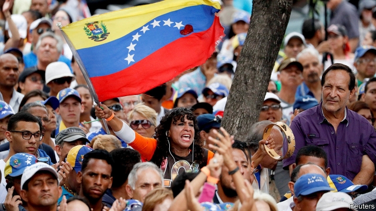

###### Feel the pressure

# America heaps more sanctions on Venezuela 

 

> print-edition iconPrint edition | The Americas | Aug 8th 2019 

AFTER THE axis of evil comes the “exclusive club of rogue nations”. That at least is how John Bolton, Donald Trump’s national security adviser, described Venezuela’s place in the world when he spoke on the sidelines of a conference in Lima, the capital of Peru, on August 6th. The meeting, attended by representatives of 59 countries, was called by the Peruvian government to discuss what to do about the “day after” Nicolás Maduro, Venezuela’s president, falls from power. But it was the United States that stole the limelight. 

On August 5th Mr Trump signed an executive order to, in effect, quarantine Venezuela in economic terms. The order freezes Venezuelan government assets. It is the harshest measure to date, aimed at all assets instead of specific companies, such as the state oil producer, PDVSA, as in the past. But it also applies secondary measures to anyone doing business with Venezuela. It is these sanctions which most threaten Mr Maduro’s government. 

According to Mr Bolton, companies around the world need to decide whether they want to receive a “trickle of income” from Venezuela or trade with the United States. The measure would allow the United States to move against any company, country or individual trading with Venezuela. America has had similar third-party sanctions in place against Cuba since the early 1960s, but they have lacked international support. The measures in place against Venezuela now are more like those against Iran and North Korea. 

American authorities have despaired of Chinese and Russian companies operating in Venezuela. They have warned that debt incurred by what they say is an illegitimate Venezuelan government would not be recognised by Mr Maduro’s successors, if and when he falls. In his address to the conference, Mr Bolton said China and Russia should not “double down on a bad bet”. 

America has been careful to state that the new measure does not apply to humanitarian aid or telecoms, which would hurt ordinary Venezuelans. Mr Maduro’s government called the move “economic terrorism” and pledged to resist efforts to remove him from power in favour of Juan Guaidó, the speaker of the national assembly who is already considered by numerous countries to be Venezuela’s legitimate president. 

The Maduro regime and Mr Guaidó’s faction have been talking in Barbados, in negotiations brokered by Norway, not least about organising early elections. Mr Maduro began a second term in power in January. The United States and many Latin American governments oppose holding another election while he remains in power, claiming he could rig them—as he was accused of doing last year. 

Attendees of the Lima meeting, among whom were representatives of Mr Guaidó, recognise the massive task of reconstruction, starting with the state-owned oil company. Venezuela has the world’s largest proven oil reserves, which made it one of the richest countries in South America. But production has crashed to less than 1m barrels a day, around two-thirds lower than in 2000. 

The United Nations in June estimated that more than 4m Venezuelans had fled the country. Some 850,000 have moved to Peru, the host of the meeting. The crisis, said Peru’s foreign minister, Néstor Popolizio, “has turned a country rich in resources into a disaster.”■ 

-- 

 单词注释:

1.sanction['sæŋkʃәn]:n. 核准, 制裁, 处罚, 约束力 vt. 制定制裁规则, 认可, 核准, 同意 

2.Venezuela[,vene'zweilә]:n. 委内瑞拉 

3.Aug[]:abbr. 八月（August） 

4.rogue[rәug]:n. 恶棍, 流氓, 小淘气 vt. 欺骗 vi. 游手好闲 

5.john[dʒɔn]:n. 盥洗室, 厕所, 嫖客 

6.bolton['bәultәn]:a. 可用螺栓固定的 

7.adviser[әd'vaizә]:n. 顾问, 劝告者, 指导教师 [法] 顾问, 劝告者 

8.sideline['saidlain]:n. 副业, 旁线, 界线, 兼职, 旁观者看法 vt. 使退出比赛场地 

9.lima['li:mә]:n. 利马（秘鲁首都） 

10.Peru[pә'ru:]:n. 秘鲁 

11.Peruvian[pә'ru:viәn]:a. 秘鲁的, 秘鲁人的, 秘鲁文化的 n. 秘鲁人 

12.maduro[mә'duәrәu]:a. 色深味浓的烟草做的, (雪茄)色深味浓的 

13.limelight['laimlait]:n. 石灰光, 石灰光灯, 以石灰光灯照射的舞台 vt. 使受到注目, 使显露头角 

14.quarantine['kwɒrәnti:n]:n. 隔离, 封锁交通, 检疫期 vt. 隔离, 排斥 

15.venezuelan[,venә'zweilәŋ]:a. 委内瑞拉的；委内瑞拉人的 

16.asset['æset]:n. 资产, 有益的东西 

17.producer[prә'dju:sә]:n. 生产者, 制作者, 制作人 [化] 发生器; (炉煤气)发生炉; 制气炉; 生产者 

18.pdvsa[]: 委内瑞拉石油公司总部所在地：委内瑞拉主要业务：炼油 

19.trickle['trikl]:n. 滴, 细流 vi. 滴, 细细地流 vt. 使滴, 使小量流动 [计] 信息透露 

20.Cuba['kju:bә]:n. 古巴 

21.Iran[i'rɑ:n]:n. 伊朗 

22.Korea[kә'riә]:n. 朝鲜, 韩国 

23.incur[in'kә:]:vt. 招致, 蒙受, 遭遇 [经] 招致, 蒙受, 担负 

24.illegitimate[.ili'dʒitimәt]:a. 不法的, 私生的, 不合规则的, 不合理的, 不符合习惯的 n. 无合法身份的人 vt. 宣告...为非法, 证明...为私生 

25.successor[sәk'sesә]:n. 继承者, 接任者 [计] 后继 

26.humanitarian[hju:.mæni'tєәriәn]:n. 人道主义者, 博爱者, 基督凡人论者 a. 人道主义的, 博爱的, 凡人论的 

27.telecom['telәkɔm]:telecommunication 电信 

28.venezuelan[,venә'zweilәŋ]:a. 委内瑞拉的；委内瑞拉人的 

29.terrorism['terәrizm]:n. 恐怖主义, 恐怖统治, 恐怖状态 [法] 胁迫, 暴政, 恐怖政治 

30.pledge[pledʒ]:n. 诺言, 保证, 誓言, 抵押, 信物, 保人, 祝愿 vt. 许诺, 保证, 使发誓, 抵押, 典当, 举杯祝...健康 

31.juan[hwɑ:n]:n. 胡安（男子名） 

32.legitimate[li'dʒitimәt]:a. 合法的, 正当的, 婚生的 vt. 认为正当, 立为嫡嗣, 使合法 

33.regime[rei'ʒi:m]:n. 政权, 当权期间, 政体, 社会制度, 体制, 情态 [医] 制度, 生活制度 

34.faction['fækʃәn]:n. 小派系, 内讧 [法] 宗派, 派别, 小集团 

35.Barbados[bɑ:'beidәus]:n. 巴巴多斯(岛) 

36.negotiation[ni.gәuʃi'eiʃәn]:n. 谈判, 磋商, 交涉 [经] 谈判, 协商 

37.broker['brәukә]:n. 掮客, 经纪人 [经] 经纪人, 掮客 

38.Norway['nɒ:wei]:n. 挪威 

39.rig[rig]:n. 装备, 帆装 vt. 装配, 装扮, 给船装帆, 垄断, 操纵 

40.attendee[æten'di:]:[计] 出席人, 参加者, 被照顾者, 被服务者 

41.reconstruction[.ri:kәn'strʌkʃәn]:n. 改造, 再建 [医] 改建, 改造, 翻造 

42.les[lei]:abbr. 发射脱离系统（Launch Escape System） 

