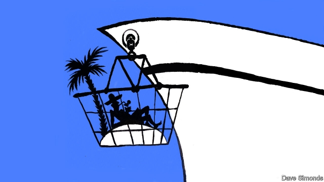

###### Island shopping

# Cruise-line companies are building private Caribbean play zones 

 

> print-edition iconPrint edition | The Americas | Aug 10th 2019 

THIRTY MINUTES west from Cap-Haïtien, a city in the north of Haiti, tawny sand beaches fringed with coconut palms are blocked by a high barbed-wire fence. It looks like a prison, except that inside are a 800-metre zip line, floating bouncy castles and a line of several hundred jetskis. Steel-drum music pumps from a 225,000-tonne ship rising 20 storeys from the turquoise sea. 

This is Labadee, a beach run by Royal Caribbean. Its name is a riff on Labadie, the name of the typically poor Haitian village next door. Though the resort is actually on the second-largest island in the Caribbean, the cruise giant markets it as a “private destination”. And in a sense they are not entirely wrong. Since its inauguration in 1986, passengers who come ashore have not been subject to customs or immigration controls. Extras, such as the signature “Labadoozie” cocktail, are paid for in US dollars, never the Haitian gourde. Haitians not employed by Royal Caribbean cannot enter. 

Caribbean countries striking deals with firms to open exclusive resorts (with or without customs checks) are “a growing phenomenon”, says Jim Walker, a lawyer based in Miami who deals with cruise liners. In 2015, Carnival opened the $85m Amber Cove in the Dominican Republic; this year, Royal Caribbean will open CocoCay in the Bahamas after a $250m renovation. A third of the 30m people who will cruise in 2019 will go to the Caribbean. 

For cruise companies, the benefits are clear. Customers—and their money—are kept in one place. And the experience can be tailored to fit nervous travellers. Dillon Mangs, an expatriate resident of Labadie whom Royal Caribbean contracts to run shore excursions, says he tries to showcase Haiti’s culture without dampening holidaymakers’ spirits by exposing them to too much reality. One excursion is to a mock Haitian mountain village, complete with a Vodou show. 

Is it a problem that cruise companies have such privileges? Some worry that the deals firms strike with governments are lopsided. To keep cruisers on side, Caribbean countries are “basically giving away parcels of land”, says Ross Klein, of the Memorial University of Newfoundland. Governments which demand too much find the ships go elsewhere. 

But for the troubled Haitian government, the Royal Caribbean deal does at least generate some cash. Each passenger, of whom there are over 700,000 a year, pays the state a $12 surcharge. The company provides jobs, and has also contributed to a school. As a boy, Rodman Decius, who lives in Labadie, attended the École Nouvelle; now he works as first mate on a yacht chartered by Royal Caribbean. He is pleased with the job and does not mind clueless guests. “If they ask questions, it’s nice for me to tell them about my culture,” he says. “But it doesn’t bother me if they don’t.”■ 
<<<<<<< HEAD

-- 

 单词注释:

1.Caribbean[.kæri'bi:әn]:n. 加勒比海 a. 加勒比海的, 加勒比人的 

2.Aug[]:abbr. 八月（August） 

3.Haiti['heiti]:n. 海地 

4.tawny['tɒ:ni]:a. 黄褐色的, 茶色的 n. 黄褐色 

5.fringe[frindʒ]:n. 边缘, 端, 流苏, 穗, 初步 vt. 加穗于, 加饰边于 a. 边缘的, 附加的 

6.coconut['kәukәnәt]:n. 椰子 [医] 椰子(实) 

7.bouncy['baunsi]:a. 快活的, 精神饱满的, 有弹性的, 自大的 

8.jetskis[]:[网络] 水上摩托车；滑行车 

9.turquoise['tә:kwɒiz]:n. 绿松石, 绿松石色 

10.labadee[]:[网络] 拉巴地；拉巴迪；拉巴第 

11.riff[rif]:n. 连复段 

12.labadie[]: [地名] [美国] 拉巴迪 

13.typically['tipikәli]:adv. 代表性地；作为特色地 

14.Haitian['heitiәn]:a. 海地的 n. 海地人, 海地语 

15.cruise[kru:z]:n. 巡航, 巡弋, 漫游 v. 巡航, 巡弋, 漫游 

16.entirely[in'taiәli]:adv. 完全, 全然, 一概 

17.inauguration[i,nɔ:^ju'reiʃәn]:n. (美)总统就职, 开幕仪式, 就职典礼, 开始, 开辟, 开创, 为...举行开幕式 [法] 就职, 就职典礼, 创造 

18.ashore[ә'ʃɒ:]:adv. 向岸, 在岸上 

19.cocktail['kɒkteil]:n. 鸡尾酒, 开味品 a. 鸡尾酒会的 

20.gourde[guәd]:n. 古德(海地货币单位) [经] 古德 

21.Haitian['heitiәn]:a. 海地的 n. 海地人, 海地语 

22.cannot['kænɒt]:aux. 无法, 不能 

23.jim[dʒim]:n. 吉姆（人名） 

24.walker['wɒ:kә]:n. 徒步者, 轻便鞋 [法] 山林巡视官 

25.Miami[mai'æmi]:n. 迈阿密 

26.carnival['kɑ:nivәl]:n. 嘉年华会, 狂欢节, 饮宴狂欢 

27.amber['æmbә]:n. 琥珀, 琥珀色 a. 琥珀色的, 琥珀似的 

28.cove[kәuv]:n. 山凹, 小湾 v. (使)内凹, (使)成拱形 

29.dominican[dә'minikәn]:a. 多明尼加共和国的 

30.cococay[]:[网络] 可可湾；可可岛；奥兰多 

31.Bahamas[bә'hɑ:mәz]:n. 巴哈马群岛 

32.renovation[.renәu'veiʃәn]:n. 革新, 刷新, 修理 [化] 改建 

33.traveller['trævlә]:n. 旅行者 [经] 旅行商 

34.dillon['dilәn]:n. 狄龙（姓氏） 

35.mang[]:n. 忙、盲等同音中文字；万、孟等同音粤语字 

36.expatriate[eks'peitrieit]:n. 移居国外者, 侨民, 被流放者, 背井离乡者 vt. 逐出国外, 脱离国籍, 放逐 vi. 移居国外 

37.showcase['ʃәukeis]:n. 陈列橱 [经] 商品陈列所, 货物陈列架 

38.dampen['dæmpәn]:vt. 弄湿, 使沮丧 vi. 变湿, 丧气 

39.mock[mɒk]:n. 嘲笑, 戏弄, 模仿 a. 假的, 伪造的, 模拟的 adv. 虚伪地 vt. 嘲弄, 模仿, 使失望, 欺骗, 挫败 vi. 嘲弄 

40.vodou[]:[网络] 伏都；巫毒；伏都教 

41.lopside[]:n. 倾向一方 

42.cruiser['kru:zә]:n. 巡洋舰, 巡航飞机, 警察巡逻车 

43.ros[]:abbr. 只读存储器（Read-Only-Storage）；活性氧（Reactive oxygen species） 

44.klein[]:n. 克莱因（男子名） 

45.Newfoundland[,nju:fәnd'lænd]:n. 纽芬兰 

46.surcharge['sә:tʃɑ:dʒ]:n. 装载过多, 超载, 追加罚款, 附加税 vt. 使装载过多, 追加罚款, 收附加税 

47.rodman['rɔdmәn,-mæn]:n. 钓鱼人, 司尺员, 标杆员 

48.Decius['di:ʃiəs]:n. 德西乌斯（罗马帝国皇帝） 

49.nouvelle[nu:'vel]:n. 中篇小说 

50.yacht[jɒt]:n. 快艇, 游艇 vi. 驾游艇, 乘游艇 

51.charter['tʃɑ:tә]:n. 特许状, 执照, 宪章 vt. 特许, 发给特许执照 

52.clueless[ˈklu:ləs]:a. 无能的, 笨的 

53.bother['bɒðә]:vt. 烦扰, 迷惑 vi. 烦恼, 操心 n. 麻烦, 纠纷, 讨厌的人 
=======
>>>>>>> 50f1fbac684ef65c788c2c3b1cb359dd2a904378

