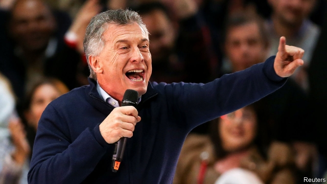

###### It won’t be easy

# Might Mauricio Macri be reelected in Argentina? 

 

> print-edition iconPrint edition | The Americas | Aug 10th 2019 

IN ARGENTINE POLITICS, being compared to a fat cow is not altogether a bad thing. At one of his last campaign stops ahead of national primaries on August 11th, Mauricio Macri, Argentina’s embattled president, rallied with thousands of farmers at the country’s annual agricultural show. Award-winning cows, horses, sheep and even donkeys paraded in front of him, as gauchos dressed in their baggy bombacha trousers doffed their berets. Mr Macri “looks like a winner to me”, said one cowboy, proudly showing off a bullock weighing close to half a tonne as he sought a selfie with a beaming president. 

The first round of the general election is due in late October; Mr Macri faces a tough contest from the duo of Cristina Fernández de Kirchner, Argentina’s president from 2007 to 2015, and her former chief of staff, Alberto Fernández (no relation). Cristina is running to be vice president; Alberto for president. Argentina is saddled with high inflation, rising unemployment and soaring debt. But despite the economic woe, Mr Macri may have a genuine chance. 

At the show the president celebrated this year’s record harvest, after last year’s worst drought in half a century. In a stadium speech he mentioned new roads, sewers and schools built during his first term. He promised that his government, if re-elected, would create a million jobs. “Sí, se puede!”(Yes, we can!) the crowd chanted back. Mr Macri is no Barack Obama, but he is learning how to rouse a crowd. “We are not going back,” he shouted, to rapturous applause. “We want a true democracy!” 

The primary election has no practical effect at the presidential level, because both Mr Macri and Mr Fernández are unchallenged within their parties. But since all Argentines over the age of 16 are legally obliged to vote, it functions in effect as a dry run of the October election. Pollsters reckon the Fernández-Fernández ticket will edge out Mr Macri, perhaps by a few percentage points. But according to one of Mr Fernández’s aides, that is not enough to give them a clear lead come October. “We know our best chance lies in an early knockout,” he says. 

To that end, Mr Fernández has pursued Mr Macri on the economy, a subject the president’s team avoids. He talks about little other than inflation, the devaluation of the peso and the record $57bn bail-out from the IMF. “We can’t pay our debts until we start growing again,” he says in one TV commercial. He says that, if elected, he could in effect default on government bonds and renegotiate the IMF loan. 

That scares the markets. On August 5th, as the standoff between China and the United States hit emerging markets worldwide, the peso fell by almost 2% against the dollar and the yield on Argentina’s debt climbed. “Our opponents are doing their worst to create market panic, but we’re prepared,” says Nicolás Dujovne, the treasury minister. 

Mr Macri’s longtime political guru, Jaime Durán Barba, sees a narrow loss in the primary as a victory in the making. If Mr Fernández comes out ahead, many voters will then fear he and his former boss could win. As long as Mr Macri survives to the run-off in November, Argentines who dislike Ms Fernández will “come home” from third-party candidates. The former president has been in court recently over corruption charges (she denies them all). 

Curiously, given the gap between Mr Macri’s centrism and the Fernández duo’s populism, the campaign so far has been bereft of ideas, says Sergio Berensztein, an analyst and pollster. Instead the candidates are focusing on “micro-reforms, not the macro-mess of the past 20 years”, he says. After the election a real debate will have to start—about the changes Mr Macri promised on taking office four years ago.■ 
<<<<<<< HEAD

-- 

 单词注释:

1.Mauricio[]:n. 毛利西奥（男子名） 

2.macri[]: [人名] 麦克里 

3.reelect[.ri:i'lekt]:vt. 重选, 改选 

4.Aug[]:abbr. 八月（August） 

5.argentine['ɑ:dʒәntain]:n. 银, 银白色金属, 银白色鱼鳞, 阿根廷人 a. 银的, 银色的, 阿根廷的 

6.politic['pɒlitik]:a. 精明的, 明智的, 策略的 

7.embattle[im'bætl]:vt. 列阵, 布阵, 整军备战, 严阵以待 

8.rally['ræli]:n. 重振旗鼓, 集合, 群众集会, 跌停回升 v. 重整旗鼓, 集合, 恢复精神, 团结, 挖苦, 嘲笑 

9.Gaucho['gautʃәu]:n. 加骄牧人 

10.baggy['bægi]:a. 袋状的, 松垂的 

11.trouser['trauzә]:a. 裤子的 

12.doff[dɒf]:vt. 脱, 丢弃, 摆脱 

13.beret['berei]:n. 贝雷帽 

14.proudly['praudli]:adv. 傲慢地, 自大地, 得意洋洋地 

15.bullock['bulәk]:n. 阉牛 

16.tonne[tʌn]:n. 吨, 公吨 [经] 吨 

17.selfie['sel.fi]:n. 自拍照 

18.duo['dju:әu]:n. 二重唱 

19.Cristina[]:n. 克里斯蒂娜（电视剧中的人物） 

20.de[di:]:[化] 非对映体过量 [医] 铥(69号元素铥的别名,1916年Eder离得的假想元素) 

21.kirchner[]:柯克纳（人名） 

22.alberto[]:n. 阿尔贝托（阿塞拜疆教练） 

23.Argentina[.ɑ:dʒәn'ti:nә]:n. 阿根廷 

24.inflation[in'fleiʃәn]:n. 胀大, 夸张, 通货膨胀 [化] 充气吹胀; 膨胀 

25.soar[sɒ:]:n. 高扬, 翱翔 vi. 往上飞舞, 高耸, 翱翔 

26.woe[wәu]:n. 悲哀, 悲痛, 苦痛 

27.sewer['su:ә]:n. 下水道, 阴沟, 裁缝师 vt. 用下水道排, 铺设下水道于 

28.SE[]:[计] 栈空, 系统扩充 [医] 硒(34号元素) 

29.barack[bɑ:'ræk]:n. 巴拉克（男子名） 

30.obama[]:n. 奥巴马(姓) 

31.rapturous['ræptʃәrәs]:a. 兴高采烈的, 狂喜的, 欢天喜地的 

32.presidential[.prezi'denʃәl]:a. 总统制的, 总统的, 首长的, 统辖的 [法] 总统的, 议长的, 总经理的 

33.unchallenged[.ʌn'tʃæliŋdʒd]:a. 未引起争论的, 未受到挑战的, 毫无疑问的 [法] 不回避的, 未引起争论的, 不成问题的 

34.argentine['ɑ:dʒәntain]:n. 银, 银白色金属, 银白色鱼鳞, 阿根廷人 a. 银的, 银色的, 阿根廷的 

35.legally['li:gәli]:adv. 法律上, 合法地 [法] 法律上, 合法地, 法定地 

36.pollster['pәulstә]:n. 民意调查人, 民意测验经办人 

37.reckon['rekәn]:vt. 计算, 总计, 估计, 认为, 猜想 vi. 数, 计算, 估计, 依赖, 料想 

38.aide[eid]:n. 助手, 副官 [计] 数据输入的可说明性 

39.knockout['nɔ'kaut]:n. (拳击)击倒对方, 被击倒, 击倒, (非正式)令人倾慕的人/物, 轰动的事物 a. 击倒的, 引人注目的, 轰动的, 使昏迷的 

40.devaluation[,di:vælju'eiʃәn]:n. 降低价值, 贬值 [经] 贬值 

41.peso['peisәu]:n. 比索 [经] 比索 

42.IMF[]:国际货币基金组织 [经] 国际货币基金 

43.default[di'fɒ:lt]:n. 违约, 不履行责任, 缺席, 默认值 v. 疏怠职责, 缺席, 拖欠, 默认 [计] 默认; 默认值; 缺省值 

44.renegotiate[.ri:ni'gәuʃieit]:vt. 重新谈判 

45.standoff['stændɒf]:a. 冷淡的, 有支架的 n. 冷淡, 平衡, 和局 

46.treasury['treʒәri]:n. 国库, 宝库, 财政部, 国库券 [经] 库存, 国库, 金库 

47.longtime['lɔŋtaim;'lɔ:ŋ-]:a. (已持续)长时间的,为时甚久的 adv. 长久 

48.guru['guru:]:n. 古鲁(印度教导师) [医] 柯拉子 

49.Jaime[]:n. 杰米（人名） 

50.barba['bɑ:bә]:芒 

51.voter['vәutә]:n. 选民, 投票人 [法] 选民, 选举人, 投票人 

52.corruption[kә'rʌpʃәn]:n. 腐败, 堕落, 贪污 [计] 论误 

53.curiously['kjuәriәsli]:adv. 好奇地 

54.centrism['sentrizәm]:n. 中间路线,中间派的政策,温和主义 

55.Populism['pɒpjulizm]:n. 平民主义, 民粹主义 

56.bereave[bi'ri:v]:vt. 使孤寂, 使丧失, 使失去 

57.Sergio[]:n. 塞尔吉奥（NBA球员） 

58.analyst['ænәlist]:n. 分析者, 精神分析学家 [化] 分析员; 化验员 
=======
>>>>>>> 50f1fbac684ef65c788c2c3b1cb359dd2a904378

