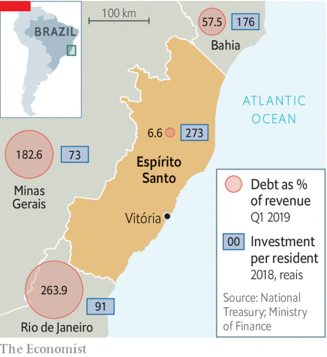

###### Spirited effort

# One Brazilian state stands out as a model of efficiency 

 

> print-edition iconPrint edition | The Americas | Aug 10th 2019 

THE MOQUECA in Espírito Santo, a state of 4m people on the coast of south-eastern Brazil, is lighter than the fish stew in Bahia, its neighbour to the north, explains a tuxedoed waiter in the capital, Vitória. Capixabas, as Espírito Santo residents are called, like it that way. Their beaches are smaller than those of Rio de Janeiro, to the south; their colonial towns plainer than those of Minas Gerais, to the west. Once considered signs of inferiority, these now seem like symbols of frugality. Other states are so indebted they cannot pay salaries, but Espírito Santo’s accounts are in order. 

That is thanks largely to the last governor, Paulo Hartung, who ran the state from 2003 to 2010 and then again from 2015 to last year. Mr Hartung stood in 2014 on an austerity platform, arguing that “spending is taking the elevator while revenue is taking the stairs”. On taking office he set about shrinking spending by 14%. His work means that Espírito Santo is now a model for other Brazilian states to follow. 

Brazil’s fiscal incontinence is legendary. The number of civil servants grew by 60% between 1995 and 2016, to 12m. Since public-sector workers cannot be fired or have their pay cut, they become a permanent expense once hired. Perks such as raises for seniority can even extend to widows’ pensions, producing the unique “post-mortem promotion”. Nearly 80% of government spending in Brazil goes on salaries and pensions, compared with a global average of 50-60%. “Instead of a state that serves the public, you have a state that serves the state,” says Samuel Pessôa of the Brazilian Institute of Economics at Fundação Getúlio Vargas, a university. 

 

These days the crisis is worst at the state level. The 27 states’ combined pensions shortfall alone is growing by 140bn reais ($35bn) a year, more than that of the federal government. The deficit has doubled in the past five years. Seven states already do not have enough cash to pay salaries; 12 more are close. 

Under Dilma Rousseff, Brazil’s president from 2011 to 2015, states like Rio de Janeiro depended on treasury-guaranteed loans from state banks to keep spending. But Brazil’s new president, Jair Bolsonaro, has promised to reduce the size of the state. His treasury head, Mansueto Almeida, has made debt relief conditional on efforts to comply with a fiscal-responsibility law—passed in 2000 but long ignored—that restricts spending on personnel. 

So how has Espírito Santo stayed in the black? One thing that sets the state apart was foresight about the depth of Brazil’s worst-ever recession, which began in 2014. Other governors believed the then president Ms Rousseff, who promised a quick recovery. “We underestimated the size of the crisis,” admits Julio Bueno, the treasury secretary in Rio de Janeiro at the time. Brazil’s GDP fell by 3.8% in 2015 and by 3.6% in 2016. Rio ended up with a budget deficit of 11bn reais. Espírito Santo finished both years with a surplus. 

Boldness is the second thing that sets Espírito Santo apart. “Fiscal adjustment is a cake recipe not a silver bullet,” says Mr Hartung. It can easily go wrong. As well as cutting budgets, including for the judiciary and legislature, he had to stand up to the unions, announcing the salary freeze on his first day. Even when two years later police officers went on strike, and 200 were murdered, Mr Hartung did not back down. 

Finally, Espírito Santo was better placed to downsize. Its bureaucracy includes a large share of temporary workers, including roughly 60% of teachers. Unlike civil servants, they can be fired. Mr Hartung eliminated more than 7,000 positions, or roughly 12% of the bureaucracy. In Rio de Janeiro less than 3% of government workers are temporary. 

Austerity has been painful. Sergio Majeski, a state congressman who opposed the fiscal adjustment, says that cuts to public investment made it harder to climb out of recession. But despite laying off teachers and closing schools, Espírito Santo jumped from 9th place to 1st on a nationwide secondary school exam between 2013 and 2017. Mr Majeski says this is because weaker students began skipping classes. But according to Marco Aurélio Villela, the director of a government school in Vitória, teachers on short-term contracts tend to perform better because they know they can be sacked. 

And cutting staff has helped the state to maintain a relatively high level of investment. According to a study by Brazil’s treasury, three states that limited spending on salaries—Espírito Santo, Alagoas and Ceará—were able to invest, on average, 304 reais per person in 2018. Rio de Janeiro, Minas Gerais and Rio Grande do Sul, the states deepest in debt, only spent 91 reais. 

Can other states emulate Espírito Santo? It will be difficult without changes to federal laws. Mr Bolsonaro’s pension reform, working its way through congress, may only apply to federal workers. The supreme court will soon decide whether to allow indebted states to reduce civil servants’ salaries and hours. That would provide some relief, as would a bill to allow people to be sacked for persistent poor performance. But most politicians will balk at unpopular cuts. A pilot project led by Ana Carla Abrão, an economist at Oliver Wyman, a consultancy, found that the city of São Paulo could reduce its payroll by 30% without sacking anyone, by paring back perks for all but the best-performing employees. The project was shelved by a new mayor in 2018. 

Last year Mr Hartung decided not to run for re-election. It would have sent a better message if he had, and had won, says Cristiane Schmidt, the treasury secretary for Goiás, a state in deep fiscal trouble. Brazilians tend to blame corruption for their economic woes, even though more money is lost to bloated bureaucracy. Whereas Sérgio Moro, a judge, gained international fame for leading the sprawling Lava Jato anti-corruption investigation, few outside of Espírito Santo have heard of Paulo Hartung. That may change as more states find their coffers empty. ■ 

