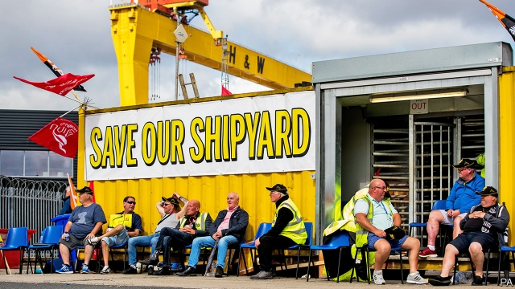

###### Staring into the abyss

# Business this week 

> Aug 10th 2019 

America officially categorised China as a currency manipulator for the first time in 25 years, after the yuan weakened past the psychologically significant mark of seven to the dollar, the lowest point for the Chinese currency since the financial crisis. The yuan trades narrowly in China around an exchange rate set by the central bank. It dismissed the idea that the yuan had been manipulated, submitting that its depreciation was caused instead by “shifts in market dynamics”, which include “escalating trade frictions”. See article.  

Those trade frictions had indeed escalated when Donald Trump earlier announced 10% tariffs on an additional $300bn-worth of Chinese goods in the two countries’ trade war. Mr Trump said he was punishing China for not keeping its promise to buy more American agricultural goods, among other things. 

Stockmarkets had a rocky week, with the S&P 500, Dow Jones Industrial Average and NASDAQ indices recording their worst trading day of the year so far. Most Asian currencies tumbled following the yuan’s depreciation. But the yen, considered to be a haven in uncertain times, soared against the dollar. The yields on government bonds, another safe bet, fell as investors ploughed into the market. 

Investors were also unnerved by a wave of larger-than-expected interest-rate cuts. India’s central bank shaved 0.35 of a percentage point off its main rate, to 5.4%; New Zealand’s slashed its benchmark rate from 1.5% to 1%; and Thailand’s first cut in four years left its main rate at 1.5%. All three were pessimistic about the prospects for growth. 

A trade dispute caused sales of cars made in Japan to plunge in South Korea last month. Samsung, South Korea’s biggest maker of smartphones and memory chips, said it was searching for substitute suppliers of some essential chemicals that Japan has tightened its grip on, which South Korea calls an embargo. This week Japan approved its first shipment of high-tech material to South Korea in a month. The row was sparked by a political spat. 

The EU selected Kristalina Georgieva as its candidate to head the IMF, but only after the rancorous exercise concluded with some telephone diplomacy. Ms Georgieva is currently the second-highest official at the World Bank. Under an informal convention, Europe gets to pick the managing director of the IMF (and America the president of the World Bank), so Ms Georgieva is favoured to get the job in October, when the IMF will choose its leader. But it must first change a rule that says a new managing director must be under 65. Ms Georgieva turns 66 on August 13th. 

John Flint’s decision to step down as chief executive of HSBC after just 18 months in the job took markets by surprise. His resignation was made “by mutual agreement with the board”, which reportedly lost confidence in Mr Flint’s ability to steer the bank through increasingly choppy waters stirred by trade tensions between America and China. Most of HSBC’s profit comes from Asia. The bank is expected to take its time choosing a successor. See article.  

A report prepared for the Intergovernmental Panel on Climate Change suggested that a move away from meat and towards plant-based diets could help fight global warming, but it pulled back from recommending that people become vegetarians. Companies selling plant-based products have seen their share prices soar this year. 

The latest takeover in the consolidating payments industry saw Mastercard agreeing to buy Nets, a Danish real-time payments provider, for $3.2bn. It is Mastercard’s biggest acquisition to date. 

Vivendi, a French media company, said it was considering selling a stake of at least 10% of its Universal Music business to Tencent, a Chinese technology conglomerate, possibly raising that to 20% at a later date. If completed, a deal might allow Tencent to combine its expertise in streaming with Universal’s vast catalogue of artists, which include Abba, the Beatles, Drake, Elton John and Taylor Swift. 

 

The Harland and Wolff shipyard in Belfast entered administration, marking the probable end of a business that built the Titanic and other famous vessels. The yard once employed 15,000 workers, but now just 122 work on repairs. It has not built a ship since 2003. 

Barneys New York, a luxury department-store chain that opened shop in 1923, filed for bankruptcy protection and said it would close most of its stores. The company is restructuring its debt and expects to keep seven stores open, including its flagship premises in Manhattan, made famous by “Sex and the City”. Its insolvency proves that the upheaval in retailing is not confined to suburban shopping malls. 

-- 

 单词注释:

1.abyss[ә'bis]:n. 深渊, 深邃, 地狱 

2.Aug[]:abbr. 八月（August） 

3.officially[ә'fiʃәli]:adv. 作为公务员, 职务上, 官方地 

4.categorise['kæti^әraiz]:vt. 分类, 归类 

5.manipulator[mә'nipjuleitә]:n. 操作者, 机械手 [化] 机械手 

6.psychologically[,psaikә'lɔdʒikәli]:adv. 心理上, 从心理学角度 

7.narrowly['nærәuli]:adv. 狭窄地, 严密地, 仔细地, 几乎不, 勉强地, 仅仅 

8.manipulate[mә'nipjuleit]:vt. 操纵, 利用, 操作, 巧妙地处理, 假造 

9.depreciation[di.pri:ʃi'eiʃәn]:n. 价值减低, 减价, 跌落, 贬低, 折旧 [化] 折旧; 减值 

10.escalate['eskәleit]:vi. 逐步扩大, 逐步升高, 逐步增强 vt. 使逐步上升 

11.tariff['tærif]:n. 关税, 关税表, 价格表, 收费表 vt. 课以关税 [计] 价目表 

12.stockmarket[s'tɒkmɑ:kɪt]: 证券市场; 证券交易所; 证券行情 

13.rocky['rɒki]:a. 岩石的, 多石的, 像岩石的, 无情的, 摇动的, 摇晃的 

14.dow[daj]:n. 美国陶氏；美国陶氏化学；道琼斯平均指数 

15.jones[dʒәunz]:n. 琼斯（姓氏） 

16.nasdaq['næz,dæk]:abbr. 全国证券交易商自动报价系统协会（National Association of Securities Dealers Automated Quotation） 

17.yen[jen]:n. 日元(日本货币单位), 渴望, 嗜好 vi. 渴望 

18.haven['heivn]:n. 港, 避难所, 安息所 vt. 安置...于港中, 庇护, 入港 

19.soar[sɒ:]:n. 高扬, 翱翔 vi. 往上飞舞, 高耸, 翱翔 

20.investor[in'vestә]:n. 投资者 [经] 投资者 

21.unnerve[.ʌn'nә:v]:vt. 使失去勇气, 使胆怯, 使不能自制 [医] 除神经 

22.slash[slæʃ]:v. 猛砍, 乱砍 n. 猛砍, 乱砍, 删减 [计] 斜线 

23.benchmark[]:[计] 基准程序; 基准 

24.Korea[kә'riә]:n. 朝鲜, 韩国 

25.samsung[]:n. 三星电子（韩国电子公司） 

26.maker['meikә]:n. 制造者, 上帝 [经] 制造者, 出票人 

27.smartphones[]: 智能手机（smartphone的复数） 

28.chip[tʃip]:n. 屑片, 薄片, 碎片 vt. 削, 切, 削成碎片, 使摔倒, 凿 vi. 削下屑片 [计] 孔屑; 组件; 晶片; 芯片 

29.supplier[sә'plaiә]:n. 供应者, 供给国, 供应商 [化] 承制厂; 供应厂商 

30.tighten['taitn]:vt. 勒紧, 使变紧 vi. 变紧, 绷紧 

31.embargo[im'bɑ:gәu]:n. 封港令, 禁运 vt. 禁止出入港口, 禁运 

32.shipment['ʃipmәnt]:n. 装船, 出货 [经] 运送, 运送(寄出)货物, 装载 

33.EU[]:[化] 富集铀; 浓缩铀 [医] 铕(63号元素) 

34.georgieva[]:n. (Georgieva)人名；(塞)格奥尔基耶娃 

35.IMF[]:国际货币基金组织 [经] 国际货币基金 

36.rancorous['ræŋkәrәs]:a. 深恨的, 怀恶意的 

37.diplomacy[di'plәumәsi]:n. 外交, 外交手腕, 交际手段 [法] 外交, 外交手腕, 权谋 

38.currently['kʌrәntli]:adv. 现在, 当前, 一般, 普通 [计] 当前 

39.informal[in'fɒ:mәl]:a. 非正式的, 不拘礼的, 通俗的 [经] 非正式的, 日常使用的 

40.john[dʒɔn]:n. 盥洗室, 厕所, 嫖客 

41.hsbc[]:abbr. 汇丰银行（Hong Kong and Shang Hai Banking Corporation） 

42.reportedly[ri'pɒ:tidli]:adv. 根据传说, 根据传闻, 据报道 

43.choppy['tʃɒpi]:a. 猛地一动一停的, 突变的 [经] 震荡的 

44.successor[sәk'sesә]:n. 继承者, 接任者 [计] 后继 

45.intergovernmental[,intә^ʌvәn'mentәl]:a. 政府间的 

46.vegetarian[.vedʒi'tєәriәn]:n. 素食者, 食草动物 a. 素食的 

47.takeover[]:n. 接管, 接收 [经] 接收 

48.consolidate[kәn'sɒlideit]:vt. 巩固, 使联合, 统一 vi. 巩固 [计] 合并计算 

49.mastercard['mɑ:stə,kɑ:d]:n. 万事达信用卡 

50.Danish['deiniʃ]:n. 丹麦文 a. 丹麦的, 丹麦人的, 丹麦文的 

51.provider[prә'vaidә]:n. 供应者, 供养人, 伙食承办人 [计] 提供器 

52.vivendi[]:[网络] 维旺迪；威望迪；法国维旺迪集团 

53.Tencent[]:[网络] 腾讯；腾讯公司；腾讯控股 

54.conglomerate[kәn'glɒmәrit]:a. 聚成球形的, 砾岩性的 n. 集成物, 混合体, 砾岩 v. (使)凝聚成团 

55.expertise[.ekspә:'ti:z]:n. 专家意见, 专门技术 [法] 专门知识, 专家意见 

56.Abba['æbә]:n. 阿爸父(耶稣对上帝的尊称) 

57.beatles['bi:tlz]:n. 披头士合唱（摇滚乐队） 

58.drake[dreik]:n. 公鸭, 蜉蝣类 

59.elton['eltәn]:n. 埃尔顿（男子名） 

60.taylor['teilә]:n. 泰勒 

61.Harland[]:n. (Harland)人名；(英、德、瑞典)哈兰；(法)阿兰 

62.Wolff[]:n. (Wolff)人名；(波、芬、瑞典、德、匈、法、罗、荷、英)沃尔夫 沃尔夫 

63.shipyard['ʃipjɑ:d]:n. 造船厂 [经] 船坞, 造船厂, 修船厂 

64.Belfast[.belfɑ:st]:n. 贝尔法斯特 

65.Titanic[tai'tænik]:a. 四价钛的 [化] 钛; 正钛; 四价钛 

66.barney['bɑ:ni]:n. [口]大吵大闹；拉曳器 

67.york[jɔ:k]:n. 约克郡；约克王朝 

68.bankruptcy['bæŋkrәptsi]:n. 破产者 [经] 破产, 倒闭 

69.restructuring[]:[计] 重构的 

70.flagship['flægʃip]:n. 旗舰 

71.premise['premis]:n. 前提, 房屋连地基, 上述各项 vt. 预先提出, 引出, 作为...的前提 vi. 作出前提 

72.Manhattan[mæn'hætәn]:n. 曼哈顿 

73.insolvency[in'sɒlvәnsi]:n. 无力偿还, 破产 [经] 破产, 无力偿付, 不足抵偿债务 

74.upheaval[ʌp'hi:vl]:n. 举起, 隆起, 大变动, 剧变 

75.suburban[sә'bә:bәn]:a. 郊外的, 郊区的, (贬)偏狭的, 土气的, 见识不广的 n. 郊区居民 

76.mall[mɔ:l]:n. 林荫路 

