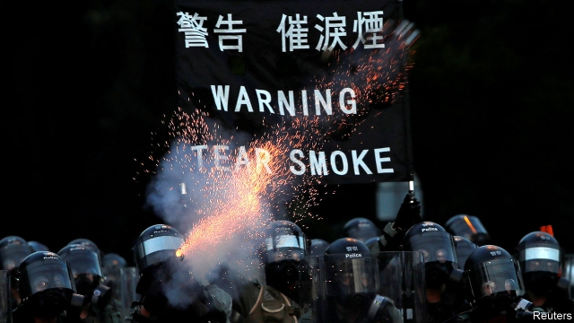
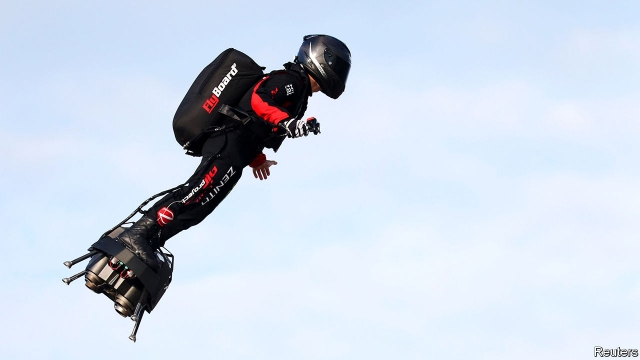

###### Staring into the abyss

# Politics this week 

 

> Aug 10th 2019 

In its most ominous warning yet to protesters in Hong Kong, China said the demonstrators were “playing with fire” and on “the verge of a very dangerous situation”. A day earlier a strike hit the city’s transport system and led to more than 200 flight cancellations. The protesters, who initially wanted an extradition bill to be scrapped, are now calling for Carrie Lam to resign as Hong Kong’s leader and for direct elections. China’s spokesman in Hong Kong said Ms Lam was staying put. See article.  

India’s Hindu-nationalist government unexpectedly ended the autonomy granted to Indian-administered Kashmir, splitting it in two, putting local party leaders under house arrest and ordering non-residents, including tourists, to leave. The government poured another 25,000 troops into the region. Pakistan said the move was illegal. Relations between the two countries were already fraught because of an attack by Pakistani-based jihadists on Indian troops in Kashmir six months ago. See article. 

The Taliban started a fresh round of talks with America’s envoy for Afghanistan. The talks, held in Qatar, are aiming for a deal under which America will withdraw its troops from Afghanistan, but only if the Taliban starts negotiations with the government in Kabul. As they were talking, the Taliban claimed responsibility for a bomb that killed 14 people and wounded 145 in Kabul. 

The Philippines declared a national dengue epidemic. At least 146,000 cases were recorded from January to July, double the number in the same period last year. More than 620 people have died. 

New Zealand’s government introduced a bill to decriminalise abortion and allow women to seek the procedure up to 20 weeks into a pregnancy. At present a woman has to get permission for an abortion, and may have one only if her pregnancy endangers her physical or mental health. New Zealand’s abortion rate is nevertheless higher than in most European countries. 

America imposed a complete economic embargo on the government of Venezuela, freezing all its assets and threatening sanctions against firms that do business with it, unless they have an exemption. The move steps up the pressure on Nicolás Maduro’s socialist regime. America, along with 50-odd other countries, recognises Juan Guaidó, the opposition leader, as Venezuela’s president, though Mr Maduro is still supported by China and Russia. See article. 

The head of Brazil’s institute for space research was fired after a spat with Jair Bolsonaro, the country’s president, over satellite images that showed a sharp increase in the Amazon’s deforestation. Mr Bolsonaro had questioned the data and said it brought Brazil’s reputation into disrepute. 

The latest mass shootings in America elicited more pleas for gun controls. Even some Republicans said they would support “red-flag laws” that would take guns away from those who are a violent risk. The gunman who slaughtered 22 people at a Walmart in heavily Hispanic El Paso was in custody, as police trawled through an anti-immigrant screed he had written. The shooter who murdered nine people, including his sister, in Dayton was killed by police officers on patrol after 30 seconds of mayhem. See article.  

America’s immigration agency arrested 680 illegal migrant workers at seven factories in Mississippi. Some were released and told to appear at an immigration court; others were sent to a detention centre in Louisiana. The operation, said to be the biggest of its kind in a single state, had been planned for months. 

Donald Trump withdrew his pick of John Ratcliffe as the new director of national intelligence, just days after putting his name forward. Many had criticised the selection, as Mr Ratcliffe’s only credentials seemed to be a staunch defence of Mr Trump at a recent congressional hearing on the Mueller report.  

Puerto Rico’s Supreme Court ruled that the appointment of a new governor by Ricardo Rosselló, who was forced from office by street protests, was unconstitutional and he would have to step down. The court sided with the territory’s Senate, which had not been given a vote on the appointment. After the court’s decision Wanda Vázquez was sworn in as governor, though she had said she didn’t want the job. 

Tributes were paid to Toni Morrison, the only black woman to have won the Nobel prize for literature, who died aged 88. Ms Morrison’s work was based on narratives about race and slavery. 

A car-bomb in central Cairo killed 20 people. Egypt’s government blamed a violent offshoot of the Muslim Brotherhood for the blast. 

Britain joined an American-led initiative to provide naval protection to ships travelling through the Strait of Hormuz amid heightened tensions with Iran. In July Iran seized a British-flagged oil tanker. 

Mozambique’s president signed a peace agreement with the leader of Renamo, a rebel movement. Renamo said it will disarm some 5,000 fighters and peacefully contest elections scheduled to be held in October. It waged a guerrilla war from 1977 to 1992 before laying down its guns, but took up arms again in 2012. 

The UN World Food Programme said that 5m people in Zimbabwe—a third of the population—are at risk of starvation. The country was the region’s breadbasket until the government began stealing farms and handing them to ruling-party cronies. 

There were more demonstrations in Moscow against the authorities’ decision to exclude opposition figures from contesting next month’s municipal elections. Hundreds of protesters were arrested, including Lyubov Sobol, one of the leading candidates to have been barred from appearing on the ballot. 

Italy’s government tightened the laws on dealing with migrants, sharply increasing the fines that can be imposed on NGOs that rescue people at sea and bring them to Italy without permission. The government had to present the vote as an issue of confidence, but easily prevailed. See article.  

 

Powered by kerosene in a backpack, Franky Zapata flew across the English Channel on a hoverboard. The French inventor, who demonstrated his device at this year’s Bastille Day parade, took 22 minutes to make the 35km (22-mile) crossing. A handy alternative to the Eurostar when it is next disrupted by weather/strikes/ technical issues. 

-- 

 单词注释:

1.abyss[ә'bis]:n. 深渊, 深邃, 地狱 

2.politic['pɒlitik]:a. 精明的, 明智的, 策略的 

3.Aug[]:abbr. 八月（August） 

4.ominous['ɒminәs]:a. 恶兆的, 不吉利的, 预兆的 

5.protester[]:n. 抗议者, 持异议者, 拒付者 [经] 反对者 

6.hong[hɔŋ]:n. （中国、日本的）行, 商行 

7.kong[kɔŋ]:n. 含锡砾石下的无矿基岩；钢 

8.demonstrator['demәnstreitә]:n. 论证者, 证明者, 指示者, 示威者 [医] 示教者 

9.verge[vә:dʒ]:n. 边缘, 边界, 起始点 vi. 处在边缘, 接近, 下沉, 趋向 

10.cancellation[kænsә'leiʃәn]:n. 取消, 作废, 注销戳 [经] 注销, 取消, 保险单的注销 

11.initially[i'niʃәli]:adv. 最初, 开头 

12.extradition[.ekstrә'diʃәn]:n. 引渡逃犯, 亡命者送还本国 [法] 引渡 

13.scrap[skræp]:n. 碎片, 残余物, 些微, 片断, 铁屑, 吵架 vt. 扔弃, 敲碎, 拆毁 vi. 互相殴打 a. 零碎拼凑成的, 废弃的 

14.carrie['kæri]:n. 卡丽（女名, Caroline的昵称） 

15.lam[læm]:v. 打, 鞭笞, 逃脱 n. 逃亡 

16.spokesman['spәuksmәn]:n. 发言人, 代言者 

17.unexpectedly[]:adv. 想不到的, 突然的, 意外的, 出乎意料的 

18.autonomy[ɒ:'tɒnәmi]:n. 自治, 自治权 [医] 自主性 

19.Kashmir['kæʃmiә]:n. 克什米尔 

20.Pakistan[.pɑ:ki'stɑ:n]:n. 巴基斯坦 

21.fraught[frɒ:t]:a. 含有...的, 伴着...的, 充满...的 

22.jihadist[]:n. 伊斯兰圣战士 

23.Taliban[]:塔利班 

24.envoy['envɒi]:n. 外交使节, 特使 [法] 使者, 代表, 使节 

25.Afghanistan[æf'gænistæn]:n. 阿富汗 

26.Qatar['kɑ:tәr]:n. 卡塔尔 

27.negotiation[ni.gәuʃi'eiʃәn]:n. 谈判, 磋商, 交涉 [经] 谈判, 协商 

28.Kabul['kɑ:bәl]:n. 喀布尔(阿富汗首都) 

29.Philippine['filipi:n]:a. 菲律宾(群岛)的, 菲律宾人的 

30.dengue['deŋgi]:n. 登革热 [医] 登革热 

31.epidemic[.epi'demik]:n. 传染病, 流行病 a. 流行的, 传染性的 

32.decriminalise[di:'kriminəlaiz]:vt. [主英国英语] =decriminalize 

33.pregnancy['preɡnәnsi]:n. 怀孕；丰富, 多产；意义深长 

34.endanger[in'deindʒә]:vt. 危及 [法] 使危险, 危及 

35.embargo[im'bɑ:gәu]:n. 封港令, 禁运 vt. 禁止出入港口, 禁运 

36.Venezuela[,vene'zweilә]:n. 委内瑞拉 

37.asset['æset]:n. 资产, 有益的东西 

38.sanction['sæŋkʃәn]:n. 核准, 制裁, 处罚, 约束力 vt. 制定制裁规则, 认可, 核准, 同意 

39.exemption[ig'zempʃәn]:n. 解除, 免除, 免税 [化] 免检 

40.regime[rei'ʒi:m]:n. 政权, 当权期间, 政体, 社会制度, 体制, 情态 [医] 制度, 生活制度 

41.juan[hwɑ:n]:n. 胡安（男子名） 

42.opposition[.ɒpә'ziʃәn]:n. 反对, 敌对, 相反, 在野党 [医] 对生, 对向, 反抗, 反对症 

43.maduro[mә'duәrәu]:a. 色深味浓的烟草做的, (雪茄)色深味浓的 

44.jair[]:[网络] 睚珥；贾伊尔；睢珥 

45.deforestation[di:.fɒ:ri'steiʃәn]:n. 采伐森林, 森林开伐 [法] 砍伐森森 

46.datum['deitәm]:n. 论据, 材料, 资料, 已知数 [医] 材料, 资料, 论据 

47.disrepute[.disri'pju:t]:n. 丧失名誉, 坏名声, 不名誉 

48.elicit[i'lisit]:vt. 引出, 推导出, 引起 

49.plea[pli:]:n. 恳求, 辩解, 抗辩, 诉讼, 请愿, 托词 [法] 抗辩, 申诉案件, 答辩 

50.gunman['gʌnmәn]:n. 枪手, 持枪的歹徒, 制造枪械者 [法] 持枪歹徒, 持枪抢劫或杀人者, 枪炮工人 

51.slaughter['slɒ:tә]:n. 残杀, 屠杀, 杀戮 vt. 残杀, 屠杀, 亏本出售 

52.walmart['wɔlma:t]: 沃尔玛（世界连锁零售企业） 

53.Hispanic[his'pænik]:a. 西班牙的 

54.el[el]:abbr. 预期损失（Expected Loss） 

55.paso[]:abbr. 泛美体育组织（Pan American Sports Organization） 

56.custody['kʌstәdi]:n. 监护, 拘留, 监禁 [经] 保管, 照顾, 保护 

57.trawl[trɒ:l]:n. 拖网 v. 用拖网捕鱼 

58.screed[skri:d]:n. 冗长的文章, (瓦工用的)抹灰靠尺 [法] 事故陈述书, 呈文, 冗长文章 

59.shooter['ʃu:tә]:n. 射手, 狩猎者, 手枪 

60.dayton['deitən]:n. 代顿（美国俄亥俄州西南部城市） 

61.patrol[pә'trәul]:n. 巡逻, 巡逻员, 侦察队 v. 巡逻, 巡视 

62.mayhem['meihem]:n. 蓄意的破坏, 故意的伤害罪 [医] 伤残, 残废 

63.migrant['maigrәnt]:n. 候鸟, 移居者 [法] 移居者 

64.Mississippi[.misi'sipi]:n. 密西西比河, 密西西比州 

65.detention[di'tenʃәn]:n. 阻止, 监禁, 拘留 [医] 隔离, 拘留, 滞留, 停滞 

66.Louisiana[lu:.i:zi'ænә]:n. 路易斯安那(美国州名) 

67.john[dʒɔn]:n. 盥洗室, 厕所, 嫖客 

68.Ratcliffe[]:n. (Ratcliffe)人名；(英)拉特克利夫 

69.criticise['kritisaiz]:v. 批评, 吹毛求疵, 非难 

70.credential[kri'denʃәl]:n. 国书, 凭据, 证明书 [经] 凭证, 证书 

71.staunch[stɒ:ntʃ]:vt. 止住, 止血 a. 坚固的, 坚强的, 忠实的, 忠诚的, 不透水的 

72.congressional[kәn'greʃәnl]:a. 会议的, 议会的, 国会的 [法] 代表大会的, 大会的, 议会的 

73.Mueller[]:米勒（人名） 

74.Puerto[]:n. 垭口, 港口, 山口 n. (Puerto)人名；(西)普埃尔托 

75.Ricardo[ri'kɑ:dәu]:里卡多(姓氏) 

76.unconstitutional['ʌnkɔnsti'tju:ʃәnәl]:a. 违反宪法的, 不符合宪法的 [法] 违反宪法的, 违宪的, 不合宪法规定的 

77.WANDA['wɔndә]:n. 旺达(f.) 

78.tribute['tribju:t]:n. 贡物, 礼物, 颂辞 

79.toni['tәuni]:n. 托妮（女子名） 

80.morrison['mɔrisn]:n. 莫里森（姓氏） 

81.Nobel['nәubel]:n. 诺贝尔 

82.narrative['nærәtiv]:n. 叙述, 故事 a. 叙述的, 叙事的, 故事体的 

83.Cairo['kaiәrәu]:n. 开罗 

84.offshoot['ɒ:fʃu:t]:n. 分支, 旁系, 衍生事物 

85.Muslim['mjzlim; (?@) 'mʌzlem]:n. 伊斯兰教, 伊斯兰教教徒 

86.Hormuz['hɔ:mәz,hɔ:'mu:z]:霍尔木兹海峡(在伊朗和阿拉伯半岛之间,连接波斯湾[即阿拉伯湾]和阿曼湾) 

87.amid[ә'mid]:prep. 在其间, 在其中 [经] 在...中 

88.heighten['haitn]:vt. 增高, 提高, 加强 vi. 升高, 变大 

89.Iran[i'rɑ:n]:n. 伊朗 

90.renamo[]:[网络] 莫桑比克全国抵抗运动；莫桑比克全国抵抗组织；莫桑比克民族抵抗运动 

91.disarm[dis'ɑ:m]:vt. 解除武装, 裁军, 缓和 vi. 放下武器 

92.peacefully[]:adv. 平静地 

93.guerrilla[gә'rilә]:n. 游击队 

94.UN[ʌn]:pron. 家伙, 东西 [经] 联合国 

95.breadbasket['bred,bɑ:skit]:n. <俚>胃, 腹 

96.crony['krәuni]:n. 密友, 亲密伙伴, 好朋友 

97.demonstration[.demәn'streiʃәn]:n. 示范, 实证 [医] 示教, 实物教授 

98.municipal[mju:'nisipl]:a. 市政的, 自治区的, 内政的 [经] 市政的, 市的 

99.lyubov[]:[网络] 柳博芙 

100.sobol[]: [人名] 索博尔 

101.ballot['bælәt]:n. 投票, 投票用纸, 抽签 vi. 投票, 抽签 vt. 投票选出, 拉选票 

102.tighten['taitn]:vt. 勒紧, 使变紧 vi. 变紧, 绷紧 

103.ngos[]:abbr. non-government organization 非政府组织，非政府机构 

104.kerosene['kerәsi:n]:n. 煤油, 火油, 灯油 [化] 煤油 

105.backpack['bækpæk]:n. 远足用的背包；双肩背包, 背包 

106.franky[]:n. 佛朗基（男子名） 

107.zapata[zə'pɑ:tə; sɑ:'pɑ:tɑ:]:n. 萨帕塔小胡子（用作定语） 

108.hoverboard[hʌvəbɔ:d]:n. 悬滑板 

109.bastille[bæ'sti:l]:n. 城堡；牢狱 

110.eurostar['juərəustɑ:]: 欧洲之星（一条连接英国伦敦圣潘可拉斯车站与法国巴黎北站、里尔以及比利时布鲁塞尔南站的高速铁路服务） 

111.disrupt[dis'rʌpt]:a. 分裂的, 中断的 vt. 使分裂, 使瓦解 

