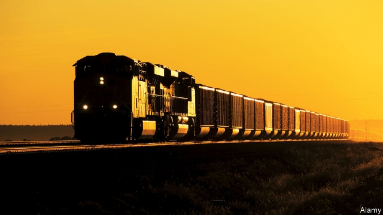

###### Comin’ round the bend

# America’s coal capital knows it must rethink its future 

 

> print-edition iconPrint edition | United States | Aug 10th 2019 

RUSTY BELL climbs a roadside platform and gazes at the sweeping, flower-strewn landscape of northern Wyoming. Immediately before him is a vast hole. Eagle Butte, a canyon of grey and brown rock, is one of the largest coal mines in America. The commissioner of Campbell County calls it a mainstay of the economy. Nearby Gillette, for example, has a swanky recreation centre, decent public-health services, a community college and more, all thanks to coal revenues, he says. 

Mr Bell’s problem is that nothing moves in the hole. Yellow lorries on the valley floor look tiny and toylike in the distance. Each is really a giant able to haul a payload of 400 tons. The tyres on each one are more than twice the height of a tall man. But where a shift of 75 workers usually toils, all is still. Where trains 1.5 miles (2.4km) long used to leave from the mine’s edge, their 140 cars brimming with low-sulphur coal, nothing stirs. Buses that bring 8,000 tourists a year to the mine are also locked out. 

The operator, Blackjewel, last year shipped 34m tons from Eagle Butte and a sister mine. About 165bn tons of recoverable coal remain under the prairie grass of the wider Powder River basin. In theory that means hundreds of years of digging yet. But in July Blackjewel declared bankruptcy, chained its gates and sent home over 1,700 workers nationally, including 580 in Wyoming. Officials and residents in Gillette lament “horrible” incompetence by its boss. The mayor, Louise Carter-King, blames “complete mismanagement”, vowing that “these mines will reopen”. 

In reality Blackjewel’s troubles reflect industry-wide woes. Cloud Peak Energy runs three mines nearby and declared bankruptcy in May. Six Wyoming operators have done so since 2015. Some are consolidating, others have restructured and reopened. Nonetheless, production is slumping. America consumes 40% less coal than at its peak in 2005. Just over a decade ago, thermal coal produced half the nation’s electricity; today it accounts for little more than a quarter. Many investors are abandoning coal. The only real uncertainty is when digging it will cease to be a significant business. The mayor, gamely, says that “for 10 to 20 years the nation will still need coal in the mix.” Others say longer. The overall trend, either way, is downwards as steeply as the edges of Eagle Butte. 

Almost a century ago 860,000 coal miners toiled in America; by January just 53,000 did. Roughly 17,000—including those employed indirectly—are in Wyoming, many in Campbell County. They are highly skilled and typically earn almost $90,000 a year, double the state average. But power utilities increasingly shun what they produce. The Sierra Club estimates that 239 coal-fired plants survive, down from 600 in 2007. Around the corner from Eagle Butte is Dry Fork, one of the newest coal-fired stations. It cost $1.3bn and opened in 2011. Talk of a second plant came to nothing. Utilities prefer cheaper and cleaner natural gas, solar or wind power. 

Academics from Columbia University forecast coal consumption crumbling by another 25% in the coming decade. For Campbell County, which digs two-fifths of America’s coal, that may be the best it can hope for. Many power plants now mix gas with coal, cutting demand. If other energy sources get cheaper, or if congressional Democrats succeed in passing laws designed to limit carbon emissions, demand will fall faster. 

Some in Wyoming—which overwhelmingly backed Donald Trump in 2016—see a liberal conspiracy against coal workers and their hardscrabble way of life. One Gillette resident says proponents of clean energy are set on “direct attacks on the good people” who work there. Many scoff at curbing carbon emissions. “I’m not sold that the ice caps are melting, most people aren’t persuaded by climate change,” says Phil Christopherson, boss of a group trying to diversify Gillette’s economy. 

Such denial helps nobody. Jim Ford, another local who works on diversifying the local economy away from mining, concedes there is “widespread distaste for carbon-flavoured kilowatts, [so] it doesn’t matter what we think.” Locals also know that exports alone won’t save the county. Governors of western coastal states refuse to let their ports be used—or a new one be built—for shipping Wyoming coal. 

Michael Von Flatern, a state senator, expects “we’ll be headed for bust more often than boom” as the industry slows. He praises efforts to test how to burn coal cleanly, by catching emissions, but says “we’re 20 years too late” in starting such experiments. Mr Ford describes a $20m international effort at Dry Fork to extract carbon from flue gases while producing marketable products from it. Some local firms hope to use coal to make asphalt, carbon fibre or water filters. 

Such activities, so far, are small-bore. Mr Von Flatern thus expects tighter belts and rising property taxes to come, because residents cannot expect taxes on minerals (oil, gas and some uranium are also extracted) to keep paying for 58% of all the county’s bills. Wyoming gets an estimated $900m a year in royalties and fees from coal miners. That sum is starting to fall. 

The mayor talks of luring firearm-makers or other industries to use Gillette’s railway, roads, airport, energy, skilled labour and water. She notes how trade shows, tourism and conferences are growing. “We know we need to diversify, but it takes time,” she says. And time is short.■ 

