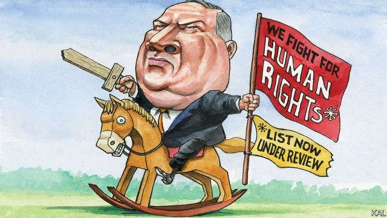

###### Lexington

# There is a need for fresh thinking on human rights 

 

> print-edition iconPrint edition | United States | Aug 10th 2019 

MARY ANN GLENDON is not used to having her bona fides questioned. The 80-year-old Harvard professor is an eminent legal scholar whose books on comparative law and human rights are widely respected. A former ambassador to the Holy See, she is also a conservative Catholic, whose opposition to gay marriage and abortion have drawn flak. But her view of abortion is nuanced; she is not for a blanket ban. And her contribution to human rights is significant. She was active in the civil-rights struggle (and had a child with an African-American) in the 1960s; her book on the conservative and Christian roots of the rights movement is seminal. Yet since her former student Mike Pompeo, the secretary of state, announced that she will lead a new “Commission on Unalienable Rights”, both she and it have been savaged. Over 400 rights, religious and academic bodies, as well as Obama and Bush administration officials such as David Kramer and Susan Rice, signed a letter asking the panel to be scrapped before it has even met. 

In a lengthy email exchange, Ms Glendon sounded understandably bruised: “I really hope that those who have rushed to judgment about the commission before it gets off the ground will one day understand how far off the mark they were.” Yet that does seem unlikely. The opposition stems from a belief that Mr Pompeo launched the commission to promote religious liberty—with which evangelical Christians, the Trump administration’s most important constituency, are obsessed—at the expense of reproductive and gay rights, which they abhor. 

This is a fair deduction. Religious liberty is the only right in which Mr Pompeo, who is evangelical and highly ambitious, has shown any serious interest. He has also previously linked it to the archaic phrase “unalienable right”, which conservatives use to denote the rights to liberty and property enshrined in America’s founding documents. By contrast, many people, seemingly including Mr Pompeo, view more recent protections for gays and other minorities as mere “interests” or “goods”, doled out by liberals for political gain. 

Ms Glendon is also among them: she once called gay marriage a demand for “special preference”. So are at least some of her fellow commissioners. They are a mainly conservative group of academics and faith leaders, few of whom have any expertise in human rights. And as if those were not sufficient grounds for scepticism, the commission is viewed with suspicion by the State Department’s own human-rights division, which has had no hand in it. Still, Ms Glendon insists that the pre-emptive criticism is wrong: “Nowhere in our charge is there anything about reprioritising [rights].” And someone of her stature deserves a serious hearing. 

In her view there are many reasons to reappraise the rights agenda. It is widely recognised in the human-rights community that the great post-1945 human-rights project is in “crisis,” she says. To underline that, she quotes a list of liberals, including Salil Shetty, a former boss of Amnesty International, and Samuel Moyn of Yale University, who have expressed similar concerns. One is that governments are not defending rights. The erosion of the fragile consensus that once supported the UN Declaration on Human Rights has benefited and been exploited by the world’s worst rights violators, writes Ms Glendon. Like Mr Moyn, she has argued for recognising socioeconomic rights, as European countries do but America does not, as well as civil and political ones. 

Her emails also touched on her more controversial views. Pandering to “special interests” has led rights groups to disavow “established rights that do not suit their agendas”, she wrote. Applied to gay rights, that is an illiberal view. Yet Ms Glendon can at least cite more history in support of it than her critics allow. With their conservative, Christian roots, the framers of the UN Declaration did not envisage gay marriage. Conservatives like her therefore believe they are not reactionaries, as liberals claim, but rather keepers of the rights movement’s true flame. 

“Crisis” may be too strong a word, but Ms Glendon is right to note the strain human rights are under, including from authoritarian leaders, ineffective international institutions and rights proliferation. An administration that wanted to lead a good-faith review of such worries could have drawn support from across the political spectrum. Ms Glendon’s illiberal views should not disqualify her from leading such an effort. Gay rights are a settled issue in America, and Mr Pompeo would struggle to restrict State Department support for them by more than the minimal steps he has already taken—by denying some embassies permission to fly flags to celebrate Gay Pride, for example. The problem is that there is not much reason to think the new commission is a good-faith effort. 

Even beyond Mr Pompeo’s evangelical crowd-pleasing, the Trump administration has shown little interest in standing up to the worst rights-violators. Mr Pompeo only ever castigates abusers, such as Iran or Cuba, when it is politically convenient. Mr Trump appears to have no interest in the issue. And the administration’s attacks on international rights institutions look equally self-serving. Its argument for pulling out of the UN Human Rights Commission—a troubled body that had nevertheless been improving under American influence—was bogus. 

The administration has a record of convening expert panels to score political points. One was given the impossible task of substantiating Mr Trump’s claim that his election saw massive vote-rigging. Another has been proposed—under one of the few climate-change deniers in an Ivy League science faculty—on global warming. That Ms Glendon’s panel looks like the latest example is, in a sense, nothing unusual. Despite the lofty ideals that attend them, rights claims are always made and resisted as part of broader political battles. Mr Moyn calls them “politics by other means”. Yet what is depressing in this case is how small the politics seem.■ 

-- 

 单词注释:

1.lexington['leksiŋtәn]:n. 列克星敦市（位于美国肯塔基州） 

2.Aug[]:abbr. 八月（August） 

3.mary['meәri]:n. 玛丽（女子名） 

4.ann[æn]:n. 安（女子名） 

5.glendon[]: [地名] [加拿大、美国] 格伦登 

6.bona['bәunә]:[法] 善良, 真诚 

7.fide['fide]: [体]国际棋联 

8.Harvard['hɑ:vәd]:n. 哈佛大学 

9.eminent['eminәnt]:a. 显赫的, 杰出的, 有名的 

10.opposition[.ɒpә'ziʃәn]:n. 反对, 敌对, 相反, 在野党 [医] 对生, 对向, 反抗, 反对症 

11.flak[flæk]:n. 高射炮, 对空炮火, 广告, 宣传 

12.nuance[nju:'ɑ:ns]:n. 细微差别 

13.seminal['seminl]:a. 精液的, 种子的, 生殖的 [医] 种子的; 精液的 

14.mike[maik]:vi. 偷懒, 游手好闲 n. 休息, 游手好闲, 扩音器, 话筒 

15.pompeo[]:n. (Pompeo)人名；(意)蓬佩奥 

16.unalienable[,ʌn'eiljәnәbl]:[法] 不可转让的, 不可剥夺的, 不可出卖的 

17.obama[]:n. 奥巴马(姓) 

18.david['deivid]:n. 大卫；戴维（男子名） 

19.Kramer[]:n. 克雷默（男子名） 

20.susan['su:zn]:n. 苏珊（女子名） 

21.scrap[skræp]:n. 碎片, 残余物, 些微, 片断, 铁屑, 吵架 vt. 扔弃, 敲碎, 拆毁 vi. 互相殴打 a. 零碎拼凑成的, 废弃的 

22.lengthy['leŋθi]:a. 冗长的, 漫长的 

23.glendon[]: [地名] [加拿大、美国] 格伦登 

24.understandably[]:adv. 可懂, 可了解, 可理解 

25.judgment['dʒʌdʒmәnt]:n. 裁判, 宣告, 判决书 [医] 判断 

26.evangelical[,i:væn'dʒelikәl]:a. 福音派教会的 n. 福音派信徒 

27.constituency[kәn'stitjuәnsi]:n. 选民, 顾客, 读者 [法] 选区, 全体选民, 选区内的选民 

28.reproductive[.ri:prә'dʌktiv]:a. 生殖的, 再生的, 复制的 [医] 生殖的, 复现的 

29.abhor[әb'hɒ:]:vt. 憎恶, 痛恨, 回避, 拒绝 

30.deduction[di'dʌkʃәn]:n. 减除, 扣除, 减除额, 推论 [医] 演绎, 推论 

31.ambitious[æm'biʃәs]:a. 有野心的, 抱负不凡的, 雄心勃勃的 

32.archaic[ɑ:'keiik]:a. 古体的, 过时的, 古老的, 古代的 [医] 原始的, 古代的 

33.unalienable[,ʌn'eiljәnәbl]:[法] 不可转让的, 不可剥夺的, 不可出卖的 

34.denote[di'nәut]:vt. 指示, 表示 

35.enshrine[in'ʃrain]:vt. 入庙祀奉, 铭记 

36.seemingly['si:miŋli]:adv. 看来似乎, 表面上看来 

37.dole[dәul]:n. 救济品, 失业救济金 vt. 发放救济 

38.commissioner[kә'miʃәnә]:n. 委员, 理事, 行政长官 [法] 委员, 政府的特派员, 地方地官 

39.expertise[.ekspә:'ti:z]:n. 专家意见, 专门技术 [法] 专门知识, 专家意见 

40.scepticism['skeptisizm]:n. 怀疑论, 怀疑主义 [医] 多疑癖 

41.reprioritising[]:[网络] 优先排序 

42.stature['stætʃә]:n. 身材, 身高, 高度 [医] 身材, 身高 

43.reappraise[.ri:ә'preiz]:vt. 重新评估, 重新评价 

44.salil[]:[网络] 酒店 

45.shetty[]:[网络] 谢蒂 

46.amnesty['æmnisti]:n. 大赦, 赦免 

47.samuel['sæmjuәl]:n. 撒母耳（希伯来先知）；塞缪尔（男子名） 

48.moyn[]:[网络] 莫恩 

49.Yale[jeil]:n. 耶鲁 

50.erosion[i'rәuʒәn]:n. 腐蚀, 冲蚀, 侵蚀 [化] 磨耗; 侵蚀 

51.UN[ʌn]:pron. 家伙, 东西 [经] 联合国 

52.declaration[.deklә'reiʃәn]:n. 宣告, 说明, 宣布 [计] 说明 

53.violator['vaiәleitә]:n. 违反者, 违背者, 妨碍者 [法] 侵犯者, 违犯者, 妨碍者 

54.socioeconomic['sәuʃiәu,i:kә'nɔmik]:a. 社会经济学的 

55.pander['pændә]:vi. 勾引, 怂恿, 卑劣地迎合 n. 拉皮条者, 怂恿者, 助恶者 

56.disavow[.disә'vau]:vt. 否认, 否定, 拒绝对...承担责任 [法] 不承认, 抵赖, 拒绝对...承担责任 

57.illiberal[i'libәrәl]:a. 狭隘的, 无教养的, 吝啬的 

58.cite[sait]:vt. 引用, 引证, 表彰 [建] 引证, 指引 

59.framer['freimә]:n. 组成者, 构成者, 筹划者 [电] 调帧器 

60.envisage[in'vizidʒ]:vt. 面对, 正视, 想象 

61.reactionary[ri'ækʃәnәri]:n. 反动分子 a. 反动的, 反动主义的, 反对改革的 

62.authoritarian[ɒ:.θɒri'tєәriәn]:a. 独裁的, 独裁主义的 

63.ineffective[.ini'fektiv]:a. 无效的 [法] 失效的, 无效的, 效率低的 

64.proliferation[.prәulifә'reiʃәn]:n. 增殖, 激增 [医] 增生, 增殖 

65.spectrum['spektrәm]:n. 光谱, 范围, 系列 [化] 光谱 

66.disqualify[dis'kwɒlifai]:vt. 使不适合, 取消...资格 

67.minimal['miniml]:a. 最小的, 极微的, 最小限度的 [医] 最小的, 最低的 

68.castigate['kæstigeit]:vt. 惩罚, 苛评, 修订 

69.abuser[]:n. 滥用者 

70.Iran[i'rɑ:n]:n. 伊朗 

71.Cuba['kju:bә]:n. 古巴 

72.politically[]:adv. 政治上 

73.equally['i:kwәli]:adv. 相等地, 同样地, 平等地 

74.bogus['bәugәs]:a. 假的, 伪造的 [经] 伪的, 伪造的 

75.convening[kənˈvi:nɪŋ]:v. 召开( convene的现在分词 ); 召集; （为正式会议而）聚集; 集合 

76.substantiate[sәb'stænʃieit]:vt. 使实体化, 证实 [经] 确证 

77.denier[di'naiә]:n. 否认者, 法国往昔银币, 一小笔钱 [化] 旦尼尔; 旦; (曾用) 

78.ivy['aivi]:n. 常春藤 a. 学院的, 抽象的 

79.lofty['lɒfti]:a. 高的, 傲慢的, 崇高的, 高级的, 玄虚的 

80.alway['ɔ:lwei]:adv. 永远；总是（等于always） 

81.politic['pɒlitik]:a. 精明的, 明智的, 策略的 

82.depressing[di'presiŋ]:a. 抑压的, 沉闷的, 阴沉的 

