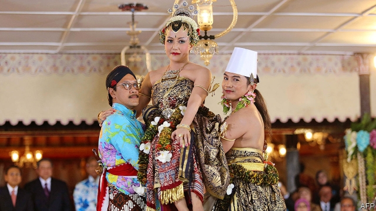

###### Raisin a sultana

# A Javanese sultan wants his daughter to succeed him. His people object 

 

> print-edition iconPrint edition | Asia | Aug 17th 2019 

THE MORNING sun was fierce but the crowd pressed against the gates of the palace did not seem to mind. They were eagerly waiting for the ceremony to start. Three times a year, the sultan of Yogyakarta, an ancient Javanese city, blesses his people with offerings of food in a ritual that mixes Hindu symbolism with Islamic beliefs. Escorted by a military parade, servants shouldering gargantuan bouquets of beans, chillies and rice crackers process to the mosque, where the offerings are handed out. Just as the ceremony ended on August 12th, the throng attacked the mounds of food. Rituals like this are the lifeblood of Yogyakarta. But the customs of this city are under attack—by the sultan himself. 

For centuries Yogyakarta has been the repository of Javanese culture, and the sultan its custodian. But Hamengkubuwono X has broken with tradition in one important way. Since the founding of the sultanate in 1755, the monarch has been a man. The sultan leads Muslims in prayer every Friday, and celebrates his marriage to the mystical Queen of the South Sea every year. Only a man can perform these duties. But the sultan has no sons. In 2015 the 73-year-old named his eldest daughter as his successor. That was hugely controversial. It had been expected that he would anoint a brother. Since then, debate over the issue has intensified. 

The sultan’s choice matters. He is no mere symbol. In 1945 Sukarno, Indonesia’s first president, appointed Sultan Hamengkubuwono IX as Yogyakarta’s governor for life in reward for fighting on the side of the new republic. In 2012 the national legislature passed a law permitting the sultan to “inherit” the governorship, and reclaim land that had traditionally belonged to the sultanate. Bayu Dardias Kurniadi of Australian National University reckons the sultan owns nearly 10% of Yogyakarta’s land. Najib Azca of Universitas Gadjah Mada in Yogyakarta says the sultan is so powerful he is “almost like an absolute monarch”. 

The prospect of a sultana troubles many ordinary Yogyakartans. Muslims say that she would sever the bond between the sultanate and the Muslim community because a woman cannot lead Friday prayers. Some believe that the sultan has been citing the need for sexual equality only as a pretext to maintain his nuclear family’s power. Others simply worry that he is flouting tradition. Sitting by the mosque, Dion Ellot, a student, says he is torn. “The princess is a woman but she can still be a good leader. On the other hand, Javanese culture says it should be a man.” His female friend Nevada Indriawati is more certain: “Tradition says it should be a man.” 

