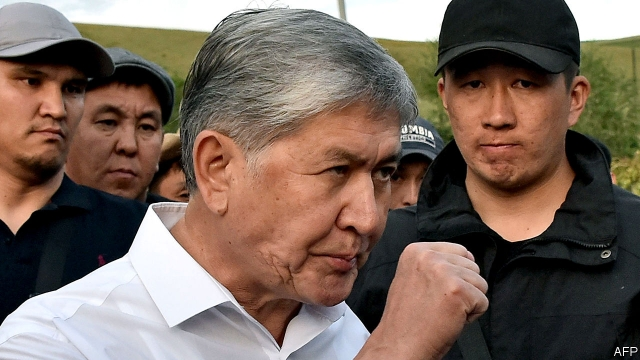

###### Atambayev arrested

# After a siege of his home, an ex-president faces grave charges 

 

> print-edition iconPrint edition | Asia | Aug 17th 2019 

THE FORMER president of Kyrgyzstan did not go down without a fight. It took the storming of his fortified compound outside the capital, Bishkek, by thousands of security personnel (one of whom was shot dead), before Almazbek Atambayev surrendered on August 8th to face corruption charges. He swears they are political. Kyrgyzstan touts itself as authoritarian Central Asia’s only democracy. The country has a pluralistic political system and competitive, albeit flawed, elections. But Mr Atambayev may have a point. 

Investigators only began probing suspicions of his collusion in the early release from prison of a mafia don in 2013, after the ex-president became embroiled in a vendetta with his successor and one-time protégé, Sooronbay Jeyenbekov. In 2017 Mr Atambayev strongly endorsed Mr Jeyenbekov’s presidential bid, expecting to act as the power behind the throne. However, the would-be partnership degenerated into a feud that Mr Jeyenbekov has won—for now. Mr Atambayev is in detention charged with corruption in connection with the crime boss’s release. Investigators have suggested he could also be charged with corruption and murder. Officials verbally accuse him of planning a coup attempt. 

During the night after his arrest, supporters of Mr Atambayev took to the streets of Bishkek. Riot police dispersed them in the early hours and arrested 40 people. The chaotic scenes evoked the unrest of Kyrgyzstan’s recent history: two leaders have been toppled in revolutions, in 2005 and 2010. Citizens fed up with their factional, self-serving politicians appear to have little appetite for another: “#weareagainstathirdrevolution” read a hashtag in Russian, which is widely spoken in Kyrgyzstan, that went viral during the showdown. 

Adding to the combustible mix is the return to Kyrgyzstan, the day after Mr Atambayev’s arrest, of Omurbek Babanov. Mr Babanov was the main opposition challenger in the election of 2017, when Mr Jeyenbekov—in a harbinger of his hostility to political adversaries—personally threatened to lock him up. Small wonder that Mr Babanov had fled abroad after he was placed under investigation on charges of incitement and seeking to overthrow the state. He was not arrested when he flew into Bishkek from Moscow to a hero’s welcome. But the security service warned that the incitement charge remained valid (the other investigation is dormant). 

Russia—which has a military base in Kyrgyzstan and considers the country, which borders on China, its geopolitical backyard—has entered the fray. Before Mr Atambayev’s arrest, Vladimir Putin, Russia’s president, made a show of support by receiving the former leader of Kyrgyzstan in the Kremlin, while urging that country to rally around Mr Jeyenbekov. After Mr Atambayev’s surrender, Russia urged restraint. Dmitry Medvedev, its prime minister, suggested Kyrgyzstan had “reached its limit” of revolutions. 

Mr Jeyenbekov undoubtedly agrees, as he jealously guards his power while mulling the unenviable fates of his predecessors. Kyrgyzstan’s democratic credentials—which were seriously eroded under Mr Atambayev—have been weakened further under Mr Jeyenbekov’s rule, as he jails opponents with almost as much abandon as Mr Atambayev did. Mr Jeyenbekov may be moving to consolidate his power and clear the field of rivals before parliamentary elections that are due to be held next year. Before then, there will be a lot more turbulence in Kyrgyzstan’s politics. ■ 

