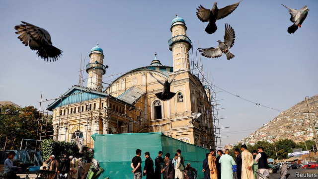

###### Exit strategy

# America and the Afghan Taliban appear closer to a deal 

 

> print-edition iconPrint edition | Asia | Aug 17th 2019 

AS HE CONCLUDED his eighth round of negotiations with the Taliban on August 12th, Zalmay Khalilzad, America’s envoy for Afghan peace talks, did not quite say that a deal allowing the extraction of American troops was done. But he came close. After “productive” discussions in the Qatari capital of Doha, the two sides were down to “technical details”, he said. It has taken a year of formal meetings to arrive at this point (and years of quiet chats before that). But it is too soon to celebrate. Those details will be devilish. 

The talks involve a relatively straightforward bargain. America will start pulling its 14,000 troops out of Afghanistan. In return the Taliban will promise that Afghan territory will not become a staging ground for international terrorist groups such as al-Qaeda and Islamic State. That would satisfy the main demand of Taliban insurgents, and address the problem that led America to invade 18 years ago. “I hope this is the last Eid where #Afghanistan is at war,” Mr Khalilzad tweeted, referring to this week’s Muslim festival (Kabul residents marking it are pictured). 

But those negotiations were “the easy part”, says Laurel Miller, a former State Department official now with the International Crisis Group, a think-tank. Mr Khalilzad also wants the Taliban to agree to a ceasefire. And he expects the Taliban to talk to other Afghans about a political settlement and, by early September, agree on a loose “road-map” towards achieving one. That, the Americans hope, would obviate the need for presidential polls that are due to be held in Afghanistan on September 28th and that are likely to result in the usual bickering over alleged electoral fraud. 

Mr Khalilzad insists that all these elements must be part of the package. But it is far from clear what America’s red lines are. Many Afghans, particularly those in power today, fear that America is likely to make big concessions in its rush for the door. It may, for example, settle for a lull in violence rather than a formal ceasefire. 

The Washington Post has reported that America will initially reduce its force in Afghanistan by between 5,000 and 6,000 troops. “A substantial withdrawal starting before the end of the summer is already in the works,” says one source. “Part of the urgency of getting the US-Taliban deal done is to maintain the pretence that the first stage of US withdrawal is a result of that agreement.” If a deal is achieved, the remaining troops would probably be withdrawn gradually while intra-Afghan bargaining—over issues such as power-sharing and constitutional change—is still under way. 

One problem is that the Taliban have refused to negotiate with other Afghans until America announces a timetable for a complete withdrawal. Even if America were to do so, it is unclear whether the Taliban would talk separately to the Afghan government, which it denounces as a puppet regime, or only as part of a group of Afghan political figures. 

On July 7th and 8th such a group—including government officials and opposition leaders, as well as members of civil society and journalists—met 17 Taliban members at an intra-Afghan conference in Doha organised by Germany and Qatar. The previous meeting to have included Afghan officials was seven years ago. Encouragingly, the delegation in July included 11 women, among them the deputy head of Afghanistan’s national security council. All sides agreed to a vague formula of “Afghan all-inclusive negotiations”, notes Thomas Ruttig of the Afghanistan Analysts Network, a research group. But they were attending only in their personal capacities. 

That raises the question: who could officially represent the government? President Ashraf Ghani’s legitimacy is disputed. It would not be reinforced if he were to be re-elected on September 28th, since charges of vote-rigging are likely. During parliamentary elections last October, almost one-third of polling stations did not open, mostly for security reasons, and turnout was poor. Mr Khalilzad has suggested delaying the ballot; Mr Ghani refuses. On August 7th Amrullah Saleh, the president’s running-mate, tweeted: “There is no compromise over elections. None.” 

America’s itchiness to withdraw would put Afghan government negotiators at a disadvantage in any talks with the Taliban. In 2017 President Donald Trump said that announcing a date for pulling out troops would be “counterproductive”. Now he has reportedly told advisers that he wants them all out by America’s own presidential elections in November 2020. 

Such a deadline diminishes America’s incentive to hold the Taliban to its word or to resist its calls for a “complete Islamic system” in Afghanistan. The result of talks between the Afghan government and the Taliban “could be more of a power-grabbing rather than power-sharing arrangement,” says Sameer Lalwani of the Stimson Centre, a think-tank. That could lead to a full-blown civil war like the one that ravaged the country in the 1990s. 

Mr Khalilzad is likely to need the support of regional powers. Pakistan has backed the Taliban from its earliest days and shelters its leaders. The country has played a vital role in pushing the group to negotiate. Some fear that India, by revoking the statehood of Jammu & Kashmir on August 6th (see article), may have complicated matters. Pakistan has hinted that it might refuse to co-operate with the Afghan peace process unless America backs Pakistan’s position on Kashmir. 

It is unlikely to do so. Pakistan has every incentive to lubricate talks. A peace deal might ease Pakistan’s strained relationship with America, and a return to power by the Taliban would be a blow to India, which has strong ties with Mr Ghani’s government. Neighbours would worry about renewed instability that could spill over Afghanistan’s borders. For Mr Trump, that would be someone else’s problem. ■ 

