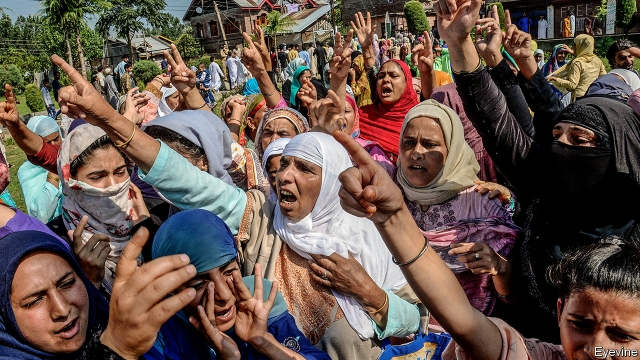

###### An area of darkness

# In its struggle to subdue Kashmir, India is stripping it of liberties 

 

> print-edition iconPrint edition | Asia | Aug 17th 2019 

AN INFORMATION BLACKOUT has obscured the northernmost tip of India. Since it scrapped Jammu & Kashmir’s largely nominal autonomy on August 5th and carved the state into two territories, the central government has maintained a curfew in the region. Internet and telephone services have been suspended. Travel has been restricted. A young academic in Delhi says the lockdown made it impossible for him to celebrate the Muslim festival of Eid with his family in rural Kashmir. The territory has “disappeared”, he says, leaving people like him only able to guess what might be happening there. 

Official statements from the central government do not shine much light. They assert that no violent protests have taken place since the change of Jammu & Kashmir’s status. But that seems unlikely. On August 9th Al Jazeera and the BBC aired footage of a large angry crowd in the Muslim-dominated part that is known as the Kashmir valley. At first the home ministry insisted that no gatherings of more than 20 people had taken place. It also claimed that no shots were fired by police, despite the sound of gunfire in the videos. It was only after four days that it reversed course and acknowledged the protest (a separate one is pictured). A day later it admitted the police had used shotguns. 

Police vans in the Kashmir valley have been cruising the streets with their loudspeakers blaring orders that people must stay at home. But the government disputes that there is a curfew in place at all. “Curfew” is a technical term, it says. There has been no formal imposition of one. 

The government has also failed to explain its legal basis for locking up many Kashmiri politicians, including ones who are relatively moderate, during the clampdown. Reports by Indian and foreign media say that between 200 and 500 people are being held in makeshift detention facilities in Srinagar, the main city in Kashmir. A senior official was asked by reporters whether there was a legal justification. “Yes,” he said simply, “but I cannot say what.” Shah Faesal, a civil servant-turned-politician, tweeted on August 12th that Kashmir needed a “non-violent political mass movement” to restore citizens’ rights. On August 14th he was detained at Delhi’s airport and put under house arrest. 

Mr Faesal is being held under the Public Safety Act. This gives police the discretion to place almost anyone under administrative detention for up to two years. It is one of many such laws that have long been in force—the Armed Forces Special Powers Act being the most notorious. They give the authorities sweeping rights to imprison or even shoot people they regard as troublemakers. The Supreme Court has taken an indulgent line on the curfew. “When the situation is such, we must have a real picture before we take a call on this,” said Arun Mishra, one of its judges. 

The prime minister, Narendra Modi, is crowing. In an interview with IANS, an Indian news agency, he said revoking Kashmir’s special status would “only empower democracy even more”. That sounds implausible. For now, the academic in Delhi fears for his family’s safety. He hopes to hear news from a friend who has just flown to Srinagar (if he can leave again). “Darkness is not a happy situation,” he says. ■ 

