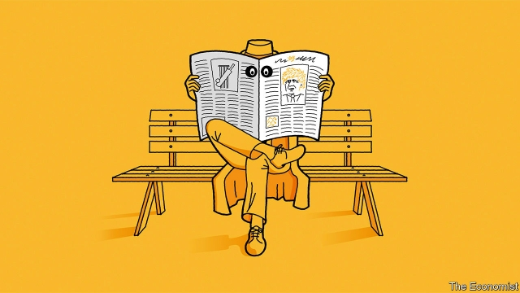

###### Spy fiction

# Mick Herron’s novels are a satirical chronicle of modern Britain 

 

> print-edition iconPrint edition | Books and arts | Aug 17th 2019 

Joe Country. By Mick Herron. Soho Crime; 360 pages; $26.95. John Murray; £14.99. 

A SERIES OF comic thrillers about failed spies may seem an unlikely source of insight into modern Britain. And, in fact, Mick Herron’s six novels about a fictitious dumping-ground for errant British agents called Slough House do not aspire to documentary realism. “Authenticity is not what I’m seeking,” the author says, in a museum café near his home in Oxford. “Plausibility and broad-stroke reality is what I’m after.” Yet, in their gleefully shocking way, his books reflect the trajectory of the nation. Their jaundiced characters are the anti-heroes Brexit-era Britain deserves. 

None of Mr Herron’s growing band of devotees can, for instance, have failed to notice that this reality includes a portrait—sustained across the series—of a ruthlessly ambitious politician named Peter Judd. “Public buffoon and private velociraptor”, the jovial, Latin-spouting Judd—“a loose cannon with a floppy haircut and a bicycle”—weaves through the vicissitudes of public life. “Straddling the gap between media-whore and political beast”, he charms, bluffs and schemes his way towards the peaks of power. Meanwhile, “below the surface lay a temper that could scorch chrome”. 

In the first book, “Slow Horses” (published in 2010), a journalist sketches out a path to Downing Street for Judd that relies on nativism, since “the decent people of this country are sick to death of being held hostage by mad liberals in Brussels.” Mr Herron insists that Judd “was created as a composite character made up of all the worst possible attributes that a politician could have.” He does not write romans à clef, and, indeed, politicians are not his stories’ focus. They barge in only to aggravate the lower-level debacles that punctuate routine in the “administrative oubliette” of squalid, shambolic Slough House. 

Yet few contemporary British writers possess keener antennae for the background hum of public affairs. Drily, Mr Herron notes that “the political chaos we’ve entered is playing nicely into the books I’ve written.” In the latest, the just-published “Joe Country”, Diana Taverner—the Machiavellian chief of Mr Herron’s fictionalised version of MI5, Britain’s domestic security service—considers: “If you want your enemy to fail, give him something important to do.” This strategy, the reader learns, is known “for obscure historical reasons” as “The Boris”. 

From their origins a century ago, in the era of John Buchan and Somerset Maugham, British spy novels have held up a cracked and smudged mirror to their times. In fiction, the twilit intrigues of Her Majesty’s secret services have tracked the course of imperial decline, the intelligence triumphs of the second world war and the ambiguous stalemate of the cold war. Since that struggle’s end, an assorted cast of jihadists, rogue states and crooked multinationals have assumed the adversary’s role in espionage fiction. 

In Mr Herron’s work, by contrast, the most vicious enemies lurk within—among colleagues, bosses, former allies, even family. “Essentially, I’m writing office politics,” he says. Manda Scott, author most recently of “A Treachery of Spies”, notes that the internecine savagery of Mr Herron’s security agencies finally buries the espionage-fiction myth of “decent gentlemen—public schoolboys all—upholding the values of imperial England by dint of superior intelligence”. Mr Herron, she says, broke the old boundaries by introducing a set-up in which the spies serve “venal politicians with no values other than the grabbing of power and survival”. 

He leavens this sardonic disenchantment with a dark seam of comedy, in meticulously sculpted prose. He is “a master of timing, word by word, sentence by sentence,” says Andrew Taylor, a crime novelist. “His language creates its own world, with streaks of satire and loss.” In a solemn genre, “it’s refreshing to find a series that makes you regularly laugh out loud.��� Mr Taylor reckons that spy fiction may at last have found an author who will move it beyond the formidable legacy of John le Carré, its master craftsman. 

For his part, Mr Herron thinks of himself as an outsider in the world of espionage. After all, “so many writers of spy fiction are writing from a certain kind of knowledge”, either as former practitioners (like Mr le Carré) or as journalists. Born in Newcastle upon Tyne, he studied in Oxford and stayed there, working as an editor for a London legal publisher. After four Oxford-set mysteries, he devised Slough House and decided, “I like this world. I’m going to stay in it.” Some of the conflicts explored by Mr le Carré—a writer he reveres—endure among his downbeat rejects: “My characters are mired in the past. The big beasts among them are cold-war relics.” Permanent East-West tension is to them the natural state of affairs; history shapes their present. “Sudden events that blind us with their light”, thinks one elderly spymaster, “had roots in the slowly turning decades.” 

Looming over each twisting plot is Jackson Lamb, the scruffy and flatulent Falstaff of the undercover world. This dinosaur spook, once based in Berlin, runs his “crew of misfits” with a heavy yet protective hand. An “overweight, greasy has-been”, Lamb is a grotesque and a flawed champion. Mr Herron stresses that “I’m not into wish-fulfilment. I don’t think a bunch of heroes will save society.” Lamb, though, will cross almost any line to save his own agents. Even they, sociopathic losers and charmless geeks alike, strive to do the decent thing. “There’s a level of romance operating there,” he admits. “Their frustrations and thwarted desires come from wanting to do good.” Cynicism and hypocrisy intensify the higher readers ascend on Mr Herron’s ladder of power. 

External threats—far-right thugs, rogue veterans, even North Korean honeytraps—do impinge on Lamb’s shabby domain. When Brexit begins to loom over the clandestine affairs of an “increasingly isolated island state”, espionage by and against other European powers comes to the fore. Mostly, though, Mr Herron’s dysfunctional crew suffers from a sort of auto-immune condition. Their closed community generates toxic antibodies that devour it from within. The self-inflicted chaos, suspicion and inertia—and the brutal self-interest that lurks beneath—acidly capture the national mood. 

Although their comic zest seldom falters, the topical bite of the books has sharpened. “Joe Country”, in which one of Lamb’s underlings imagines a country led by Judd as “a mash-up of ‘The Handmaid’s Tale’ and ‘It’s a Knockout’” (a notoriously puerile British game-show), feels like the bleakest volume yet. Its gags still sparkle. The stage, however, darkens. “As a human being, and a citizen of this country, I deplore almost everything that’s going on in public life,” Mr Herron says. “As a novelist with a bent towards the satirical, it’s a gift.” ■ 
<<<<<<< HEAD

-- 

 单词注释:

1.Mick[mik]:n. 爱尔兰人 

2.satirical[sә'tirik(ә)l]:a. 讽刺的, 讥讽的, 好挖苦的, 写讽刺作品的 

3.chronicle['krɒnikl]:n. 年代记, 记录, 编年史 vt. 把...载入编年史 

4.Aug[]:abbr. 八月（August） 

5.joe[dʒәu]:n. 乔（男子名） 

6.herron[]: [人名] [英格兰人姓氏] 赫伦 Heron的变体 

7.soho[sәu'hәu]:interj. 哈, 嗬 

8.john[dʒɔn]:n. 盥洗室, 厕所, 嫖客 

9.murray['mʌri, 'm\\:-]:n. 默里（男子名）；墨累河（澳大利亚东南部一条河流） 

10.sery[]:n. (Sery)人名；(俄)谢雷；(科特)塞里 

11.comic['kɒmik]:n. 连环漫画, 喜剧演员, 滑稽的人 a. 滑稽的, 有趣的, 喜剧的 

12.fictitious[fik'tiʃәs]:a. 假想的, 编造的, 虚伪的 [法] 假定的, 假设的, 虚构的 

13.errant['erәnt]:a. 周游的, 离开正道的, 不定的 

14.slough[slau]:n. 泥沼, 沼泽, 蜕下的皮, 腐肉 vt. 使陷入泥沼, 使沉沦, 脱落, 抛弃 vi. 在泥浆中跋涉, 蜕皮, 脱落 

15.aspire[ә'spaiә]:vi. 渴望, 立志于 

16.documentary[.dɒkju'mentәri]:n. 记录片 a. 文件的 

17.realism['riәlizm]:n. 写实主义, 现实, 实在论 [法] 现实主义 

18.authenticity[.ɒ:θen'tisiti]:n. 可靠性, 真实性 [经] 确实性, 真实性 

19.Oxford['ɒksfәd]:n. 牛津, 牛津大学 

20.plausibility[.plɒ:zi'biliti]:n. 似有道理, 貌似可信 [法] 花言巧语, 似乎有理 

21.gleefully['ɡli:fəlɪ]:adv. 高兴地 

22.trajectory[trә'dʒektri]:n. 轨道, 弹道, 轨线 [化] 轨道 

23.jaundice['dʒɒ:ndis]:n. 黄疸, 偏见, 乖僻 vt. 使患黄疸, 使怀偏见 

24.devotee[.devә'ti:]:n. 爱好者, 献身者, 虔诚的宗教信徒 

25.ruthlessly['ru:θləslɪ]:adv. 无情地, 冷酷地, 残忍地 

26.ambitious[æm'biʃәs]:a. 有野心的, 抱负不凡的, 雄心勃勃的 

27.peter['pi:tә]:vi. 逐渐消失, 逐渐减少 

28.judd[dʒʌd]:n. 贾德（姓氏） 

29.buffoon[bә'fu:n]:n. 小丑 

30.velociraptor[vəˌlɒsɪˈræptə(r)]:n. 迅猛龙（二足、肉食性的有羽毛恐龙, 能高速奔跑。电影《侏罗纪公园》系列中的重要角色）; 速龙; 伶盗龙 

31.jovial['dʒәuviәl]:a. 快活的, 高兴的, 愉快的 [计] 国际算法语言的朱尔斯文本 

32.floppy['flɒpi]:a. 叭嗒叭嗒响的, 松软的 

33.vicissitude[vi'sisitju:d]:n. 变化无常, 变迁, 荣枯, 盛衰 

34.straddle['strædl]:n. 跨坐, 观望 v. 跨坐, 两腿叉开坐, 观望 

35.charm[tʃɑ:m]:n. 吸引力, 魔力, 符咒 vt. 迷住, 使陶醉, 行魔法 vi. 用符咒, 有魅力 

36.bluff[blʌf]:n. 断崖, 绝壁, 吓唬 a. 直率的 v. 吓唬, 欺骗 

37.scorch[skɒ:tʃ]:n. 烧焦, 枯萎 v. 烧焦, 拷焦, (使)枯萎, 讽刺 

38.chrome[krәum]:n. 铬, 铬合金 [医] 铬(24号元素) 

39.nativism['neitivizm]:n. 先天论, 乡土主义, 本土主义 

40.hostage['hɒstidʒ]:n. 人质, 抵押品 [经] 人质, 抵押品 

41.Brussel[]:n. 布鲁塞尔（比利时首都） 

42.composite[kәm'pɒzit]:a. 合成的, 混合成的, 菊科的 n. 合成物, 复合材料, 菊科 

43.clef[klef]:n. 谱号 

44.barge[bɑ:dʒ]:n. 驳船 vt. 用船运输 vi. 蹒跚, 闯入 

45.aggravate['ægrәveit]:vt. 使恶化, 使更严重, 加重 

46.debacle[dei'bɑ:kl]:n. 崩溃, 大失败 

47.administrative[әd'ministrәtiv]:a. 管理的, 行政的 [法] 行政的, 管理的, 遗产管理的 

48.oubliette[.u:bli'et]:n. 地下密牢 

49.squalid['skwɒlid]:a. 污秽的, 肮脏的, 悲惨的, 可怜的, 卑劣的 

50.shambolic[ʃæm'bɒlik]:a. 大混乱的 

51.antennae[æn'teni:]:pl. 天线, 触须, 触角 

52.hum[hʌm]:n. 嗡嗡声, 哼声, 杂声 vi. 发低哼声 vt. 哼, 用哼声表示 interj. 哼, 嗯 

53.drily['draili]:adv. 干燥地, 不加渲染地, 冷冰冰地, 枯燥地 

54.chao[]:n. 钞（货币） 

55.nicely['naisli]:adv. 漂亮地, 谨慎地, 恰好地 

56.Diana[dai'ænә]:n. 狄安娜, 独身女子 

57.machiavellian[.mækiә'veliәn]:a. 马基雅弗利的, 狡猾的 n. 权谋政治家 

58.fictionalise['fɪkʃənəli:z]:vt. 将（真实事情）编写成小说 

59.boris['bɔris]:n. 鲍里斯（男子名） 

60.Buchan[]:巴肯 

61.somerset['sʌmәsit. -set]:n. 有衬垫的马鞍（独腿者乘坐的） 

62.Maugham[mɔ:m]:毛姆(姓氏) 

63.smudge[smʌdʒ]:n. 污点, 脏污, 熏烟 vt. 弄脏, 使模糊, 用浓烟熏 vi. 被弄脏 

64.twilit['twailit]:a. 沉浸在柔和的微光中的 

65.intrigue[in'tri:g]:n. 阴谋, 复杂的事 vi. 密谋, 私通 vt. 激起...的兴趣, 用诡计取得 

66.imperial[im'piәriәl]:a. 帝王的, 宗主国的, 至尊的, 壮丽的 n. 特等品 

67.stalemate['steilmeit]:n. 僵持状态, 僵局, 陷于困境, 胶着状况 vt. 将...逼和, 使僵持, 使陷入困境 

68.assort[ә'sɒ:t]:vt. 把...分类, 把...归为一类 vi. 协调, 交往 

69.jihadist[]:n. 伊斯兰圣战士 

70.rogue[rәug]:n. 恶棍, 流氓, 小淘气 vt. 欺骗 vi. 游手好闲 

71.crook[kruk]:n. 钩, 弯曲部分, 坏蛋 vt. 使弯曲, 诈骗 vi. 弯曲 

72.multinational[.mʌlti'næʃәnl]:a. 多国的, 跨国公司的 n. 跨国公司 

73.espionage[.espiә'nɑ:ʒ]:n. 间谍活动 [法] 间谍活动, 刺探, 间谍 

74.vicious['viʃәs]:a. 邪恶的, 堕落的, 品性不端的, 恶毒的, 恶性的, 有错误的 [医] 缺点的, 恶的 

75.lurk[lә:k]:n. 潜伏, 潜行 vi. 暗藏, 潜伏, 埋伏 [计] 隐匿阅读 

76.ally['ælai. ә'lai]:n. 同盟者, 同盟国, 助手 vt. 使联盟, 使联合, 使有关系 vi. 结盟 

77.essentially[i'senʃәli]:adv. 本质上, 本来 

78.politic['pɒlitik]:a. 精明的, 明智的, 策略的 

79.manda[]:n. 曼达岛 

80.scott[skɔt]:n. 斯科特（男子名） 

81.treachery['tretʃәri]:n. 背叛, 变节 [法] 背叛, 变节, 背信弃义 

82.internecine[.intә'ni:sain]:a. 互相残杀的, 两败俱伤的, 致命的 [法] 互相残杀的, 两败俱伤的, 杀人的 

83.savagery['sævidʒәri]:n. 兽性, 原始状态, 野蛮人 

84.myth[miθ]:n. 神话, 虚构的事, 虚构的人 

85.schoolboy['sku:lbɒi]:n. 男学生 

86.dint[diŋt]:n. 凹痕, 作用 vt. 打击出凹痕 

87.venal['vi:nl]:a. 可收买的, 贪污的, 用金钱买得的 [经] 贪污的 

88.grab[græb]:n. 抓握, 掠夺, 强占, 东方沿岸帆船 vi. 抓取, 抢去 vt. 攫取, 捕获, 霸占 

89.leaven['levn]:n. 酵母, 促使渐变的因素 vt. 使发酵, 渐变 

90.sardonic[sɑ:'dɒnik]:a. 嘲笑的, 冷笑的, 讥讽的 [医] 痉笑的 

91.disenchantment[ˌdɪsɪn'tʃɑ:ntmənt]:n. 觉醒, 清醒 

92.seam[si:m]:n. 缝合线, 衔接口, 接缝, 线缝, 伤疤 vt. 缝合, 接合, 焊合, 使留下伤痕 vi. 裂开, 发生裂痕 

93.meticulously[]:adv. 过细地, 细致地 

94.sculpt[skʌlpt]:v. 雕刻, 造型 

95.prose[prәuz]:n. 散文 v. 写散文 a. 散文的, 平凡的 

96.timing['taimiŋ]:n. 时间选择, 时间测定, 定时, 调速 [计] 定时器时钟 

97.andrew['ændru:]:n. 安德鲁（男子名） 

98.taylor['teilә]:n. 泰勒 

99.streak[stri:k]:n. 条理, 斑纹, 倾向 vt. 加条纹 vi. 变成条纹, 飞跑 

100.satire['sætaiә]:n. 讽刺文学, 讽刺 

101.genre['ʒɒŋrә]:n. 类型, 流派 

102.reckon['rekәn]:vt. 计算, 总计, 估计, 认为, 猜想 vi. 数, 计算, 估计, 依赖, 料想 

103.formidable['fɒ:midәbl]:a. 巨大的, 优秀的, 可怕的, 艰难的 

104.legacy['legәsi]:n. 祖先传下来之物, 遗赠物 [经] 遗产, 遗赠物 

105.LE[]:[计] 小于或等于 

106.craftsman['kræftsmәn]:n. 工匠, 技工, 手艺人 

107.outsider[' aut'saidә]:n. 外人, 局外人, 非会员, 外行, 门外汉, 比赛中获胜可能性不大的选手 [经] 外船公司 

108.practitioner[præk'tiʃәnә]:n. 从业者, 开业者 [医] 行医者, 医师 

109.newcastle['nju:,kɑ:sl]:n. 纽卡斯尔（英国港市） 

110.Tyne[tain]:泰恩河[英国英格兰北部] 

111.publisher['pʌbliʃә]:n. 出版者, 发行人 [法] 发行人, 出版者, 报刊发行者 

112.downbeat['dajnbi:t]:n. 强拍, 下降, 低沉, 衰退 a. 悲观的, 低沉的 

113.mire[maiә]:n. 泥沼, 泥泞 vt. 使陷于泥泞, 使陷入困境 vi. 掉进泥坑 

114.relic['relik]:n. 遗物, 遗迹, 纪念物, 遗风, 残留物 

115.spymaster['spai,mɑ:stә(r); -,mæs-]:n. 间谍组织的首脑 

116.loom[lu:m]:n. 织布机, 若隐若现的景象 vi. 朦胧地出现, 隐约可见, 可怕地出现 

117.jackson['dʒæksn]:n. 杰克逊（男子名）；杰克逊（美国密西西比州的城市） 

118.scruffy['skrʌfi]:a. 不整齐的, 肮脏的, 破旧的, 褴褛的 

119.flatulent['flætʃәlәnt]:a. 肠胃气胀的, 空虚的, 浮夸的 [医] 气胀的 

120.falstaff['fɔ:lstɑ:f]:n. 福斯塔夫(莎士比亚作品中的喜剧人物) 

121.undercover[.ʌndә'kʌvә]:a. 秘密从事的, 秘密的, 从事间谍活动的 [法] 暗中从事的, 秘密的 

122.spook[spu:k]:n. 幽灵, 鬼 vt. 惊吓, 鬼怪般地出没 vi. 惊吓而逃窜, 受惊 

123.Berlin[bә:'lin]:n. 柏林, (软质)柏林毛线 

124.misfit['misfit]:n. 不适合, 不适合的东西, 不适应环境的人 vt. (衣着)对...不合身 vi. 不适合 

125.greasy['gri:zi]:a. 油腻的, 含脂肪多的 

126.grotesque[grәu'tesk]:n. 奇异风格, 怪异图案 a. 奇怪的, 可笑的 

127.flaw[flɒ:]:n. 缺点, 裂纹, 瑕疵, 一阵狂风 [化] 划痕; 裂缝; 裂纹 

128.sociopathic[sәusiәu'pæθik]:a. 反社会的, 不爱社交的 

129.loser['lu:zә]:n. 失败者, 遗失者 [法] 失败者, 失物者, 遗失者 

130.charmless['tʃɑ:mlis]:a. 无魅力的, 无吸引力的, 不美的 

131.geek[gi:k]:n. 做低级滑稽表演的人 

132.strive[straiv]:vi. 努力, 奋斗, 斗争 

133.romance[rәu'mæns]:n. 冒险故事, 浪漫史, 传奇文学 vi. 写传奇, 作空想, 虚构 

134.frustration[frʌs'treiʃәn]:n. 挫折, 顿挫 [医] 挫折 

135.thwart[θwɒ:t]:a. 横放的 vt. 反对, 阻挠, 横过 prep. 横过 adv. 横过 

136.cynicism['sinisizm]:n. 犬儒主义 

137.hypocrisy[hi'pɒkrәsi]:n. 伪善 [法] 伪善, 虚伪 

138.intensify[in'tensifai]:vt. 加强 vi. 强化 

139.ascend[ә'send]:vi. 上升, 追溯, 登高 vt. 攀登 

140.thug[θʌg]:n. 恶棍, 刺客, 凶手 [法] 凶手, 刺客, 暴徒 

141.Korean[kә'riәn]:n. 朝鲜人, 朝鲜语 a. 朝鲜人的, 朝鲜语的 

142.impinge[im'pindʒ]:vi. 撞击, 起作用, 侵犯 vt. 撞击 

143.domain[dәu'mein]:n. 领域, 领土, 产业, 范围 [计] 域, 区域, 支配命令 

144.Brexit[]:[网络] 英国退出欧盟 

145.clandestine[klæn'destin]:a. 偷偷摸摸的 [法] 秘密的, 暗中的 

146.fore[fɒ:]:a. 在前的, 以前的 adv. 在前面, 在船头 prep. 在...前 

147.dysfunctional[dɪsˈfʌŋkʃənl]:a. 功能失调的 

148.toxic['tɒksik]:a. 有毒的, 中毒的 [医] 中毒的, 毒物的 

149.antibody['æntibɒdi]:n. 抗体 [化] 抗体 

150.devour[di'vauә]:vt. 吞食, 挥霍, 吞没 

151.brutal['bru:tәl]:a. 残忍的, 野蛮的, 不讲理的 

152.zest[zest]:n. 兴趣, 热情, 风味, 热心 vt. 给...调味 

153.falter['fɒ:ltә]:vt. 支吾地说 vi. 支吾, 蹒跚地走 n. 颤抖, 支吾, 踌躇 

154.topical['tɒpikl]:a. 论题的, 题目的, 时事问题的, 局部的 [医] 局部的 

155.underling['ʌndәliŋ]:n. 部下, 下手, 下属 

156.notoriously[]:adv. 臭名昭著的, 声名狼藉的 

157.puerile['pjuәrail]:a. 孩子气的, 天真的, 未成熟的 [医] 儿童的, 幼稚的 

158.bleak[bli:k]:a. 萧瑟的, 荒凉的, 阴冷的 

159.gag[gæg]:n. 箝口物, 箝制言论, 讨论终结 vt. 阻塞, 压制言论自由, 使窒息, 使呕吐, 插科打浑, 欺骗 vi. 窒息, 作呕, 欺骗, 插科打浑 

160.darken['dɑ:kn]:vt. 弄暗, 使模糊 vi. 暗下来, 颜色变深 

161.deplore[di'plɒ:]:vt. 悲悼, 哀叹, 对...深感遗憾 
=======
>>>>>>> 50f1fbac684ef65c788c2c3b1cb359dd2a904378

