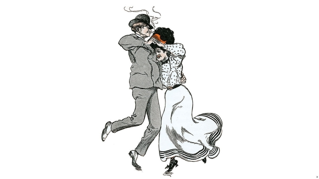

###### Boogie nights

# Music and morals in New York’s ragtime age 

 

> print-edition iconPrint edition | Books and arts | Aug 17th 2019 

Everybody’s Doin’ It: Sex, Music, and Dance in New York, 1840-1917. By Dale Cockrell. W.W. Norton; 288 pages; $27.95 and £19.99. 

IN THE SPRING of 1899 a committee was convened in New York to investigate the city’s police force—and the “protection” it might be offering to Gotham’s saloons and brothels. Politicians and do-gooders were particularly interested in a new kind of music known as “rag-time”, which William Devrey, the police chief, called “a filthy abomination”. 

He was not alone in that opinion. As Dale Cockrell writes in his terrifically entertaining book, this was only a part of the “public avalanche of criticism that questioned ragtime’s character and the moral bearings of people who enjoyed it.” Arthur Weld, a professor of music, pronounced the genre “evil” and “vulgar”. It was nothing short of a “national calamity”. 

Mr Cockrell is professor of musicology at Vanderbilt University in Tennessee. In “Everybody’s Doin’ It” he makes a bracing case that New York was the hothouse in which American popular-music culture took root. He considers the intersection of musicianship and morality from the early days of “blackface minstrelsy”—in which white performers insultingly darkened their faces—through to the birth of ragtime and jazz. The lives he writes about were mostly lived below “the horizon of record”; he mines newspapers and police reports, as well as the testimonies of middle-class witnesses that drip with condescension for those “beneath their place”. 

The result is an energetic, colourful tour of the city’s dens of iniquity. “Dives”, as such spots are known to this day, were usually in cellars, so people “dived” into them. The bars, brothels and concert halls that Mr Cockrell describes were places of sexual liberation, where men and women danced the hoochie koochie, the bunny hug, the wiggle and the shiver; they spieled, they hopped, they dipped. They inculcated racial freedom, too. Enslaved New Yorkers were freed by 1827; by 1873 racial discrimination was outlawed in the city. Yet one consequence of the increased regulation of musical entertainment thereafter was segregation, as moralisers frowned on racial mixing. Thus “the spirit of Jim Crow started casting its long, dark shadow over New York’s social, political, and cultural life.” 

The book’s focus may seem narrow, but the vividness with which Mr Cockrell evokes a vanished world is compelling. The only thing missing is a soundtrack; readers will long to hear “Roll Me Around Like a Hoop My Dear”, “Meet Me Tonight in Dreamland” or the “Boogie Man Rag”. Even in silence, however, by the last page the author has proved his point: that the musical, terpsichorean and sensual turmoil of the great city made for “an explosive compound of sounds and rhythms that would prove quite impossible to extinguish.” ■ 

-- 

 单词注释:

1.boogie['bu(:)^i]:(随着摇摆舞音乐节奏)摆动身体, [蔑]黑人 

2.ragtime['rægtaim]:n. 雷格泰姆旋律, 散拍乐 a. 滑稽的 

3.Aug[]:abbr. 八月（August） 

4.york[jɔ:k]:n. 约克郡；约克王朝 

5.dale[deil]:n. 小谷, 溪谷 

6.cockrell[]: [人名] [英格兰人姓氏] 科克雷尔 Cock的昵称 

7.ww[]:abbr. 栈单（Warehouse Warrant） 

8.norton['nɔ:tәn]:n. 诺顿（男子名）；诺顿公司（美国一软件公司） 

9.convene[kәn'vi:n]:vt. 集合, 召集, 召唤 vi. 聚集, 集合 

10.saloon[sә'lu:n]:n. 大厅, 沙龙, 酒吧, 会客室 

11.brothel['brɒθәl]:n. 妓院 [法] 妓院 

12.william['wiljәm]:n. 威廉（男子名）；[常作W-][美俚]钞票, 纸币 

13.filthy['filθi]:a. 污秽的, 丑恶的 

14.abomination[ә.bɒmi'neiʃәn]:n. 厌恶, 痛恶, 令人厌恶的事物 

15.terrifically[tә'rifikli]:adv. 非常地, 极端地, 可怕地 

16.avalanche['ævәlɑ:ntʃ]:n. 雪崩, 山崩, 大量 vi. 崩塌 vt. 大量涌至 

17.bearing['bєәriŋ]:n. 举止, 轴承, 忍受, 关系, 意义, 方向, 生育 [化] 轴承 

18.arthur['ɑ:θә]:n. 亚瑟（男子名）；亚瑟王（传说中六世纪前后英国的国王, 圆桌骑士团的首领） 

19.genre['ʒɒŋrә]:n. 类型, 流派 

20.vulgar['vʌlgә]:a. 粗俗的, 庸俗的, 普通的, 通俗的, 方言的 [法] 庸俗的, 卑下的, 粗俗的 

21.calamity[kә'læmiti]:n. 灾难, 不幸事件 

22.musicology[.mju:zi'kɒlәdʒi]:n. 音乐学 

23.vanderbilt['vændəbilt]:n. 范德比尔特（姓氏） 

24.Tennessee[.teni'si:]:n. 田纳西州 

25.brace[breis]:n. 支柱, 曲柄, 支撑, 一对 vt. 紧缚, 支撑, 激励 vi. 打起精神 [计] 花括号 

26.hothouse['hɒthaus]:n. 温室, 温床, 浴室 

27.intersection[.intә'sekʃәn]:n. 交集, 十字路口, 交叉点 [计] 逻辑乘; 与 

28.musicianship[mju:'ziʃәnʃip]:n. 音乐技巧,音乐感,音乐才能,音乐修养, 音乐鉴赏力 

29.morality[mә'ræliti]:n. 道德, 教训, 品行 [法] 道德, 道义 

30.blackface['blækfeis]:n. 粗黑体字 

31.insultingly[ɪn'sʌltɪŋlɪ]:adv. 侮辱地, 无礼地 

32.darken['dɑ:kn]:vt. 弄暗, 使模糊 vi. 暗下来, 颜色变深 

33.testimony['testimәni]:n. 证言, 证据, 声明 [医] 证据 

34.condescension[.kɒndi'senʃәn]:n. 屈尊, 傲慢态度 

35.colourful['kʌlәful]:a. 颜色丰富的, 鲜艳的, 艳丽的, 多色的, 丰富多彩的, 吸引人的, 引人入胜的 [计] 有色的 

36.den[den]:n. 兽穴, 洞穴 [法] 匪巢, 贼窝 

37.iniquity[i'nikwiti]:n. 不公正, 不公正行为 

38.hoochie['hu:tʃi]:n. 私酒, 私运入的酒 

39.bunny['bʌni]:n. 兔子 

40.wiggle['wigl]:v. 扭动着行进, 摆动 n. 扭动, 摆动 

41.spiel['spi:l]:n. 演说, 招揽生意的言辞, 电台广告稿 v. 高谈阔论, 演奏音乐 

42.hop[hɒp]:n. 单脚跳, 跳跃, 舞会, 飞行 vi. 单脚跳, 跳跃 vt. 跃过, 跳上, 加蛇麻子于, 服麻醉药 [计] 跳跃式传输 

43.inculcate['inkʌlkeit]:vt. 反复灌输, 谆谆教诲 

44.enslave[in'sleiv]:vt. 奴役, 束缚, 使受控制, 征服 

45.yorker['jɒ:kә]:n. 贴板球 

46.outlaw['autlɒ:]:n. 被剥夺法律保护的人, 罪犯 vt. 使...失去法律保护, 将...逐出社会, 宣告非法, 取缔 

47.thereafter[.ðєәr'æftә]:adv. 其后, 从那时以后 

48.segregation[.segri'geiʃәn]:n. 隔离, 偏析, 被隔离的部分, 种族隔离 [化] 分离; 分凝; 离析; 偏析; 分聚 

49.moraliser['mɔrəlaɪz]:vi.,vt. [英国英语] =moralize 变形： vi.,vt. moralised . moralising 

50.jim[dʒim]:n. 吉姆（人名） 

51.cultural['kʌltʃәrәl]:a. 文化的, 教养的, 修养的 [医] 培养的 

52.vividness['vɪvɪdnəs]:n. （色彩、光线等）鲜艳; 活泼; 生动; 逼真 

53.evoke[i'vәuk]:vt. 唤起, 引起, 召(魂) [法] 提审, 移送 

54.soundtrack[]:n. 声迹, 声槽, 声带 

55.hoop[hu:p]:n. 箍, 铁环, 呼呼声 vt. 加箍于, 包围 vi. 发呼呼声 

56.dreamland['dri:mlænd]:n. 梦境, 梦乡, 睡眠 

57.terpsichorean[,tә:psikә'ri(:)әn]:a. 舞蹈的 n. (书面)(谑)舞蹈者, 舞蹈家 

58.sensual['senʃuәl]:a. 肉欲的, 感觉的, 感觉论的 

59.turmoil['tә:mɒil]:n. 骚动, 混乱 

60.extinguish[ik'stiŋgwiʃ]:vt. 熄灭, 使消亡, 压制, 使减色 [医] 消灭 

