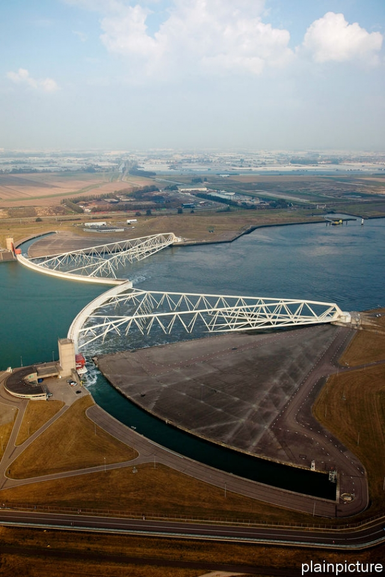
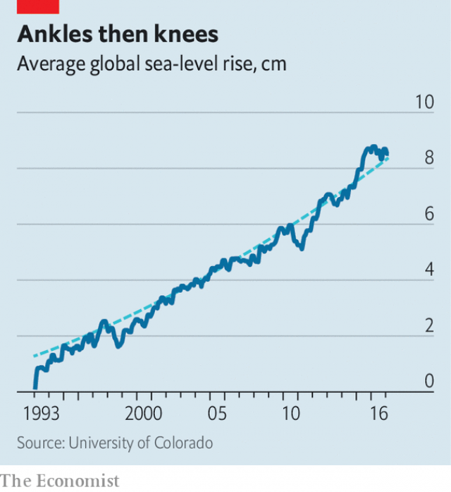
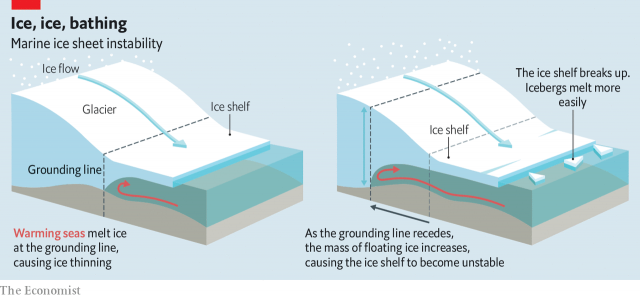
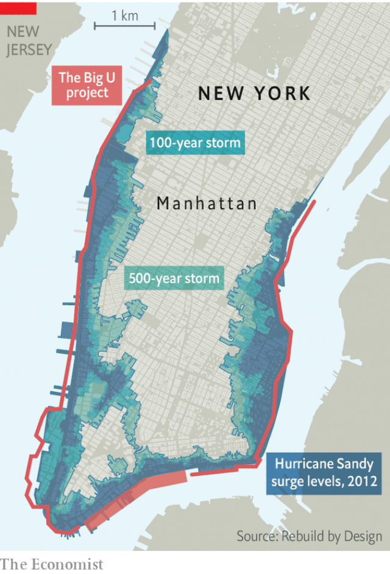
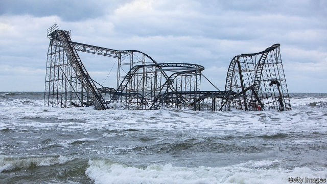

###### The rising oceans

# Climate change is a remorseless threat to the world’s coasts 

 

> print-edition iconPrint edition | Briefing | Aug 17th 2019 

IMAGINE A HUGE horizontal A-frame: a recumbent, two-dimensional Eiffel Tower. Pin a pivot through its tip, so it can swivel around 90 degrees. Then add to its splayed feet something like the rocker of a rocking chair, but 210 metres long, 22 metres high and 15 metres wide. Now double it: picture, across a 360-metre-wide canal, its mirror image. Paint all their 13,500 tonnes of steel glistening white. 

What you have imagined, the Dutch have built. When the Maeslant barrier (pictured) is open, it allows ships as large as any ever built to pass along the canal to Rotterdam, Europe’s biggest port. When closed, it protects that city—80% of which sits below sea level—from the worst storm surges the North Sea can throw at it. 

 

In 1953 such a surge, driven by hurricane-force winds and coinciding with a spring high tide, broke through the dykes that protect much of the Netherlands from the sea in dozens of places, killing almost 2,000 people and inundating 9% of its farmland. Over the following 50 years the Dutch modernised their sea defences in one of the most ambitious infrastructure projects ever undertaken; the Maeslant barrier, inaugurated in 1997, was its crowning glory. It is to be swung shut whenever the sea surges above three metres (the 1953 surge was 4.5 metres). So far it has yet to be used in an emergency. But with the motor of a regional economy of €150bn ($167bn) at stake, better to be safe than sorry. In January the city’s mayor, Ahmed Aboutaleb, told The Economist he now expects the barrier to have to close more frequently than the once-a-decade its makers planned for. It had come within 20cm just the day before. 

As Mr Aboutaleb makes clear, the rising threat is a result of climate change. Few places are as vulnerable as the Netherlands, 27% of which is below sea level. But many other places also face substantial risk, and almost all of them are far less able to waterproof themselves than the Dutch. It is not just a matter of being able to afford the hardware (the Netherlands has 40,000km of dykes, levees and seawalls, plus innumerable sluices and barriers less mighty than the Maeslant). It is also a matter of social software: a culture of water governance developed over centuries of defending against the waves. The rest of the world cannot afford the centuries it took the Dutch to build that up. 

 

There are some 1.6m kilometres of coastline shared between the 140 countries that face the sea. Along this they have strung two-thirds of the world’s large cities. A billion people now live no more than ten metres above sea level. And it is coming to get them. Global mean sea level (GMSL) ticked up by between 2.7mm and 3.5mm a year between 1993, when reliable satellite measurements began, and 2017 (see chart). That may not sound like much; but to raise GSML a centimetre means melting over 3trn tonnes of ice. And though forecasts of sea-level rise are vexed with uncertainties and divergences, there is a strong consensus that the rate is accelerating as the world warms up. The Intergovernmental Panel on Climate Change (IPCC), which assesses climate change for the UN, says sea level rose by around 19cm in the 20th century. It expects it to rise by at least twice that much this century, and probably a good bit more. It is worth noting that last year the authors of a study looking at 40 years of sea-level-rise forecasts concluded that the IPCC’s experts consistently “err on the side of least drama”. 

Sea-level rises on the order of one metre—a bit above the IPCC range for 2100—will cost the world a lot. Leaving aside fatalities owing to storms and storm surges, whose effects are worse in higher seas, one estimate made in 2014 found that by 2100 the value of property at risk from marine flooding would be worth between $20trn and $200trn. The Union of Concerned Scientists, an American NGo, estimates that by that time 2.5m existing coastal properties in America, today worth $1.1trn, could be at risk of flooding every two weeks. 

A massive problem for some; an existential risk for others. Atoll nations like Kiribati—average elevation less than two metres—risk losing almost all their territory to floods like that pictured on the previous page. In 2015 the president of Micronesia, another Pacific island state, described the fate of such nations in the global greenhouse as “potential genocide”. This, one hopes, goes too far; refugees could surely be resettled. Still, the extirpation of entire territorial states would be without any modern precedent. 

Some of this is unavoidable. About two-fifths of the increase so far comes not from water being added to the oceans, but from the water already in the oceans warming up and thus expanding. Scientists estimate the sea-level rise for a one-degree warming—which is what the world is currently experiencing, measured against the pre-industrial climate—at between 20cm and 60cm. They also note that, because it takes time for the oceans to warm up, that increase takes its time. This means the seas would continue rising for some time even if warming stopped tomorrow. 

Not that it will. Today’s mitigation measures are not enough to keep warming “well below” 2ºC, the target enshrined in the Paris agreement of 2015; in the absence of more radical action, 3ºC looks more likely. That would suggest a sea-level rise of between 60cm and 180cm from thermal expansion alone. 

Though thermal expansion has dominated the rise to date, as things get hotter the melting of ice on land will matter much more. The shrinking of mountain glaciers, the water from which all eventually runs to the sea, is thought to have contributed a bit more than a third of the human-induced GMSL rise to date. The great ice sheets of Greenland and Antarctica have not yet done as much. But their time seems nigh. 

In bathtub water-level terms, the melting of continental ice sheets is to thermal expansion as a rubber duck is to a person. When the most recent ice age ended, the melting of the ice sheets sitting atop western Eurasia and much of North America increased GMSL by around 120 metres. 

Today’s residual ice sheets are smaller—the equivalent of less than 70 metres of sea-level rise. And most of that is in the East Antarctic ice sheet, widely seen as very stable. The Greenland ice sheet, the second largest, is shrinking both because its glaciers are flowing more quickly to the sea and because the surface is melting at an unprecedented rate, but its loss of mass is not yet huge. It is the West Antarctic ice sheet which scares scientists most. Many think it will become unstable in a warmer world—or that it may already be unstable in this one. 

The West Antarctic ice sheet looks, in profile, like a flying saucer that has landed on the sea-floor. A thin rim—an ice shelf—floats on the sea. A thicker main body sits on solid rock well below sea level. As long as the saucer is heavy enough, this arrangement is stable. If the ice thins, though—either through surface melting or through a faster flow of glaciers—buoyancy will cause the now-less-burdened saucer to start lifting itself off the rock. The boundary between the grounded ice sheet and its protruding ice shelf will retreat. 

As this grounding line recedes, bits of the ice shelf break off. The presence of an ice shelf normally checks the tendency of ice at the top of the ice sheet’s saucer to flow down glaciers into the sea. As the shelf fragments, those glaciers speed up. At the same time the receding grounding line allows water to undermine the ice sheet proper, turning more of the sheet into shelf and accelerating its demise (see diagram). 

 

First suggested in the 1970s, marine-ice-sheet instability of this sort was long considered largely theoretical. In 1995, though, the Larsen A ice shelf on the Antarctic Peninsula, which is adjacent to the West Antarctic ice sheet, collapsed. Its cousin, Larsen B, suffered a similar fate in 2002. By 2017 there was a 160km crack in Larsen C. The glaciers on the peninsula are accelerating; so is the rate at which the sheet itself is melting. Marine-ice-sheet instability feels much more than theoretical. And though the West Antarctic ice sheet is a tiddler compared with its eastern neighbour, its collapse would mean a GMSL rise of about 3.5 metres. Even spread out over a few centuries, that is a lot. 

Some fear that collapse could be quicker. In 2016 Robert DeConto, from the University of Massachusetts, and David Pollard, of Pennsylvania State University, noted that the ice cliffs found at the edge of ice sheets are never more than 100 metres tall. They concluded that ice cliffs taller than that topple over under their own weight. If bigger ice shelves breaking away from ice sheets—a process called calving—leave behind cliffs higher than 100 metres, those cliffs will collapse, exposing cliffs higher still that will collapse in their turn, all speeding the rate at which ice flows to the sea. The rapid retreat of the Jakobshavn glacier in Greenland offers some evidence to back this up. 

Such cascades, the researchers calculated, could speed up the collapse in West Antarctica and bring one on in Greenland. That would not be unprecedented. For some of a 15,000-year lull between ice ages that began 130,000 years ago, GMSL was perhaps nine metres higher than it is today, suggesting that large parts of both the West Antarctic and Greenland ice sheets collapsed. Mr DeConto and Mr Pollard point to ice-cliff instability as the reason why. When the process was included in models of today, they found that if greenhouse-gas levels continued to rise at today’s reckless rates, Antarctica alone could add a metre to GMSL by 2100 and three metres by 2200. 

This conclusion is not unassailable. In February Tamsin Edwards, of King’s College, London, and colleagues published more sophisticated computer simulations that replicate the ancient sea levels without large-scale ice-cliff collapse, and thus suggest a slower rate of GMSL rise. Where the earlier work found a one-metre rise due to Antarctic ice this century, they found 22cm. The total rise, though, was still a disturbing 1.5 metres. And the possibility that, over further centuries, levels will rise many metres more remains real. 

Efforts to pin down the extent and speed of ice-sheet collapse are themselves accelerating. When Anders Levermann led the sea-level work for the IPCC’s most recent climate assessment, published in 2014, marine-ice-sheet instability was just a footnote. There were four computer models of the process back then, Mr Levermann says; today he can count 16. In January a team of British and American scientists embarked on a five-year, $25m field mission to study the Thwaites glacier in West Antarctica and its ice sheet from above and, using undersea drones, below, thus adding new data to proceedings. 

However great the rise in GMSL ends up, not all seas will rise to the same extent. Peculiarly, sea levels near Antarctica and Greenland are expected to drop. At present, the mass of their ice sheets draws the seas to them in the same way the Moon’s mass draws tides. As they lose weight, that attraction will wane. Other regional variations are caused by currents—which are expected to shift in response to climate change. A weakening Gulf Stream, widely expected in a warmer world, would cause sea level to rise on America’s eastern seaboard even if GMSL did not change at all. 

Then there is the rising and falling of terra not-quite firma. Some of this is natural; many northern land masses, long pressed down by the mass of ice-age ice sheets, have been rising up since their unburdening some 15,000 years ago. Some of it is human, and tends to be more local but also much more dramatic. 

If you remove enough stuff from the sediments below you, the surface on which you stand will settle. In the first half of the 20th century Tokyo sank by four metres as Tokyoites not yet hooked up to mains water drained aquifers. Parts of Jakarta are now sinking by 25cm a year, as residents and authorities of Indonesia’s capital repeat Japan’s mistakes. Last year a study of the San Francisco Bay area found that maps of 100-year-flood risk—the risk posed by the worst flood expected over 100 years—based on sea-level rise alone underestimate the area under threat by as much as 90% compared with maps that accounted for land that was getting lower because of subsidence. 

As land sinks, the sea erodes it away. Komla Sarkar, who lives in the village of Chandpur in Bangladesh’s flood-prone south, recalls childhood days when her parents grew crops and kept goats and chickens between their hut and the water. “When we leave our houses in the morning,” she now says, “we don’t feel confident they will still be there when we return.” 

People often worsen erosion. Satellite images show that stretches of Mumbai’s coast have eroded by as much as 18 metres since 2000, in part because developers and slum-dwellers have paved over protective mangroves. Other aspects of climate change will have effects, too. Heavier bursts of rainfall upstream will mean that some low-lying coastlines will see the risks posed by the sea compounded by those from rivers. In 2012 a team of Japanese researchers predicted that by 2200 the Bay of Bengal would experience 31% fewer cyclones than today, but that 46% more will roil the Arabian Sea on the other side of the subcontinent. 

The biggest extra effect of human activity, though, may well be putting more property at risk as a more populous and richer world concentrates itself in cities by the sea. In the rich world, and increasingly in emerging economies too, the closer to the beach you can erect a condo or office block, the better. In New York alone 72,000 buildings sit in flood zones. Their combined worth is $129bn. 

In October 2012 Hurricane Sandy jolted the city into a new awareness of the threats it faces, given that geology, gravity and the Gulf Stream are conspiring to raise the seas lapping at its shores by half as much again as the global average. Other cities are worrying, too. Rotterdam now welcomes 70 delegations a year from fact-finders seeking to apply Dutch know-how to New Jersey, Jakarta and points in between. 

A lot of effort is devoted to engineering a way out of the problem. New York is paying almost $800m for the Big U, a necklace of parks, walls and elevated roads to shield lower Manhattan from another Sandy. Mumbai wants to build four huge and costly seawalls. Bangladesh, a delta country ten times more populous and one-thirtieth as rich as the Netherlands, is doubling its coastal embankment system and repairing existing infrastructure. Indonesia intends a $40bn wall in the shape of a giant mythical bird to seal Jakarta off from the seas. 

Such schemes take decades to plan and execute, which means the conditions they end up facing are not necessarily those they were conceived for. When the Big U was first proposed, a year after Sandy, the worst-case scenario for sea-level rise on America’s east coast was one metre. When its environmental assessment report was eventually published this April, that looked closer to the best case. 

London’s Thames Barrier—conceived, like the Dutch delta defences, after the floods of 1953—closed just eight times between its inauguration in 1982 and 1990. Since 2000 it has shut 144 times. In Venice MOSE, a system of flood barriers which cost a staggering €5.5bn, will be needed every day if the seas rise by 50cm. Such near-permanence will render moot the huge effort and expense that went into keeping it unobtrusively submerged when not in use. At one metre of sea-level rise it would be basically pointless. Even the resourceful Dutch only designed Maeslant with one metre of sea-level rise in mind. 

 

Kate Orff, a landscape architect, dismisses walls as one-dimensional attempts to solve multidimensional problems. Her project, a string of offshore breakwaters on the western tip of Staten Island to prevent coastal erosion while preserving sea life, is one of various “softer infrastructure” projects to have been funded by Rebuild by Design, a $1bn post-Sandy programme. Arunabha Ghosh of the Council on Energy, Environment and Water, an Indian think-tank, favours approaches which can be scaled up over time as the threat increases. These include anything from restoring mangroves, patch by patch, to barriers built out of interlocking blocks that can be added to as needed. “Modularity lets you shorten the time horizon,” Mr Ghosh says. 

As welcome as these ideas are, they remain niche. Rebuild by Design’s $1bn is a drop in the bucket compared with the $60bn which Congress earmarked for post-Sandy recovery efforts. Some of that money was spent sensibly, for example on hardening power stations and hospitals. A lot was used to replace storm-lost buildings with new ones built in the same way and much the same place. 

If this were paid for by the owners, or their insurers, it might be unobjectionable. But insurers and banks are only slowly beginning to capture sea-level rise in policies and mortgages. In a world awash with capital eager to build, buy or develop, prices seldom reflect the long-term threat. Some price signals are emerging where the problems are most egregious. Controlling for views and other amenities that they offer, prices of Floridan properties at risk of flooding have underperformed unexposed ones by 10-15% over the past few years, says Christopher Mayer of Columbia Business School. But they have not exactly tanked. 

Instead of rebuilding as is, better to put in place appropriate defences, soft as well as hard, and rebuild in styles better suited to the conditions. Alternatively, in some cases, encourage, help or even require people to walk away. In the rich world such “managed retreat” is anathema. People see the government’s job as protecting them, not moving them. Relocating a neighbourhood in New York requires the consent of the residents; holdouts can block decisions for years. “Across the country, there is no appetite for eminent domain,” admits Dan Zarrilli, in charge of climate policy at New York’s city hall. 

In Bangladesh, though, the Ashrayan project, run directly by the prime minister’s office, has relocated 160,000 families affected by cyclones, flooding and river erosion to higher ground at a total cost of $570m. Each family is housed in an army-built barracks and receives a loan of $360, plus 30kg of rice, to restart its life. It is expected to be extended for another three years, and cover another 90,000 households. Fiji has resettled a number of communities from low-lying islands, with dozens more earmarked for relocation. Meanwhile Kiribati, 2,000km away, has gained title to 20 square kilometres of Fiji as a bolthole against the day when its 117,000 citizens have to quit their homes. 

Such schemes may require few civil engineers but they need plenty of social engineering. Bangladeshi officials familiar with the Ashrayan scheme have found converting fishermen into farmers far from straightforward. High ground wanted by some may also be coveted by others. When a Kiribati government delegation visited its plot in Fiji recently, it found some non-Kiribatis making themselves at home. 

Permanent resettlement is not the only form of people moving that needs considering. In places where communications are good and storms frequent evacuation can be an effective life-saver. But what of places where the big storms are very rare? Drills to make people familiar with plans they have never yet had to enact are possible—but they are also massively inconvenient, and maybe worse. A few years ago Mr Aboutaleb cancelled a test evacuation of 12,000 Rotterdammers after computer models suggested a handful of elderly or infirm evacuees might die in the process. 

 

Even if people move, they cannot take with them everything that they value. This is not just a matter of private property. Last October Lena Reimann of Kiel University published a warning that 37 of the 49 UNESCO world-heritage sites located on the Mediterranean’s coasts can now expect to flood at least once a century. All but seven risk being damaged by erosion in the coming decades. Sites do not need world-heritage status to matter. The headman of the first flood-prone Fijian community resettled by the government bemoans the burial grounds abandoned to the sea. 

The inertia in the climate system means that not even the most radical cuts in emissions—nor, indeed, a dimming of sunlight brought about by means of solar geoengineering—will stop sea levels dead in their tracks. Adaptation will be necessary. But there is little appetite to pay for it. A rise that seems precipitous to Earth scientists remains well beyond the planning horizons of most businesses: even utilities rarely take a century-long perspective. Governments can always find more pressing concerns, both at home and when helping others abroad. Less than one-tenth of $70bn in annual global climate aid goes to helping poor places cope with all effects of climate change, not just sea-level rise. 

The lack of action reflects a lack of drama—for almost everyone, the worst floods of the year or decade happen somewhere else. The oceans will not suddenly crush all the world’s coasts like some biblical retribution or Hollywood tsunami. It will rise slowly, like a tide, its encroachment as imperceptible from moment to moment as it is inexorable. But unlike a tide, it will not turn. Once the oceans rise, they will not fall back. ■ 

