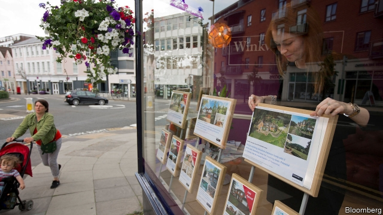

###### Housing and politics

# A rebellion against house-building spells trouble for the Tories 

 

> print-edition iconPrint edition | Britain | Aug 17th 2019 

BOTH PARTIES were formed at the start of the year. Both parties are led by ex-City boys. Both parties gave the Conservatives a battering at an election in May. The Residents for Guildford and Villages (R4GV) may attract less attention than the Brexit Party—but they could still cause the Conservatives a problem. 

A backlash against proposals to build up to 14,600 new houses in and around Guildford, a commuter town in Surrey, led to the Tories slumping from 34 of 48 councillors in the previous local election to just nine this year. By contrast, the upstart R4GV, registered only two months before, went from no seats to 15. “It’s Faragesque,” says Joss Bigmore, a banker turned R4GV politico. 

This was no isolated hit. The Conservatives suffered across the south-east. In nearby Tandridge, where a plan to build 4,000 homes on protected green-belt land was angrily attacked by locals, the Tories lost control of the council, with voters drifting to residents’ groups and independents. In Essex, Residents for Uttlesford, which was founded partly to oppose the local council’s controversial planning schemes, gained 17 seats. The Conservatives lost 19. 

Housing is an existential problem for the Tories. As a rough rule, people who own their homes are more likely to be Conservative (in the general election of 2017, 55% of owner-occupiers voted Tory, while 54% of private renters voted Labour). So the falling rate of homeownership—now, at 64%, back to its level in the mid-1980s—is ominous for the party. No wonder, then, that the housing department says it is “unashamedly and relentlessly” focused on boosting this figure. 

Yet more building can lead to a backlash, as Tory councillors in Guildford and beyond can attest. It represents a Conservative catch-22: the party must build houses to attract new voters, but cannot do so without annoying their current backers. 

Guildford demonstrates why. Even if every site in the local housing plan were built on, the area would still be green and pleasant. Green-belt land would fall from making up 89% of the borough to 86.4%. A disused airfield, which is classed as green-belt despite being a big slab of concrete, is one of the sites earmarked for housing. “Areas of outstanding natural beauty”—the picture-postcard parts—would be almost entirely untouched. If the local council did not impose its own plan, then the government would foist one on the area with even less input from locals, says Paul Spooner, the former Tory leader of Guildford council. Yet this defence fell on deaf ears. Mr Spooner was hoofed out in May, replaced by Liberal Democrat leadership. 

R4GV insists it is not a party of NIMBYs. Given that Guildford is choked by green belt, some building on surrounding fields is inevitable, admits Mr Bigmore. Opposition to the housing plan—which ran to some 750-pages, along with piles of supporting documents—was based on its process and execution rather than its objectives. The scheme had been rammed through an extraordinary meeting of the council, just a week before the election. 

Under the current planning system, there is little scope for winning round housing sceptics. The benefits of development seep out of the area: extra tax revenue generated by new residents tends to flow to central government rather than to the local authority. “Local government bears the political risk, without seeing much reward,” says Anthony Breach of the Centre for Cities, a think-tank. With a target for house-building imposed on the council by the government, villagers and townies end up pitted against each other, trying to shove development elsewhere. 

For now, the political damage is quarantined at a local level. Each of the Conservatives’ 11 MPs in Surrey sits on a fat majority. But councillors draw a parallel with austerity, where the government outsourced the blame for cuts by forcing local councils to decide what to axe. When it comes to housing, Tory MPs will hope the firewall between local politics and Westminster holds for longer. ■ 
<<<<<<< HEAD

-- 

 单词注释:

1.politic['pɒlitik]:a. 精明的, 明智的, 策略的 

2.Tory['tɒ:ri]:n. 托利党党员, 保守党员, 亲英分子 a. 保守分子的 

3.Aug[]:abbr. 八月（August） 

4.batter['bætә]:v. 连续猛打（尤其指妇女），猛击 n. 面糊（食物），击球员，打击手 

5.Guildford[]:n. 吉尔福德（英国东南部萨里郡的郡府） 

6.les[lei]:abbr. 发射脱离系统（Launch Escape System） 

7.Brexit[]:[网络] 英国退出欧盟 

8.backlash['bæklæʃ]:n. 后冲, 强烈反对 [电] 反撞, 逆栅流 

9.commuter[kә'mju:tә]:n. 乘公共车辆上下班者, 月季票乘客 [经] 非(当地)居民 

10.surrey['sʌri]:n. 四轮双座轻便游览马车 

11.slump[slʌmp]:n. 暴跌, 垂头弯腰的姿态 vi. 猛然掉落, 陷入, 衰落(经济等) 

12.councillor['kaunsilә]:n. 地方议会成员, 议会委员, 顾问, 评议员, 参赞 [法] 议员, 评议员, 顾问 

13.upstart['ʌpstɑ:t]:n. 新贵, 暴发户, 自命不凡者 a. 暴富的 

14.joss[dʒɒs]:n. 偶像, 神像, 佛像 [计] 琼尼阿克开放系统 

15.banker['bæŋkә]:n. 银行家, 庄家 [经] 银行业者, 银行家 

16.politico[pә'litikәu]:n. 政客 

17.Tandridge[]:[网络] 坦德里奇 

18.angrily['æŋgrili]:adv. 愤怒地 

19.voter['vәutә]:n. 选民, 投票人 [法] 选民, 选举人, 投票人 

20.Essex['esiks]:n. 艾塞克斯郡(英格兰郡名) 

21.Uttlesford[]:[网络] 阿特尔斯福德；阿特斯福德 

22.existential[.egzis'tenʃәl]:a. 有关存在的 

23.Tory['tɒ:ri]:n. 托利党党员, 保守党员, 亲英分子 a. 保守分子的 

24.renter['rentә]:n. 承租人, 佃户, 出租人 [经] 租赁人, 租户, 出租人 

25.ominous['ɒminәs]:a. 恶兆的, 不吉利的, 预兆的 

26.unashamedly[ˌʌnə'ʃeɪmɪdlɪ]:adv. 厚颜无耻 

27.relentlessly[]:adv. 不仁慈, 严酷, 无情, 坚韧, 不懈, 不屈不挠 

28.attest[ә'test]:vi. 证明, 表明, 作证 vt. 为...作证 

29.cannot['kænɒt]:aux. 无法, 不能 

30.backer['bækә]:n. 援助者, 支持者 [经] 背书人, 支持人 

31.borough['bә:rәu]:n. 自治的市镇, 区 

32.disused[]:a. 不用, 废弃 

33.airfield['єәfi:ld]:n. 飞机场 

34.slab[slæb]:n. 平板, 厚片 vt. 切成厚板, 以平板盖上 

35.earmark['iәmɑ:k]:n. 耳上记号, 特征, 记号, 标记 vt. 在耳朵上做记号, 标记, 指定...作特定用途 

36.entirely[in'taiәli]:adv. 完全, 全然, 一概 

37.untouched[.ʌn'tʌtʃt]:a. 未触摸过的, 未改变的, 未受影响的 

38.foist[fɒist]:vt. 硬卖给, 偷偷插入, 使混入 

39.paul[pɔ:l]:n. 保罗（男子名） 

40.Spooner['spu:nə]:n. 斯普纳（姓氏） 

41.hoof[hu:f]:n. 蹄, (人的)脚 vt. 以蹄踢, 行走, 步行 vi. 走, 踢, 踏 

42.democrat['demәkræt]:n. 民主人士, 民主主义者, 民主党党员 [经] 民主党 

43.nimby[ˈnɪmbi]:n. <美口>宁比 

44.opposition[.ɒpә'ziʃәn]:n. 反对, 敌对, 相反, 在野党 [医] 对生, 对向, 反抗, 反对症 

45.execution[.eksi'kju:ʃәn]:n. 实行, 完成, 执行, 死刑 [计] 执行 

46.ram[ræm]:n. 公羊, 撞锤 vi. 猛击, 撞 vt. 猛击, 填塞, 反复灌输 n. 只读内存, 随机存取内存, 随机存取存储器 [计] 随机存取存储器 

47.sceptic['skeptik]:n. 怀疑论者 

48.seep[si:p]:vi. 渗出, 渗流, 漏 n. 小泉, 水陆两用吉普车 

49.anthony['æntәni]:n. 安东尼（人名） 

50.breach[bri:tʃ]:n. 裂口, 违背, 破坏, 违反, 突破, 破裂 vt. 攻破, 突破 vi. 跳出水面 

51.towny[]:a. 城里的, 城市生活的 

52.shove[ʃʌv]:n. 推, 挤 vt. 推挤, 猛推, 强使 vi. 推 

53.quarantine['kwɒrәnti:n]:n. 隔离, 封锁交通, 检疫期 vt. 隔离, 排斥 

54.MP[]:国会议员, 下院议员 [计] 宏处理程序, 维护程序, 线性规划, 微程序, 多处理器 

55.austerity[ɒ'sterәti]:n. 朴素, 苦行, 严格, 严峻 

56.outsourced[autˈsɔ:st]:v. 外购（指从外国供应商等处获得货物或服务）； 外包（工程）( outsource的过去式和过去分词 ) 

57.axe[]:n. 斧, 斧头 vt. 削减(人员、经费、计划、机构等) 

58.firewall[]:[计] 放火墙, 隔离 

59.Westminster['westminstә]:n. 威斯敏斯特 
=======
>>>>>>> 50f1fbac684ef65c788c2c3b1cb359dd2a904378

