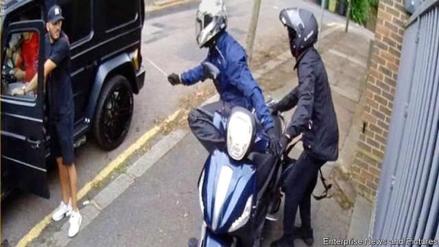

###### Of goons and Gooners

# Attacks on Arsenal players shed light on Britain’s diverse underworld 

 

> print-edition iconPrint edition | Britain | Aug 17th 2019 

YOU DON’T mess with Sead Kolasinac. Fans of Arsenal Football Club call their beefy left-back “the tank”. Last month he proved that he is also a formidable opponent off the pitch. When he and his teammate Mesut Ozil were set upon by knife-wielding robbers a few miles west of their north London stadium, he leapt out of Mr Ozil’s car and fought back. After dusting himself off, he posted a triumphant Instagram picture of the two grinning players, looking distinctly unruffled. “Think we’re fine,” he wrote. 

That was before the replay. Both players skipped the opening match of the season on August 11th following what a club spokesperson euphemistically termed “further security incidents”. Two men were charged with public-order offences after a row with bodyguards at Mr Ozil’s home. Tabloids speculated that the footballers had unwittingly become embroiled in a feud between two rival gangs. The thinking goes that an east European gang warned against any further attacks on the players, which only encouraged the other mob. 

The theory is not as outlandish as it sounds. Threatening the players could be interpreted by a north London gang as a high-profile incursion on their patch. Others reckon ethnicity is in play. Both players are Germans with roots elsewhere: Mr Ozil has Turkish heritage, Mr Kolasinac plays for the Bosnia and Herzegovina team. Tony Saggers, a former anti-drugs wallah at the National Crime Agency (NCA), an impoverished answer to America’s FBI, says foreign crooks can see footballers as ambassadors for their country and thus untouchable. 

Either way, the episode has shone a light on the diversity of Britain’s underworld. In 2017 the NCA calculated that citizens of at least 134 different countries were involved in organised crime. Britons made up the majority, but there were several hundred Romanian, Pakistani, Polish and Albanian gangsters on its books, too. About 900 Albanians are behind bars, topping the league table of imprisoned foreigners. 

Crooks of the same nationality often stick together. A shared language and culture can be important in forging trust when setting up a criminal network, says Anna Sergi of Essex University. They also benefit from a ready-made international network through connections in their home country and diaspora. 

Geography often plays a big part in the types of crime such groups specialise in, says Mr Saggers. For instance, Turkish and Pakistani gangsters are overrepresented in Britain’s heroin trade, thanks to the countries’ proximity to Afghanistan, where most opium is grown. People-traffickers are most often Albanian, Romanian, Vietnamese and Chinese as well as British, since they have ready access to people keen for work. Their victims are forced to pick pockets, steal from shops or farm cannabis in Britain. 

Yet gangs united by ethnicity tend to specialise in low-level crime, points out Ms Sergi. The more lucrative or sophisticated the crime, the more necessary it is to recruit locals who can readily launder money through legitimate businesses or corrupt officials. In fact, she says, acquisitive crime such as the attempted robbery of the Arsenal players tends to be the domain of the most recently arrived crooks, who need cash to start up their network. Messrs Ozil and Kolasinac ought to take some comfort, then. They are probably not up against crime’s premier league. ■ 
<<<<<<< HEAD

-- 

 单词注释:

1.goon[gu:n]:n. 受雇暴徒, 愚笨者, 呆子 

2.gooner['ɡu:nər]:n. 阿森纳的外号是gunner; 而gooner是对阿森纳球迷最正宗的称呼; 英国俚语; 所以说gunner代表阿森纳 

3.arsenal['ɑ:snәl]:n. 兵工厂, 军械库 [机] 兵工厂 

4.underworld['ʌndәwә:ld]:n. 下层社会, 地狱, 下流社会 

5.Aug[]:abbr. 八月（August） 

6.sead[]:abbr. 压制敌方防空火力（Suppression of Enemy Air Defense） 

7.beefy['bi:fi]:a. (牛)多肉的, 象牛肉的, 粗壮的, 结实的 

8.formidable['fɒ:midәbl]:a. 巨大的, 优秀的, 可怕的, 艰难的 

9.teammate['ti:mmeit]:n. 队友 

10.mesut[]:[网络] 梅苏特 

11.ozil[]: 厄齐尔（人名） 

12.triumphant[trai'ʌmfәnt]:a. 得胜的, 得意洋洋的 

13.Instagram[]:一款图片分享应用 

14.grin[grin]:n. 露齿笑 v. 露齿而笑 

15.distinctly[dis'tiŋktli]:adv. 显然地, 明显地, 清楚地 

16.unruffled[.ʌn'rʌfld]:a. 不起皱的, 不骚动的, 不混乱的, 安定的 

17.replay[.ri:'plei]:vt. 重新比赛, 重演 n. 重赛 

18.spokesperson['spәukspә:sn]:n. 发言人, 代言人 

19.euphemistically[ˌju:fə'mɪstɪklɪ]:adv. 委婉的 

20.bodyguard['bɒdigɑ:d]:n. 保镖, 护卫 

21.tabloid['tæblɒid]:n. 小报, 小型画报, 药片, 文摘 a. 轰动性的, 扼要的, 缩略的, 小报式的 

22.speculate['spekjuleit]:vi. 深思, 推测, 投机 [经] 投机 

23.footballer['futbɒ:lә]:n. 足球员, 足球选手 

24.unwittingly[]:adv. 不知情地；不知不觉地；不经意地 

25.embroil[im'brɒil]:vt. 使卷入, 牵连 

26.feud[fju:d]:n. 不和, 封地, 争执 vi. 长期不和, 擦亮 

27.mob[mɒb]:n. 暴民, 民众, 暴徒 vt. 大举包围, 蜂拥进入, 围攻 vi. 聚众生事 

28.outlandish[aut'lændiʃ]:a. 外国气派的, 偏僻的, 古怪的 

29.incursion[in'kә:ʃәn]:n. 侵入, 侵略, 奇袭 

30.reckon['rekәn]:vt. 计算, 总计, 估计, 认为, 猜想 vi. 数, 计算, 估计, 依赖, 料想 

31.ethnicity[eθ'nisәti]:n. 种族划分 

32.Turkish['tә:kiʃ]:n. 土耳其语 a. 土耳其的, 土耳其人的, 土耳其语的 

33.heritage['heritidʒ]:n. 遗产, 祖先遗留物, 继承物 [医] 遗传性 

34.bosnia['bɔzniә]:n. 波斯尼亚；波士尼亚 

35.Herzegovina[,heәtsә^әu'vi:nә]:黑塞哥维那[南斯拉夫中西部一地区] 

36.tony['tәuni]:a. 高贵的, 时髦的 

37.saggers[]:[网络] s。。 

38.wallah['wɑ:lә]:n. 要人, 经办业务人 

39.NCA[]:[化] 不加载体 

40.impoverish[im'pɒvәriʃ]:vt. 使贫穷, 耗尽...的力气 

41.FBI[]:美国联邦调查局 [经] 美国联邦调查局 

42.crook[kruk]:n. 钩, 弯曲部分, 坏蛋 vt. 使弯曲, 诈骗 vi. 弯曲 

43.untouchable[ʌn'tʌtʃәbl]:a. 达不到的, 碰不着的, 管不到的, 不可批评的, 碰不得的, 不可捉摸的, 无形的 

44.diversity[dai'vә:siti]:n. 差异, 多样性 [化] 多样性 

45.Briton['britәn]:n. 大不列颠人, 英国人 

46.Romanian[ru:'meiniәn]:n. 罗马尼亚人, 罗马尼亚语 a. 罗马尼亚的 

47.Pakistani[.pɑ:ki'stɑ:ni]:a. 巴基斯坦的 n. 巴基斯坦人 

48.albanian[æl'beinjәn]:n. 阿尔巴尼亚人 

49.gangster['gæŋstә]:n. 流氓, 歹徒 [法] 暴徒, 恶棍, 打手 

50.albanian[æl'beinjәn]:n. 阿尔巴尼亚人 

51.forge[fɒ:dʒ]:n. 熔炉, 铁工厂 vt. 打制, 锻造, 伪造 vi. 锻造, 伪造 

52.anna['ænә]:n. 安娜（女子名） 

53.sergi[]:[网络] 塞尔吉；塞尔吉酒厂；塞乔·罗西 

54.Essex['esiks]:n. 艾塞克斯郡(英格兰郡名) 

55.Diaspora[dai'æspәrә]:n. 犹太人的离散, 离散的犹太人 

56.specialise['speʃә,laiz]:vt. 特加指明, 列举, 使专门化, 限定...的范围 vt.vi. (使)特化, (使)专化 vi. 成为专家, 专务, 专攻, 专门研究, 逐条详述 

57.overrepresent['әjvә,repri'zent]:vt.使有过多的代表,使代表人数超出比例 

58.heroin['herәuin]:n. 海洛因, 吗啡 [化] 海洛因; 二醋吗啡; 二乙酰吗啡 

59.proximity[prɒk'simiti]:n. 接近, 亲近 

60.Afghanistan[æf'gænistæn]:n. 阿富汗 

61.opium['әupjәm]:n. 鸦片 [化] 阿片; 鸦片 

62.vietnamese['vjetnә'mi:z]:n. 越南人；越南语 

63.cannabis['kænәbis]:n. 大麻 [化] 大麻 

64.lucrative['lu:krәtiv]:a. 有利益的, 获利的, 合算的 

65.sophisticate[sә'fistikeit]:n. 久经世故的人, 精于...之道的人 vt. 篡改, 曲解, 使变得世故, 掺合, 弄复杂 vi. 诡辩 

66.launder['lɒ:ndә]:n. 流水槽 v. 洗衣, 烫衣 

67.legitimate[li'dʒitimәt]:a. 合法的, 正当的, 婚生的 vt. 认为正当, 立为嫡嗣, 使合法 

68.acquisitive[ә'kwizitiv]:a. 渴望获得的, 贪婪的 [法] 取得的, 获得的, 贪得无厌的 

69.domain[dәu'mein]:n. 领域, 领土, 产业, 范围 [计] 域, 区域, 支配命令 

70.Messrs['mesәz]:[法][pl. ](=Messieurs)各位(先生) 
=======
>>>>>>> 50f1fbac684ef65c788c2c3b1cb359dd2a904378

