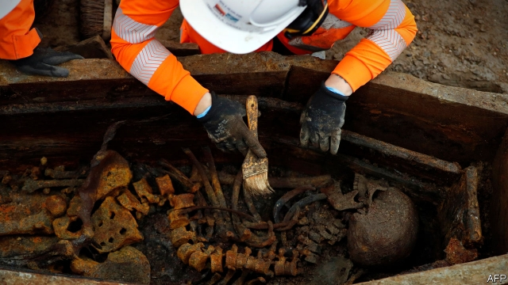

###### Euston, we have a problem

# Britain’s government tries to trim the £56bn cost of HS2 

 

> print-edition iconPrint edition | Britain | Aug 15th 2019 

TAKING A CAB from Euston station in central London used to be a grim experience. In the 1960s the taxi rank was put in a poorly ventilated underground garage known as “the gas chamber”. In January cabbies were cheered when the rank was moved above ground to make way for HS2, a planned high-speed railway between London and the north of England. Yet fears are growing that Boris Johnson’s government could derail the project. 

HS2 is not a done deal. Some £4bn ($5bn) of work has been completed, including exhuming 45,000 bodies from a graveyard at Euston to make way for new platforms. The rest of the cash was to be released this autumn if the project was on track to stay within its £56bn budget. But that looks unlikely. In December HS2’s chairman resigned over rising costs. Last month his replacement warned that the bill could overrun by £30bn. 

Boris Johnson is sceptical. The new prime minister has previously described HS2’s costs as “spiralling out of control”. He has ordered a review by Douglas Oakervee, another former HS2 chairman, who will report within six weeks on whether the project should be slimmed down or even scrapped. At the same time he has promised to build new railways between northern cities, dubbed HS3, at a cost of £39bn. 

Opponents of HS2—from the nerdish Campaign for Better Transport to the right-wing TaxPayers’ Alliance—worry that its huge budget will mean less money for improving local links. They say the cash should be spent on re-opening smaller lines closed in the 1960s, which would have greater economic benefit per pound spent, according to the government’s own analysis. 

Yet for all the doubts, HS2 is likely to survive in some form. Mr Johnson recently told the Birmingham Mail: “I’m going to hesitate for a long time before scrapping any major infrastructure project.” One option is to slow the trains down, to avoid the cost of reinforcing weak ground in the Midlands that cannot support a 225mph (362kph) train. A further £8bn could be saved by ending the line in Old Oak Common, in west London, rather than Euston. That might inconvenience passengers but would boost the area, one of Mr Johnson’s pet projects when he was mayor.■ 

-- 

 单词注释:

1.Euston[]:尤斯顿（人名） 

2.Aug[]:abbr. 八月（August） 

3.grim[grim]:a. 冷酷的, 坚强的, 残忍的, 可怕的, 讨厌的 

4.poorly['puәli]:adv. 贫穷地, 不充分地, 贫乏地 a. 身体不舒服的 

5.ventilate['ventileit]:vt. 使空气流通, 使通风, 公开讨论, 公开 [医] 通风, 换气 

6.cabby['kæbi]:n. 出租车司机, 出租马车的车夫 

7.boris['bɔris]:n. 鲍里斯（男子名） 

8.derail[di'reil]:vt. 使出轨 n. 脱轨器 [计] 转移指令 

9.exhume[ig'zju:m]:vt. 掘出, 发掘 

10.graveyard['greivjɑ:d]:n. 墓地 

11.replacement[ri'pleismәnt]:n. 归还, 更换, 代替者 [医] 复位, 置换 

12.overrun[.әuvә'rʌn]:n. 蔓延, 风行一时, 超过限度 vt. 蔓延, 蹂躏, 超过, 泛滥 vi. 泛滥, 超载限度 [计] 超限 

13.johnson['dʒɔnsn]:n. 约翰逊（姓氏） 

14.spiral['spairәl]:n. 螺旋形之物, 螺线 a. 螺旋形的, 盘旋的 vi. 螺旋形下降, 螺旋形上升, 螺旋形行进 vt. 使螺旋形行进 

15.douglas['dʌ^lәs]:n. 道格拉斯（男子名）；道格拉斯（英国马恩岛首府） 

16.scrap[skræp]:n. 碎片, 残余物, 些微, 片断, 铁屑, 吵架 vt. 扔弃, 敲碎, 拆毁 vi. 互相殴打 a. 零碎拼凑成的, 废弃的 

17.dub[dʌb]:vt. 配音, 轻点, 授予称号, 击 n. 一下击鼓声, 笨蛋 

18.nerdish[ˈnə:diʃ]:n. <美><俚>笨得令人讨厌的 

19.les[lei]:abbr. 发射脱离系统（Launch Escape System） 

20.Birmingham['bә:miŋәm]:n. 伯明翰 

21.infrastructure['infrәstrʌktʃә]:n. 基础结构, 基础设施 [经] 基础设施 

22.midland['midlәnd]:n. 中部地方, 内地 

23.cannot['kænɒt]:aux. 无法, 不能 

24.oak[әuk]:n. 橡树, 橡木 a. 橡木制的 

25.inconvenience[.inkәn'vi:njәns]:n. 不便, 困难 vt. 使感不便, 使感困难 

