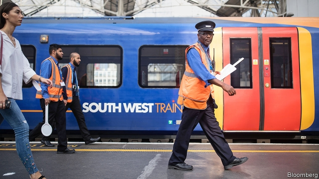
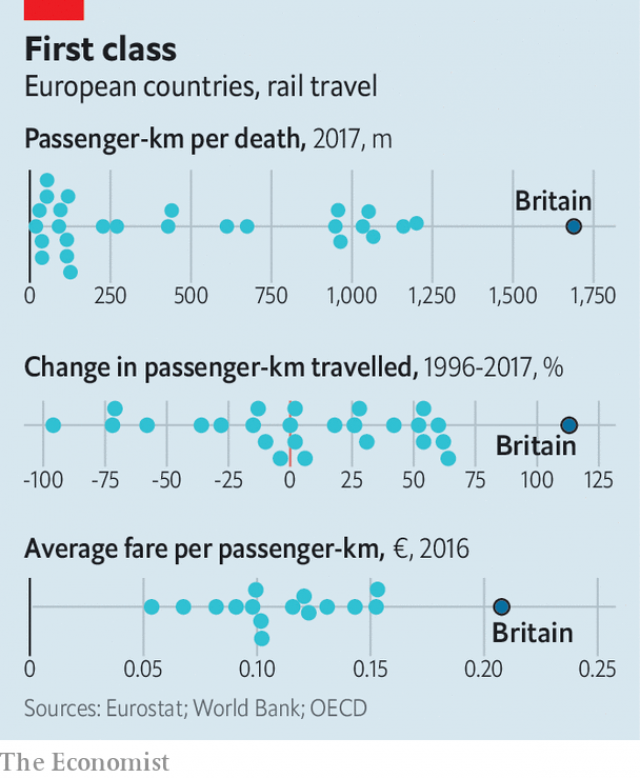

###### Getting back on track

# How rising rail fares and falling punctuality undermine confidence 

 

> print-edition iconPrint edition | Britain | Aug 15th 2019 

MANY OFFICE serfs like to slip away early on Friday afternoons in the quiet summer months. So anger boiled over on August 9th when several rail lines were shut down following a power cut. Delays were so bad on lines going north from London that it was quicker for some commuters to trudge home on foot. The snafu was the fault of the electricity industry rather than the train companies. But it added to the railways’ growing reputation for unreliability. With dreadful timing, it was announced a few days later that fares would go up again next year, by 2.8%. 

Boris Johnson’s government is consumed by the task of getting Britain out of the European Union by October 31st. But before then it must also make two big decisions about the railways. The first is whether to go ahead with HS2, a high-speed line between London and the north (see article). The second is how to fix the rest of the network. This autumn an official review by Keith Williams, a former British Airways boss, will consider how to reform the franchising system under which most lines operate. Mr Williams has already said the current set-up has “had its day” and talked of “revolution, not evolution”. 

The Williams report was commissioned after a catastrophically botched timetable change last summer led to nearly half the trains in northern England being delayed or cancelled. The incident exemplified how the railways, which made much progress after being privatised in the early 1990s, have gone off-track. Last year delays and cancellations reached their worst level in nearly a decade. At the same time passenger numbers fell by 1.4%, the first dip since privatisation. Amid all this, passengers are paying more. Ticket prices have risen twice as fast as wages since 2010. 

When Britain broke up and sold British Rail, the state-run monopoly, it hoped to spur competition and cut costs. With this aim it embarked on a radical experiment, tried before only in Sweden, of separating the management of the tracks from that of the trains. Politicians feared that chaos could ensue, and some politically sensitive lines could close, if the system went from rigid state monopoly to free-market free-for-all overnight. So they introduced a system of franchises, in which companies could bid for the right to operate specified services, to ensure continuity and allow for the subsidising of loss-making services. 

The opposition Labour Party, which came to back privatisation in the 1990s, wants to renationalise the network. Andy McDonald, the shadow transport secretary, argues that privatisation has left “a fragmented and inefficient network that drives up costs”, and says the answer is for a single state-owned firm to run both trains and track. Most voters seem to agree. A poll last year by BMG Research found that 64% support nationalisation. (The same is not necessarily true of rail-users, notes Anthony Smith of Transport Focus, a watchdog. It finds that passengers care more about having a reliable service than who runs it.) 

Supporters of nationalisation compare Britain’s railways unfavourably with those in other European countries, where the state plays a more active role. Yet, perhaps surprisingly, many countries on the continent see the British model as one to copy. EU rules that came into force in June require state-owned rail firms to open their tracks to rivals and legally separate the management of track and train, as in Britain. And although British rail-users are fed up, those elsewhere are crosser still. Only five EU countries have happier passengers (and most of them are in countries without many railway lines). 

 

Britons may scoff at the idea that they have anything to teach the world about railways. But they do (see chart). Passenger numbers have risen by almost 120% since privatisation, twice the increase in the next-best big country, Spain. This may be because other forms of transport have become more wretched: driving has got pricier, for instance. Yet anti-car policies have gone further in other countries, without an equivalent rail boom. Meanwhile, Britain has gone from having one of the most accident-prone railways in Europe to running its safest. 

Average British fares are by some way the highest in Europe. But European passengers pay less for their tickets mainly because they pay more through taxation. In France and Germany, taxpayers cover almost half the cost of train tickets, whereas the fares Britons pay fully cover the trains’ operating costs. Any argument for increasing subsidies must reckon with the fact that rail-users are, on average, a richer bunch than those who use other forms of transport, such as buses. 

Where Britain does badly is in the crucial area of reliability. Although its long-distance trains are pretty punctual by European standards, its short-haul ones run late. Britain comes 19th out of 26 European countries for punctuality on local routes—and these are the ones that cause most anguish, as commuters rely on them to get to work on time. 

The franchising business has also sometimes proved chaotic. The East Coast mainline franchise has gone bust three times—in 2007, 2009 and 2018—as operators overpromised how much they could pay in track-access charges. Even Eamonn Butler of the Adam Smith Institute, a libertarian think-tank which pioneered the idea of separating the management of track and trains, admits that franchises “didn’t work out as we intended”. 

Faced with these problems, the government is thinking about new approaches. On some long-distance routes it is running an “open-access” system, under which different companies are allowed to run services along the same route in competition with each other. The idea is to offer passengers a choice, driving down prices and encouraging innovation—something that is discouraged by franchising, in which rail companies are tied to contracts so detailed that some even specify how often train carpets should be shampooed. 

The results are encouraging. On the East Coast mainline, open-access operators such as Hull trains and Grand Central now compete for passengers. Average fares are lower than on the West Coast mainline, where the West Midlands trains franchise for stopping services and the Virgin trains franchise for express ones hold near-monopolies. Three of the four train companies with the highest passenger-satisfaction ratings last year were open-access operators, not franchisees. 

On shorter lines, the open-access approach is harder to pull off. Busy commuter routes have such tightly packed services that arranging a timetable around several companies would be a recipe for chaos. So an alternative approach is to grant concessions in which a single operator signs a contract to run all services on a line, and sometimes to maintain the track as well. London’s Docklands Light Railway, which has the happiest rail passengers in the capital, is run like this by Keolis, a French firm. Three of Britain’s four most punctual rail firms are concessions. 

Granting concessions doesn’t give passengers a choice about how they travel. Yet an element of competition can be introduced by re-opening alternative lines that were closed half a century ago. In 2016 Chiltern Railways opened a London-Oxford line that had been closed by British Rail in the 1960s, when rail use was in decline. Within a few months the incumbent on a rival line, GWR, cut ticket prices and introduced free Wi-Fi. Some have proposed re-opening a 40-mile stretch of the Great Central Railway between Aylesbury and Rugby to provide competition for the West Coast mainline between London and the north. 

There may be little case for turning back the clock to the 1980s, before privatisation. But going back even further, to the days when passengers had a real choice of which line to take, is a promising alternative.■ 

-- 

 单词注释:

1.punctuality[.pʌŋktʃu'æliti]:n. 严守时间, 正确 

2.undermine[.ʌndә'main]:vt. 在...下面挖, 渐渐破坏, 暗地里破坏 [法] 暗中破坏, 以阴谋中伤伤害 

3.Aug[]:abbr. 八月（August） 

4.serf[sә:f]:n. 农奴, 奴隶, 服苦役的人 

5.commuter[kә'mju:tә]:n. 乘公共车辆上下班者, 月季票乘客 [经] 非(当地)居民 

6.trudge[trʌdʒ]:n. 沉重的步伐, 长途跋涉 vi. 步履艰难地走, 蹒跚地走 vt. 跋涉 

7.snafu[snæ'fu:]:a. 一团槽的, 大混乱的 vt. 使混乱, 使一团槽 n. 混乱 

8.unreliability[]:n. 不可靠, 不可信赖；不安全 

9.dreadful['dredful]:a. 可怕的 

10.timing['taimiŋ]:n. 时间选择, 时间测定, 定时, 调速 [计] 定时器时钟 

11.boris['bɔris]:n. 鲍里斯（男子名） 

12.keith[ki:θ]:n. 基思（男子名） 

13.williams['wiljәmz]:n. 威廉姆斯（男子名） 

14.airway['єәwei]:n. 空中航线, 风道 [医] 导气管 

15.franchise['fræntʃaiz]:n. 公民权, 特权, 特许经营权, 免赔额 vt. 给以特权, 给以...公民权 

16.catastrophically[]:灾难性地 

17.botch[bɒtʃ]:v. 拙笨地修补, 糟蹋 n. 拙笨的修补, 难看的补缀 

18.exemplify[ig'zemplifai]:vt. 例证, 例示 [法] 制作经公章证明的誊本, 例证 

19.privatise[p'rɪvətɪs]:vt. 使私有化 

20.cancellation[kænsә'leiʃәn]:n. 取消, 作废, 注销戳 [经] 注销, 取消, 保险单的注销 

21.privatisation[ˌpraɪvətaɪ'zeɪʃən]:n. 私有化, 非国营化（将国营企业转为民营） 

22.amid[ә'mid]:prep. 在其间, 在其中 [经] 在...中 

23.monopoly[mә'nɒpәli]:n. 垄断, 专卖权, 独占事业 [经] 垄断, 专利品, 垄断(权)独占 

24.embark[im'bɑ:k]:vi. 乘船, 着手, 从事, 上飞机 vt. 使上船, 使上飞机, 使从事 

25.Sweden['swi:dn]:n. 瑞典 

26.chao[]:n. 钞（货币） 

27.ensue[en'su:]:vi. 跟着发生, 继起 vt. 追求 

28.politically[]:adv. 政治上 

29.continuity[.kɒnti'nju:iti]:n. 连续性 [化] 连续性 

30.subsidise[]:vt. 给...补助金, 津贴, 资助 

31.opposition[.ɒpә'ziʃәn]:n. 反对, 敌对, 相反, 在野党 [医] 对生, 对向, 反抗, 反对症 

32.renationalise[riː'næʃənəlaɪz]:vt. [主英国英语] = renationalize 

33.andy['ændi]:n. 安迪（男子名, 等于Andrew） 

34.mcdonald[mәk'dɔnәld]:n. 麦克唐纳（男子名）；麦当劳（快餐店名称） 

35.voter['vәutә]:n. 选民, 投票人 [法] 选民, 选举人, 投票人 

36.bmg[]:abbr. 血魔法师（blood magician）；贝塔斯曼音乐集团（Bertelsmann Music Group） 

37.nationalisation[,næʃәnәlai'zeiʃәn; -li'z-]:n. 国有化, 国营 

38.anthony['æntәni]:n. 安东尼（人名） 

39.smith[smiθ]:n. 铁匠, 金属品工匠 [机] 锻造工, 上手 

40.watchdog['wɒtʃdɒg]:n. 看门狗, 监察人 [化] 监控设备; 监视器 

41.supporter[sә'pɒ:tә]:n. 支持者, 后盾, 迫随者, 护身织物 [法] 支持者, 赡养者, 抚养者 

42.unfavourably[ʌnˈfeɪvrəblɪ]:adv. 不适宜地; 不利地; 反对地; 令人不快地 

43.EU[]:[化] 富集铀; 浓缩铀 [医] 铕(63号元素) 

44.legally['li:gәli]:adv. 法律上, 合法地 [法] 法律上, 合法地, 法定地 

45.crosser[]:垫木；隔条；衬木 

46.Briton['britәn]:n. 大不列颠人, 英国人 

47.scoff[skɒf]:n. 嘲笑, 愚弄, 笑柄, 食品 v. 嘲笑, 嘲弄, 贪吃, 狼吞虎咽地吃 

48.Spain[spein]:n. 西班牙 

49.pricy['praisi]:a. 昂贵的, 价格高的 

50.les[lei]:abbr. 发射脱离系统（Launch Escape System） 

51.taxation[tæk'seiʃәn]:n. 课税, 征税, 抽税, 税款, 估定的税额 [经] 征税, 纳税, 税制 

52.taxpayer['tækspeiә]:n. 纳税人 [法] 纳税人, 纳税义务人 

53.fully['fuli]:adv. 十分地, 完全地, 充分地 

54.reckon['rekәn]:vt. 计算, 总计, 估计, 认为, 猜想 vi. 数, 计算, 估计, 依赖, 料想 

55.anguish['æŋgwiʃ]:n. 剧痛, 痛苦 vt. 使极痛苦 vi. 感到痛苦 

56.chaotic[kei'ɒtik]:a. 混乱的, 无秩序的 [法] 混乱的, 混沌的 

57.mainline[]:n. 主线, 干线 vt.vi. (美)(非正式)把(毒品)直接注射入静脉 

58.bust[bʌst]:n. 半身像, 胸部, 失败, 殴打 vt. 使爆裂, 使破产 vi. 爆裂, 破产 [计] 操作错 

59.overpromised[]:[网络] 过度承诺；礼贤下士通常是过度承诺的 

60.Eamonn[]:n. (Eamonn)人名；(英)埃蒙 

61.butler['bʌtlә]:n. 男管家, 司膳总管 

62.Adam['ædәm]:n. 亚当 [计] 自动直接存取管理 

63.libertarian[.libә'tєәriәn]:n. 自由意志主义支持者, 行动自由者 a. 自由意志主义支持者的, 主张个人思想的 

64.hull[hʌl]:n. 壳, 皮, 船体 vt. 去壳 

65.midland['midlәnd]:n. 中部地方, 内地 

66.virgin['vә:dʒin]:n. 处女 a. 处女的, 贞洁的, 纯洁的, 初始的, 纯的 

67.rating['reitiŋ]:n. 等级, 额定功率, 责骂 [经] 等级评定 

68.franchisee[.fræntʃai'zi:]:n. 有代销权的人(或团体) [经] 特许证持有人 

69.tightly['taitli]:adv. 紧紧地, 坚固地 

70.concession[kәn'seʃәn]:n. 特许, 让步, 认可 [经] 核准, 许可, 特殊(权) 

71.dockland[ˈdɒklænd]:n. 港区, 港口住宅区 

72.chiltern['tʃiltә:n]:白垩质, 砂质 

73.incumbent[in'kʌmbәnt]:a. 现任的, 依靠的, 负有义务的 n. 领圣俸者, 在职者 

74.GWR[]:abbr. 地理加权回归（Geographically Weighted Regression）；气水比（Gas Water Ratio）；英国大西铁路（Great Western Railway） 

75.Aylesbury['eilzbәri]:爱斯勃雷鸭 

