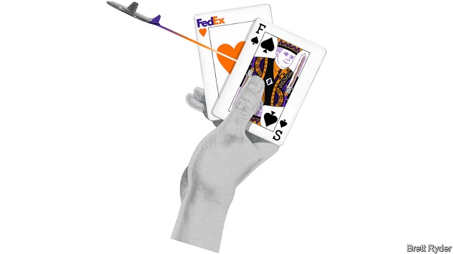

###### Schumpeter

# FedEx’s visionary founder is a disrupter at risk of disruption 

 

> print-edition iconPrint edition | Business | Aug 17th 2019 

FOR OUTSIDERS, FedEx is synonymous with the business it pioneered: the overnight delivery of packages. For insiders, it might just as well be called FredEx. It is virtually indistinguishable from its founder, Fred Smith, who has been boss since 1971. The 75-year-old, who came up with his idea for air freighting packages at Yale University, is the stuff of folklore. Some of it is apocryphal, such as the story that he got a C at Yale for a paper outlining his idea (he can’t recall the grade). But one tale is, if anything, too good to check. In its early days, as the firm flirted with bankruptcy, he saved it with a lucky wager at a blackjack table in Las Vegas. 

Mr Smith is an entrepreneur of the old school. The ex-marine dispatched his first 14 planes in 1973—on the first day they carried 186 packages. FedEx is now the biggest cargo airline in the world, with 681 aircraft and an average volume of 15m packages a day. He has played politics as he plays cards, be that securing deregulation of the air-cargo industry in the 1970s, winning protection from American unions or schmoozing congressmen at the FedEx Field, home to the Washington Redskins. Among American firms, FedEx has long been one of the most recognisable, admired and popular to work for. In January the board in effect gave Mr Smith tenure for life, by waiving the firm’s retirement age of 75 for executives. “Like a Supreme Court judge,” chuckles one admirer. 

Shareholders are less giddy. As one of the biggest parcel carriers in America, FedEx ought to benefit from uninterrupted GDP growth. Yet since 2009, when America began its longest economic expansion on record, the company has underperformed the S&P 500 by almost 100 percentage points. This year it has suffered from the Sino-American trade war, growing competition from Amazon and problems integrating Europe’s TNT Express, which it bought in 2016 for $4.4bn. Such squalls are not good for its financial health, yet FedEx has been investing more than $5bn a year since 2017 to keep deep-pocketed rivals like Amazon and the e-commerce giant’s Chinese counterpart, Alibaba, out of its delivery business. This is a game of chance that Mr Smith is not guaranteed to win. 

The biggest stakes are at home. FedEx built its name as a high-end business-to-business firm, offering guaranteed time slots for delivering parcels and factory goods along the supply chain. But e-commerce is raising the importance of delivery to homes, at faster speeds and lower costs. FedEx has responded by expanding its trucking service, which will soon reach most American homes seven days a week. But that clobbers margins. Meanwhile, Amazon is spending heavily on same-day delivery. It is also building an aircraft fleet that, though still a midget compared with FedEx’s, will amount to 70 aircraft by 2021. According to Satish Jindel, a logistics consultant, Amazon has leapfrogged its rivals to become the biggest firm in the world at organising warehousing and transport for other companies’ goods (as well as its own). Only a few years ago Mr Smith mocked the idea of competition from the likes of Amazon as “fantastical”. But in the past two months FedEx has severed its (albeit tiny) remaining ties with Amazon to focus on building its relationship with retailers like Walmart and Target instead. Its main rival, UPS, is sticking with Amazon. This sets the stage for a potentially bruising price war that could further crimp profits. 

Its second big challenge is overseas. Besides having to fix TNT, FedEx has found itself in the awkward position of being on the wrong side of both adversaries in the trans-Pacific trade war. In recent months it was forced to apologise to China for diverting packages belonging to Huawei. FedEx said that this was owing to an error. Nonetheless the Chinese government is reportedly threatening to put FedEx on its own blacklist. And the company has also sued its own government, saying it should not be deputised to “police the contents” of any packages it sends to check that they do not violate export bans. 

Besides the ugly geopolitics, global competition is also rising for FedEx. One of the biggest threats comes from Cainiao, a Chinese rival backed by Alibaba that in 2017 pledged to invest $15bn in cross-border logistics. FedEx claims that its own vast network, extending to 220 countries, safeguards it from such incursions. But it is not used to having tanks the size of Amazon’s and Alibaba’s on its lawn; their troves of data on customers may give them an edge in the delivery wars. 

In response, both FedEx and UPS are investing large sums to modernise their fleets and expand their delivery hubs. But though FedEx’s revenues of almost $18bn in the last quarter have nearly caught up with UPS’s, its profit margins are weaker and it is generating less cash. That worries investors. It could seek to reassure them by reducing purchases of costly items like aircraft, or combining two of its independent businesses in America, FedEx Express and FedEx Ground, to cut costs. But it has rejected both ideas, insisting it is best to invest in growth. 

It may be wise to double down this way. However much risk-averse investors may prefer share buy-backs to ambitious capital-spending plans, halting investment could be seen as a flag of surrender by the likes of Amazon. That said, FedEx’s failures—to respond more quickly to the changing e-commerce landscape, to read the runes of geopolitics and to end its stubborn refusal to join its two businesses—reflect a company whose management is long in the tooth. Including Mr Smith, FedEx’s ten top executives average more than three decades at the firm, which is extraordinary. 

It is hard not to misread the changing rules of business when you once rewrote them—even harder when some of your oldest friends are your sounding board. It is clear that the directors have no stomach for replacing their chairman in the foreseeable future. But unless Mr Smith brings in fresh executives, and then listens to them, his days at the business blackjack table should be numbered. Think FredExit, in other words.■ 

-- 

 单词注释:

1.Schumpeter[]:n. 熊彼特（美籍奥匈帝国经济学家, 当代资产阶级经济学代表人物之一） 

2.visionary['viʒәnәri]:a. 幻像的, 幻想的, 梦想的 n. 有眼力的人, 空想家, 梦想者 

3.founder['faundә]:n. 创立者, 建立者 vt. 使沉没, 使摔倒, 弄跛, 浸水, 破坏 vi. 沉没, 摔到, 变跛, 倒塌, 失败 

4.disrupter[]:n. 分裂者, 破坏者 

5.disruption[dis'rʌpʃәn]:n. 分裂, 崩溃, 瓦解 

6.Aug[]:abbr. 八月（August） 

7.outsider[' aut'saidә]:n. 外人, 局外人, 非会员, 外行, 门外汉, 比赛中获胜可能性不大的选手 [经] 外船公司 

8.fedex[]:n. 联邦快递（等于the Federal Express） 

9.synonymous[si'nɒnimәs]:a. 同义词的, 同义的 

10.insider['in'saidә]:n. 内部的人, 权威人士, 知道内情的人 [经] 熟悉内情者 

11.indistinguishable[.indis'tiŋgwiʃәbl]:a. 不能辨别的, 不能区别的 

12.fred[fred]:n. 佛瑞德（男子名） 

13.smith[smiθ]:n. 铁匠, 金属品工匠 [机] 锻造工, 上手 

14.Yale[jeil]:n. 耶鲁 

15.folklore['fәuklɒ:]:n. 民俗学, 民间风俗, 民间传说 

16.apocryphal[ә'pɔkrif(ә)l]:a. 伪的, 不足凭信的 

17.C[si:]:[计] 调用, 访问, 呼叫；电容, 进位, 通道, 字符, 清除, 常数, 控制, 周期；C 程序设计语言 [化] 碳的化学符号; 胞苷 

18.flirt[flә:t]:n. 卖弄风骚的人, 急动, 急扔 vt. 忽然弹出, 轻快摆动, 挥动 vi. 调情, 玩弄, 摆动, 轻率地对待 

19.bankruptcy['bæŋkrәptsi]:n. 破产者 [经] 破产, 倒闭 

20.wager['weidʒә]:n. 赌注, 赌博, 赌物 vt. 下赌注, 向...保证 vi. 打赌 

21.blackjack['blækdʒæk]:n. 闪锌矿；扑克牌的二十一点；包革金属棍棒 

22.La[lɔ:, lɑ:]:[医] 镧(57号元素) 

23.vega['vi:^ә]:n. [天]织女星 

24.entrepreneur[.ɒntrәprә'nә:]:n. 企业家, 主办人 [经] 承包商, 企业家 

25.dispatch[dis'pætʃ]:vt. 派遣 n. 派遣, 急件 [计] 调度 

26.politic['pɒlitik]:a. 精明的, 明智的, 策略的 

27.deregulation[di:.regju'leiʃәn]:n. 撤消(价格等的)管制规定, 解除控制 

28.schmooze[ʃmu:z]:n. 闲谈 vi. 闲谈 

29.congressman['kɒŋgresmәn]:n. 国会议员, 众议院议员 [法] 国会议会 

30.Washington['wɒʃiŋtn]:n. 华盛顿 

31.redskin['redski:n]:n. 红皮肤人 

32.recognisable[]:a. 可辨认的；可认识的；可承认的（=recognizable） 

33.tenure['tenjuә]:n. 享有, 保有期 [经] (财产,职位等的)占有, 占有权 

34.waive[weiv]:vt. 不坚持要求, 放弃, 推迟考虑, 丢弃 [经] 放弃权利, 免除, 弃权人 

35.retirement[ri'taiәmәnt]:n. 退休, 隐居, 撤退 [经] 退休, 退股, (固定资产)报废 

36.chuckle['tʃʌkl]:n. 咯咯的笑声, 轻笑 vi. 咯咯的笑, 咕咕叫 

37.admirer[әd'maiәrә]:n. 钦佩者, 仰慕者, 求爱者 

38.shareholder['ʃєә.hәuldә]:n. 股东 [法] 股东, 股票持有人 

39.les[lei]:abbr. 发射脱离系统（Launch Escape System） 

40.giddy['gidi]:a. 眼花的, 头晕的 v. (使)眼花, (使)眩晕 

41.uninterrupted['ʌn.intә'rʌptid]:a. 不间断的, 连续的, 不断的 

42.underperform[,ʌndәpә'fɔ:m]:vi.表现不佳,工作不如预期(或同行) vt.(股票等)运作差于(一般市场价格) 

43.amazon['æmәzɒn]:n. 亚马孙河 [医] 无乳腺者 

44.TNT[]:[化] 梯恩梯 [医] 三硝基甲苯 

45.squall[skwɒ:l]:n. 飑, 喊叫 vi. 起飑, 嚎啕, 叫嚷 vt. 尖叫 

46.counterpart['kauntәpɑ:t]:n. 副本, 复本, 配对物, 相应物 [经] 副本, 正副二份中之一 

47.alibaba[]:n. 阿里巴巴（公司名） 

48.slot[slɒt]:n. 水沟, 细长孔, 硬币投币口, 缝, 狭槽, 狭通道, 位置, 一档(广播节目等) vt. 开槽于, 把...纳入机构 [计] 槽; 存储槽 

49.clobber['klɒbә]:n. 衣服, (鞋匠用来掩饰皮革缝的)软膏 vt. 痛打, 击倒, 拉垮 

50.midget['midʒit]:n. 侏儒 a. 小型的 

51.satish[]:[网络] 萨蒂夏；萨蒂什南比亚；萨提许 

52.logistic[lәu'dʒistik]:a. 逻辑的, 后勤学的 

53.leapfrog['li:pfrɒg]:n. 跳背游戏, 竞相提高 vi. 跳背, 交替前进 vt. 跃过 

54.mock[mɒk]:n. 嘲笑, 戏弄, 模仿 a. 假的, 伪造的, 模拟的 adv. 虚伪地 vt. 嘲弄, 模仿, 使失望, 欺骗, 挫败 vi. 嘲弄 

55.fantastical[fæn'tæstikәl]:a. 空想的；捕风捉影的 

56.sever['sevә]:vt. 切断, 脱离, 分开, 使分离, 断绝, 中断 vi. 断, 裂开 

57.albeit[ɔ:l'bi:it]:conj. 尽管, 虽然 

58.retailer['ri:teilә]:n. 零售商人, 传播的人 [经] 零售商 

59.walmart['wɔlma:t]: 沃尔玛（世界连锁零售企业） 

60.potentially[pә'tenʃәli]:adv. 可能地, 潜在地 

61.crimp[krimp]:n. 诱人当兵的人, 拳曲, 鬈发 vt. 诱...去当兵, 使拳曲, 使有褶 

62.oversea['әuvә'si:]:adv. 海外, 向国外, 向海外, 国外 a. 外国的, 在国外的, 在海外的, 舶来的 

63.adversary['ædvәsәri]:n. 敌手, 对手 a. 敌手的, 敌对的 

64.apologise[ә'pɔlәdʒaiz]:vi. 道歉（等于apologize） 

65.divert[dai'vә:t]:vt. 转移, 使欢娱 vi. 转移 

66.huawei[]: 华为 

67.nonetheless[,nʌnðә'les]:conj. 然而, 尽管, 不过 adv. 不过, 仍然, 尽管如此, 然而 

68.reportedly[ri'pɒ:tidli]:adv. 根据传说, 根据传闻, 据报道 

69.blacklist['blæklist]:n. 黑名单 

70.sue[su:]:vt. 控告, 起诉, 请求 vi. 提出诉讼, 提出请求 

71.deputise[]:vt. 委...为代表, 授权...为代表 vi. 担任代表 

72.geopolitic[,dʒi:әjpә'litik]:a. 地理政治学的 

73.pledge[pledʒ]:n. 诺言, 保证, 誓言, 抵押, 信物, 保人, 祝愿 vt. 许诺, 保证, 使发誓, 抵押, 典当, 举杯祝...健康 

74.safeguard['seifgɑ:d]:n. 保卫, 保护措施, 防护设施 vt. 保卫, 保护 

75.incursion[in'kә:ʃәn]:n. 侵入, 侵略, 奇袭 

76.trove[trәuv]:n. 发现物, 收藏品 [法] 发现物, 收藏物 

77.datum['deitәm]:n. 论据, 材料, 资料, 已知数 [医] 材料, 资料, 论据 

78.modernise['mɔdәnaiz]:vt.vi. (使)现代化, (使)适应现代需要 vi. 用现代方法 

79.hub[hʌb]:n. 毂, 木片, 中心 [计] 插座; 插孔; 集线器, 集中器, 连接器, 中继站 

80.investor[in'vestә]:n. 投资者 [经] 投资者 

81.reassure[.ri:ә'ʃuә]:vt. 使...安心, 向...再保证 [法] 重新保证, 再保险, 使清除疑虑 

82.ambitious[æm'biʃәs]:a. 有野心的, 抱负不凡的, 雄心勃勃的 

83.quickly['kwikli]:adv. 很快地 

84.landscape['lændskeip]:n. 风景, 山水, 风景画 vi. 从事景观美化 vt. 美化...景观 [计] 横向 

85.rune[ru:n]:n. 诗歌；古代北欧文字；神秘的记号 

86.misread[mis'ri:d]:vt. 读错, 看错 

87.foreseeable['fɒ:'si:әbl]:a. 可预知的, 能预测的 [法] 可预见的, 可预料的 

