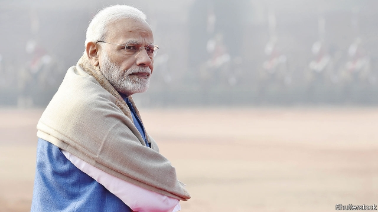
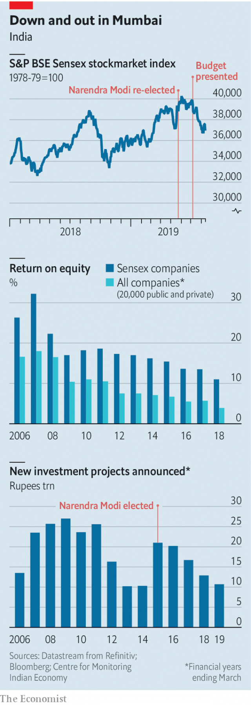

###### Modi blues

# India Inc is growing disenchanted with Narendra Modi 

 

> print-edition iconPrint edition | Business | Aug 17th 2019 

IN MAY CHAMPAGNE corks popped as Mumbai’s bankers, investors and industrialists feted the re-election of Narendra Modi as India’s prime minister. His Hindu nationalist Bharatiya Janata Party’s defeats in regional elections last autumn raised the possibility of a return to power of the left-leaning Congress party, which most of India Inc views (with some justification) as anti-business, corrupt and fiscally feckless. Mr Modi’s landslide victory therefore set corporate pulses racing. The Mumbai stockmarket soared to a record high. So did expectations that he would follow first-term coups like a new bankruptcy code and a goods-and-services tax with fresh business-friendly measures. “Modi knows how to change the goalposts,” gushed one respected tycoon on election night. His fellow moguls nodded in agreement. 

Two months later, the elation is gone. Despite an uptick in August, Mumbai’s Sensex stock index is about as close to October’s lows as it is to June’s highs. In July foreigners pulled more money out of Indian equities than they put in. India’s cautious business press has begun to criticise the government. So too, even more gingerly, have its cowed business leaders. “There is no demand and no private investment,” groused Rahul Bajaj, chairman of Bajaj Auto, a motorcycle-maker, at its annual meeting in late July. “So where will growth come from?” The remark, widely interpreted as a swipe at Mr Modi, encapsulates Indian business’s disenchantment with the man they once regarded as their champion. 

The immediate cause of the mood swing was the budget, presented on July 5th by Nirmala Sitharaman, the newly appointed finance minister. Business folk tuned in to the two-hour presentation expecting less red tape, fewer tariffs, more incentives for investment and lower taxes. They got the opposite. 

At an international bank, analysts’ feigned interest turned to mild bewilderment, then despair, as Ms Sitharaman recited the budget’s 143 provisions. The top marginal tax rate for high-earners would increase from 35.9%, already above the level in most emerging economies, to 42.7%, roughly as much as the average in the OECD club of mostly rich countries. The corporate-tax rate for big companies stayed at 35% (compared with a global average of 23%, and 21% in America). Or at least it appeared to: a new levy of 20% on share buy-backs, on top of existing charges, would bring the capital-gains rate above 40%, among the highest in the world. Add in a tax on dividends and a recently imposed charge on recipients and, all told, the government could skim off 60% of corporate profits. New tariffs would be slapped on products from cashews to newsprint to fibre-optic cables. One banker recounts listening to the speech from the shower, the last vestige of optimism washing down the drain. 

As observers unpacked the budget’s convoluted text over the subsequent weeks, unintended consequences became apparent. To close loopholes, the bill extended taxes to the kinds of trust used by foreign portfolio investors, whom the government hopes to court. This turned them from heavy buyers of Indian equities to net sellers. Some high-earners wonder if it is time to decamp to more functional, business-friendlier Dubai or Singapore—especially after India’s parliament amended the Companies Act on July 30th to let the government jail executives at big firms that do not spend part of their post-tax profits on corporate social responsibility. 

All this looks like an odd way to boost India’s flagging animal spirits—the deeper reason for corporate India’s malaise. Anomalies in the country’s GDP numbers, not all of which can be blamed on Mr Modi, have raised suspicions that India’s growth rate may have been significantly overstated. Indians are beginning to skimp on hair oil, toothpaste and other essentials, hitting retailers and consumer-goods firms. Collapsing car and tractor sales in the past couple of months are reverberating down the supply chain, from parts-makers to steel companies. Demand for building materials is so feeble that one industry bigwig says his workers mostly perform maintenance work. Exports are stagnant. Companies caught up in China’s trade row with America are relocating their supply chains to Bangladesh and Vietnam, not India. 

The budget—and the statist signal it sends—is unlikely to encourage new spending by either domestic firms or foreign ones. Business investment has been sluggish since 2015, a year after Mr Modi first took office, a state of affairs for which the government is, again, not solely to blame. Lots of firms borrowed heavily to invest earlier in the decade, when India’s economy appeared to be on a roll. Its subsequent wobble exposed a Himalaya of bad loans, particularly at state-owned banks which dominate lending. More recently, liquidity and solvency crises hit shadow banks, which finance some businesses and many consumer purchases, including cars and motorbikes. Investments are the last thing on struggling bosses’ minds. 

Announcements of new capital spending tracked by the independent Centre for Monitoring Indian Economy (CMIE) fell from 10.3trn rupees ($207bn) in the first quarter of 2009 to 2.4trn rupees from January to March this year. Instead, companies have returned a growing share of profits to shareholders. Combined, the two trends do not exactly amount to a vote of confidence in India Inc’s prospects. 

Powerful industries with lots of workers and lobbyists, such as vehicle manufacturers who want a cut in the 28% sales tax on their products, are seeking favour with the government. Everybody else has to cut costs, slash investments and cling on to cash, chief executives grumble. Both listed and unlisted firms’ return on equity, which began Mr Modi’s first term well below a peak in 2006-07, ended it lower still (see chart). Profits at 399 of India’s biggest public companies have declined by 3.7% a year on average on his watch, according to Refinitiv, a data provider. The CMIE calculates that asset utilisation has dropped from 50% in the 2000s to below 40%. 

 

Asked on July 8th about the post-budget stockmarket rout, Ms Sitharaman replied that she did not let this sort of thing “affect my calms”. If so, warned one financier at the time, “then the markets will fall until her calms are affected”. 

Whether or not the subsequent falls rattled the minister herself, they appear to have jolted the government. Its initial response was to drag bosses in for confidential consultations, including at least one attended by Mr Modi himself. The officials’ conclusion, says a person close to the events, was that messaging was the problem, not the message. Ms Sitharaman was dispatched to pose for photos, listening to the concerns of bankers and captains of industry. This was a welcome change from the Modi government’s previous insularity. So was its promise, in response to panicked pleas from companies, not to lock up executives for stinting on social projects. The central bank’s 35-basis-point cut in interest rates on August 7th raised spirits. But neither removes the desert of sand that still silts up the wheels of Indian commerce. 

Businesspeople who have spoken with Mr Modi say he is clever and focused. In private, they insist, he gets the need for a less overweening officialdom. They praise the bankruptcy code (though it was partially stymied by the courts) and excuse missteps, such as a disruptive withdrawal from circulation of certain banknotes. (They do not talk about his sometimes ugly Hindu nationalism.) Some speculate, longingly, that the business-bashing is part of a cunning strategy to distance himself from the wealthy in order, when the time comes, to reform India’s stifling labour laws. 

Yet they also confide that the prime minister often asks not what the government can do for companies, but what they can do for the government. He is increasingly viewed not as broadly pro-market but selectively pro-business. His goodwill extends to companies whose goals align with his own: bankers who offer cheap loans to the poor, energy firms which furnish households with gas and electricity, corporations which improve sanitation in villages near their factories. Favoured firms are kept on life support with credit from state-controlled lenders, leaving less capital for everyone else. 

Such complaints aren’t widely heard, not because they are rare but because they are not made in public. Sotto voce, denizens of India Inc say they fear retribution from the authorities. Criticism can provoke a call from an official that carries the implied threat of lost contracts or withdrawn permits, they say. After the suicide in July of the founder of a coffee chain who claimed t have been harassed by the tax authorities, the term “tax terrorism”, first coined in 2014, has gained new traction. Indian entrepreneurs share stories of protracted investigations that cripple businesses. 

Most of these problems are endemic in India. Despite the liberalisation of the “Licence Raj” in the early 1990s the country has never quite let go of its deeply ingrained interventionism. But the prime minister, whose 13-year tenure as chief minister of the western state of Gujarat won him a reputation for sound economic management, was going to be different, members of the put-upon corporate class hoped. As he begins his sixth year as India’s prime minster, some of them are beginning to wonder if the state’s success owes more to go-getting Gujaratis than to their erstwhile leader. ■ 

