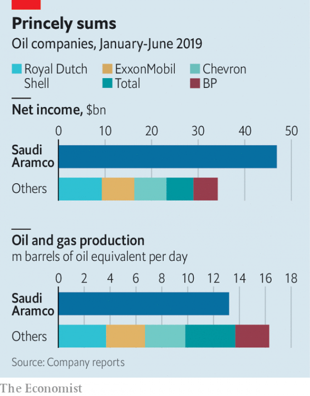

###### Tap dance

# Saudi Aramco debuts in an earnings call 

 

> print-edition iconPrint edition | Business | Aug 17th 2019 

THE EARNINGS call lasted about half an hour and was, by conventional measures, underwhelming. Saudi Aramco, the world’s most profitable company, gave no guidance on capital spending. Its finance chief, Khalid al-Dabbagh, said (cryptically) that dividends must be “affordable”. He did not disclose where or when it might list its shares. The oil giant’s first such interaction with public investors on August 12th was still revealing. It showcased the firm’s evolution—and the forces that may impede it. 

National oil companies face a hazy future. American shale output is booming and long-term demand for fossil fuels looks less certain as concerns about climate change mount. Still, Aramco enjoys a privileged position, as its results for the first half of the year demonstrate. It produced an average of 10m barrels of crude a day, plus another 3m or so barrels of oil equivalent from natural gas. Its $46.9bn in net income eclipsed that of its five biggest listed rivals—ExxonMobil, Shell, Chevron, BP and Total—combined (see chart). 

 

The numbers add new detail to the formidable portrait painted by Aramco’s first international bond prospectus in April. The $12bn issue’s success has revived plans to list 5% of Aramco’s shares. Muhammad bin Salman, Saudi Arabia’s crown prince, declared in 2016 that an initial public offering would value the company at more than $2trn, raising $100bn to invest in other sectors. It may come as soon as next year. 

That is where the earnings call comes in. It was less an exchange of information than an awkward dress rehearsal—a chance for investors to familiarise themselves with Aramco and vice versa. Mr al-Dabbagh conjured an image of dominance today and outlined plans to extend it tomorrow. The firm is expanding its trading arm and striking deals to secure demand for its crude and diversify its revenue. Like others in the industry, it expects appetite for petrochemicals to jump. In March Aramco said it would buy 70% of SABIC, a petrochemical giant, from Saudi Arabia’s public investment fund for $69bn. On August 12th Reliance Industries, an Indian conglomerate, said that Aramco would pay $15bn or so for a 20% stake in its refining-and-petrochemicals business. The Saudi firm will supply Reliance with up to 500,000 barrels a day of crude, helping to lock in a long-term customer. It has struck deals in China, Malaysia and South Korea. 

Aramco could yet trip up. Some downstream projects may take years to materialise, notes Alan Gelder of Wood Mackenzie, an energy-research firm. It boasts of “99.9%” reliability of its supply, but tensions with Iran threaten exports through the Strait of Hormuz. Expanding a pipeline to the Red Sea will help only a bit. The Saudi kingdom is hungry for revenue; dividends in the first six months of 2019 were 22% larger than free cashflow because Aramco paid a “special dividend” of $20bn on top of an ordinary one of $26.4bn (the company invoked the “exceptionally strong financial performance” of 2018). 

Most important, the oil price is sinking. It pulled Aramco’s net income in the first half of 2019 down by 12% compared with last year. To support prices, Saudi Arabia has brokered production cuts by the OPEC cartel of oil-producers and slashed its output by 7% from December to June. If rising fears of a global economic slowdown keep oil markets depressed, a listing may be delayed. Again. ■ 

