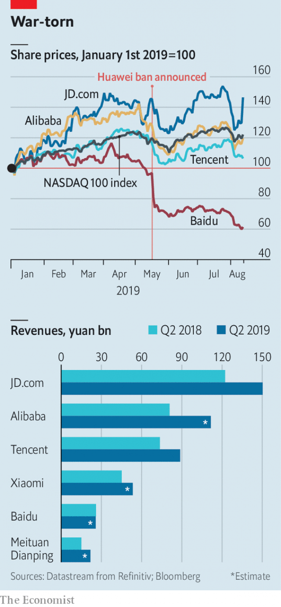

###### Stuck in the Middle Kingdom

# Tencent and other Chinese tech firms are reporting decent results 

 

> print-edition iconPrint edition | Business | Aug 17th 2019 

THE LAST three months have been hard on China’s most valuable public technology companies. Or, at least, on their share prices. In May Alibaba and Tencent lost more than a tenth of their value in the week after President Donald Trump restricted the export of American technology to Huawei, a privately held Chinese telecoms giant. Investors feared that knock-on effects from the ban might hurt other Chinese tech businesses by, for instance, making it hard for them to source cutting-edge components and software from America. 

You would not have guessed, looking at the latest batch of quarterly results. Take Tencent, which owns WeChat, a ubiquitous all-in app, makes mobile games and much cyberstuff besides. On August 14th it reported that a new hit game—which lured users of its most popular title, banned by Chinese censors earlier in the year—propelled its profits to 21.4bn yuan ($3.4bn), from 17.9bn yuan in the same period last year. Revenues rose by 21%, to 88.8bn yuan. Or JD.com, an e-merchant, whose healthy revenues, posted earlier in the week, revived a sagging share price. Analysts expect Alibaba, China’s e-commerce titan, which was due to publish its second-quarter results on August 15th after The Economist went to press, to notch up sales of 111bn yuan and rake in a net profit of 10.3bn yuan, an increase of 35% and 26% year on year, respectively. Xiaomi, a device-maker, and Meituan, a food-delivery firm, which both announce second-quarter earnings next week, are also forecast to report rising revenues. Growthless Baidu, China’s search giant, is an outlier. 

Huawei itself shows that even the long and mercurial arm of American law can do little to hobble the stars of Chinese technology. Many of their employees feel energised by the tech tussle, seeing it as both a validation of Chinese prowess and an opportunity to increase the independence of China’s burgeoning technology ecosystem from America’s government. Finally, Chinese have something their American rivals do not: near-total control of their country’s vast domestic market, second in size only to America’s but growing much faster. 

 

Still, Chinese tech is not invulnerable. Tencent’s revenues came in lower than analysts had forecast, in part owing to disappointing advertising sales. In that business it faces new competition from ByteDance, a Beijing-based startup which also makes TikTok, a video-sharing app that, in a first for a Chinese social-media platform, is all the rage among Western teens. ByteDance is also challenging Baidu in search, which explains some of the latter’s underwhelming performance. Alibaba still relies on its e-commerce business for 85% of revenue. A slowing domestic economy may hurt it, as it might JD.com. Alibaba’s foray into designing chips for cloud-computing and the internet of things is at an early stage. 

These higher-tech lines of business promise riches in the future. They are also more sensitive to geopolitics than are online marketplaces—and the technological conflict between America and China is not going to end anytime soon. The 90-day reprieve granted to Huawei expires soon. It might not be extended. 

Another threat to China’s companies may come from within. It could take the form of (healthy) competition from upstarts like ByteDance or (less healthily) a slowing economy. It could also manifest itself in Chinese tech’s inward turn in response to the trade war. By focusing exclusively on their home market companies might fall into the trap of cutting themselves off from the wider world and the bigger ideas it contains. 

For the time being, then, China’s tech companies look well insulated. That virtue could one day come to haunt them.■ 

-- 

 单词注释:

1.Tencent[]:[网络] 腾讯；腾讯公司；腾讯控股 

2.tech[tek]:n. 技术学院或学校 

3.Aug[]:abbr. 八月（August） 

4.alibaba[]:n. 阿里巴巴（公司名） 

5.huawei[]: 华为 

6.privately[]:adv. 秘密地；私下地 

7.telecom['telәkɔm]:telecommunication 电信 

8.investor[in'vestә]:n. 投资者 [经] 投资者 

9.batch[bætʃ]:n. 一次所烘的面包, 一次所制之量, 一组, 批, 成批, 分批 v. 成批, 分批处理 [计] 一批 

10.WeChat[]:[网络] 微信；微讯；腾讯微信 

11.ubiquitous[ju:'bikwitәs]:a. 无所不在的, 到处存在的, 普遍存在的 

12.APP[]:[计] 应用, 应用程序; 相联并行处理器 

13.lure[luә]:n. 饵, 诱惑 vt. 引诱, 诱惑 

14.censor['sensә]:n. 检查员 vt. 检查, 审查, 删改 

15.revive[ri'vaiv]:vt. 使苏醒, 使复兴, 使振奋, 回想起, 重播 vi. 苏醒, 复活, 复兴, 恢复精神 

16.sag[sæg]:vi. 下垂, 倾斜, 萎靡, 萧条, 变得乏味 vt. 使下垂 n. 下垂, 倾斜, 萧条 [计] 系统分析组, 语法分析生成程序, 电压下降 

17.analyst['ænәlist]:n. 分析者, 精神分析学家 [化] 分析员; 化验员 

18.Titan['taitn]:n. 提坦, 太阳神, 巨人 

19.economist[i:'kɒnәmist]:n. 经济学者, 经济家 [经] 经济学家 

20.notch[nɒtʃ]:n. 刻痕, 等级, 峡谷 vt. 刻凹痕, 用刻痕计算, 赢得 

21.Xiaomi[]:[网络] 小米手机；路嘉怡；品牌 

22.earning['ә:niŋ]:n. 收入（earn的现在分词） 

23.growthless['ɡrəʊθlɪs]:adj. 不生长的，不增长的 

24.baidu[]:n. 百度（全球最大的中文搜索引擎） 

25.outly[]:[网络] 欧特利 

26.mercurial[mә:'kjuәriәl]:a. 水星的, 敏捷的, 活泼的, 水银的 n. 汞剂 

27.hobble['hɒbl]:vi. 蹒跚 vt. 使跛行, 阻碍 n. 跛行 

28.energise['enәdʒaiz]:vt. 供给…能量；使精力充沛（等于energize） 

29.tussle['tʌsl]:n. 扭打, 争斗, 论争 vi. 扭打, 打斗 

30.validation[.væli'deiʃәn]:n. 批准, 确认 [计] 证实, 检验 

31.prowess['prauis]:n. 英勇, 勇敢, 超凡技术 

32.burgeoning[]:[计] 急速增长的 

33.ecosystem['i:kәu.sistәm]:n. 生态系统 [医] 生态系 

34.invulnerable[in'vʌlnәrәbl]:a. 不会受伤害的, 刀枪不入的, 无懈可击的, 无可反驳的 

35.advertising['ædvәtaiziŋ]:n. 广告业, 广告 a. 广告的 [计] 发广告 

36.startup[]:[计] 启动 

37.teen[ti:n]:n. 愤怒, 悲哀 

38.underwhelm[,ʌndә'hwelm]:vt. 未留下深刻印象 

39.foray['fɒrei]:vi. 侵略, 劫掠, 袭击 n. 侵掠, 侵略, 攻击 

40.chip[tʃip]:n. 屑片, 薄片, 碎片 vt. 削, 切, 削成碎片, 使摔倒, 凿 vi. 削下屑片 [计] 孔屑; 组件; 晶片; 芯片 

41.riche[]:n. 暴发户 

42.geopolitic[,dʒi:әjpә'litik]:a. 地理政治学的 

43.online[]:[计] 联机 

44.technological[.teknә'lɒdʒikl]:a. 技术的 [经] 工艺的, 技术的 

45.anytime['enitaim]:adv. 任何时候；无例外地 

46.reprieve[ri'pri:v]:n. 缓刑, 缓刑令, 暂缓 vt. 暂时解救, 缓期执行 

47.expire[ik'spaiә]:vi. 期满, 呼气, 断气 vt. 呼出 

48.upstart['ʌpstɑ:t]:n. 新贵, 暴发户, 自命不凡者 a. 暴富的 

49.les[lei]:abbr. 发射脱离系统（Launch Escape System） 

50.healthily['helθili]:adv. 健康地 

51.manifest['mænifest]:n. 载货单, 运货单, 旅客名单 a. 显然的, 明白的 vi. 显示, 出现 vt. 表明, 表现, 证明 

52.insulate['insjuleit]:vt. 使绝缘, 隔离 [医] 绝缘 

53.haunt[hɒ:nt]:n. 常到的地方, 生息地 vt. 常到, 出没于, 萦绕于 vi. 出没, 作祟 

