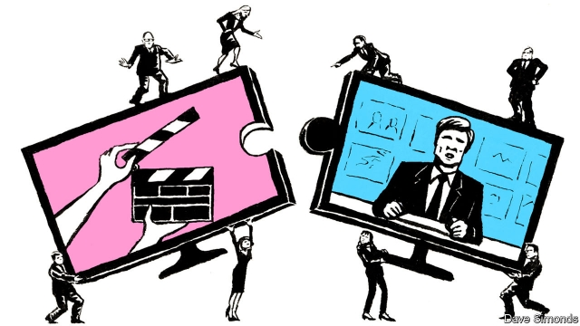

###### Together again

# Viacom and CBS agree to reunite 

 

> print-edition iconPrint edition | Business | Aug 15th 2019 

AMERICA’S MEDIA business once lionised boutique firms and their iconoclastic bosses. No longer. Like so many other industries, it has come to be dominated by a few huge companies focused squarely on achieving economies of scale. Besides Netflix, a pioneer of video-streaming with a market capitalisation of $131bn, most of the giants were created through mergers. AT&T’s acquisition of Time Warner produced a $250bn behemoth. Disney’s takeover of 21st Century Fox in March has created a juggernaut worth just under $240bn. Verizon, another telecoms titan, which in 2015 snapped up AOL, an online portal, comes in at $230bn. Just shy of $200bn, Comcast, a cable company which last year bought Sky, a British satellite broadcaster, is the tiddler of the bunch. 

Against this supersized backdrop Viacom, a content provider with a market value of nearly $11bn, and CBS, a television network worth some $17bn, look like flailing minnows. But they do control some prime media properties, including Paramount, a Hollywood film studio, and TV series such as “CSI” and “South Park”. And this week, after years of wrangling, the two firms agreed to merge in an all-share deal engineered by Shari Redstone, daughter of Sumner Redstone, a legendary tycoon (who is aged 96 and ailing). 

The two firms were once united but Mr Redstone broke them up in 2006. The Redstone family’s investment vehicle still maintains control of both companies through its holdings of shares with enhanced voting rights. Ms Redstone overcame many foes, including Les Moonves, the formidable former boss of CBS who was forced to resign last September following allegations of sexual harassment, which he denies. She will chair the combined entity, which is to be called ViacomCBS. CBS shareholders will control roughly 61% of the combined enterprise. Bob Bakish, a Viacom veteran who is to lead the new firm, expects yearly revenues to exceed $28bn and annual savings of $500m within the next two years. 

The deal undeniably enhances the market muscle of the two companies. The merged firm plans to push its own “direct-to-consumer” streaming services harder. And it is expected to spend some $15bn on new content this year, about as much as Netflix. Added to an extensive library of popular shows, from cult television programmes like “Star Trek” and “Big Bang Theory” to blockbuster movie franchises such as “Mission Impossible”, this will put ViacomCBS in a stronger position to negotiate with big distributors. 

Energised by her latest success, Ms Redstone may in time try to make another acquisition. That is because, as Kerry Fields of the Marshall Business School at the University of Southern California argues, “the new firm is still sub-scale”. 

Disney is splashing out nearly twice as much on new shows this year. Despite the fact that many likely aggressors are still digesting recent acquisitions, there is already talk in industry circles of an impending second wave of media mergers. 

If the speculations are correct, Ms Redstone’s deal, which has long seemed inevitable, may also prove an inadequate defence against potential acquirers with a lot more financial firepower. Indeed, by fattening up CBS with Viacom she may even have manufactured a firm that will prove an irresistible prey for one of the industry’s big guns.■ 

