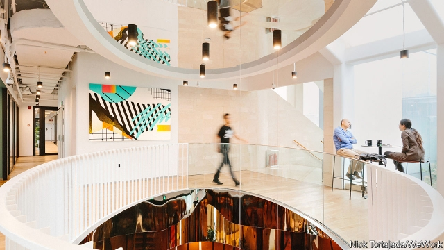
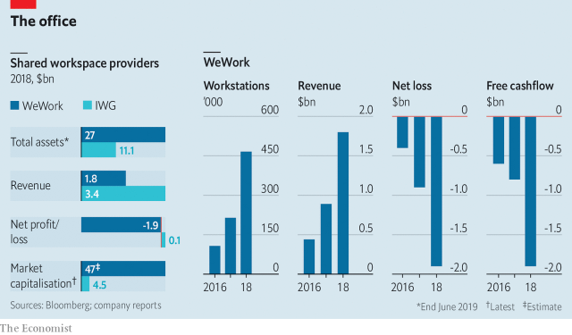

###### Risky business

# WeWork unveils its IPO prospectus 

 

> print-edition iconPrint edition | Business | Aug 15th 2019 

FAR FROM the soulless corporate offices of midtown Manhattan is a door in Greenwich Village wedged between a rowdy saloon and a burrito joint. The steady stream of hipsters and fashionistas passing in front of it is punctuated by professionals in “business casual” outfits with computer tote bags. Inside are stylish workspaces offering fruit-infused water and nitro coffee on tap. In one animated meeting, participants are sitting on beanbags and the floor. That would never happen at his firm’s conservative headquarters, says an executive at the technology giant that has leased this co-working space: “Younger workers want a more casual place to work, and WeWork helps us with recruitment and retention.” 

The We Company (WeWork’s parent), a nine-year-old privately held firm, is controversial. The company’s chic co-working spaces and its flamboyant boss, Adam Neumann, clearly inspire passion among many customers and workers. Japan’s SoftBank has invested over $10bn in the firm, boosting its valuation to $47bn. Equally passionate are its critics, who argue that the firm is worth nothing like that kind of money. They point to IWG, which offers shared offices under the Regus and Spaces brands worldwide and which has a market capitalisation of just $4.5bn (see chart). 

 

So what is WeWork really worth? At last, investors will get the chance to make up their own minds. On August 14th the company unveiled its financial prospectus, which is expected to lead to a public flotation next month. The disclosures paint a picture of a firm in transition from overhyped property startup to a maturing corporation with diverse clients. 

There are four main areas of concern about WeWork’s viability. The first, and most glaring, is its lack of profits. The firm argues that this is explained by its huge investments needed to secure economies of scale. It says that mature locations are profitable. Revenues doubled during the first half of 2019 to $1.5bn, from $764m during the same period in 2018. Net losses rose more modestly to $905m during the first half of this year, up from $723m (though one-off gains from related-party transactions partly explain this). 

The second concern is its obscene valuation. Happily, the firm is diversifying its funding sources. WeWork has reportedly arranged for some $6bn in credit facilities from ten banks, led by JPMorgan Chase, that are tied to the successful completion of its IPO. That gives Mr Neumann a strong incentive to swallow his pride and lower the asking price for its shares. 

The third concern is whether a recession will push the company to bankruptcy. This remains a risk, as the firm has taken on $47bn in lease payments but has only $4bn in committed future revenues from customers. Here, it has some hedges. Its leases are typically held in special-purpose entities specific to one property (so a blow-up insulates the parent firm). WeWork has entered into revenue-sharing leases with some landlords, which can offer countercyclical relief. Because it does its own construction, it can slow down the build-out of new offices as it did during London’s Brexit-induced downturn. 

More important, some 40% of its memberships are now held by big corporations, up from 20% a couple of years ago. These firms, which range from Amazon to HSBC, have deeper pockets and typically take out multi-year deals. Jeffrey Rayport of Harvard Business School argues that the firm’s combination of low cost, flexibility and thoughtfully curated culture is attractive to big firms: “We have not reinvented office space in 50 years, so WeWork is moving into white space,” he says. “It does make workers happier and more productive.” 

The final big worry is questionable corporate governance. WeWork will issue multiple classes of shares that give Mr Neumann control with a minority stake. He has a complex relationship with the firm because he leases space to it in buildings he owns, a practice it promises to end. His wife is a “strategic thought partner” and runs an unpromising education arm. Charles Elson, a governance expert at the University of Delaware, warns, “If you start with this culture, you can’t get rid of it.” 

Mr Neumann’s claim that his firm will “elevate the world’s consciousness” is plainly silly. Even so, it is wrong to equate WeWork with Regus. CBRE, a property-management firm, estimates that the flexible-work niche has experienced “meteoric growth” of 25% in America’s top ten markets in 2018, with similar figures in big cities worldwide. Mr Rayport believes that the firm’s business-model innovations have dramatically enlarged the total addressable market. Still, investing in WeWork remains an act of faith. ■ 

