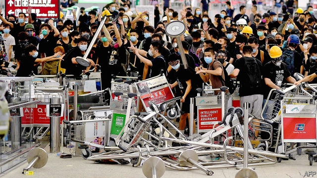

###### Sit-in, stand-off

# Is Hong Kong moving closer to the abyss that its leaders warn about? 

 

> print-edition iconPrint edition | China | Aug 17th 2019 

A TEN-WEEK-OLD political crisis in Hong Kong has taken a lurch for the worse. Flash-mob protests across the territory have led to a sharp increase in violence, with hardball tactics employed both by anti-government demonstrators and police. In an unprecedented move for Asia’s pre-eminent financial centre, the authorities shut down Hong Kong’s airport for two days in a row in response to large demonstrations there. The protests in the terminal culminated in ugly scenes that China was quick to describe as “terrorism”. 

The escalation has fuelled speculation about how China might respond. “If the situation gets worse, and turmoil occurs that the Hong Kong government is unable to control, the central government will not sit idly by,” the head of China’s Hong Kong affairs office, Zhang Xiaoming, had warned the previous week. The unrest does not yet appear impossible to contain using Hong Kong’s police, but China’s state media have broadcast footage of the mainland’s anti-riot forces manoeuvring on the border with the territory. The threat is clear. 

After three days of low-key protests at the airport, the mood changed on August 12th. Huge numbers massed at the terminal following an alleged case of police brutality, when a young woman appeared to have been shot in the eye with a beanbag round during a separate demonstration. The airport responded by cancelling outgoing flights and telling airlines not to take off for Hong Kong. Fearing that police were about to move in, most protesters left. 

The following day demonstrators returned, and flights were again cancelled. As the evening wore on, the mood grew nastier. Protesters cornered a man who they claimed was an undercover police officer from the mainland. The man fainted, yet protesters refused to give access to medics. Riot police eventually rescued him. During the operation one officer came under frenzied attack and drew his pistol. Demonstrators also assaulted another man, claiming he too was a mainland agent. Global Times, a mainland newspaper, said he was one of its reporters. 

During the second day of airport closure Carrie Lam, the territory’s chief executive, said the unrest had taken Hong Kong to the edge of an “abyss”. Yet she offered no guidance as to how she intends to walk the territory back, other than a reliance on police force to overawe the agitators. 

Protesters too show no sign of willingness to compromise. Their demonstrations were at first about a bill that would have allowed suspects in Hong Kong to be extradited to China. Now they want a complete withdrawal of the bill, not just the shelving of it that Mrs Lam has announced. They also demand an independent inquiry into the whole affair, including the police response. But they have set their sights much higher: Mrs Lam’s resignation and fully democratic elections—something China says it will not allow. 

Activists have called for another large-scale rally in central Hong Kong on August 18th. This will be a test of whether the public is growing weary of the violence and fearful of the Communist Party’s warnings. These have been growing ever more shrill. Party-controlled media have been churning out what they describe as evidence that the unrest has become a “colour revolution” and that foreign “black hands” are behind it (see Chaguan). 

All this smacks of an attempt by the central government to make a case for intervention by the Chinese army, which Hong Kong’s constitution allows. The party is surely mindful of the approach of an important date: October 1st, the 70th anniversary of Communist rule. For months it has been reminding officials around the country of the supreme importance of maintaining social stability in the build-up to this occasion—the party has been clamping down on dissent harder than ever. China’s leader, Xi Jinping, would be horrified by a massive protest in Hong Kong on that hallowed day. He may be wondering whether intervention sooner rather than later would be the best way of preventing one. In practice it has to be assumed that he is not itching to send in troops: doing so would have huge diplomatic and economic repercussions. For now, the threats are intended to intimidate. The order to loyal groups in Hong Kong is still to express confidence in Mrs Lam’s ability to handle this. 

One prong of China’s approach has become clearer: stern demands for business to fall into line. Cathay Pacific, Hong Kong’s home-grown airline, is the most obvious victim. Its parent, Swire Pacific, has roots in Hong Kong’s early colonial history. Many of its ground staff and cabin crew have taken part enthusiastically in marches; one pilot was even arrested for rioting. Only last week Cathay’s chairman said of the firm’s employees: “We certainly wouldn’t dream of telling them what they have to think about something.” 

The group’s tune has changed following relentless attacks by the Chinese government and state media for allegedly supporting the protesters. An online boycotting campaign against Cathay has garnered over 17m views. China has banned Cathay planes flying into the mainland from taking crew members who have joined illegal protests or “overly radical activities”. Since August 11th Cathay has had to submit the names of all crew before getting permission to fly. Now management says that any staff found to be participating in illegal protests will be fired (two pilots have been). A Swire statement condemning illegal actions and resolutely supporting Hong Kong’s government reads like a Communist Party declamation. Poor Cathay, its shares buffeted, now faces a possible boycott from angry Hong Kong democrats too. It is yet one more example of a hardening of lines. People in Hong Kong are coming under pressure to take sides. 

The hardening is evident on the front lines of the territory’s young demonstrators. For weeks, a legislator and social worker, Fernando Cheung, has acted as a mediator, attempting to de-escalate confrontations between protesters and police. He has had some success. But at the airport this week, Mr Cheung admits, both sides, swearing and yelling, “wanted to get rid of me as soon as possible”. The next steps in the crisis, he adds, “do not look pretty”. ■ 

