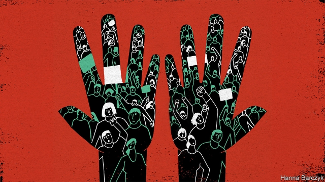

###### Chaguan

# Why Chinese officials imagine America is behind unrest in Hong Kong 

 

> print-edition iconPrint edition | China | Aug 17th 2019 

THERE IS SOMETHING depressing about the Chinese government’s claim that foreign “black hands” are behind the protests in Hong Kong. For the claim is both nonsensical and, in mainland China, widely believed. It is a fresh lesson in the power of disinformation to see decent, patriotic Chinese sharing tales of the CIA paying gullible Hong Kongers to join marches or smuggling in foreign rioters on late-night flights (a rumour sourced to a driver at Hong Kong airport, in the version that Chaguan heard). 

There is something positively alarming about signs that, at some level, Communist Party bosses believe the black-hands story. Neither evidence nor common sense supports the tale’s central charge that outsiders tricked or provoked as many as 2m Hong Kongers into joining marches. The accusations began while the protesters were still overwhelmingly peaceful, focused on a planned law that would send suspects from their city’s Western-style justice system into Communist-controlled mainland courts. To propagandists in Beijing, no free will has been marshalling those students and pensioners, doctors in hospital scrubs and black-suited lawyers, off-duty civil servants and parents with pushchairs. Instead the protesters are at best dupes, and at worst foreigner-loving race traitors, ashamed of being Chinese. 

The drumbeat has intensified as the demonstrations have grown more violent. Police and at least one mainland reporter have endured beatings by young radicals gripped by nihilistic rage. To objective analysts, the causes include protesters’ paranoia after days of police infiltration and brutality, and the lack of any further concessions by the government as rewards for pragmatism other than the shelving of the extradition bill. But grim-faced government spokesmen in Hong Kong and Beijing have another explanation. They accuse foreign forces, meaning America, of fomenting a Ukraine-style “colour revolution” to keep a rising China down. 

In late July Tung Chee-hwa, a shipping magnate and Hong Kong’s first chief executive under Chinese rule, called the “well-organised” protests evidence of “masterminds behind the storm”, with “various signs” pointing to America and Taiwan. Communist-controlled newspapers have made much of the handful of protesters who insist on carrying American and colonial-era Hong Kong flags on marches (which is arguably more foolish than sinister). They have shared images of a “foreign commander” directing protests by smartphone, who turned out to be a New York Times journalist texting colleagues. They have also published photographs of a meeting between pro-democracy leaders and Julie Eadeh, a diplomat at America’s consulate whose job is to talk to local politicians. One such newspaper, Takungpao, called Ms Eadeh “a person of mysterious status and an expert in low-key acts of subversion”. Given that Ms Eadeh met Hong Kong’s most famous democracy activists in a hotel lobby in broad daylight, either the tradecraft of American super-spies is slipping, or the party’s media define the term “mysterious” pretty loosely. 

Those accusing America of funding revolution in Hong Kong must also grapple with some logical objections. For one thing, the protests do not need much funding. Ordinary Hong Kongers have donated spare T-shirts to replace clothes soaked in pepper spray, and money to buy hard hats, face masks and McDonald’s vouchers for hungry youngsters. For another, stability and the status quo in Hong Kong serve American interests profitably and well. More American businesses operate in Hong Kong today than in 1997, when British colonial rule ended. Some of America’s largest corporations rely on the city’s open markets, transparent legal system, uncensored internet, modern transport links and business-friendly governance as they access China’s vast markets. It is true that congressional leaders have urged rulers in Beijing to avoid sending in troops to crush protests, and that senior American officials have recently hosted pro-democracy Hong Kongers. But America’s long-standing policy has been to lobby China to preserve the territory’s freedoms, not to seek a democratic revolution. As for President Donald Trump, he has dubbed the protests “riots”—the term used by Chinese officials—and said he has “ZERO doubt” that China’s leader, Xi Jinping, can “humanely solve the Hong Kong problem.” 

There are reasons why propagandists peddle the black-hands myth. For one thing, it works. After initially censoring news from Hong Kong, official outlets are full of videos showing protesters attacking police or hurling petrol bombs, over captions calling them splittists who want formal independence from China (in reality, a fringe position in Hong Kong). Many ordinary folk have heard little about the extradition law that sparked the protests. Chinese opinion is hardly monolithic, but it is not hard to find netizens impatient to see snooty, ungrateful Hong Kongers crushed. 

Most worrying, China’s rulers are betraying a bleak and cynical worldview in which might is right and the big always dominate the small. To them, it is not conceivable that 7.3m Hong Kongers could believe that their individual, universal rights trump the will of 1.4bn compatriots. If tiny Hong Kong is defying its mighty Motherland, another great power must be egging it on. 

When the British government defends Hong Kong’s freedoms, Chinese officials are sure that Britain is still sulking about its loss of empire—and will pipe down once Brexit renders it friendless. Other Western envoys in Beijing have been lectured that their support for Hong Kong must be part of a concerted push by American hawks to hurt China. Suggest that Western countries might occasionally be guided by principle and Chinese officials scoff. 

Their cynicism is self-serving, of course, as it handily shifts blame for the mistrust the party inspires in Hong Kong. But it also clouds China’s vision of the world at a perilous moment. Some propaganda is laughable and tragic at the same time. ■ 

-- 

 单词注释:

1.hong[hɔŋ]:n. （中国、日本的）行, 商行 

2.kong[kɔŋ]:n. 含锡砾石下的无矿基岩；钢 

3.Aug[]:abbr. 八月（August） 

4.depressing[di'presiŋ]:a. 抑压的, 沉闷的, 阴沉的 

5.nonsensical[nɒn'sensikl]:a. 无意义的, 荒谬的 

6.disinformation[.disinfә'meiʃәn]:n. 假情报 

7.patriotic[.peitri'ɒtik]:a. 爱国的, 有爱国心的 [法] 爱国的, 有爱国心的 

8.CIA[]:中央情报局 [计] 中国互联网络协会 

9.gullible['gʌlibl]:a. 易受骗的 [法] 易受骗的, 轻信的 

10.smuggle['smʌgl]:vt. 偷运, 走私, 私运 vi. 走私 

11.rioter['raiәtә]:n. 暴民, 暴徒, 纵情享乐者 [法] 暴徒, 骚乱者, 暴动者 

12.positively[]:adv. 明确地, 肯定地, 无疑地, (非正式)确实地, 真正地 

13.outsider[' aut'saidә]:n. 外人, 局外人, 非会员, 外行, 门外汉, 比赛中获胜可能性不大的选手 [经] 外船公司 

14.provoke[prә'vәuk]:vt. 激怒, 惹起, 诱导 [法] 刺激, 煽动, 激怒 

15.accusation[ækju:'zeiʃәn]:n. 控告, 指控, 指责 [法] 控告, 起诉, 告发 

16.protester[]:n. 抗议者, 持异议者, 拒付者 [经] 反对者 

17.overwhelmingly[.әuvә'hwelmiŋli]:adv. 压倒性地, 不可抵抗地 

18.propagandist[.prɒpә'gændist]:n. 宣传者 a. 宣传的, 宣传者的 

19.marshal['mɑ:ʃәl]:n. 元帅, 陆空军高级将官, 典礼官, 执法官 vt. 整理, 引领, 统率 vi. 排列, 各就各位 

20.pensioner['penʃәnә(r)]:n. 领取抚恤金者, (英国剑桥大学的)自费生, 为金钱所收买的人, 帮佣 [法] 领取退休金者, 领取抚恤金者 

21.scrub[skrʌb]:n. 用力擦洗, 矮树, 矮人, 渺小之物 vt. 用力擦洗, 擦掉, 摩擦 vi. 擦洗干净, 进行手臂消毒 a. 次等的, 矮小的, 非正规球队的, 临时凑合的 

22.pushchair['puʃtʃєә]:n. 折叠式婴儿车 

23.dupe[dju:p]:n. 傻瓜, 易受骗的人 vt. 欺骗, 愚弄 

24.drumbeat['drʌmbi:t]:n. 鼓声 

25.intensify[in'tensifai]:vt. 加强 vi. 强化 

26.demonstration[.demәn'streiʃәn]:n. 示范, 实证 [医] 示教, 实物教授 

27.beating['bi:tiŋ]:n. 打, 挫败, 搏动 [化] 打浆 

28.nihilistic[.naii'listik]:a. 虚无主义的, 无政府主义的 

29.analyst['ænәlist]:n. 分析者, 精神分析学家 [化] 分析员; 化验员 

30.paranoia[.pærә'nɒiә]:n. 偏执狂, 多疑症 [法] 妄想狂, 偏执狂 

31.infiltration[.infil'treiʃәn]:n. 渗入, 渗透, 渗透物 [化] 渗滤; 渗入过滤; 渗透; 渗入 

32.brutality[bru:'tæliti]:n. 残忍, 无慈悲, 野蛮的行为 

33.concession[kәn'seʃәn]:n. 特许, 让步, 认可 [经] 核准, 许可, 特殊(权) 

34.pragmatism['prægmәtizm]:n. 实用主义 [法] 实用主义, 干涉主义, 独断 

35.shelve[ʃelv]:vt. 放置架子上, 搁置 vi. 渐渐倾斜 

36.extradition[.ekstrә'diʃәn]:n. 引渡逃犯, 亡命者送还本国 [法] 引渡 

37.spokesman['spәuksmәn]:n. 发言人, 代言者 

38.foment[fәu'ment]:vt. 热敷, 煽动 

39.tung[tʌŋ]:n. 油桐 

40.magnate['mægneit]:n. 大官, 巨头 [法] 大官, 权贵, 大资本家 

41.mastermind['mɑ:stәmaind]:n. 优秀策划者, 才子 vt. 指导, 主持, 策划 

42.taiwan['tai'wɑ:n]:n. 台湾 

43.arguably['ɑ:ɡjuәbli]:adv. 可论证地；可争辩地；正如可提出证据加以证明的那样地 

44.sinister['sinistә]:a. 不吉利的, 凶恶的, 左边的 [医] 左的 

45.smartphone[]:n. 智能手机 

46.york[jɔ:k]:n. 约克郡；约克王朝 

47.texting[]:n. 发短信 

48.julie[]:n. 朱莉（女子名） 

49.diplomat['diplәmæt]:n. 外交官, 有外交手腕的人 [法] 外交家, 外交官, 有权谋的人 

50.consulate['kɒnsjulit]:n. 领事, 领事任期, 领事馆 [经] 领事馆 

51.statu[]:[网络] 状态查看；雕像；特级雪花白 

52.subversion[sәb'vә:ʃәn]:n. 颠覆, 打倒, 破坏 [法] 颠覆, 死亡, 败坏 

53.activist['æktivist]:n. 激进主义分子 

54.lobby['lɒbi]:n. 大厅, 休息室, 游说议员者 vi. 游说议员, 游说 vt. 游说 

55.tradecraft['tredkræft]: 谍报技术 

56.loosely['lu:sli]:adv. 松弛地, 宽松地, 不紧 

57.grapple[græpl]:v. 抓住, 掌握 n. 抓住, 系紧, 掌握, 与...扭打 

58.donate['dәuneit]:v. 捐赠 

59.voucher['vautʃә]:n. 证人, 保证人, 证明者, 凭证, 凭单 vt. 证实...的可靠性 

60.quo[]:vt. [古]说 

61.profitably['prɒfitәbli]:adv. 有利地, 有益地 

62.colonial[kә'lәunjәl]:a. 殖民的, 殖民地的 [法] 殖民地居民 

63.uncensored[.ʌn'sensәd]:a. 未经审查的, 无保留的 

64.governance['gʌvәnәns]:n. 统治, 统辖, 管理 [法] 统治, 管理, 支配 

65.congressional[kәn'greʃәnl]:a. 会议的, 议会的, 国会的 [法] 代表大会的, 大会的, 议会的 

66.dub[dʌb]:vt. 配音, 轻点, 授予称号, 击 n. 一下击鼓声, 笨蛋 

67.humanely[hju:'meɪnlɪ]:adv. 仁慈地; 人道地; 富人情地; 慈悲地 

68.peddle['pedl]:vi. 挑卖, 沿街叫卖, 游荡, 闲混 vt. 叫卖, 兜售, 散播 

69.myth[miθ]:n. 神话, 虚构的事, 虚构的人 

70.initially[i'niʃәli]:adv. 最初, 开头 

71.hurl[hә:l]:n. 用力的投掷 vt. 用力投掷, 发射, 愤慨地说出, 丢下 vi. 猛投, 猛掷 

72.splittist[sp'lɪtɪst]: 分裂主义分子 

73.fringe[frindʒ]:n. 边缘, 端, 流苏, 穗, 初步 vt. 加穗于, 加饰边于 a. 边缘的, 附加的 

74.monolithic[.mɒnәu'liθik]:a. 独石的, 完全统一的, 整体的 [化] 整体(铸,烧结)的; 龟甲网衬里; 单片; 单块 

75.netizens[nə'taɪzənz]:abbr. Internet citizens 网络公民 

76.snooty['snu:ti]:a. 傲慢的, 自大自满的, 鄙视别人的 

77.ungrateful[.ʌn'greitful]:a. 忘恩负义的, 使人不愉快的, 徒劳的, 讨厌的 

78.bleak[bli:k]:a. 萧瑟的, 荒凉的, 阴冷的 

79.cynical['sinikәl]:a. 愤世嫉俗的, 讽刺的, 冷嘲的 

80.worldview['wɜ:ldvju:]:n. 看; 视力; 观点; 目的 

81.alway['ɔ:lwei]:adv. 永远；总是（等于always） 

82.conceivable[kәn'si:vәbl]:a. 想得到的, 可想象的, 可理解的 

83.compatriot[kәm'pætriәt]:n. 同国人 a. 同国的, 同胞的 

84.defy[di'fai]:vt. 藐视, 挑衅, 使落空 n. 挑战 

85.mighty['maiti]:n. 有势力的人 a. 有势力的, 强大的, 有力的 adv. 很, 极 

86.eg[]:abbr. [拉]例如（exempli gratia）；[网络用语]邪恶的笑（Evil Grin） 

87.sulk[sʌlk]:n. 闹情绪, 闷闷不乐 vi. 不高兴, 闷闷不乐, 不悦, 生气, 愠怒 

88.Brexit[]:[网络] 英国退出欧盟 

89.friendless['frendlis]:a. 没有朋友的, 无依无靠的 

90.envoy['envɒi]:n. 外交使节, 特使 [法] 使者, 代表, 使节 

91.concerted[kәn'sә:tid]:a. 商定的, 协定的, 一致的 [法] 一致的, 协力的, 共同的 

92.scoff[skɒf]:n. 嘲笑, 愚弄, 笑柄, 食品 v. 嘲笑, 嘲弄, 贪吃, 狼吞虎咽地吃 

93.cynicism['sinisizm]:n. 犬儒主义 

94.handily['hændili]:adv. 巧妙地, 敏捷地, 便利地 

95.mistrust[.mis'trʌst]:n. 不信任, 疑惑 v. 不信任, 疑惑 

96.perilous['perilәs]:a. 危险的, 濒临毁灭的 

97.propaganda[.prɒpә'gændә]:n. 宣传, 宣传活动 [医] 宣传 

98.laughable['lɑ:fәbl]:a. 可笑的, 有趣的 

99.tragic['trædʒik]:a. 悲惨的, 悲剧的 

