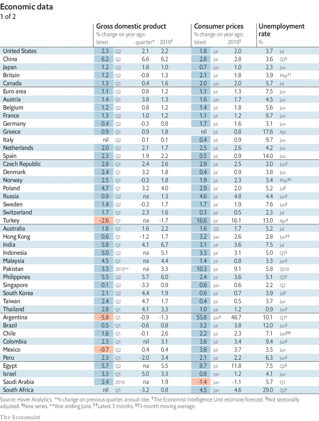
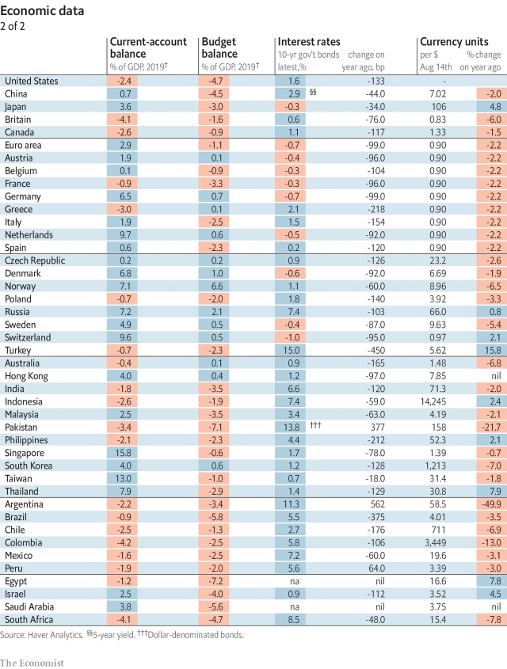
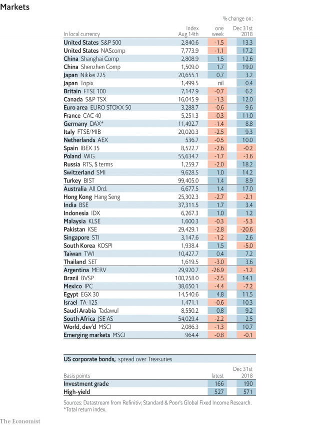
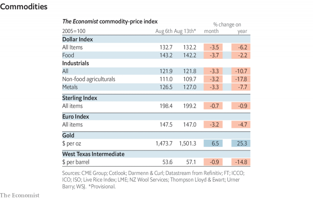

###### The world economy

# Economic data, commodities and markets 

> Aug 15th 2019 

 

 

 

 

-- 

 单词注释:

1.datum['deitәm]:n. 论据, 材料, 资料, 已知数 [医] 材料, 资料, 论据 

2.commodity[kә'mɒditi]:n. 农产品, 商品, 有用的物品 [经] 商品, 货物, 日用品 

3.Aug[]:abbr. 八月（August） 

