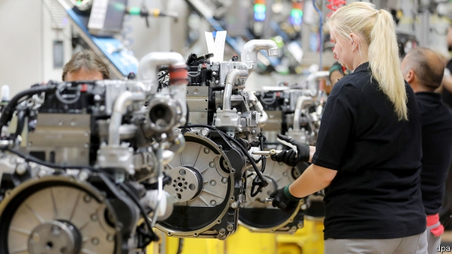

###### Becalmed

# Germany’s economy is now shrinking 

 

> print-edition iconPrint edition | Europe | Aug 15th 2019 

THE MOOD music had grown so ominous that the shock was somewhat muted. After weeks of dismal survey and industrial-output numbers, it was little surprise to learn on August 14th that Germany’s GDP had contracted by 0.1% in the second quarter of 2019 compared with the previous three months. The economy has been essentially flat over the past year. Household spending, bolstered by wage growth in a tight labour market, has held up but the slump in manufacturing, which represents over one-fifth of output, is deepening. Companies are cutting work hours and issuing profit warnings. Many analysts think Germany is heading for outright recession. 

This has triggered two debates. First, are Germany’s woes home-made or imported? A year-on-year 8% slump in exports appears to be the main driver of the slowdown. The uncertainty spawned by the US-China trade spat and the prospect of a no-deal Brexit are largely out of the hands of Angela Merkel’s government. Demand for German products in China is slowing. Germany will be badly hurt if Donald Trump follows through on his threat to whack tariffs on car imports later this year. 

Yet this is only half the story. Analysts have long urged Germany to wean itself off its export-dependence. Despite a mild rebalancing, the current-account surplus still stands at a whopping 7.4% of GDP in the world’s fourth-largest economy. Coddled by government, the automotive industry, which runs a larger trade surplus than any other export sector, has been slow to adjust to the rise of electric and autonomous cars. Politicians, from Mrs Merkel down, have done too little to ready an ageing society for challenges like digitisation. Every euro-zone economy is buffeted by headwinds, but so far Germany’s is the only one to have contracted in the past quarter. 

A second discussion is raging over the German government’s steadfast aversion to borrowing. The “debt brake”, enshrined in the constitution since 2009, rules out borrowing to finance the structural deficit beyond 0.35% of GDP. A related political commitment, the schwarze Null (“black zero”), pledges a balanced budget for current spending. This has ensured low debt and, since 2014, a surplus that last year stood at 1.7% of GDP, or €58bn ($66bn). Germany has thus been able to raise spending on infrastructure, social security and defence without extra borrowing. Yet as the euro zone’s largest economy grinds to a halt, the debate over whether to open the spigots further is gathering pace. 

So far the government remains unmoved. But Sebastian Dullien, director of the IMK research institute in Düsseldorf, says the pressure will increase. Reuters recently reported that a climate-change package due next month might include a pledge to issue fresh debt. This week Mrs Merkel said her commitment to a balanced budget remains intact, but added: “We will react depending on the situation.” Inside the finance ministry a lively debate has begun over how and whether to raise investment—although the minister himself, Olaf Scholz, remains cautious, to the disappointment of many in his Social Democratic Party (the junior coalition partner to Mrs Merkel’s Christian Democrats). Outside government the Greens are urging a massive boost to investment in climate protection. The government’s budgetary rules are “voodoo fiscal policy”, said Robert Habeck, the party’s co-leader, this week. 

A short-term bump in spending, as Mrs Merkel argues, would rub up against bottlenecks in areas like construction. Nor would it help remove the pall of uncertainty facing German firms. So some analysts want a credible, possibly cross-party, commitment to establish a fund that would disburse several hundred billion euros over the next decade. Possible targets include transport infrastructure, broadband networks, house building and help for local governments struggling under debt loads. Other ideas include cutting taxes on Germany’s army of low-paid workers or its corporations, or introducing incentives for climate-friendly policies like retrofitting buildings and clean fuel. 

There could hardly be a better time. Yields on 30-year government bonds are negative, meaning in effect that investors pay the government for the privilege of lending it money. Even if the European Central Bank cuts rates further next month, the monetary toolbox is nearly exhausted. Tax cuts and, in time, investment in infrastructure would help rebalance the German economy from its exports-first approach. Mrs Merkel, now in the twilight of her chancellorship, has U-turned before, notes Mr Dullien. But the headwinds may need to blow a little harder first. ■ 

-- 

 单词注释:

1.becalm[bi'kɑ:m]:vt. 使安静, 因无风而使停航 

2.Aug[]:abbr. 八月（August） 

3.ominous['ɒminәs]:a. 恶兆的, 不吉利的, 预兆的 

4.dismal['dizmәl]:a. 阴沉的, 凄凉的, 令人忧郁的 n. 低落的情绪, 沼泽 

5.essentially[i'senʃәli]:adv. 本质上, 本来 

6.bolster['bәulstә]:n. 支持, 长枕 vt. 支持, 支撑 

7.slump[slʌmp]:n. 暴跌, 垂头弯腰的姿态 vi. 猛然掉落, 陷入, 衰落(经济等) 

8.manufacturing[.mænju'fæktʃәriŋ]:n. 制造业 a. 制造业的 

9.analyst['ænәlist]:n. 分析者, 精神分析学家 [化] 分析员; 化验员 

10.outright['autrait]:a. 率直的, 完全的, 总共的, 直率的 adv. 完全地, 率直地, 立刻地, 一直向前 

11.recession[ri'seʃәn]:n. 后退, 凹处, 衰退, 归还 [医] 退缩 

12.trigger['trigә]:n. 触发器, 扳机 vt. 触发, 发射, 引起 vi. 松开扳柄 [计] 切换开关 

13.woe[wәu]:n. 悲哀, 悲痛, 苦痛 

14.slowdown['slәudaun]:n. 降低速度, 减速 

15.uncertainty[.ʌn'sә:tnti]:n. 不确定, 不可靠, 不确定的事物 [化] 不确定度 

16.spawn[spɒ:n]:n. (鱼)卵, 产物 vt. 产卵, 酿成, 大量生产 vi. 产卵, 大量生产 

17.Brexit[]:[网络] 英国退出欧盟 

18.angela['ændʒilә]:n. 安吉拉（女子名） 

19.whack[hwæk]:vt. 猛击, 重打, 削减 vi. 重击 n. 重击, 重打 

20.tariff['tærif]:n. 关税, 关税表, 价格表, 收费表 vt. 课以关税 [计] 价目表 

21.wean[wi:n]:vt. 使断奶, 使丢弃, 使断念 n. 小儿 

22.rebalance[re'bæləns]: 再平衡 

23.whop[hwɒp]:v. 打, 抽出, 打败, 征服 n. 重击, 打击声 

24.coddle['kɒdl]:vt. 娇养, 溺爱, 用文火煮(蛋) 

25.automotive[.ɒ:tәu'mәutiv]:a. 汽车的 

26.sector['sektә]:n. 扇形, 部门, 部分, 函数尺, 象限仪, 段, 区段 vt. 把...分成扇形 [计] 扇面; 扇区; 段; 区段 

27.Mr['mistә(r)]:先生 [计] 存储器回收程序, 多重请求 

28.merkel[]: [人名] 默克尔; [地名] [美国] 默克尔 

29.digitisation[]:[计] 数字化 

30.headwind[]:n. 逆风, 顶风 

31.steadfast['stedfәst]:a. 坚定的, 踏实的, 固定的, 不变的 

32.aversion[ә'vә:ʃәn]:n. 厌恶, 讨厌的事, 讨厌的人 [医] 厌恶, 移转, 移位 

33.enshrine[in'ʃrain]:vt. 入庙祀奉, 铭记 

34.deficit['defisit]:n. 赤字, 不足额 [医] 短缺 

35.schwarze[]:n. (Schwarze)人名；(德、瑞典)施瓦策 

36.null[nʌl]:a. 无效力的, 无效的, 无价值的 n. 零, 空, 零位 [计] 空 

37.pledge[pledʒ]:n. 诺言, 保证, 誓言, 抵押, 信物, 保人, 祝愿 vt. 许诺, 保证, 使发誓, 抵押, 典当, 举杯祝...健康 

38.infrastructure['infrәstrʌktʃә]:n. 基础结构, 基础设施 [经] 基础设施 

39.euro['juәrәu]:n. 欧元（欧盟的统一货币单位） 

40.spigot['spigәt]:n. 栓, 嘴, 龙头, (管子的)插端 [机] 插口 

41.unmoved[.ʌn'mu:vd]:a. 没有动过的, 不动摇的, 坚决的, 冷静的 

42.sebastian[si:'bæstjәn]:n. 塞巴斯蒂安（男子名） 

43.IMK[]:abbr. Identification Mark 识别符号 

44.Düsseldorf[]:[地名] 杜塞尔多夫 ( 德 ) 

45.Reuter['rɔitә]:n. 路透社, 路透通讯社 

46.intact[in'tækt]:a. 尚未被人碰过的, 原封不动的, 完整的 [医] 完整的, 无伤的 

47.olaf['әulәf, 'ɔl-]:n. 奥拉夫（男子名） 

48.scholz[]:n. (Scholz)人名；(瑞典)斯科尔茨；(英)肖尔茨 

49.coalition[.kәuә'liʃәn]:n. 结合体, 结合, 联合 [经] 联合, 联盟 

50.democrat['demәkræt]:n. 民主人士, 民主主义者, 民主党党员 [经] 民主党 

51.budgetary['bʌdʒitәri]:a. 预算的 [法] 预算的 

52.voodoo['vu:du:]:n. 伏都教, 巫术, 巫术信仰 

53.fiscal['fiskәl]:a. 财政的, 国库的 [经] 财政上的, 会计的, 国库的 

54.Robert['rɔbәt]:[法] 警察 

55.habeck[]:哈贝克 

56.bump[bʌmp]:n. 撞击, 肿块 vt. 碰撞 vi. 撞, 颠簸而行 

57.bottleneck['bɒtlnek]:n. 瓶颈 [经] 瓶颈, 增产障碍 

58.pall[pɒ:l]:n. 棺罩, 柩衣, 遮盖物 vi. 失去吸引力, 乏味 vt. 覆盖, 使笼罩阴影, 使乏味 

59.credible['kredәbl]:a. 可信的, 可靠的 [法] 可信的, 可靠的 

60.disburse[dis'bә:s]:vt. 支付, 支出, 分配 [经] 支付, 支出, 偿付 

61.broadband['brɔ:dbænd]:[计] 宽带 

62.incentive[in'sentiv]:n. 动机 a. 激励的 

63.retrofit['retrә,fit]:n. 式样翻新 vt.vi. 式样翻新 [计] 更新; 改进 

64.investor[in'vestә]:n. 投资者 [经] 投资者 

65.monetary['mʌnitәri]:a. 货币的, 金钱的 [经] 货币的, 金融的 

66.toolbox['tu:lbɒks]:n. 工具箱 [计] 工具箱 

67.twilight['twailait]:n. 暮光, 曙光, 黎明, 黄昏, 微光, 朦胧状态 a. 微明的 

68.chancellorship[t'ʃɑ:nsələʃɪp]:n. 长官的职位或任期 

