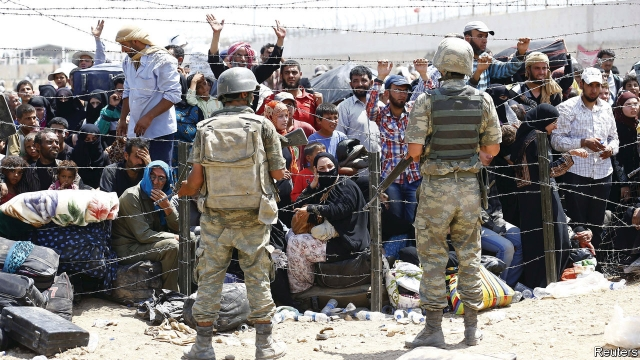

###### Young, evicted and back

# How Turkey deals with returning Islamic State fighters 

 

> print-edition iconPrint edition | Europe | Aug 17th 2019 

SUHEYLA REMEMBERS the day clearly. She had invited her children for dinner and was preparing her youngest son’s favourite stew. He never showed up. Neither did her four daughters. When none of them picked up the phone, she and her husband Lutfu understood what was happening. They rushed to a police station to ask the authorities to track down their children: they were headed south. A month later one of Suheyla’s daughters called. She and her siblings, the youngest 18 and the eldest 27, along with her brother’s wife and their infant son, had smuggled themselves into Syria and joined Islamic State (IS). 

That was in late 2015. Today, three of the daughters are behind bars in Baghdad, having been captured by Iraqi forces two years ago. The fourth died in jail, two months after giving birth to a boy. Their brother, Yasin, has not been heard from in two years. Earlier this summer, Suheyla and Lutfu (not their real names) were united with two of their grandchildren, aged one and two, who were repatriated from Iraq. The toddlers were ill when they arrived. One was covered with sores, having caught scabies in the squalid prison in which he was born. He survived on his aunt’s milk. 

At their apartment in Esenler, a conservative district in Istanbul, Suheyla fights back tears as she flicks through photos of her daughters on her phone. Like their parents, they were good, devout Muslims, she recalls, but they were not zealots. Their parents do not know how they were radicalised, but in a month they had transformed beyond recognition. Her daughters swapped their headscarves for shapeless black niqabs. Her son grew a beard. They began to praise the murderous caliphate that IS had founded in parts of Iraq and Syria. “You could not reason with them,” says Lutfu. “It was like a disease.” 

Since the war in Syria began, at least 2,000 Turks are said to have joined the thousands of foreign jihadists who poured across Turkey’s southern border to fight alongside IS or al-Qaeda. Hundreds died on the battlefield. Some carried out suicide bombings at home. During a terrifying spell between 2015 and early 2017, at least 300 people died in a dozen IS attacks across Turkey. Most of the bombers were Turks. According to officials, about 500 home-grown IS supporters are in prison in Turkey, in addition to some 700 foreigners. Hundreds of Turkish women who joined the group, including Suheyla’s daughters, are held in Baghdad. Some fighters sneaked into Turkey as the caliphate began to collapse. Turkey must now come to grips with those militants, both domestic and foreign, who have returned from Iraq and Syria, and those planning to do so. 

Belatedly, the country has begun to focus on prevention and rehabilitation. The government has organised seminars for Turkish and refugee children, to inoculate them against IS propaganda. The religious affairs directorate, which oversees the teaching of Islam, has trained 70 prison chaplains to work with religious extremists. The programme has enjoyed a measure of success. A pair of young sisters who pledged allegiance to IS, and then refused to be tried by a Turkish court, recanted after sessions with a female chaplain. They were released. Prison officials say they make a point of keeping IS supporters away from each other, and from other inmates. That is easier said than done. A massive and often indiscriminate crackdown following a violent coup attempt in 2016 has left the prisons more overcrowded than ever, leaving some 30,000 people behind bars. And some of those who came back from Syria were never picked up in the first place. 

Turkey is getting some things right. Since the terror campaign of 2015-2017, the bombings have stopped. Officials credit improved co-ordination between agencies, as well as a sweeping purge of state institutions directed against members of the Gulen movement, an Islamic fraternity accused of spearheading the 2016 coup. Analysts say it took time for police and intelligence forces to infiltrate IS networks. 

A wall constructed over stretches of the border and a military operation against IS strongholds in northern Syria have helped, making it harder for bombers to slip into Turkey. It is not for want of trying. Turkish police say they have foiled at least 28 large attacks since 2014, including a planned massacre at a shopping mall in Istanbul. 

The threat the authorities now have to contend with is the exodus from Syria. Their caliphate smashed to pieces by Kurdish fighters and American air strikes, scores of IS fighters have escaped to Iraq. But the group also seems keen to expand its underground network in Turkey. “Three years ago, we were chasing terrorists who were about to blow themselves up,” says a counter-terrorism official. “Now we’re doing operations to disrupt their logistics and prevent IS financing from entering.” 

Turkey once accused Western governments of neglecting to share intelligence about militants, making it hard to stop them at Turkish airports. Now it says they are trying to dump them on Turkey. According to officials, 775 suspected foreign fighters are being held at deportation centres, waiting to be sent home. Most have destroyed their old passports. Their consulates, however, are often slow to provide them with new travel documents, which delays or prevents deportation. Four have been stripped of citizenship, making repatriation impossible. Because they can only be held without charge for 12 months, they can expect to be set free. “If there’s no hard evidence against them, you cannot detain them or open a case,” says an official. “It’s a recipe for complete chaos.” 

Turkey insists IS members must face trial in their own countries. Suheyla and Lutfu hope President Recep Tayyip Erdogan’s government will apply the same logic to its own citizens, namely their daughters. “They left after you opened the borders,” she says, as her grandson crawls onto her lap, his legs dotted with scars. “Now bring them back. Sentence them to life or to death if you like, but do so in Turkey.” ■ 

-- 

 单词注释:

1.evict[i'vikt]:vt. 逐出, 赶出, 驱逐 [法] 逐出, 驱逐, 没收 

2.Islamic[iz'læmik]:a. 伊斯兰教的, 穆斯林的 

3.Aug[]:abbr. 八月（August） 

4.stew[stju:]:n. 炖, 烦恼, 热浴, 妓院, 鱼塘 vi. 炖, 焖, 忧虑 vt. 炖, 焖, 使焦虑 

5.sibling['sibliŋ]:n. 兄弟, 同胞 [医] 同胞(兄弟姐妹) 

6.eldest['eldist]:a. 最年长的, 排行中第一的 n. 最年长者, 排行中第一者 

7.smuggle['smʌgl]:vt. 偷运, 走私, 私运 vi. 走私 

8.Syria['siriә]:n. 叙利亚 [经] 叙利亚 

9.Baghdad['bægdæd]:n. 巴格达 

10.Iraqi[i'rɑ:ki]:n. 伊拉克人, 伊拉克阿拉伯语 a. 伊拉克的, 伊拉克人的 

11.yasin[]: [地名] [克什米尔（地区）] 亚辛 

12.repatriate[ri:'pætrieit]:vt. 把...遣返 vi. 回国 n. 被遣返回国者 

13.Iraq[i'rɑ:k]:n. 伊拉克 

14.toddler['tɔdlә]:n. 蹒跚行走的人, 学步的小孩, 学步的幼儿, (非正式)信步走的人 

15.scaby[]:[网络] 扫气旁通系统；扫气旁通增压 

16.squalid['skwɒlid]:a. 污秽的, 肮脏的, 悲惨的, 可怜的, 卑劣的 

17.Istanbul[.istæn'bu:l]:n. 伊斯坦布尔 

18.flick[flik]:n. 快速的轻打, 轻打声, 弹开 v. 轻弹, 轻轻拂去, 忽然摇动 

19.devout[di'vaut]:a. 虔诚的, 虔敬的, 诚恳的 

20.Muslim['mjzlim; (?@) 'mʌzlem]:n. 伊斯兰教, 伊斯兰教教徒 

21.zealot['zelәt]:n. 热心者, 狂热者, 犹太教狂热信徒 [法] 狂热分子, 激烈分子 

22.radicalise['rædikəlaiz]:vt. 使激进（等于radicalize） vi. 变得激进（等于radicalize） 

23.headscarf[ˈhedskɑ:f]:n. 女人的头巾 

24.shapeless['ʃeiplis]:a. 无形状的, 不定形的, 破相的, 不象样的, 不匀称的 

25.niqab[nɪ'kɑ:b]:n. 尼卡布（一些穆斯林妇女在公共场合戴的面纱，通常露出眼睛） [网络] 罩袍；尼卡帛；尼卡布面纱 

26.murderous['mә:dәrәs]:a. 凶狠的, 杀人的, 致命的 [法] 谋杀的, 杀人的, 残酷的 

27.caliphate['kælifeit]:n. 伊斯兰教国王的职权或其领域 

28.Turk[tә:k]:n. 土耳其人, 土耳其马 

29.jihadist[]:n. 伊斯兰圣战士 

30.battlefield['bætlfi:ld]:n. 战场, 沙场 

31.suicide['sjuisaid]:n. 自杀, 自杀者 v. 自杀 a. 自杀的 

32.bombing['bɔmiŋ]:n. 轰炸, 投弹 

33.bomber['bɒmә]:n. 轰炸机, 投弹手 

34.supporter[sә'pɒ:tә]:n. 支持者, 后盾, 迫随者, 护身织物 [法] 支持者, 赡养者, 抚养者 

35.Turkish['tә:kiʃ]:n. 土耳其语 a. 土耳其的, 土耳其人的, 土耳其语的 

36.sneak[sni:k]:vi. 鬼鬼祟祟做事 vt. 偷偷地做 n. 鬼鬼祟祟的人, 偷偷摸摸的行为, 帆布胶底运动鞋 a. 暗中进行的 

37.militant['militәnt]:a. 好战的 

38.belatedly[bi'leitidli]:adv. 延迟地；延续地 

39.prevention[pri'venʃәn]:n. 阻止, 妨碍, 预防 [医] 预防 

40.rehabilitation['ri:(h)ә,bili'teiʃәn]:n. 复原 [医] 复原, 恢复, 康复 

41.refugee[.refju'dʒi:]:n. 难民, 流亡者 [法] 避难者, 流亡者, 难民 

42.inoculate[i'nɒkjuleit]:vt. 接种, 嫁接 [医] 接种 

43.propaganda[.prɒpә'gændә]:n. 宣传, 宣传活动 [医] 宣传 

44.directorate[di'rektәrit]:n. 理事之职务, 董事会, 理事会 [经] 董事会 

45.oversee[.әuvә'si:]:vt. 向下看, 了望, 监督, 偷看到 [法] 监察, 监督, 俯瞰 

46.Islam['izlɑ:m]:n. 伊斯兰教 

47.chaplain['tʃæplin]:n. 牧师 

48.extremist[iks'tri:mist]:[经] 偏激份子 

49.pledge[pledʒ]:n. 诺言, 保证, 誓言, 抵押, 信物, 保人, 祝愿 vt. 许诺, 保证, 使发誓, 抵押, 典当, 举杯祝...健康 

50.allegiance[ә'li:dʒәns]:n. 忠贞, 效忠 

51.recant[ri'kænt]:vt. 放弃 vi. 放弃信仰, 撤回声明, 公开认错 

52.inmate['inmeit]:n. 同住者, 被收容者 [法] 内部的, 接近中心的, 内在的 

53.indiscriminate[.indis'kriminit]:a. 无差别的, 任意的, 杂乱的 [医] 无差别的, 普遍的 

54.crackdown['krækdaun]:n. 制裁, 镇压, 痛击 

55.coup['ku:]:n. 砰然的一击, 妙计, 出乎意料的行动, 政变 [医] 发作, 中, 击 

56.overcrowd[.әuvә'kraud]:vt. 容纳过多的人, 使过度拥挤 

57.purge[pә:dʒ]:n. 净化, 清除, 泻药 v. (使)净化, 清除, (使)通便 [计] 服务器文件删除实用程序 

58.gulen[]:[网络] 居伦；葛兰 

59.fraternity[frә'tә:niti]:n. 友爱, 互助会, 大学生联谊会 

60.spearhead['spiәhed]:n. 矛尖, 先锋队, 先头部队 vt. 做先锋, 带头 

61.analyst['ænәlist]:n. 分析者, 精神分析学家 [化] 分析员; 化验员 

62.infiltrate[in'filtreit]:vt. 使浸润, 使潜入, 使渗入 vi. 渗入 n. 渗透物 

63.stronghold['strɒŋhәuld]:n. 要塞, 堡垒, 大本营 

64.foil[fɒil]:n. 箔, 烘托, 衬托 vt. 贴箔于, 衬托, 阻止, 挡开, 挫败 

65.massacre['mæsәkә]:n. 大屠杀 vt. 大屠杀, 残杀 

66.mall[mɔ:l]:n. 林荫路 

67.contend[kәn'tend]:vi. 奋斗, 斗争, 竞争 vt. 为...斗争 

68.exodus['eksәdәs]:n. 大批的离去 [法] 退出, 大批离去, 成一外出 

69.Kurdish['kә:diʃ]:a. 库尔德人的 n. 库尔德语 

70.terrorist['terәrist]:n. 恐怖分子 [法] 恐怖份子, 恐怖主义 

71.disrupt[dis'rʌpt]:a. 分裂的, 中断的 vt. 使分裂, 使瓦解 

72.logistic[lәu'dʒistik]:a. 逻辑的, 后勤学的 

73.deportation[.di:pɒ:'teiʃәn]:n. 驱逐出境, 放逐 [法] 递解出境, 放逐, 驱逐 

74.consulate['kɒnsjulit]:n. 领事, 领事任期, 领事馆 [经] 领事馆 

75.citizenship['sitizәnʃip]:n. 国籍, 市民权, 市民的身份 [法] 公民权, 公民资格, 公民身分 

76.repatriation[.ri:pætri'eiʃәn]:n. 遣送回国 [经] 汇回本国 

77.cannot['kænɒt]:aux. 无法, 不能 

78.detain[di'tein]:vt. 扣留, 扣押, 耽搁 [法] 拘留, 扣押, 留住 

79.chao[]:n. 钞（货币） 

80.recep[]:n. (Recep)人名；(土)雷杰普 

81.tayyip[]:[网络] 塔伊普 

