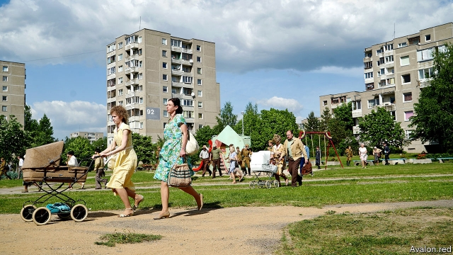

###### Soviet blocks

# In the Baltic states, many people are stuck in Khrushchev-era flats 

 

> print-edition iconPrint edition | Europe | Aug 17th 2019 

IN THE BALTIC STATES, Soviet-era apartments have taken on a gritty glamour. In Lithuania, Instagrammers hunt down Fabijoniskes, the neighbourhood where a recent television series about the Chernobyl nuclear disaster was filmed (see picture). In Estonia and Latvia, they form a backdrop to art shows and hip-hop videos. Nicknamed khrushchyovka (after Nikita Khrushchev), these uniform blocks of prefabricated panels were built to house workers across the Soviet Union from the 1960s onwards. 

Many were meant to last no more than 30 years. Yet in the Baltic states —where 68% of people live in apartments, the highest level in Europe—many people still call them home. Living inside history is less appealing than looking at it, alas. For, like the Soviet Union itself, they are drab, joyless places. 

For one thing, they are poorly insulated and expensive to heat. In Lithuania, for example, heating a two-bedroom apartment in the coldest months can cost 20% of the average salary. Soviet districts are generally occupied by the elderly and the hard-up, who are least able to bear the cost. Most also depend on centralised district heating, with no option to disconnect or change providers. In the winter, bitter inter-apartment battles are fought over the thermostat. 

It’s not just chilly residents who need better insulation. The EU aims to be carbon-neutral by 2050. Housing, which consumes 40% of all the EU’s energy and belches out 36% of its carbon, requires the biggest overhaul. Europe has decreed that, by 2020, all new buildings must use almost no energy. It is even harder to figure out what to do with old ones. Mass demolitions are expensive and unpopular. (Residents resisted when, in 2017, Moscow announced that it would tear down 8,000 of its own Khrushchev-era apartments.) Retrofitting, too, is problematic: in apartment blocks, individual owners can rarely reach consensus on something so expensive. All three Baltic countries offer government-backed financial instruments, but their success has been limited. Residents often don’t understand the need for change and, because the poorest receive heating subsidies, many have little direct incentive to do so. 

A more hands-on approach is needed. SmartEnCity, an initiative supported by EU funding, recently succeeded in turning three khrushchyovka blocks into energy-efficient “smart homes” in Tartu, Estonia. With someone else managing the project, and explaining the process, residents were more willing to take out loans and hand over their keys. Groups from Latvia and Lithuania are interested in copying the experiment.■ 

-- 

 单词注释:

1.Baltic['bɒ:ltik]:a. 波罗的海的 

2.Aug[]:abbr. 八月（August） 

3.Baltic['bɒ:ltik]:a. 波罗的海的 

4.gritty['griti]:a. 有砂砾的, 坚韧不拔的 

5.glamour['glæmә]:n. 魅力, 迷人的美, 魔法 vt. 迷惑 

6.lithuania[,liθju(:)'einjә, -niә]:n. 立陶宛 

7.sery[]:n. (Sery)人名；(俄)谢雷；(科特)塞里 

8.Chernobyl[tʃiә'nɔ:bil]:[经] 车诺比 

9.Estonia[es'tәuniә]:n. 爱沙尼亚 

10.Latvia['lætviә]:n. 拉脱维亚 

11.backdrop['bækdrɒp]:n. 背景幕, 背景 

12.nickname['nikneim]:n. 绰号, 昵称 vt. 给...取绰号, 叫错名字 [计] 绰号 

13.Nikita[]:n. 尼基塔（人名） 

14.Khrushchev[kru'ʃtʃɒf]:n. 赫鲁晓夫 

15.prefabricate[pri:'fæbrikeit]:vt. 预先制造, 预先准备 [经] 预制构件 

16.onward['ɒnwәd]:a. 向前的, 前进的 adv. 向前, 前进, 在先 

17.les[lei]:abbr. 发射脱离系统（Launch Escape System） 

18.ala['eilә]:n. 翼, 翅 [化] 丙氨酸 

19.drab[dræb]:a. 土褐色的, 单调的 

20.joyless['dʒɒilis]:a. 不高兴的, 不快乐的 

21.poorly['puәli]:adv. 贫穷地, 不充分地, 贫乏地 a. 身体不舒服的 

22.insulate['insjuleit]:vt. 使绝缘, 隔离 [医] 绝缘 

23.centralise['sentrәlɑiz]:vt. 形成中心, 把统治权集中于中央, 把...集中起来, 成为...的中心, 集中 

24.disconnect[.diskә'nekt]:vt. 使分离, 使不相连, 拆开 vi. 断开 [计] 断开 

25.provider[prә'vaidә]:n. 供应者, 供养人, 伙食承办人 [计] 提供器 

26.thermostat['θә:mәustæt]:n. 自动调温器, 温度自动启闭装置 [化] 恒温器; 恒温箱 

27.chilly['tʃili]:a. 寒冷的, 冷淡的, 不友好的 [建] 番椒, 冷 

28.insulation[.insju'leiʃәn. 'insә-]:n. 绝缘；隔离, 孤立 

29.EU[]:[化] 富集铀; 浓缩铀 [医] 铕(63号元素) 

30.belch[beltʃ]:vi. 打嗝, 喷吐 vt. 打嗝, 吼叫着发出(命令), 喷吐 n. 打嗝, 喷吐 

31.overhaul[.әuvә'hɒ:l]:vt. 分解检查, 翻修, 精细检查, 彻底革新 n. 分解检查, 精细检查, 大检修 

32.decree[di'kri:]:n. 法令, 判决, 天意 vt. 颁布, 判决 vi. 发布命令 

33.demolition[.demә'liʃәn]:n. 破坏, 毁坏, 撤销 [经] 拆毁(除,破坏) 

34.unpopular['ʌn'pɔpjulә]:a. 不得人心的, 不受欢迎的, 不流行的 

35.retrofit['retrә,fit]:n. 式样翻新 vt.vi. 式样翻新 [计] 更新; 改进 

36.incentive[in'sentiv]:n. 动机 a. 激励的 

37.Tartu['tɑ:tu:]:n. 塔尔图（爱沙尼亚的第二大城市） 

