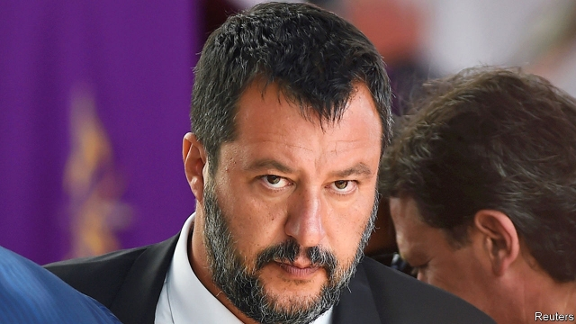

###### Salvini stumbles

# Italy’s would-be strongman suddenly looks more vulnerable 

 

> print-edition iconPrint edition | Europe | Aug 15th 2019 

HUBRIS IS AN occupational hazard for political leaders. Two of Italy’s recent prime ministers, Silvio Berlusconi and Matteo Renzi, stumbled just when it seemed they could do whatever they wanted. (Mr Renzi wanted to change the constitution; Mr Berlusconi wanted to hold “bunga bunga” sex parties. In both cases, voters objected.) 

Now Matteo Salvini, the leader of the populist Northern League, wants to ditch his coalition partners in the anti-establishment Five Star Movement (M5S), bring down the government that is led by Giuseppe Conte, an independent, and hustle the country into a snap election so as to give himself what he has termed “full powers”. This would enable him to impose, among other things, a radically expansionist budget for 2020. Mr Salvini claims that a “fiscal shock” is needed to jolt the moribund Italian economy back to life. Critics fear it could instead pitch the country, which has debts of over 130% of GDP, into a new financial crisis, along with the rest of the euro zone. 

So the stakes were high when, on August 9th, the League tabled a Senate motion of no confidence in Mr Conte. Mr Salvini, a deputy prime minister, did not, however, withdraw either himself or his ministers from the cabinet—a move that would have made the fall of the government inevitable. And on August 13th, a hastily reconvened upper house rejected the League’s demand for a confidence debate to be held the very next day. 

The luckless Mr Conte will still have to go to parliament to explain a crisis that is not of his making. But he will start his visit to the two chambers on August 20th, this date having been set by a majority that for the first time united the M5S with the opposition, centre-left Democratic Party (PD) and a handful of regionalists and independents. That raised the possibility that Mr Conte, who belongs to neither party in his coalition, might not get the thumbs-down, or that, if he resigned, a new government could even be formed, backed by the Five Stars and the PD. 

Nothing can be taken for granted. An Italian government crisis has more twists and dizzying turns than a cliff-top drive along the Riviera. After years of reciprocal abuse, most of it levelled by the M5S at the PD, mistrust between the two parties runs deep. Though M5S activists lean mostly to the left, they disagree with the PD on many issues, from infrastructure to immigration. Mr Renzi, who still enjoys the backing of most of the PD’s parliamentarians, wants an entente. But the PD’s new leader, Nicola Zingaretti, does not (though some of his closest aides are open to the idea). 

Mr Salvini told the Corriere della Sera, a daily paper, that preventing a deal between the Five Stars and the PD had become his priority. To that end, in the Senate, he made a proposal apparently intended to drive a wedge between them. The M5S’s most cherished, and electorally popular, item of legislation is one that would slash the number of elected lawmakers to 600 from 945. The M5S’s bill, which the PD opposes, needs to be approved just one more time, in the Senate. Mr Salvini said the League would support it, if the Five Stars agreed to an immediate election. 

But his offer raised more questions than it answered. It is not the M5S, but the president, who decides if an election is to be called after a government falls. And since Mr Conte may have resigned or been ousted before the final debate on the parliamentary reform bill, due on August 22nd, it may never be put to a vote. Even if it is, and the League ensures its approval, most experts agree the effect would be to make it impossible to hold an election until well into next year: a referendum might be needed and parliamentary boundaries would have to be redrawn. Mr Salvini insisted the reform could be put on hold until after the next legislature. But aides to the president, Sergio Mattarella, dismissed that idea out of hand. So what is the League leader up to? 

His offer did allow him to rebut claims by the M5S that he wants a return to the polls solely to pre-empt the reform of parliament and enable his lawmakers to keep their seats. But his surprise move could also be seen as a first step towards building a ladder down which he can retreat from the chaos he has prompted. The vote on August 13th was not the only setback Mr Salvini has endured recently. 

Expecting an election, he has taken bare-chested to the beaches to consolidate his lead in the polls. Mobbed by adoring fans in the north, Mr Salvini has run into heckling and demonstrations since taking his campaign to the south, where people still remember the snooty contempt for southerners that he and his party once openly expressed. 

Recent polls give the League 36-37% of the vote. To control parliament, however, Mr Salvini needs around 40%. He can probably count on a small party of former neo-fascists for the extra votes. But to be surer of victory he also needs a deal with Mr Berlusconi’s much-depleted Forza Italia movement. The two leaders were to have met before the Senate vote. But then it emerged that Mr Salvini’s plan was, in effect, to take over Forza Italia, and the meeting did not take place. For a politician often depicted as Italy’s strongman-in-waiting, Mr Salvini suddenly looks vulnerable. ■ 

-- 

 单词注释:

1.salvini[]:[网络] 索氏丽体鱼；萨尔维尼 

2.strongman[ˈstrɒŋmæn]:n. 大力士 

3.vulnerable['vʌlnәrәbl]:a. 易受伤害的, 有弱点的, 易受影响的, 脆弱的, 成局的 [医] 易损的 

4.Aug[]:abbr. 八月（August） 

5.hubris['hju:bris]:n. 傲慢, 狂妄野心 

6.occupational[.ɒkju'peiʃәnl]:a. 职业的, 军事占领的 [医] 职业的 

7.Silvio[]:西尔维奥 

8.Berlusconi[]:n. (Berlusconi)人名；(意)贝卢斯科尼 

9.matteo[]:马泰奥（人名） 

10.renzi[]:[网络] 黎恩济 

11.bunga[]: [地名] [巴基斯坦、尼日利亚] 本加; [地名] [冰岛] 本加山 

12.voter['vәutә]:n. 选民, 投票人 [法] 选民, 选举人, 投票人 

13.Populist['pɔpjulist]:n. 民粹派的成员 

14.coalition[.kәuә'liʃәn]:n. 结合体, 结合, 联合 [经] 联合, 联盟 

15.giuseppe[]:n. 朱塞佩（男子名） 

16.conte[kuŋt]:n. 短篇小说 

17.hustle['hʌsl]:n. 心碌, 挤, 推, 拥挤喧嚷 vt. 催促, 乱挤活动, 硬逼, 强夺 vi. 赶紧, 硬挤过去 

18.radically['rædikәli]:adv. 根本地, 完全地 

19.expansionist[ik'spænʃәnist]:a. (关于)扩张主义的, 赞同扩张主义的 n. 扩张主义者, 领土扩张论者 

20.fiscal['fiskәl]:a. 财政的, 国库的 [经] 财政上的, 会计的, 国库的 

21.jolt[dʒәult]:n. 震摇, 摇动, 颠簸 vi. 颠簸而行, 震摇 vt. 使颠簸, 使慌张, 猛击 

22.moribund['mɒ:ribʌnd]:a. 垂死的 n. 垂死的人 

23.euro['juәrәu]:n. 欧元（欧盟的统一货币单位） 

24.hastily['heistili]:adv. 匆忙地, 急速地, 急躁地 

25.luckless['lʌklis]:a. 不幸的, 坏运气的 

26.opposition[.ɒpә'ziʃәn]:n. 反对, 敌对, 相反, 在野党 [医] 对生, 对向, 反抗, 反对症 

27.Pd[]:[医] 钯(46号元素) 

28.regionalist['ri:dʒәnәlist]:n. 地方主义者, 乡土作家 

29.riviera[,rivi'eәrә]:n. 海滨游憩胜地 

30.reciprocal[ri'siprәkl]:a. 互惠的, 相互的, 相等的, 倒数的, 彼此相反的 n. 倒数, 互相起作用的事物 

31.mistrust[.mis'trʌst]:n. 不信任, 疑惑 v. 不信任, 疑惑 

32.activist['æktivist]:n. 激进主义分子 

33.infrastructure['infrәstrʌktʃә]:n. 基础结构, 基础设施 [经] 基础设施 

34.parliamentarian['pɑ:lәmen'teәriәn]:n. 议会法规专家, 国会议员, 熟悉议会法规而又有经验的议员 

35.entente[ɒŋ'tɒŋt]:n. 协定, 协约 [法] 谅解, 协定, 协约 

36.nicola[]:n. 尼古拉（男子名） 

37.aide[eid]:n. 助手, 副官 [计] 数据输入的可说明性 

38.della['delә]:n. 黛拉（女子名, 等于Delia） 

39.sera['siәrә]:浆液, 血清 [医] 血清; 浆液 

40.apparently[ә'pærәntli]:adv. 表面上, 清楚地, 显然地 

41.wedge[wedʒ]:n. 楔子, 楔形物, 起因, 导致分裂的东西 vt. 楔住, 挤进, 楔入 vi. 楔入, 挤进 

42.cherish['tʃeriʃ]:vt. 珍爱, 怀有, 爱护 

43.electorally[i'lektərəli]:adv. 从选举方面来讲（electoral的副词形式） 

44.slash[slæʃ]:v. 猛砍, 乱砍 n. 猛砍, 乱砍, 删减 [计] 斜线 

45.lawmaker[lɒ:'meikә]:n. 立法者 

46.oust[aust]:vt. 逐出, 罢黜, 剥夺, 驱逐 [法] 驱逐, 剥夺, 免职 

47.parliamentary[.pɑ:lә'mentәri]:a. 国会的, 议会的, 议会制度的 

48.referendum[.refә'rendәm]:n. （就重大政治或社会问题进行的）全民公决，全民投票 

49.redraw[.ri:'drɒ:]:vt. 重画 vi. 刷新屏幕 [计] 刷新屏幕 

50.legislature['ledʒisleitʃә]:n. 立法机关, 议会, 立法院 [法] 立法机构, 立法机关 

51.Sergio[]:n. 塞尔吉奥（NBA球员） 

52.Mattarella[]:马塔雷拉 

53.rebut[ri'bʌt]:vi. 反驳 vt. 辩驳, 反驳, 揭露 

54.chao[]:n. 钞（货币） 

55.setback['setbæk]:n. 挫折, 退步, 逆流 

56.consolidate[kәn'sɒlideit]:vt. 巩固, 使联合, 统一 vi. 巩固 [计] 合并计算 

57.mob[mɒb]:n. 暴民, 民众, 暴徒 vt. 大举包围, 蜂拥进入, 围攻 vi. 聚众生事 

58.heckle['hekl]:vt. 诘问, 以麻梳梳理, 激烈质问 n. 针排 

59.demonstration[.demәn'streiʃәn]:n. 示范, 实证 [医] 示教, 实物教授 

60.snooty['snu:ti]:a. 傲慢的, 自大自满的, 鄙视别人的 

61.southerner['sʌðәnә]:n. 南方人 

62.openly['әjpәnli]:adv. 公开地, 坦率地, 直率地, 公然地 

63.forza[]:n. 力量；（意）加油 

64.italia[i'tɑ:ljɑ:]:n. 意大利 

65.depict[di'pikt]:vt. 描述, 描写 

