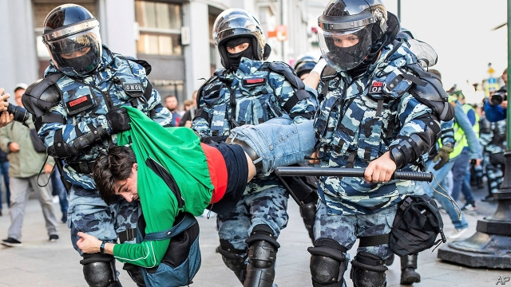

###### Unbowed

# Protests in Moscow show that Putin’s critics are getting stronger 

 

> print-edition iconPrint edition | Europe | Aug 17th 2019 

IT IS 20 years this month since then-President Boris Yeltsin appointed a shadowy security chief called Vladimir Putin as Russia’s prime minister. The next New Year’s Eve, the ailing Mr Yeltsin would install the ex-KGB man as his successor. On the anniversary of his ascent to power, Mr Putin has little reason to celebrate. 

On August 10th, as they have for the past five weekends, Russians took to the streets of Moscow to demand that opposition politicians unfairly barred from next month’s city-council polls should be allowed to run after all. Waving white, red and blue Russian flags, an estimated 50,000-60,000 protesters flooded a broad avenue. “Russia will be free!” they chanted. It was the biggest opposition rally since 2012—after Mr Putin’s pals again bamboozled a ballot. 

The city council has little power. But the blatant interference has transformed what should have been mundane elections into a political crisis for the Kremlin. Although often derided as fringe figures, many of the aspiring opposition candidates were poised to win seats. Mr Putin seems determined to deny his critics even a foothold on Russia’s electoral ladder. 

The mounting protests come at a dangerous time for Mr Putin, whose ratings have been sliding since his government introduced a five-year increase in the national pension age last summer. An invigorated opposition movement is focused squarely on the city-council election. But the protests are rapidly turning into a broader expression of anger over high-level corruption and widespread poverty. The government’s own statistics agency, Rosstat, admitted this month that over a quarter of Russian children are poor. 

The opposition movement is being endorsed by a growing number of music stars and celebrities. Yevgeny Kafelnikov, a former world-number-one tennis player, is backing the protests, as is Yury Dud, a YouTube blogger with millions of followers. Ivan Dremin, a popular rapper better known by his stage name, Face, performed at Saturday’s rally. “Taking to the streets has become prestigious,” writes Abbas Gallyamov, a former Kremlin speechwriter turned political analyst. 

The opposition’s show of strength came after a crackdown aimed at stifling dissent—a tactic that worked in 2011-12. Since the protests began on July 14th, baton-wielding riot police have arrested more than 2,500 people, often violently. Although many of the protesters were quickly released, 14 people are facing up to eight years in prison on dubious charges of “mass unrest”. Among them is a man who is accused of throwing an empty plastic bottle at police. 

The protests are also providing the opposition with new figureheads. Most prominent is Lyubov Sobol, a 31-year-old lawyer who works with the anti-corruption organisation run by Alexei Navalny, a prominent critic of the Kremlin. Ms Sobol, who went on hunger strike in a bid to force her way onto the city-council ballot, was dragged out of her office and arrested by police ahead of last weekend’s rally. 

The danger for Mr Putin now is that the protests will trigger a chain reaction throughout Russia. At a state-organised forum in southern Russia this weekend, participants, including members of the ruling party’s own youth wing, voiced grievances over corruption and inequality that would not have sounded out of place at a Moscow opposition rally. “We have only one solution—revolution,” said one young woman. “We are like an explosive cocktail. We are ready to go off.” ■ 
<<<<<<< HEAD

-- 

 单词注释:

1.unbowed[.ʌn'baud]:a. 不弯的, 不屈服的 

2.Aug[]:abbr. 八月（August） 

3.boris['bɔris]:n. 鲍里斯（男子名） 

4.Yeltsin[]:n. 叶利钦（俄罗斯前总统） 

5.shadowy['ʃædәui]:a. 有影的, 暗黑的, 朦胧的, 虚幻的 

6.Vladimir[vlɑ'dimɪr]:n. 弗拉基米尔（古罗斯弗拉基米尔-苏兹达里公国的古都） 

7.putin['putin]:n. 普京（人名） 

8.ailing['eiliŋ]:a. 生病的 [医] 患病的, 病痛的 

9.successor[sәk'sesә]:n. 继承者, 接任者 [计] 后继 

10.ascent[ә'sent]:n. 上升, 提高, 攀登, 上坡路 

11.opposition[.ɒpә'ziʃәn]:n. 反对, 敌对, 相反, 在野党 [医] 对生, 对向, 反抗, 反对症 

12.unfairly[]:adv. 不正当地；不公平地 

13.protester[]:n. 抗议者, 持异议者, 拒付者 [经] 反对者 

14.rally['ræli]:n. 重振旗鼓, 集合, 群众集会, 跌停回升 v. 重整旗鼓, 集合, 恢复精神, 团结, 挖苦, 嘲笑 

15.pal[pæl]:n. 朋友, 伙伴, 同志, 同谋 vi. 交友, 结伴 

16.bamboozle[bæm'bu:zl]:vt. 欺骗, 迷惑 

17.ballot['bælәt]:n. 投票, 投票用纸, 抽签 vi. 投票, 抽签 vt. 投票选出, 拉选票 

18.blatant['bleitәnt]:a. 喧嚣的, 吵闹的, 俗丽的, 炫耀的 

19.mundane['mʌndein]:a. 现世的, 世俗的, 宇宙的 

20.Kremlin['kremlin]:n. 克里姆林宫 [经] 克里姆林宫 

21.deride[di'raid]:vt. 嘲弄, 嘲笑 

22.fringe[frindʒ]:n. 边缘, 端, 流苏, 穗, 初步 vt. 加穗于, 加饰边于 a. 边缘的, 附加的 

23.aspire[ә'spaiә]:vi. 渴望, 立志于 

24.poise[pɒiz]:n. 平衡, 均衡, 姿势, 镇静, 安静, 砝码 vt. 使平衡, 使悬着, 保持...姿势 vi. 平衡, 悬着, 准备好 

25.foothold['futhәuld]:n. 立足处, 据点, 根据地 

26.electoral[i'lektәrәl]:a. 选举人的, 选举的, (有关)选举的 [法] 选举的, 选举人的, 由选举人组成的 

27.rating['reitiŋ]:n. 等级, 额定功率, 责骂 [经] 等级评定 

28.invigorate[in'vigәreit]:vt. 使精力充沛, 鼓舞, 搞活, 使健壮 

29.squarely['skwєәli]:adv. 干脆地, 正好, 直角地 

30.corruption[kә'rʌpʃәn]:n. 腐败, 堕落, 贪污 [计] 论误 

31.statistic[stә'tistik]:n. 统计量 a. 统计的, 统计学的 

32.endorse[in'dɒ:s]:vt. 支持, 赞同, 背书于, 签署 [经] 赞成, 背书 

33.celebrity[si'lebrti]:n. 名声, 名人 

34.yevgeny[]:[网络] 叶夫根尼 

35.kafelnikov[]:[网络] 卡费尔尼科夫；卡菲尼可夫 

36.Yury[]:n. (Yury)人名；(俄)尤里；(法)于里 

37.dud[dʌd]:n. 衣服, 哑弹, 无用物 a. 无用的 

38.youtube[]:n. 视频网站（可以让用户免费上传、观赏、分享视频短片的热门视频共享网站） 

39.blogger[]:n. 写博客的人；博客使用者 

40.follower['fɒlәuә]:n. 从者, 属下, 追补者 [电] 随动机 

41.ivan['aivәn]:n. 伊凡（男子名） 

42.rapper['ræpә]:n. 敲门人, (美)(非正式)控告人, 证人, 检举人 [机] 敲杆 

43.prestigious[pre'stidʒiәs]:a. 享有声望的 

44.Abba['æbә]:n. 阿爸父(耶稣对上帝的尊称) 

45.speechwriter['spi:tʃ,raitә(r)]:n. 演讲稿撰写人 

46.analyst['ænәlist]:n. 分析者, 精神分析学家 [化] 分析员; 化验员 

47.crackdown['krækdaun]:n. 制裁, 镇压, 痛击 

48.stifle['staifl]:vt. 使窒息, 抑止, 扼杀 vi. 窒息, 被扼杀 

49.tactic['tæktik]:n. 一项战术, 一条策略 a. 战术的, 顺序的, 排列的 

50.riot['raiәt]:n. 暴动, 喧闹, 放纵 vi. 发动, 暴动, 纵情, 放荡 vt. 浪费, 挥霍 

51.violently['vaiәlәntli]:adv. 猛烈地, 激烈地, 极端地 

52.quickly['kwikli]:adv. 很快地 

53.dubious['dju:biәs]:a. 可疑的, 不确定的 

54.figurehead['figәhed]:n. 装饰船头的人像, 傀儡领袖 

55.lyubov[]:[网络] 柳博芙 

56.sobol[]: [人名] 索博尔 

57.organisation[,ɔ: ^әnaizeiʃən; - ni'z-]:n. 组织, 团体, 体制, 编制 

58.Alexei[]:n. (Alexei)人名；(捷、罗、俄)阿列克谢 

59.Navalny[]:[网络] 纳瓦尔内；瓦尔尼 

60.trigger['trigә]:n. 触发器, 扳机 vt. 触发, 发射, 引起 vi. 松开扳柄 [计] 切换开关 

61.forum['fɒ:rәm]:n. 论坛, 公开讨论的广场, 法庭, 讨论会 [法] 讨论会, 专题讨论, 公共论坛 

62.participant[pɑ:'tisipәnt]:n. 参加者, 参与者 a. 有份的, 参加的, 参与的 

63.grievance['gri:vәns]:n. 委屈, 冤情, 苦况 [经] 不满(对雇用条件的) 

64.inequality[.ini'kwɒliti]:n. 不平等, 不同, 不平坦, 不平均 n. 不平等, 不等式 [计] 不等式 

65.cocktail['kɒkteil]:n. 鸡尾酒, 开味品 a. 鸡尾酒会的 
=======
>>>>>>> 50f1fbac684ef65c788c2c3b1cb359dd2a904378

