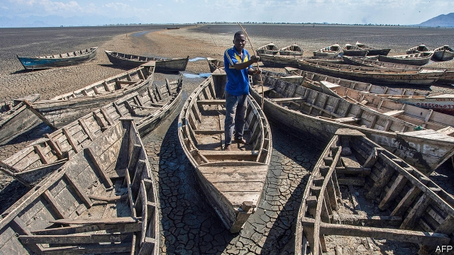

###### Costing the earth

# Countries most exposed to climate change face higher costs of capital 

 

> print-edition iconPrint edition | Finance and economics | Aug 17th 2019 

IN EAST AFRICA millions of people are suffering from a prolonged drought. Deadly typhoons are wreaking havoc in Vietnam. Honduran coffee-farmers are seeing their crops wither in the heat. Poor countries have less capacity than rich ones to adapt to changing weather patterns, and tend to be closer to the equator, where weather patterns are becoming most volatile. As the world heats up, they will suffer most. 

By 2030 poor countries will need to spend $140bn-300bn each year on adaptive measures, such as coastal defences, if they want to avoid the harm caused by climate change. That estimate, from the UN Environment Programme, assumes that global temperatures will be only 2°C above pre-industrial levels by the end of the century, which seems unlikely. Adding to the costs, research suggests that these countries face higher interest rates than similar countries less exposed to climate risks. This raises the prospect of a vicious cycle, in which the most vulnerable countries pay more to borrow, making adaptation harder and them even more exposed. 

The research focuses on the V20, a group founded by 20 vulnerable countries whose membership has since grown to 48. The members are mostly poor, together accounting for less than 5% of global GDP. They include low-lying atolls, such as the Marshall Islands, and economies dominated by agriculture, such as Kenya. The researchers, led by Ulrich Volz of SOAS University of London and Bob Buhr of Imperial College Business School, examined sovereign-bond yields between 1996 and 2016 for 46 countries, 25 of them in the V20. After controlling for non-climate factors, such as income per person and levels of public debt, they estimate that V20 countries must pay interest rates 1.2 percentage points higher than comparable countries. That raises the V20’s borrowing costs by about 10%, equivalent to an extra $4bn each year in interest payments. 

Companies may also be charged more for loans if they are perceived as more exposed to climate-related risks. In a new paper researchers at SOAS looked at the cost of corporate debt for more than 60,000 firms in 80 countries. A fifth of the companies, holding about 3% of the total debt, were in the countries most vulnerable to climate change. They were charged interest rates on average 0.83 percentage points higher—again roughly a 10% premium. 

High interest rates largely reflect a greater risk of default. So credit-rating agencies are looking at climate risks, too. Undiversified economies that are reliant on agriculture are particularly susceptible, says Marie Diron of Moody’s. In the 37 countries that the firm thinks are most vulnerable, farming accounts for 44% of employment on average. (Together they have issued $2.8trn of sovereign debt, about 4% of the world’s total.) Those relying on tourism could also be in trouble. And climate-exposed countries often have weak institutions, says Ms Diron. They struggle to plan for and respond to disasters. 

Some of the smaller vulnerable countries have been attempting to build climate resilience by pooling insurance risk to make premiums more affordable. The first such attempt was the Caribbean Catastrophe Risk Insurance Facility, which has paid out $139m since it was founded in 2007. The payouts help alleviate cashflow problems after disasters, reassuring investors and credit-rating agencies. In the past five years similar insurance schemes have popped up in sub-Saharan Africa, Central America and the Pacific. 

Others are seeking to reduce the interest-rate premium with “blended finance”, whereby multilateral institutions such as the World Bank and Asian Development Bank bear part of the risk for mitigation and climate-resilience projects. In April the V20 launched such a programme. Officials plan to apply to use $500m from the UN’S Green Climate Fund in the V20. Such schemes will help, but only a bit. In truth, climate-vulnerable countries can do little to offset the rise in the cost of capital.■ 

-- 

 单词注释:

1.Aug[]:abbr. 八月（August） 

2.prolong[prәu'lɒŋ]:vt. 延长, 拖延, 拖长 [化] 冷凝管 

3.wreak[ri:k]:vt. 发泄(怒火), 报仇 [法] 报仇, 报复, 施 

4.havoc['hævәk]:n. 大破坏, 蹂躏 vt. 严重破坏 

5.Vietnam[.vjet'næm]:n. 越南 

6.Honduran[hɔn'djuәrәn]:a. 洪都拉斯的 

7.wither['wiðә]:vt. 使凋谢, 使消亡, 使畏缩 vi. 枯萎, 衰退 

8.les[lei]:abbr. 发射脱离系统（Launch Escape System） 

9.equator[i'kweitә]:n. 赤道 [医] 赤道, 中纬线 

10.volatile['vɒlәtail]:a. 挥发性的, 可变的, 不稳定的, 飞行的, 轻快的, 爆炸性的 n. 有翅动物, 挥发物 [计] 易失的 

11.adaptive[ә'dæptiv]:a. 适应的, 能适应的 

12.coastal['kәustәl]:a. 海岸的, 沿海的, 沿岸的 [法] 海岸的, 沿海的 

13.UN[ʌn]:pron. 家伙, 东西 [经] 联合国 

14.vicious['viʃәs]:a. 邪恶的, 堕落的, 品性不端的, 恶毒的, 恶性的, 有错误的 [医] 缺点的, 恶的 

15.vulnerable['vʌlnәrәbl]:a. 易受伤害的, 有弱点的, 易受影响的, 脆弱的, 成局的 [医] 易损的 

16.membership['membәʃip]:n. 会员的资格, 全体会员, 会员数目 [法] 会员资格, 成员资格, 会籍 

17.atoll['ætɒl]:n. 环状珊瑚岛, 环礁 

18.Marshall['mɑ:ʃәl]:n. 马歇尔（姓氏, 男子名, 等于Mar'shal） 

19.Kenya['kenjә]:n. 肯尼亚 

20.Ulrich[]:n. 乌利希期刊指南；乌利齐（人名） 

21.volz[]: [人名] 沃尔兹 

22.soa[]:abbr. 前进速度（speed of advance ）；工艺技术水准（state of the art）；进场著陆速度（speed of approach）；工艺现状（State of the Art） 

23.bob[bɒb]:vt. 剪短, 敲击 vi. 振动, 上下跳动 n. 短发, 悬挂的饰品, 浮子, 摆动, 轻敲, 5便士 

24.buhr[bә:]:[机] 磨石 

25.imperial[im'piәriәl]:a. 帝王的, 宗主国的, 至尊的, 壮丽的 n. 特等品 

26.corporate['kɒ:pәrit]:a. 社团的, 合伙的, 公司的 [经] 团体的, 法人的, 社团的 

27.premium['pri:miәm]:n. 额外补贴, 奖金, 奖赏, 保险费 [医] 保险费 

28.default[di'fɒ:lt]:n. 违约, 不履行责任, 缺席, 默认值 v. 疏怠职责, 缺席, 拖欠, 默认 [计] 默认; 默认值; 缺省值 

29.undiversified['ʌndai'vә:sifaid]:a. 没有变化的, 千篇一律的, 清一色的, 单一的 

30.reliant[ri'laiәnt]:a. 依赖的, 信赖的 

31.susceptible[sә'septәbl]:a. 易受影响的, 易感动的, 容许...的 [法] 易感的, 易受影响的, 容许 

32.marie['mɑ:ri(:), mә'ri:]:n. 玛丽（女子名） 

33.sovereign['sɒvrin]:n. 元首, 独立国 a. 具有主权的, 至高无上的, 国王的, 完全的 

34.resilience[ri'ziliәns]:n. 弹回, 有弹力, 恢复力 [化] 回弹; 弹性; 弹回性; 回能; 弹能 

35.affordable[]:[计] 普及型 

36.Caribbean[.kæri'bi:әn]:n. 加勒比海 a. 加勒比海的, 加勒比人的 

37.payout['pei'aut]:n. 支出, 付出款项 [经] 付出款项, 花费, 支出 

38.alleviate[ә'li:vieit]:vt. 减轻, 使缓和 

39.cashflow['kæʃfləʊ]:vi. 现金流转 

40.reassure[.ri:ә'ʃuә]:vt. 使...安心, 向...再保证 [法] 重新保证, 再保险, 使清除疑虑 

41.investor[in'vestә]:n. 投资者 [经] 投资者 

42.whereby[(h)weә'bai]:adv. 靠什么, 如何, 为何, 靠那个, 因此, 由此 [法] 因此, 由是 

43.multilateral[.mʌlti'lætәrәl]:a. 多边的, 多国的 [经] 多边的, 涉及多方的 

44.mitigation[.miti'geiʃәn]:n. 缓和, 减轻 [法] 减, 减轻, 缓和 

45.offset['ɒ:fset]:n. 抵消, 把...并列, 旁系, 支管, 用胶印法印 vt. 弥补, 抵消, 胶印 vi. 装支管 n. 偏移量 [计] 偏移量 

