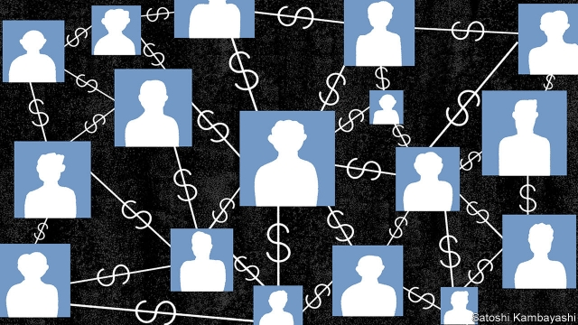

###### And then there were seventeen

# Malaysia charges 17 Goldman Sachs executives 

 

> print-edition iconPrint edition | Finance and economics | Aug 17th 2019 

THE SURPRISE stung. On August 9th Malaysia’s attorney-general filed criminal charges against 17 current and former executives at Goldman Sachs, an investment bank. The move marks an escalation in Malaysia’s efforts to deal with a scandal uncovered at 1MDB, a state investment vehicle set up more than a decade ago by Najib Razak, then Malaysia’s prime minister. As much as $4.5bn of public money vanished from the fund between 2009 and 2015, according to America’s Department of Justice (DOJ). The cash was funnelled through shell companies around the world and frittered away on yachts, artworks, diamonds and other fripperies. Investigations have spanned America, Luxembourg, Malaysia, Singapore, Switzerland and the United Arab Emirates. 

The 17 executives occupied senior positions at three subsidiaries of Goldman between May 2012 and March 2013. Five still work at the bank: among them is Richard Gnodde, the chief executive of its London-based subsidiary. During that time Goldman underwrote three bond offerings that raised $6.5bn for 1MDB, of which, according to the DOJ, $2.7bn later disappeared. Even so, the bank earned a whopping $600m in fees—a figure that Malaysia’s authorities claim was above the market rate. In 2013 one of the bank’s former executives, who has been charged, was paid a bonus exceeding that of its chief executive at the time. Malaysia’s prime minister, Mahathir Mohamad, who booted Mr Najib out of office 15 months ago with a rallying cry against corruption, has called the fees “a huge killing”. His finance minister wants $7.5bn in reparations from Goldman. 

The bank’s former chairman for South-East Asia, Tim Leissner, helped win the work. He and Roger Ng, another former Goldman banker, already face charges in America and Malaysia. Mr Leissner, who last year pleaded guilty to the American charges of bribery and money-laundering, awaits sentencing. But Mr Ng protested his innocence in a court in New York in May after being extradited from Malaysia. 

The alleged mastermind of the scheme, Jho Low, a Malaysian financier, remains at large. Mr Najib, meanwhile, must contend with four trials related to 1MDB in Malaysia, the first of which is under way. Both men deny wrongdoing. 

Goldman has painted Mr Leissner as a rogue employee. The bank’s chief executive has even apologised to Malaysians for Mr Leissner’s role in the mess. But the former executive has said his cover-ups were in line with the bank’s culture. The decision to charge another 17 executives under Malaysia’s Capital Markets and Services Act (CMSA), which allows top employees to be held responsible for the offences of their organisations, suggests authorities take a broad view of the matter. In December, under another section of the CMSA, Malaysia filed criminal charges against the firm. 

The bank denies wrongdoing. Edward Naylor, its head of corporate communications in the Asia-Pacific region, said that the charges against the 17 are “misdirected”. “Certain members of the former Malaysian government and 1MDB lied to Goldman Sachs,” he added. As those accused had no opportunity to argue their case before the charges were filed, the attorney-general’s move increases pressure on the bank in its dealings with the Malaysian authorities. It also signals Malaysia’s determination to make an example of Goldman. 

The big question is how America’s crime-busters respond. Goldman is likely to be punished for the actions of Mr Leissner and others. But the size of a potential fine could depend on the extent to which they are judged to have acted in their employer’s interest. One tricky legal issue is whether Goldman is liable for the $2.7bn that was stolen from the bond-sale proceeds. The bank is thought to have set aside somewhere between $1bn and $2bn to cover legal costs related to 1MDB. Analysts reckon the size of any American fine could be based either on the fees Goldman earned on the bond issuance, or on the larger sum that disappeared from the fund. With $76bn of core capital, the bank can absorb the potential hit to its balance-sheet. Its reputation for being both nimble and astute may take longer to recover.■ 
<<<<<<< HEAD

-- 

 单词注释:

1.Malaysia[mә'leiziә]:n. 马来西亚 [经] 马来西亚 

2.goldman[]:n. 高曼（姓氏） 

3.Sachs[zaks]:n. 萨克斯（汽车零配件生产厂商） 

4.Aug[]:abbr. 八月（August） 

5.escalation[.eskә'leiʃәn]:n. 扩大, 增加 [经] 调查, 价格调整 

6.najib[]:n. 纳吉彼; 纳吉布; 纳吉（人名） 

7.razak[]:[网络] 拉扎克；拉萨家族；总理拉紮克 

8.doj[]:abbr. Department of Justice <美国>司法部 

9.funnel['fʌnl]:n. 漏斗, 漏斗状的东西, 烟囱 [化] 漏斗 

10.fritter['fritә]:vt. 浪费, 细切, 剁碎 n. 细片, 屑 

11.yacht[jɒt]:n. 快艇, 游艇 vi. 驾游艇, 乘游艇 

12.artwork['ɑ:twә:k]:n. 插图, 艺术作品 [计] 原图 

13.frippery['fripәri]:n. 便宜而俗艳的服装, 无用的东西 

14.luxembourg['luksәm,bә:^]:n. 卢森堡公国；卢森堡（卢森堡公国首都） 

15.Singapore[.siŋgә'pɒ:]:n. 新加坡 

16.emirate[e'miәrit]:n. 埃米尔的地位, 酋长国 

17.subsidiary[sәb'sidiәri]:n. 子公司, 附件, 辅助者 a. 辅助的, 次要的, 津贴的 

18.richard['ritʃәd]:n. 理查德（男子名） 

19.underwrite['ʌndәrait]:vt. 签名于下, 给...保险 vi. 经营保险业 

20.offering['ɒfәriŋ]:n. 提供, 奉献物, 牲礼, 上市的股票(或证券等) [经] 出售物 

21.whop[hwɒp]:v. 打, 抽出, 打败, 征服 n. 重击, 打击声 

22.Mahathir[]:n. (Mahathir)人名；(马来)马哈蒂尔 

23.Mohamad[]:n. (Mohamad)人名；(阿拉伯、印尼)穆罕默德 

24.rally['ræli]:n. 重振旗鼓, 集合, 群众集会, 跌停回升 v. 重整旗鼓, 集合, 恢复精神, 团结, 挖苦, 嘲笑 

25.corruption[kә'rʌpʃәn]:n. 腐败, 堕落, 贪污 [计] 论误 

26.reparation[.repә'reiʃәn]:n. 补偿, 赔偿, 弥补, 修复, 修理 [经] 赔偿, 补偿, 修理 

27.tim[tim]:n. 蒂姆（男子名） 

28.roger['rɔdʒә]:interj. 对!, 行!, 好! 

29.NG[]:[化] 硝化甘油 

30.banker['bæŋkә]:n. 银行家, 庄家 [经] 银行业者, 银行家 

31.plead[pli:d]:vi. 辩护, 恳求 vt. 为...辩护, 提出...借口, 托称, 恳求 

32.bribery['braibәri]:n. 贿赂行为, 行贿, 受贿 [经] 行贿, 受贿 

33.innocence['inәsәns]:n. 无罪, 无知, 天真无邪 [法] 无罪, 无罪的人, 清白无辜者 

34.york[jɔ:k]:n. 约克郡；约克王朝 

35.allege[ә'ledʒ]:vt. 宣称, 主张, 提出, 断言 [法] 断言, 指称, 指证 

36.mastermind['mɑ:stәmaind]:n. 优秀策划者, 才子 vt. 指导, 主持, 策划 

37.JHO[6]:Jam Handy Organization 中空弹尖包覆型 

38.Malaysian[mә'leiziәn]:a. 马来西亚的 n. 马来西亚人 

39.financier[fai'nænsiә]:n. 财政家, 金融家 vi. 从事欺骗性金融活动, 欺骗 

40.contend[kәn'tend]:vi. 奋斗, 斗争, 竞争 vt. 为...斗争 

41.wrongdoing['rɒŋ'du:iŋ]:n. 干坏事, 坏事 

42.rogue[rәug]:n. 恶棍, 流氓, 小淘气 vt. 欺骗 vi. 游手好闲 

43.apologise[ә'pɔlәdʒaiz]:vi. 道歉（等于apologize） 

44.Malaysian[mә'leiziәn]:a. 马来西亚的 n. 马来西亚人 

45.cmsa[]: [医][=conventional microvascular sutured anastomosis]常规小血管缝合吻合术 

46.organisation[,ɔ: ^әnaizeiʃən; - ni'z-]:n. 组织, 团体, 体制, 编制 

47.edward['edwәd]:n. 爱德华（男子名） 

48.Naylor[]:n. (Naylor)人名；(英)内勒 

49.corporate['kɒ:pәrit]:a. 社团的, 合伙的, 公司的 [经] 团体的, 法人的, 社团的 

50.misdirect['misdi'rekt]:vt. 误导, 写错地址 [法] 对...作错误指示 

51.dealing['di:liŋ]:n. 经营行为, 行为, 交易 [法] 待遇, 处置, 行为 

52.tricky['triki]:a. 狡猾的, 机敏的 

53.analyst['ænәlist]:n. 分析者, 精神分析学家 [化] 分析员; 化验员 

54.reckon['rekәn]:vt. 计算, 总计, 估计, 认为, 猜想 vi. 数, 计算, 估计, 依赖, 料想 

55.issuance['iʃjuәns]:n. 发行, 发布 [经] 发行, 发给 

56.nimble['nimbl]:a. 敏捷的, 伶俐的, 聪明的 

57.astute[ә'stju:t]:a. 敏锐的, 狡猾的 
=======
>>>>>>> 50f1fbac684ef65c788c2c3b1cb359dd2a904378

