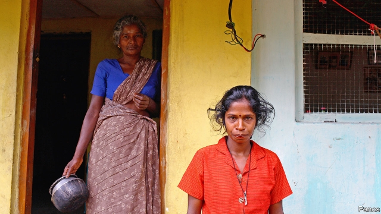

###### Distress signals

# Microfinance is driving many Sri Lankan borrowers to despair 

 

> print-edition iconPrint edition | Finance and economics | Aug 17th 2019 

IN PARTS OF Sri Lanka’s north and east, some women keep track of their microloans by the day of the week the collectors come. Others identify the lenders by the colours of their collectors’ shirts. Monday loan, Tuesday loan, blue shirt, yellow shirt: small, unsecured loans promoted by the government after the decades-long civil war ended in 2009 have enmeshed many women in hopeless debt. A central-bank official says his employees have talked desperate borrowers out of killing themselves. At least 170 committed suicide last year. 

Nalani Wickremesinghe, from Baduraliya in the south, has taken loans from 11 companies, only two of which are registered with the central bank. The first was to pay for her husband’s medical treatment. Then he fell at his workplace and is still bedridden. She has borrowed 500,000-600,000 rupees ($2,800-3,400) in total—but has no idea of the interest rate. She has already pawned, and lost, her gold jewellery. Struggling to feed her family, she has little option but to borrow again. 

In Nachchikuda, a coastal village, Sri Sundara Gowri sits in her front yard—not far from the satellite dish she bought on hire-purchase—and relates how she had five loans, three of which have been at last paid off. The first, of 25,000 rupees, was taken ten years ago after she returned from prolonged displacement to build a house. Unable to live on her husband’s fishing income, they borrowed more. One loan went on a fishing net that was soon damaged. Their property is now mortgaged to an informal lender who frequently sends agents to threaten them. 

Researchers say these stories are typical. Borrowers know nothing about interest rates—effective rates may be as high as 220%—only the capital and weekly instalment. The finance ministry reckons big microfinance institutions have lent out 282bn rupees ($1.6bn), but it has no data for the many smaller lenders that operate. No rules exist to prevent over-indebtedness. Most borrowers took out their first loan to consume rather than invest, and most new loans are taken out to service old ones. 

Giving poor people small loans without collateral, albeit at higher interest rates than on conventional loans, was meant to spur entrepreneurship and allow people to bootstrap their way out of poverty. In Sri Lanka it seems to be burying many, particularly women, deeper in it. 

Those areas in the north and the east where civil war once raged hold 160,000 households headed by women. When the war ended the government began a $26m microloan programme called “Awakening North” for agriculture and business. The money was disbursed at 12% interest through state-owned and private banks. 

Then commercial lenders swarmed in. These offered microloans at dearer interest, and hire-purchase and leasing. Placards nailed to shrapnel-ridden coconut and palmyra trees advertised motorcycles, tuk-tuks and tractors on lease. Kilinochchi, the former rebel capital, bustles with banks and microfinance companies. 

Most borrowers are women with no steady work. They buy consumer goods on hire purchase, and take loans for coming-of-age ceremonies or to cover family illnesses. Some borrow to send their husbands or sons abroad for work. If the job fails to work out, the man returns and the woman is saddled with debt. 

Such problems seem more severe in Sri Lanka than elsewhere, says Hema Bansal of Accion, a global non-profit organisation. Leasing and housing-finance companies lend without assessing ability to repay. Few have links with international donors. Irresponsible lending carries no penalties. Last year Mangala Samaraweera, Sri Lanka’s finance minister, accused microfinance companies of ruining Sri Lanka’s financial sector and of creating a “sadistic situation” in which loan officers, when unable to extract repayment, solicit sexual favours. 

There are strong echoes of the wave of farmer suicides linked to predatory lending in the Indian state of Andhra Pradesh in the 1990s and early 2000s. These caused India to pass laws preventing private microfinance institutions from “exploiting” borrowers through “usurious interest rates and coercive means of recovery”. The measures led to borrowers becoming more aware of the terms attached to their loans, but they came at the cost of a sudden stop in lending and squeezed consumption. 

Last year the Lanka Microfinance Practitioners’ Association, a group of established lenders, published a code of conduct. This covers basics, such as checking how many loans a prospective borrower already has and stating the interest rate upfront. But the code is voluntary and covers only the group’s 66 members; it thinks there are at least 5,000 unregulated firms. Worried about damage to its reputation from predatory lending, it wants the authorities to oversee all firms. A Microfinance Act, introduced in 2016 after ten years of lobbying, is weak, covering only deposit-taking lenders. Just three are registered under it. A Credit Regulatory Act is being written but could take two years to pass. 

Last year the government wrote off business loans of up to 100,000 rupees given to women in drought-affected areas and capped interest rates at 35%. But the relief applied only to each person’s biggest loan from a registered lender. Enforcing the cap fell to borrowers, few of whom knew about, let alone understood, the rule. 

One-off measures will not do, says Ms Bansal: Sri Lanka needs properly enforced rules that prevent over-indebtedness and ensure fair treatment of borrowers. Until then, microfinance will be a cause not for hope but for despair. ■ 

