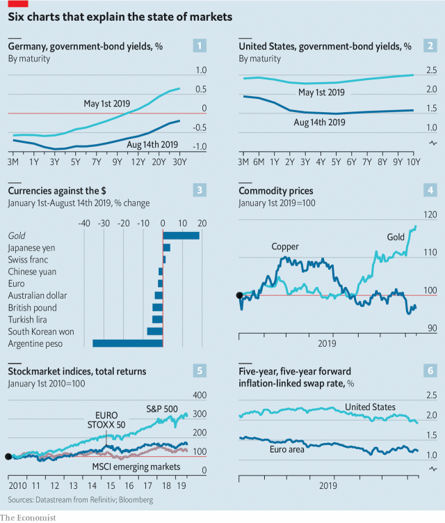

###### The new commonplace

# Six charts that explain the state of markets 

> print-edition iconPrint edition | Finance and economics | Aug 17th 2019 

IN THE AUTUMN of 2008, strange and novel things happened in financial markets, such as the emergence of negative yields on Treasury bills. In times of fear, the safest assets are at a premium. 

What was once strange is now ordinary. Negative yields are a familiar feature of European bond markets. But such is the anxiety about the world economy that they are spreading. In Germany, interest rates are negative all the way from cash to 30-year bonds (chart 1). In America yields are still positive. But the curve is inverted: interest rates on ten-year bonds are below those on three-month bills (chart 2). The last seven recessions in America have been preceded by an inverted yield curve. 

 

Nervous investors are reaching for the safety of the dollar. The yen and Swiss franc, habitual sanctuaries, are among the few currencies that have risen against it (chart 3). The price of gold, another haven, is at a six-year high. That of copper, a barometer of global industry, is down from its recent peak (chart 4). 

Faced with uncertainty, the go-to market for equity investors is America’s. It has left others in the dust (chart 5). MSCI’s emerging-market share index leans heavily towards “Factory Asia” (China, South Korea and Taiwan), which is in the eye of the trade-war storm. Europe’s markets lean towards banks and carmakers, which suffer in downturns. 

Investors fret that the rich world is slowly becoming Japanese, with economies that are too feeble to generate inflation. Forecasts of inflation in the swaps market have fallen sharply (chart 6). A fear in 2008 was that deflation might take root. The fear remains. 
<<<<<<< HEAD

-- 

 单词注释:

1.commonplace['kɒmәnpleis]:n. 寻常事, 老生常谈, 普通的东西 a. 平凡的, 普通的 

2.Aug[]:abbr. 八月（August） 

3.emergence[i'mә:dʒәns]:n. 出现, 浮现, 发生 

4.treasury['treʒәri]:n. 国库, 宝库, 财政部, 国库券 [经] 库存, 国库, 金库 

5.asset['æset]:n. 资产, 有益的东西 

6.premium['pri:miәm]:n. 额外补贴, 奖金, 奖赏, 保险费 [医] 保险费 

7.recession[ri'seʃәn]:n. 后退, 凹处, 衰退, 归还 [医] 退缩 

8.precede[.pri:'si:d]:vt. 在...之前, 优于, 较...优先 vi. 在前面 

9.invert[in'vә:t]:a. 转化的 vt. 使反转, 使颠倒, 使转化 n. 颠倒的事物 [计] 倒置; 反转 

10.investor[in'vestә]:n. 投资者 [经] 投资者 

11.yen[jen]:n. 日元(日本货币单位), 渴望, 嗜好 vi. 渴望 

12.sanctuary['sæŋktʃuәri]:n. 圣所(指教堂、寺院等), 耶路撒冷的神殿, 避难所 [法] 庇护所, 避难所, 教堂 

13.haven['heivn]:n. 港, 避难所, 安息所 vt. 安置...于港中, 庇护, 入港 

14.barometer[bә'rɒmitә]:n. 气压计 [化] 气压计 

15.uncertainty[.ʌn'sә:tnti]:n. 不确定, 不可靠, 不确定的事物 [化] 不确定度 

16.equity['ekwiti]:n. 公平, 公正 [经] 权益, 产权 

17.Korea[kә'riә]:n. 朝鲜, 韩国 

18.taiwan['tai'wɑ:n]:n. 台湾 

19.carmaker['kɑ:,meikә(r)]:n. 汽车制造商 

20.downturn['dauntә:n]:n. (尤指经济方面的)衰退, 下降趋势 [电] 低迷时期 

21.fret[fret]:n. 烦躁, 磨损, 焦急, 网状饰物 vi. 烦恼, 不满, 磨损 vt. 使烦恼, 腐蚀, 使磨损, 使起波纹 

22.inflation[in'fleiʃәn]:n. 胀大, 夸张, 通货膨胀 [化] 充气吹胀; 膨胀 

23.deflation[di'fleiʃәn]:n. 放气, 缩小, 通货紧缩 [医] 放气, 解除气胀 
=======
>>>>>>> 50f1fbac684ef65c788c2c3b1cb359dd2a904378

