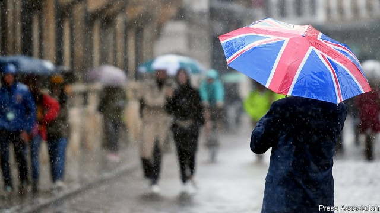
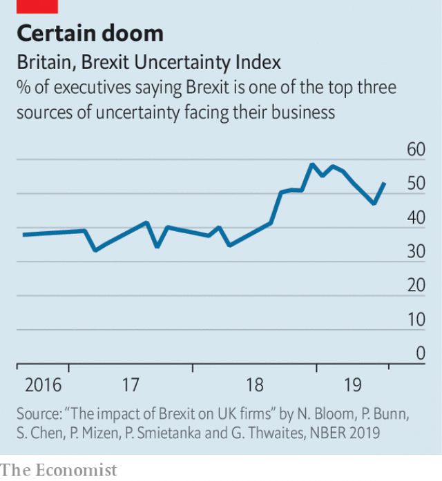

###### Deep freeze

# The chilling economic effects of Brexit uncertainty are intensifying 

 

> print-edition iconPrint edition | Finance and economics | Aug 17th 2019 

SINCE BRITAIN voted to leave the European Union (EU) in June 2016, Leavers have been gloating. Despite the Remain camp’s dire predictions, the economy seemed to trundle on well enough. But the crowing is dying down. Figures released on August 9th showed that Britain’s GDP shrank in the second quarter. And a growing body of research suggests that Brexit-related uncertainty is doing subtle but serious economic damage. 

A paper published early this year by Meredith Crowley, Oliver Exton and Lu Han of the University of Cambridge reckons that uncertainty over trade policy has dented export prospects. Had the vote not taken place, 5% more firms would have exported new products to the EU in 2016 alone. 

After the referendum economists from the Bank of England, the University of Nottingham and Stanford University set up the “Decision-maker panel”, a survey that regularly polls executives across the country’s industries and regions. In a new paper the researchers examine the responses of 5,900 firms, representing 14% of private-sector jobs, to gauge the effect of Brexit uncertainty on business. 

 

The results are startling. The uncertainty that comes with a rise in oil prices or an unexpected bank failure can be costly, but typically abates as more information becomes available. Brexit uncertainty is unusually persistent—after all, three years after the vote, the terms of departure are still unclear. The authors track the share of bosses reporting that Brexit is one of the top three sources of uncertainty, if not the biggest, facing their business (see chart). This remained elevated a full two years after the referendum, then rose further in 2018 as stalling talks with the EU raised the odds of a no-deal Brexit. 

Bosses reporting greater uncertainty also appear to have scaled back investment more. But the depressing effect is not quite what forecasters had envisaged in 2016. They had pencilled in a steep drop in investment immediately after the vote that would ease as firms adjusted to the new world. But in fact the drag on investment has worsened over time. (The effect of uncertainty on hiring is more ambiguous.) 

Importantly, the deceleration in investment has had significant knock-on effects on Britain’s productivity, which even before the referendum was dismal. That is partly because managers have been forced to spend valuable time planning. Between November 2018 and January 2019, nearly three-quarters of bosses put aside time each week to prepare for various outcomes. But uncertainty has also been a bigger burden on exporters, which tend to be more productive than firms catering to the home market. All told, productivity is 2-5% lower than it would have been without the uncertainty. Brexit still carries plenty of unknowns. The effect on Britain’s economy, though, is becoming ever clearer. ■ 

