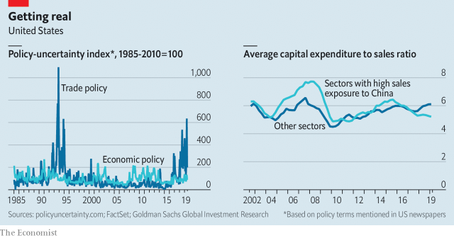
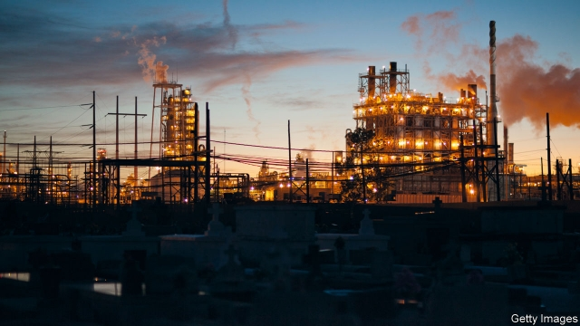

###### Under attack

# The trade war is leading some firms to crimp investment 

 

> print-edition iconPrint edition | Finance and economics | Aug 15th 2019 

“THERE’S TARIFFS on games and tariffs on toys—try explaining tariffs to your little boy. Santa’s workshop is struggling, you’ll find yourself saying. I think the reindeer are backed up with their sleighing.” Wendy Lazar, who runs a company called I Heart Guts, submitted this peeved poem to the United States Trade Representative (USTR) in June. As an importer of children’s toys from China, she was complaining about how the trade war could squeeze her firm. 

She is not alone. In boardrooms across America, business people are scrambling to assess the impact of the latest escalation in the commercial confrontation between the two superpowers. For most firms the easy bit is calculating the immediate financial impact of more tariffs on demand, prices and costs. That can be done in a spreadsheet. Far harder is working out how to rejig your strategy and long-term investment plans to adapt to a new world of enduring trade tensions. Fund managers and Wall Street traders have begun to reach their own conclusion—that investment may slump, possibly triggering a recession. Hence the violent moves in markets since the first week of August, with a rush towards safe bonds and a sell-off in equities (see article). 

That sell-off picked up pace on August 1st when President Donald Trump’s administration announced the imposition of tariffs on $300bn of Chinese goods, at a rate of 10%, starting on September 1st. On August 13th the USTR announced a delay covering about two-thirds of the goods in question, including mobile phones, smartwatches and toys, which would be subject to duties starting on December 15th. As Mr Trump explained later that day, the move would allow American shoppers to splurge in the run-up to Christmas. The press release announcing the delay arrived at 9.43am; between 9.40 and 9.45 shares in Apple rose by 3%, and the S&P 500 share index jumped by 1%. But by the following day the stockmarket—and the iPhone-maker’s share price—slumped again as investors fretted that a global downturn might soon be on the cards. 

America’s expansion may be cooling as it enters its second decade, but GDP still grew at a respectable pace of 2.1% in the second quarter of 2019, and the unemployment rate is a brag-worthy 3.7%. The direct effect of the tariffs should be small: in 2017, before hostilities began, goods trade with China amounted to just 3.2% of GDP. Even including the additional levies planned for December, they represent a tax rise offsetting only a fifth of the cuts introduced by the Tax Cuts and Jobs Act of 2017. 

What really matters, though, is the wider effects of the uncertainty created by the trade war on corporate behaviour. Most companies make plans over a five- to ten-year horizon and invest in assets with a life of 10-20 years. But with each new tariff announcement, the rules for trading their products become less stable. And the scope of the trade war has expanded beyond goods to technology and currencies. Perhaps the international banking system, shipping companies or foreign joint ventures could be next. The most sophisticated firms try to gauge such risks. 

The high level of uncertainty is measurable. A study from 2016 by Scott Baker of Northwestern University, Nick Bloom of Stanford University and Steven Davis of the University of Chicago quantified policy uncertainty in America using newspaper reports. Their index of trade-policy uncertainty has soared in recent months (see chart). And such increases in uncertainty tend to have real effects. The researchers found that increases in their index were associated with dampened investment and slower hiring. More recently, Ryan Sweet of Moody’s Analytics, a financial firm, finds that changes in business confidence and economic-policy uncertainty appear to predict changes in managers’ capital spending. 

 

Given all this, how is investment in America holding up? In the second quarter non-residential business investment shrank at an annualised rate of 0.6%. The question is to what extent the trade war is the culprit, rather than industry-specific factors, domestic economic trends or the global manufacturing cycle. To get a sense of this The Economist has analysed around 2,400 listed American companies in 42 sectors, taking into account both their investment levels and how dependent their sector is on Chinese inputs. 

Firms with a higher degree of Sino-reliance do seem to have scaled back investment. The 20 sectors most exposed to inputs from China accounted for a third of total investment by the 2,400 firms. In total these sectors saw aggregate capital spending drop by 1% in the past four quarters compared with the prior year. Meanwhile the other 22 sectors, which are less exposed to China, saw investment rise by 14%. The analysis is simple: other factors may well have played a role. 

But business executives too report an effect on investment. A survey compiled by the Federal Reserve Bank of Atlanta in January found that trade tensions had crimped investment by 1.2%. Tariffs were mentioned in a quarter of all earnings calls among companies in the S&P 500 index in the second quarter of 2019, according to figures from FactSet, a data-analytics firm. One of the sectors most exposed to China is chemicals. In July Jim Fitterling, chief executive of Dow, a big producer, told investors on an earnings call that he would keep capital spending “tight” until he got “better visibility”, adding that he thought a trade deal was needed to “get some confidence back in this market”. 

 

Wall Street economists are also crunching data on how trade-policy uncertainty is altering companies’ behaviour. In June researchers at Goldman Sachs had been sceptical that the trade war was hampering investment, pointing out that overall policy uncertainty was low. But more recently they have altered their view, finding that, after adjusting for underlying trends, sectors that sell more to China (rather than those that buy from it) were seeing slower investment growth than those that were less exposed. 

Goldman’s economists also found that tariff announcements were associated with worsening financial conditions (higher borrowing costs, lower equity prices or a stronger dollar). Expectations of interest-rate cuts by the Federal Reserve have only offset half of the shift in financial conditions. Overall the analysts reckon that, including indirect effects, the hit to GDP would be 0.6%—material, but not enough to tip America into recession. 

The overall picture, therefore, is that there is now good evidence that the trade war is leading some firms to crimp investment. Pessimists worry that the knock-on effect from this capital-spending stumble could be far-reaching and more painful than the likes of Goldman expect. In the long run it could sap productivity. In the short run it could cause firms to scale back hiring. That could then damage consumers’ confidence. 

Much depends on whether hostilities between America and China intensify. On August 13th Mr Trump said that he had a “very, very productive call” with China’s leaders. But few on the ground take seriously the prospect of a lasting reconciliation. Jake Parker of the US-China Business Council, a lobby group, reports that his members have realised that the threat of future levies would still lurk even if a deal were struck and tariffs lifted. Blows to China’s economy could also spill back to America. 

And Mr Trump has plenty more ways of injecting fear into the economy. He must decide whether to reinstate onerous restrictions on American companies that do business with Huawei, a Chinese telecommunications giant, by August 19th. His labelling of China as a currency manipulator could ignite a currency war. If the sickness that is now visible in most trade-exposed sectors spills over to the rest of the economy, that would set off a downward spiral that not even lifting tariffs, and allowing in Ms Lazar’s stuffed toys, would reverse.■ 
<<<<<<< HEAD

-- 

 单词注释:

1.crimp[krimp]:n. 诱人当兵的人, 拳曲, 鬈发 vt. 诱...去当兵, 使拳曲, 使有褶 

2.Aug[]:abbr. 八月（August） 

3.tariff['tærif]:n. 关税, 关税表, 价格表, 收费表 vt. 课以关税 [计] 价目表 

4.reindeer['rein.diә]:n. 驯鹿 

5.sleigh[slei]:n. 雪撬 vt. 用雪撬搬运 vi. 乘雪撬 

6.wendy['wendi]:n. 温迪（女子名） 

7.lazar['læzә]:n. 恶疾患者 [医] 麻风病人 

8.gut[gʌt]:n. 剧情, 内容, 内脏, 肚子, 海峡, 勇气 vt. 取出内脏, 毁坏...的内部 

9.peeve[pi:v]:v. (使)气恼, (使)焦躁, (使)忿怒 n. 麻烦的事物, 怨恨, 生气, 触怒 

10.ustr[]:abbr. United States trade representative 美国贸易代表; United States Trade Representative 美国贸易代表 

11.importer[im'pɒ:tә]:n. 输入者, 进口商 [法] 进口商, 输入者 

12.boardroom['bɒ:drum]:n. 会议室, 证券交换场所 

13.scramble['skræmbl]:n. 攀缘, 爬行, 抢夺, 混乱, 紧急起飞 vi. 攀缘, 杂乱蔓延, 争夺, 拼凑, 匆忙 vt. 攀登, 扰乱, 使混杂 

14.escalation[.eskә'leiʃәn]:n. 扩大, 增加 [经] 调查, 价格调整 

15.confrontation[.kɔnfrʌn'teiʃәn]:n. 对抗；对质；面对 

16.superpower[.sju:pә'pauә]:n. 超级强权, 超级大国 [经] 超级大国 

17.spreadsheet['spredʃi:t]:n. 空白表格程序, 电子制表软件, 电子数据表 [计] 电子表格 

18.rejig[ˌri:ˈdʒɪg]:vt. 重新装备 n. 重新安排；调整 

19.trader['treidә]:n. 商人, 商船 [经] 交易者, 商船 

20.slump[slʌmp]:n. 暴跌, 垂头弯腰的姿态 vi. 猛然掉落, 陷入, 衰落(经济等) 

21.trigger['trigә]:n. 触发器, 扳机 vt. 触发, 发射, 引起 vi. 松开扳柄 [计] 切换开关 

22.recession[ri'seʃәn]:n. 后退, 凹处, 衰退, 归还 [医] 退缩 

23.equity['ekwiti]:n. 公平, 公正 [经] 权益, 产权 

24.imposition[.impә'ziʃәn]:n. 征收, 课税, 强加, 欺骗 [经] 征税, 税, 税款 

25.smartwatches[]:[网络] 智能手表 

26.shopper['ʃɒpә]:n. 购物者 [经] 顾客, 购物的人 

27.splurge[splә:dʒ]:n. 炫耀, 夸示 vi. 炫耀, 卖弄, 挥霍 vt. 挥霍 

28.investor[in'vestә]:n. 投资者 [经] 投资者 

29.fret[fret]:n. 烦躁, 磨损, 焦急, 网状饰物 vi. 烦恼, 不满, 磨损 vt. 使烦恼, 腐蚀, 使磨损, 使起波纹 

30.downturn['dauntә:n]:n. (尤指经济方面的)衰退, 下降趋势 [电] 低迷时期 

31.respectable[ri'spektәbl]:a. 值得尊重的, 人格高尚的, 相当数量的 n. 品格高尚的人 

32.hostility[hɒs'tiliti]:n. 敌意, 敌对, 反对 

33.levy['levi]:n. 税款, 所征的人数, 征收 vi. 征税, 课税 vt. 征收, 强求, 召集 

34.offset['ɒ:fset]:n. 抵消, 把...并列, 旁系, 支管, 用胶印法印 vt. 弥补, 抵消, 胶印 vi. 装支管 n. 偏移量 [计] 偏移量 

35.uncertainty[.ʌn'sә:tnti]:n. 不确定, 不可靠, 不确定的事物 [化] 不确定度 

36.corporate['kɒ:pәrit]:a. 社团的, 合伙的, 公司的 [经] 团体的, 法人的, 社团的 

37.asset['æset]:n. 资产, 有益的东西 

38.les[lei]:abbr. 发射脱离系统（Launch Escape System） 

39.sophisticate[sә'fistikeit]:n. 久经世故的人, 精于...之道的人 vt. 篡改, 曲解, 使变得世故, 掺合, 弄复杂 vi. 诡辩 

40.scott[skɔt]:n. 斯科特（男子名） 

41.baker['beikә]:n. 面包师 [医] 烤箱(骨科用) 

42.northwestern[.nɒ:θ'westәn]:a. 在西北部的, 西北方的, 来自西北的 

43.nick[nik]:n. 刻痕, 缺口, 划痕 vt. 刻痕于, 弄缺, 擦伤 vi. 狙击 

44.stanford['stænfәd]:n. 斯坦福（姓氏, 男子名）；斯坦福大学（美国一所大学） 

45.steven['sti:vn]:n. 史蒂文（男子名） 

46.davis['deivis]:n. 戴维斯（男子名） 

47.Chicago[ʃi'kɑ:gәu]:n. 芝加哥 

48.quantify['kwɒntifai]:vt. 定量, 用数量表示, 测量 

49.soar[sɒ:]:n. 高扬, 翱翔 vi. 往上飞舞, 高耸, 翱翔 

50.dampen['dæmpәn]:vt. 弄湿, 使沮丧 vi. 变湿, 丧气 

51.ryan['raiәn]:n. 赖安（男子名） 

52.analytic[.ænә'litik]:a. 分析的, 善于分析的, 解析的 [医] 分析的 

53.annualised['ænjuəlaizd]:a. 年度的 v. 按年计算（annualise的过去式和过去分词） 

54.culprit['kʌlprit]:n. 犯人, 罪犯, 刑事被告 [法] 犯罪者, 犯人, 罪犯 

55.manufacturing[.mænju'fæktʃәriŋ]:n. 制造业 a. 制造业的 

56.economist[i:'kɒnәmist]:n. 经济学者, 经济家 [经] 经济学家 

57.sector['sektә]:n. 扇形, 部门, 部分, 函数尺, 象限仪, 段, 区段 vt. 把...分成扇形 [计] 扇面; 扇区; 段; 区段 

58.aggregate['ægrigәt]:n. 合计, 总计, 聚集体 a. 合计的, 聚集的 v. 聚集, 集合, 合计达 [计] 聚合体; 聚集 

59.atlanta[әt'læntә]:n. 亚特兰大（美国城市） 

60.earning['ә:niŋ]:n. 收入（earn的现在分词） 

61.factset[]:[网络] 辉盛；研究系统公司；辉盛研究系统 

62.jim[dʒim]:n. 吉姆（人名） 

63.dow[daj]:n. 美国陶氏；美国陶氏化学；道琼斯平均指数 

64.producer[prә'dju:sә]:n. 生产者, 制作者, 制作人 [化] 发生器; (炉煤气)发生炉; 制气炉; 生产者 

65.visibility[.vizi'biliti]:n. 可见性, 能见度, 能见距离 [计] 可见性 

66.economist[i:'kɒnәmist]:n. 经济学者, 经济家 [经] 经济学家 

67.crunch[krʌntʃ]:v. 嘎吱嘎吱的咬嚼, 压碎, 嘎吱嘎吱地踏过 n. 咬碎, 咬碎声 

68.datum['deitәm]:n. 论据, 材料, 资料, 已知数 [医] 材料, 资料, 论据 

69.goldman[]:n. 高曼（姓氏） 

70.Sachs[zaks]:n. 萨克斯（汽车零配件生产厂商） 

71.hamper['hæpә]:n. 食篮, 阻碍物, 食盒 vt. 阻碍, 使困累, 妨碍, 牵制 

72.underlie[.ʌndә'lai]:vt. 位于...之下, 成为...的基础 

73.worsen['wә:sn]:vt. 使更坏, 使恶化 vi. 变得更坏, 恶化 

74.analyst['ænәlist]:n. 分析者, 精神分析学家 [化] 分析员; 化验员 

75.reckon['rekәn]:vt. 计算, 总计, 估计, 认为, 猜想 vi. 数, 计算, 估计, 依赖, 料想 

76.pessimist['pesimist]:n. 悲观者, 厌世者, 悲观主义者 

77.sap[sæp]:n. 树液, 体液, 活力, 坑道, 消弱, 警棍 vt. 使排出体液, 使伤元气, 使衰竭, 挖坑道逼近, 逐渐侵蚀 vi. 挖坑道, 消弱 [计] 共享汇编程序, 结构分析程序, 符号汇编程序, 服务器广告协议 

78.productivity[.prәudʌk'tiviti]:n. 生产力 [经] 生产率, 生产能力 

79.intensify[in'tensifai]:vt. 加强 vi. 强化 

80.reconciliation[,rekәnsili'eiʃәn]:n. 和解, 和好, 复交, 调解, 调停, 和谐, 一致, 甘愿, 顺从 [经] (银行往来)调节, 调和, 一致 

81.jake[dʒeik]:a. 满意的, 上等的 n. 乡下佬, 家伙 

82.parker['pɑ:kә]:n. 停放车辆的人 

83.lobby['lɒbi]:n. 大厅, 休息室, 游说议员者 vi. 游说议员, 游说 vt. 游说 

84.lurk[lә:k]:n. 潜伏, 潜行 vi. 暗藏, 潜伏, 埋伏 [计] 隐匿阅读 

85.inject[in'dʒekt]:vt. 注射, 注入, 使入轨 [医] 注射 

86.reinstate[.ri:in'steit]:vt. 使复原, 使恢复, 使复立 

87.onerous['ɒnәrәs]:a. 繁重的, 负有法律责任的 [法] 负有义务的, 艰巨的, 繁重的 

88.huawei[]: 华为 

89.telecommunication['telikәmju:ni'keiʃәn]:n. 电讯, 远距离通讯, 无线电通讯 [计] 远程通信, 电信 

90.manipulator[mә'nipjuleitә]:n. 操作者, 机械手 [化] 机械手 

91.ignite[ig'nait]:vt. 点燃, 使灼热, 使兴奋 

92.spiral['spairәl]:n. 螺旋形之物, 螺线 a. 螺旋形的, 盘旋的 vi. 螺旋形下降, 螺旋形上升, 螺旋形行进 vt. 使螺旋形行进 
=======
>>>>>>> 50f1fbac684ef65c788c2c3b1cb359dd2a904378

