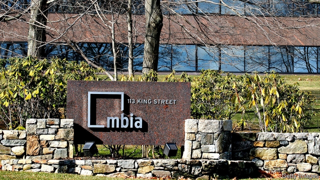

###### Bad wrap

# The woes of bond insurers 

 

> print-edition iconPrint edition | Finance and economics | Aug 17th 2019 

ON AUGUST 8TH two subsidiaries of MBIA, an American insurer, sued nine Wall Street firms, alleging misconduct in underwriting bonds issued by Puerto Rico and “wrapped”, or guaranteed, by MBIA. Lawsuits accusing banks of peddling iffy securities are not rare these days. However, this one is a reminder that “monoline” bond insurers, which briefly played a starring role in the financial crisis of 2008, are, though hardly full of life, still kicking. 

Monoline insurers (so called because they focus solely on providing financial guarantees) charge a premium to cover interest and principal payments should bonds default. The industry sprang up in the 1970s, first focusing on municipal debt and later branching out into structured products like mortgage securities. That expansion backfired spectacularly when American house prices crashed. For a few weeks in 2008 the previously obscure monolines—the biggest of which were MBIA and New York-based Ambac—became front-page news as fears spread that they might be unable to pay claims on hundreds of billions of dollars of securitised debt. 

Rating agencies responded by downgrading monolines’ own debt. That did for some of them, given that the business was largely about lending the insurer’s AAA rating to the bonds. Ambac filed for bankruptcy and was placed in rehabilitation. MBIA avoided going bust but is a shadow of its former self. Both firms remain in run-off, meaning they cannot write new policies, but have big books of existing business. These days, most new policies are written by either Bermuda’s Assured Guaranty or New York-based Build America Mutual. 

The monolines had hoped that less-ravaged municipal bonds would shore them up. But there too volume tumbled as issuance dwindled and interest rates fell, eroding margins. Josh Esterov of CreditSights, a research firm, reckons the muni-insurance business is a tenth of its pre-crisis size. 

Moreover, as the public-finance market shrank it also convulsed. Insurers have suffered bigger-than-expected losses on muni defaults, from Detroit to Puerto Rico. The latter’s bankruptcy in 2017, designed to help it restructure $120bn of debt and pension obligations, has hit them particularly hard. The $170m net loss under US GAAP made by MBIA in the latest quarter was largely down to Puerto Rico. 

The $720m MBIA is seeking from Citigroup, UBS and seven other banks matches the value of claims it has paid out on Puerto Rican contracts. It accuses them of creating “a financial abyss of historic proportions” by urging Puerto Rico to issue “unsustainable” debt, and making false or misleading disclosures on which the insurer relied. The banks’ defence is likely to focus on the fact that bond insurers are hardly unsophisticated; insurers have long advertised their credit-surveillance skills. 

All of which suggests that post-crisis bond insurance is not for the faint-hearted. Last year David Einhorn became the latest in a long line of hedge funders to publicly short a bond insurer, calling Assured Guaranty “a melting ice cube”. The firm pooh-poohed the critique, and many clearly think it has navigated the morass well: its share price is 50% above its pre-crisis peak (and 23% higher than when Mr Einhorn weighed in); MBIA’s is down by 88%. This has allowed Assured to swoop in on some of the more attractive bits of rivals’ books. It is also diversifying: on August 9th it acquired BlueMountain, a fund manager specialising in collateralised loan obligations—securities backed by leveraged loans, which fared better than mortgage-backed debt in the crisis and remain popular with yield-hungry investors.■ 

