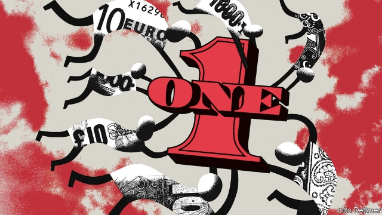

###### Free exchange

# What comes after Bretton Woods II? 

 

> print-edition iconPrint edition | Finance and economics | Aug 15th 2019 

“THERE IS NO longer any need for the United States to compete with one hand tied behind her back,” Richard Nixon, then America’s president, told his countrymen in August 1971. With that speech, he heralded the end of the post-war economic order, suspending the convertibility of the dollar into gold and putting up tariffs on imports. The survival of today’s order, which emerged from the chaos that followed, now also looks in doubt. In other circumstances, its demise might not have been mourned. But with each passing August day, the prospects for a happy shift from one global monetary regime to another look ever grimmer. 

International trade is complicated by the fact that most countries have their own currencies, which move in idiosyncratic ways and can be held down to boost competitiveness. Governments’ efforts to manage currencies are constrained by certain trade-offs. Pegging them to an external anchor to stabilise their value means either ceding control of domestic economic policy or restricting access to foreign capital flows. Systems of monetary order, which resolve these trade-offs in one way as opposed to another, work until they do not. The context for America’s economic showdown with China is a system that worked once but no longer does. 

Such things happen. The first great age of globalisation, which began in the late 19th century, was built atop the gold standard. Governments fixed the value of their currencies to gold, sacrificing some control over the domestic economy. This trade-off became untenable during the Great Depression, when governments reneged on their monetary commitments. As one after another devalued, angry trading partners put up tariffs, and the world retreated into rival currency blocs. In 1944 Allied nations had another go at crafting a monetary order at a conference in Bretton Woods, New Hampshire. Participating countries fixed their currencies to the dollar (with some room for adjustment). The buck, in turn, was pegged to gold. The truce survived a mere quarter-century. As America’s trade balance sagged and inflation rose in the 1960s and 1970s, faith in the dollar’s peg to gold waned. Drastic fiscal and monetary belt-tightening might have restored its credibility abroad, but at great cost at home. Forced to choose between the domestic interest and the survival of the global monetary system, Nixon abandoned America’s Bretton Woods commitments. 

The present system, often described as Bretton Woods II, slowly emerged from the ashes of the post-war order. The dollar’s dominance did not end. Much of the world’s commerce trades in greenbacks. Changes in America’s economic policy still echo around the world. A stronger dollar depresses global trade, research suggests, while tighter American monetary policy straitens global financial conditions. Through bitter experience, emerging economies learnt that protecting themselves against these gales meant accumulating large dollar reserves, which began to pile up in the 1990s and peaked in 2014. Emerging-market dollar purchases kept the greenback overvalued and boosted the competitiveness of emerging-market exporters. America began running large, persistent current-account deficits. In other words, its excessive consumption was funded by lending from the emerging world, which invested its dollars into American assets. This flow of money—from reserve-accumulating economies, China chief among them, to America, and from American consumers back to reserve-accumulating economies—defined Bretton Woods II. 

The regime never looked particularly sustainable. America could not borrow from abroad for ever, and persistent current-account deficits ate away at its export industries. In the 2000s some economists worried that investors might lose faith in the greenback, precipitating a collapse in the dollar and a global crisis. Fewer observers predicted that America might tire of its role in the system, or that damage done to American communities by deindustrialisation might make politicians across the spectrum sceptical of the gains from globalisation. 

For a time, though, a benign end to Bretton Woods II seemed possible. As Europe’s economies became more integrated and China grew, the prospect of a multipolar world, in which the dollar shared reserve-currency duties with the euro and the renminbi, loomed. European and Chinese consumers would play as important a role as American ones—and global imbalances would shrink. Alas, history has had other ideas. Amid the turmoil of the past decade, investors have clung to the safety of dollar assets, reinforcing America’s monetary hegemony. Debt crises have undercut faith in the euro. Confidence in the renminbi’s inevitable rise has been dimmed by China’s slowing growth, and its diminished enthusiasm for reform. Meanwhile, the present system looks more vulnerable than ever. President Donald Trump’s spiralling trade and currency wars threaten to topple Bretton Woods II, even as attractive alternatives to the system fade. 

A minimally disruptive end to Bretton Woods II remains within the realms of possibility. Its fate might resemble that of Bretton Woods I, especially if Mr Trump loses office in 2020. Democrats are more economically nationalistic than they used to be, but still mindful of the value of global co-operation. President Bernie Sanders or Elizabeth Warren might seek a one-off depreciation of the dollar while recommitting America to a rules-based system of global trade. A recession in China could scare its leadership into offering concessions on trade that America would accept. 

But the experience of the 1930s may prove a more apt guide. In the absence of a co-ordinated adjustment to exchange rates and a peaceful end to trade hostilities, the world could stumble into a cycle of competitive devaluations and tariff rises. As trading relationships unravel, countries may organise themselves into rival economic blocs. It is hard to imagine the world repeating such an ugly era of history. But not as hard as it used to be. ■ 
<<<<<<< HEAD

-- 

 单词注释:

1.Bretton['bretәn]:Woods布雷顿森林 

2.Aug[]:abbr. 八月（August） 

3.richard['ritʃәd]:n. 理查德（男子名） 

4.nixon['niksn]:n. 尼克松（美国第37任总统） 

5.countryman['kʌntrimәn]:n. 同胞, 乡下人, 国民 

6.herald['herәld]:n. 使者, 传令官, 先驱 vt. 预报, 宣布, 传达, 欢呼 

7.convertibility[kәn.vә:tә'biliti]:n. 可改变性, 可变换, 可兑换 [经] 可兑换性 

8.tariff['tærif]:n. 关税, 关税表, 价格表, 收费表 vt. 课以关税 [计] 价目表 

9.chao[]:n. 钞（货币） 

10.demise[di'maiz]:n. 崩, 薨, 死亡 vt. 让渡, 遗赠, 转让 

11.monetary['mʌnitәri]:a. 货币的, 金钱的 [经] 货币的, 金融的 

12.regime[rei'ʒi:m]:n. 政权, 当权期间, 政体, 社会制度, 体制, 情态 [医] 制度, 生活制度 

13.grim[grim]:a. 冷酷的, 坚强的, 残忍的, 可怕的, 讨厌的 

14.idiosyncratic[.idiәsiŋ'krætik]:a. 特质的, 异质的, 特殊的 [医] 特[异反]应性的, 特异体质的 

15.competitiveness[]:[经] 竞争 

16.constrain[kәn'strein]:vt. 强迫, 限制, 关押 

17.peg[peg]:n. 钉, 桩, 栓, 藉口, 销子, 借口 vt. 钉木钉, 固定, 限制, 使受约束 vi. 坚持不懈地奋力于, 疾行 

18.stabilise['steibilaiz]:vt.vi. (使)稳定, (使)安定, (使)坚固 vt. 装稳定器 

19.cede[si:d]:vt. 割让 [法] 割让, 让与, 放弃 

20.context['kɒntekst]:n. 上下文, 背景, 来龙去脉 n. 上下文 [计] 上下文 

21.showdown['ʃәudaun]:n. 摊牌, 暴露, 紧要关头 

22.globalisation[,gləubəlai'zeiʃən]:n. 全球化, =globalization 

23.atop[ә'tɒp]:adv. 在顶上 prep. 在...的顶上 

24.untenable[.ʌn'tenәbl]:a. 不能防守的, 不能维持的, 支持不住的, (主张等)站不住脚的 

25.renege[ri'ni:g]:vi. 违例出牌, 食言, 毁约 vt. 否认, 放弃, 拒绝 n. 出牌违例 

26.devalue[di:'vælju:]:vt.vi. 降低...的价值, 贬值, 降低价值, 使(货币)贬值 [经] 贬值 

27.bloc[blɒk]:n. 集团 

28.ally['ælai. ә'lai]:n. 同盟者, 同盟国, 助手 vt. 使联盟, 使联合, 使有关系 vi. 结盟 

29.hampshire['hæmpʃiә]:n. 汉普郡（英国南部之一郡） 

30.buck[bʌk]:n. 元, 雄鹿, 纨绔子弟, 鞍马, 培克(赌博时的庄家标志), 碱水, 自夸, 谈话 vi. 马背突然拱起, 反对, 吹牛, 闲聊 vt. 马背突然拱起将骑手摔下, 反对, 用碱水洗 a. 雄的 

31.truce[tru:s]:n. 停战, 休战 vi. 停战, 休止 vt. 以休战结束 

32.sag[sæg]:vi. 下垂, 倾斜, 萎靡, 萧条, 变得乏味 vt. 使下垂 n. 下垂, 倾斜, 萧条 [计] 系统分析组, 语法分析生成程序, 电压下降 

33.inflation[in'fleiʃәn]:n. 胀大, 夸张, 通货膨胀 [化] 充气吹胀; 膨胀 

34.wane[wein]:n. 减少, 衰微, 败落, 亏缺, 月亏 vi. 变小, 亏缺, 衰落, 消逝, 退潮 

35.drastic['dræstik]:a. 激烈的 [医] 峻泻药, 剧烈的 

36.fiscal['fiskәl]:a. 财政的, 国库的 [经] 财政上的, 会计的, 国库的 

37.credibility[.kredi'biliti]:n. 可信用, 确实性, 可靠 [法] 证据能力, 可信程度, 确实性 

38.ii[]:abbr. 微光（Image Intensification） 

39.dominance['dɔminәns]:n. 优势, 显性, 统治, 控制, 支配 [计] 控制, 扰势 

40.greenback['gri:nbæk]:n. 美钞, 绿背动物 [法] 美钞 

41.straiten['streitn]:vt. 使为难, 使穷困, 限制 

42.overvalue[.әuvә'vælju:]:vt. 估价过高, 过分尊重, 估计过高 

43.exporter[ik'spɒ:tә]:n. 出口商, 输出者, 出口公司 [经] 出口商, 输出者 

44.persistent[pә'sistәnt]:a. 固执的, 坚持的, 持续的, 作用持久的 [法] 坚持的, 固执的, 持续的 

45.deficit['defisit]:n. 赤字, 不足额 [医] 短缺 

46.asset['æset]:n. 资产, 有益的东西 

47.sustainable[sә'steinәbl]:a. 足可支撑的, 养得起的, 可以忍受的 

48.economist[i:'kɒnәmist]:n. 经济学者, 经济家 [经] 经济学家 

49.investor[in'vestә]:n. 投资者 [经] 投资者 

50.precipitate[pri'sipiteit]:n. 沉淀物, 凝结物, 结果 vt. 猛抛, 使陷入, 促成, 使沉淀 vi. 猛地落下 a. 突然的, 猛地落下的, 轻率的 

51.deindustrialisation[]:[网络] 去工业化；后工业化 

52.spectrum['spektrәm]:n. 光谱, 范围, 系列 [化] 光谱 

53.benign[bi'nain]:a. 善良的, 良性的 [医] 良性的 

54.multipolar[.mʌlti'pәulә]:a. 多极的 [医] 多极的 

55.euro['juәrәu]:n. 欧元（欧盟的统一货币单位） 

56.Renminbi['ren'min'bi:]:人民币 

57.loom[lu:m]:n. 织布机, 若隐若现的景象 vi. 朦胧地出现, 隐约可见, 可怕地出现 

58.imbalance[im'bælәns]:n. 不平衡, 不均衡 [医] 不平衡, 失调 

59.ala['eilә]:n. 翼, 翅 [化] 丙氨酸 

60.amid[ә'mid]:prep. 在其间, 在其中 [经] 在...中 

61.turmoil['tә:mɒil]:n. 骚动, 混乱 

62.cling[kliŋ]:vi. 粘紧, 附着, 紧贴, 坚持 

63.hegemony[hi:'dʒemәni]:n. 霸权, 领导权, 支配权, 拥有支配权的政府 [法] 霸权, 盟主权 

64.undercut['ʌndәkʌt]:n. 底切, 牛腰部下侧嫩肉, 下口, 下旋削球 vt. 廉价出售, 底切, 雕出, 下旋削球 vi. 切除底部 

65.diminish[di'miniʃ]:v. (使)减少, (使)变小 

66.vulnerable['vʌlnәrәbl]:a. 易受伤害的, 有弱点的, 易受影响的, 脆弱的, 成局的 [医] 易损的 

67.spiral['spairәl]:n. 螺旋形之物, 螺线 a. 螺旋形的, 盘旋的 vi. 螺旋形下降, 螺旋形上升, 螺旋形行进 vt. 使螺旋形行进 

68.topple['tɒpl]:vt. 推翻, 颠覆 vi. 倒塌, 摇摇欲坠 

69.minimally[]:adv. 最低限度地；最低程度地 

70.disruptive[dis'rʌptiv]:a. 分裂的, 破坏(性)的 [计] 击穿的, 中断的 

71.democrat['demәkræt]:n. 民主人士, 民主主义者, 民主党党员 [经] 民主党 

72.economically[i:kә'nɔmikәli]:adv. 节约地, 不浪费地, 节省地, 节俭地, 在经济上, 在经济学上 

73.nationalistic[.næʃәnә'listik]:a. 国家主义的 

74.mindful['maidful]:a. 深切注意的, 留神的, 留心的 

75.bernie['bә:ni]:n. 伯尼（男子名）；[俚]可卡因（等于cocaine） 

76.sander['sændә]:[电] 散沙 

77.elizabeth[i'lizәbәθ]:n. 伊丽莎白（女子名） 

78.warren['wɒrәn]:n. 养兔场, 拥挤的地区 

79.depreciation[di.pri:ʃi'eiʃәn]:n. 价值减低, 减价, 跌落, 贬低, 折旧 [化] 折旧; 减值 

80.recommit[.ri:kә'mit]:vt. 把...再委托, 再犯 [法] 再委托, 重提, 再犯 

81.recession[ri'seʃәn]:n. 后退, 凹处, 衰退, 归还 [医] 退缩 

82.concession[kәn'seʃәn]:n. 特许, 让步, 认可 [经] 核准, 许可, 特殊(权) 

83.apt[æpt]:a. 有...倾向的, 易于的, 恰当的, 聪明的 [计] 自动数控语言, 自动图象传输, 自动程序控制, 自动程序设计工具 

84.hostility[hɒs'tiliti]:n. 敌意, 敌对, 反对 

85.devaluation[,di:vælju'eiʃәn]:n. 降低价值, 贬值 [经] 贬值 

86.unravel[.ʌn'rævl]:vt. 阐明, 解决, 解开 vi. 散开 
=======
>>>>>>> 50f1fbac684ef65c788c2c3b1cb359dd2a904378

