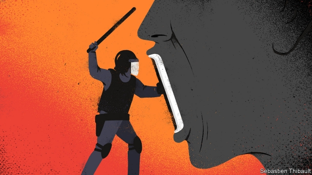
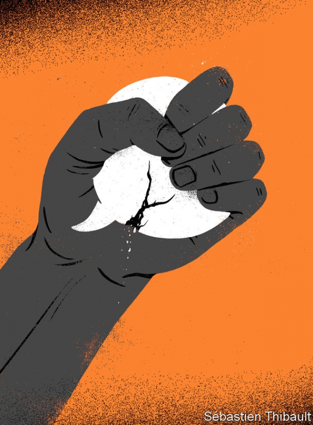

###### The new censors

# The global gag on free speech is tightening 

 

> print-edition iconPrint edition | International | Aug 17th 2019 

ON JUNE 22ND there was an alleged coup attempt in Ethiopia. The army chief of staff was murdered, as was the president of Amhara, one of the country’s nine regions. Ordinary Ethiopians were desperate to find out what was going on. And then the government shut down the internet. By midnight some 98% of Ethiopia was offline. 

“People were getting distorted news and were getting very confused about what was happening...at that very moment there was no information at all,” recalls Gashaw Fentahun, a journalist at the Amhara Mass Media Agency, a state-owned outlet. He and his colleagues were trying to file a report. Rather than uploading audio and video files digitally, they had to send them to head office by plane, causing a huge delay. 

Last year 25 governments imposed internet blackouts. Choking off connectivity infuriates people and kneecaps economies. Yet autocrats think it worthwhile, usually to stop information from circulating during a crisis. 

This month the Indian government shut down the internet in disputed Kashmir—for the 51st time this year. “There is no news, nothing,” says Aadil Ganie, a Kashmiri stuck in Delhi, adding that he does not even know where his family is because phones are blocked, too. In recent months Sudan shut down social media to prevent protesters from organising; Congo’s regime switched off mobile networks so it could rig an election in the dark; and Chad nobbled social media to silence protests against the president’s plan to stay in power until 2033. 

Free speech is hard won and easily lost. Only a year ago it flowered in Ethiopia, under a supposedly liberal new prime minister, Abiy Ahmed. All the journalists in jail were released, and hundreds of websites, blogs and satellite TV channels were unblocked. But now the regime is having second thoughts. Without a dictatorship to suppress it, ethnic violence has flared. Bigots have incited ethnic cleansing on newly free social media. Nearly 3m Ethiopians have been driven from their homes. 

Ethiopia faces a genuine emergency, and many Ethiopians think it reasonable for the government to silence those who advocate violence. But during the alleged coup it did far more than that—in effect it silenced everyone. As Befekadu Haile, a journalist and activist, put it: “In the darkness, the government told all the stories.” 

Some now fear a return to the dark days of Abiy’s predecessors, when dissident bloggers were tortured. The regime still has truckloads of electronic kit for snooping and censoring, much of it bought from China. It is also planning to criminalise “hate speech”, under a law that may require mass surveillance and close monitoring of social media by police. Many fret that the law will be used to lock up peaceful dissidents. 

According to Freedom House, a watchdog, free speech has declined globally over the past decade. The most repressive regimes have become more so: among those classed as “not free” by Freedom House, 28% have tightened the muzzle in the past five years; only 14% have loosened it. “Partly free” countries were as likely to improve as to get worse, but “free” countries regressed. Some 19% of them (16 countries) have grown less hospitable to free speech in the past five years, while only 14% have improved (see map). 

 

There are two main reasons for this. First, ruling parties in many countries have found new tools for suppressing awkward facts and ideas. Second, they feel emboldened to use such tools, partly because global support for free speech has faltered. Neither of the world’s superpowers is likely to stand up for it. China ruthlessly censors dissent at home and exports the technology to censor it abroad. The United States, once a champion of free expression, is now led by a man who says things like this: 

“We certainly don’t want to stifle free speech, but ... I don’t think that the mainstream media is free speech ... because it’s so crooked. So, to me, free speech is not when you see something good and then you purposely write bad. To me, that’s very dangerous speech and you become angry at it.” 

Really? Seeing something that the government claims is good and pointing out why it is bad is an essential function of journalism. Indeed, it is one of democracy’s most crucial safeguards. President Donald Trump cannot censor the media in America, but his words contribute to a global climate of contempt for independent journalism. Censorious authoritarians elsewhere often cite Mr Trump’s catchphrases, calling critical reporting “fake news” and critical journalists “enemies of the people”. 

The notion that certain views should be silenced is popular on the left, too. In Britain and America students shout down speakers they deem racist or transphobic, and Twitter mobs demand the sacking of anyone who violates an expanding list of taboos. Many western radicals contend that if they think something is offensive, no one should be allowed to say it. 

Authoritarians elsewhere agree. What counts as offensive is subjective, so “hate speech” laws can be elastic tools for criminalising dissent. In March Kazakhstan arrested Serikzhan Bilash for “inciting ethnic hatred”. (He had complained about the mass incarceration of Uighurs in China, a big trading partner of Kazakhstan.) Rwanda’s government interprets almost any criticism of itself as support for another genocide. In India proposed new rules would require digital platforms to block all unlawful content—a tough task given that it is illegal in India to promote disharmony “on grounds of religion, race, place of birth, residence, language, caste or community or any other ground whatsoever”. 

One way to silence speech is to murder the speaker. At least 53 journalists were killed on the job in 2018, slightly more than in the previous two years, according to the Committee to Protect Journalists (CPJ), a watchdog. Few of the killers were caught. The deadliest country for journalists was Afghanistan, where 13 were killed. In one case, a jihadist disguised himself as a journalist so as to mingle with, and slaughter, the first reporters and medics to arrive at the scene of an earlier suicide bombing. 

Perhaps the most brazen murder in 2018 was of Jamal Khashoggi, a critic of the Saudi regime. A team of assassins landed in Turkey on easily identifiable private jets, drove in luxury cars to the Saudi consulate in Istanbul and cut Khashoggi to pieces on consular property. Whoever ordered this presumably thought there would be no serious consequences for dismembering a Washington Post contributor. He was right. Although Germany, Denmark and Norway stopped arms sales to Saudi Arabia, Mr Trump stressed America would remain the kingdom’s “steadfast partner”. 

On December 1st 2018 the CPJ counted more than 250 journalists in jail for their work: at least 68 in Turkey, 47 in China, 25 in Egypt and 16 in Eritrea. The true number is surely higher, since many journalists are held without charge or publicity. However, the number in Eritrea may be lower, since nearly all have been held in awful conditions since President Issaias Afwerki shut down the independent media in 2001, and some are probably dead. 

Rather than risking the bother and bad publicity of putting journalists on trial, some regimes try to intimidate them into docility. In Pakistan, when military officers ring up editors to complain about coverage, the editors typically buckle. Ahmad Noorani, a reporter who dared to write about the army’s role in politics, was ambushed by unknown assailants on a busy street in the capital, Islamabad, and beaten almost to death with a crowbar. 

In India journalists who criticise the ruling Bharatiya Janata Party receive torrents of threats on social media from Hindu nationalists. If female, those threats may include rape. Reporters are often “doxxed”—pictures of their families are circulated, inviting others to harm them. Barkha Dutt, a television pundit, filed a complaint against trolls who had sent her a death threat and published her personal telephone number as that of an escort service. Four suspects were arrested in March. 

Occasionally, the worst threats against Indian journalists are carried out, lending chilling credibility to the rest. Gauri Lankesh, an editor who often lambasted Hindu nationalism, was gunned down outside her home in 2017. Pro-BJP commenters celebrated. The man arrested for pulling the trigger told police that his handlers told him he had to do it to “save” his religion. 

Intimidation does not always work. Ivan Golunov, a Russian reporter, investigated Moscow city officials buying mansions with undeclared millions and security officers going into business with the mafia. His stories were little known, published on a small website called Meduza. On June 6th police grabbed Mr Golunov, bundled him into a car, took him to a government building, beat him up and claimed to have found drugs in his backpack. The ministry of interior posted nine photos of drugs allegedly found in his flat, but then removed eight of them, admitting that they were taken elsewhere and saying they had been published by mistake. 

Mr Golunov’s supporters think the drugs were planted. To the authorities’ surprise, the story spread rapidly on Facebook and Twitter—Russia does not have anything like China’s capacity for suppressing unwelcome posts on social media. Street protesters demanded Mr Golunov’s release. Foreign media picked up the story, which overshadowed Mr Putin’s summit with Xi Jinping, China’s president, that week. An embarrassed Kremlin ordered Mr Golunov’s release. When his new investigation was published by Meduza a few weeks later, it was read by 1.5m people—several times its usual audience. 

As the advertising revenues that used to support independent journalism dwindle, many governments have found it easier to distort the news with taxpayers’ hard-earned cash. The simplest method is to pump it into state media that unctuously support the ruling party. Most authoritarian regimes do this. China and Russia go further, sponsoring global media outlets that seek to undermine democracy everywhere. However, the problem with state media, from an autocrat’s point of view, is that they tend to be boring. 

So another method is to use government advertising to reward subservience and punish uppityness. In many countries the government is now by far the biggest advertiser, so newspapers and television stations are terrified of annoying it. 

A subtler method is to cultivate tycoons who depend on the state for permits or contracts, and urge them to buy up media outlets. Unlike normal moguls, they don’t need their media firms to make profits. The favours their construction firms receive far outweigh any losses they incur running obsequious television stations. Indeed, they can often undercut their independent media rivals, exacerbating the financial distress caused by the decline of advertising, aggressive tax audits, unreasonable fines and so forth. Cash-strapped independent media are of course cheaper for the president’s cronies to buy and de-fang. 

Several ruling parties use these techniques. India’s uses most of them, as do Russia’s and Turkey’s. Israel’s prime minister, Binyamin Netanyahu, is accused of promising favourable regulation to a telecoms firm in exchange for positive coverage on a news website it owns. In January, Nicaragua’s most popular newspaper ran a blank front page to complain that its imported supplies of ink, paper and other materials had been mysteriously impounded at customs after it published critical reports about the ruling Sandinista party. 

Such skulduggery has even crept into supposedly democratic parts of Europe. Hungary’s ruling party, Fidesz, has used public money to dominate the national conversation. The state news agency has been stuffed with toadies and offers its bulletins free to cash-strapped outlets. “When you get a news flash on [an independent] rock radio station, [it’s] totally government propaganda...because it’s free,” complains a local journalist. 

The Hungarian government’s advertising budget has swollen enormously since 2010, when Prime Minister Viktor Orban took power. His cronies have bought up previously feisty broadcasters and websites. “It’s an unstoppable process,” says an independent editor. “Hungarians are used to the idea that online news is free. So [media firms] become reliant on the money of their owners. And many of the businessmen in public life are linked to the government.” Last year the proprietors of 476 media firms, including practically all the local newspapers in Hungary, gave them without charge to a new mega-foundation run by a pal of Mr Orban. Starved of cash, serious journalists find it hard to do their jobs. “It’s practically impossible to investigate even the major corruption stories, because there are so many,” says Agnes Urban of Mertek, a media watchdog. 

Meanwhile, in mature democracies, support for free speech is ebbing, especially among the young, and outright hostility to it is growing. Nowhere is this more striking than in universities in the United States. In a Gallup poll published last year, 61% of American students said that their campus climate prevented people from saying what they believe, up from 54% the previous year. Other data from the same poll may explain why. Fully 37% said it was “acceptable” to shout down speakers they disapproved of to prevent them from being heard, and an incredible 10% approved of using violence to silence them. 

Many students justify this by arguing that some speakers are racist, homophobic or hostile to other disadvantaged groups. This is sometimes true. But the targets of campus outrage have often been reputable, serious thinkers. Heather Mac Donald, for example, who argues that “Black Lives Matter” protests prompted police to pull back from high-crime neighbourhoods, and that this allowed the murder rate to spike, had to be evacuated from Claremont McKenna College in California in a police car. Furious protesters argued that letting her speak was an act of “violence” that denied “the right of black people to exist”. 

 

Such verbal contortions have become common on the left. Many radicals argue that words are “violence” if they denigrate disadvantaged groups. Some add that anyone who allows offensive speakers a platform is condoning their wicked ideas. Furthermore, as America has polarised politically, many people have started to divide the world simplistically into “good” people (who agree with them) and “evil” people (who don’t). This has led to bizarre altercations. At Reed College in Portland, Oregon, Lucia Martinez Valdivia, a gay, mixed-race lecturer with post-traumatic stress disorder, was accused of being “anti-black” because she complained about the aggressive students who stood next to her shouting down her lectures on ancient Greek lesbian poetry (to which the hecklers objected because the poet Sappho would today be considered white). As Greg Lukianoff and Jonathan Haidt argue in “The coddling of the American mind”: 

“If some students now think it’s OK to punch a fascist or white supremacist, and if anyone who disagrees with them can be labelled a fascist or a white supremacist, well, you can see how this rhetorical move might make people hesitant to voice dissenting views on campus.” 

The habit of trying to silence opposing views, instead of rebutting them, has spread off campus. In Portland, Oregon, this weekend, far-right extremists are planning to rally, their “antifa” (anti-fascist) opponents are expected to try to stop them, and both sides are spoiling for a fight. When the same groups clashed in June, a conservative journalist, Andy Ngo, was so badly beaten that he was hospitalised with a brain haemorrhage. 

Similar intolerance has spread to Europe, too. French “yellow jacket” protesters have repeatedly beaten up television crews. In Britain any discussion of transgender issues is explosive. In September, for example, Leeds City Council barred Woman’s Place UK, a feminist group, from holding a meeting because activists had accused them of “transphobia”. (The feminists do not think that simply saying “I am a woman” should confer on biological males the right to enter women’s spaces, such as changing rooms and rape shelters.) 

“It’s nearly impossible to have a free debate [on this topic]. I’ve never seen anything like it,” says Ruth Serwotka, a co-founder of Woman’s Place UK. Today, the group only tells members where meetings will take place a couple of hours in advance, to avoid disruption. Feminists who question “gender self-identification” (the notion that if you say you are a woman, you should automatically be legally treated as one) are routinely threatened with rape or death. Some have faced organised campaigns to get them sacked from their jobs, barred from Twitter or arrested. In March, for instance, Caroline Farrow, a Catholic journalist, was interviewed by British police after someone complained that she had used the wrong pronoun to describe a transgender girl. Another feminist, 60-year-old Maria MacLachlan, was beaten up by a transgender activist at Speakers’ Corner in London, where free speech is supposed to be sacrosanct. ■ 
<<<<<<< HEAD

-- 

 单词注释:

1.censor['sensә]:n. 检查员 vt. 检查, 审查, 删改 

2.gag[gæg]:n. 箝口物, 箝制言论, 讨论终结 vt. 阻塞, 压制言论自由, 使窒息, 使呕吐, 插科打浑, 欺骗 vi. 窒息, 作呕, 欺骗, 插科打浑 

3.tighten['taitn]:vt. 勒紧, 使变紧 vi. 变紧, 绷紧 

4.Aug[]:abbr. 八月（August） 

5.allege[ә'ledʒ]:vt. 宣称, 主张, 提出, 断言 [法] 断言, 指称, 指证 

6.coup['ku:]:n. 砰然的一击, 妙计, 出乎意料的行动, 政变 [医] 发作, 中, 击 

7.Ethiopia[.i:θi'әupiә]:n. 埃塞俄比亚 

8.Amhara[ɑ:m'hɑ:rɑ:]:阿姆哈拉(埃塞俄比亚 一地区) 

9.Ethiopian[.i:θi'әupiәn]:a. 埃塞俄比亚的 n. 埃塞俄比亚人 

10.offline[]:[计] 挂线, 脱机 

11.distort[dis'tɒ:t]:vt. 扭曲, 歪曲 [法] 歪区, 曲解, 纂改 

12.upload['ʌp,lәud]:[计] 上装, 加载, 储入 

13.digitally[]:adv. 数位 

14.blackout['blækaut]:n. 灯火管制, 暂时的意识丧失, 灯火熄灭, 删除 [计] 电网掉电 

15.connectivity[kәnek'tiviti]:[计] 连通性, 连通度 

16.infuriate[in'fjuәrieit]:a. 狂怒的 vt. 激怒 

17.kneecap['ni:kæp]:n. 膝盖骨, 护膝 

18.autocrat['ɒ:tәkræt]:n. 独裁者 

19.Kashmiri[kæʃ'miәri]:n. 克什米尔语, 克什米尔人 

20.delhi['deli]:n. 德里（印度城市名） 

21.Sudan[su:'dæn]:n. 苏丹 [化] 苯偶氮间苯二酚; 苏丹 

22.protester[]:n. 抗议者, 持异议者, 拒付者 [经] 反对者 

23.regime[rei'ʒi:m]:n. 政权, 当权期间, 政体, 社会制度, 体制, 情态 [医] 制度, 生活制度 

24.rig[rig]:n. 装备, 帆装 vt. 装配, 装扮, 给船装帆, 垄断, 操纵 

25.Chad[tʃæd]:n. 乍得 [计] 孔屑 

26.nobble['nɒbl]:vt. 诈骗 [法] 捉住, 逮住, 偷 

27.supposedly[sә'pәuzidli]:adv. 想象上, 看上去像, 被认为是, 恐怕, 按照推测 

28.ahmed[]:n. 艾哈迈德（男子名） 

29.blog[]:n. 博客；部落格；网络日志 

30.unblocked[]:a. 非块式；畅通无阻的 

31.dictatorship[dik'teitәʃip]:n. 独裁者之职位, 独裁, 独裁政权 [法] 专攻, 独裁权 

32.suppress[sә'pres]:vt. 镇压, 使止住, 禁止, 抑制, 查禁 [法] 镇压, 平定, 禁止出版 

33.ethnic['eθnik]:a. 人种的, 种族的 [医] 人种的 

34.bigot['bigәt]:n. 盲从者, 偏执的人 

35.cleanse[klenz]:vt. 使清洁, 净化, 使纯净 [建] 纯化, 净化, 精炼 

36.Haile[]:n. (Haile)人名；(西)艾莱；(阿拉伯、索、埃塞)海尔；(英)黑尔 

37.activist['æktivist]:n. 激进主义分子 

38.predecessor[.predi'sesә]:n. 前任, 先辈, 前身 [医] 初牙, 前辈, 祖先 

39.dissident['disidәnt]:a. 意见不同的, 持不同政见的 n. 意见不同的人, 持不同政见者 

40.blogger[]:n. 写博客的人；博客使用者 

41.truckload['trʌklәjd]:n. 货车荷载, 最低起运量 

42.kit[kit]:n. 装备, 工具箱, 成套工具 [计] 成套部件; 成套零件 

43.snoop[snu:p]:vi. 调查, 窥探 n. 窥视行为, 爱管闲事的人, 私家侦探 

44.criminalise['krimənəlaiz]:vt. [主英国英语] =criminalize 

45.surveillance[sә:'veilәns]:n. 监视, 监督 [电] 侦测 

46.fret[fret]:n. 烦躁, 磨损, 焦急, 网状饰物 vi. 烦恼, 不满, 磨损 vt. 使烦恼, 腐蚀, 使磨损, 使起波纹 

47.watchdog['wɒtʃdɒg]:n. 看门狗, 监察人 [化] 监控设备; 监视器 

48.globally[]:[计] 全局地 

49.repressive[ri'presiv]:a. 压抑的, 抑制的, 镇压的 

50.muzzle['mʌzl]:n. 动物之鼻口, 口套, 枪口 vt. 戴口套于, 使缄默 

51.regress['ri:^res]:n. 退回, 复归权, 回归, 倒退, 退步, 退化, 退行 vi. 退回, 复归, 回归, 倒退, 退步, 退化, 退行 

52.les[lei]:abbr. 发射脱离系统（Launch Escape System） 

53.hospitable['hɒspitәbl]:a. 好客的, 招待周到的 

54.embolden[im'bәuldn]:vt. 使大胆, 使有胆量 

55.falter['fɒ:ltә]:vt. 支吾地说 vi. 支吾, 蹒跚地走 n. 颤抖, 支吾, 踌躇 

56.superpower[.sju:pә'pauә]:n. 超级强权, 超级大国 [经] 超级大国 

57.ruthlessly['ru:θləslɪ]:adv. 无情地, 冷酷地, 残忍地 

58.dissent[di'sent]:n. 异议 vi. 持异议, 不同意 

59.stifle['staifl]:vt. 使窒息, 抑止, 扼杀 vi. 窒息, 被扼杀 

60.mainstream['meinstri:m]:n. 主流 

61.crook[kruk]:n. 钩, 弯曲部分, 坏蛋 vt. 使弯曲, 诈骗 vi. 弯曲 

62.purposely['pә:pәsli]:adv. 故意地 

63.journalism['dʒә:nәlizm]:n. 新闻业, 报章杂志 [法] 报刊, 新闻业, 新闻出版 

64.safeguard['seifgɑ:d]:n. 保卫, 保护措施, 防护设施 vt. 保卫, 保护 

65.cannot['kænɒt]:aux. 无法, 不能 

66.censorious[sen'sɒ:riәs]:a. 爱批判的, 挑剔的 

67.authoritarian[ɒ:.θɒri'tєәriәn]:a. 独裁的, 独裁主义的 

68.cite[sait]:vt. 引用, 引证, 表彰 [建] 引证, 指引 

69.catchphrase['kætʃfreiz]:n. 吸引人们注意的话/字句 

70.fake[feik]:n. 假货, 欺骗, 诡计 a. 假的 vt. 假造, 仿造 vi. 伪装 

71.deem[di:m]:v. 认为, 相信 

72.racist['reisist]:n. 种族主义者 [法] 种族主义的, 种族歧视 

73.transphobic[]:跨性别恐惧症 

74.twitter['twitә]:n. 啁啾, 唧唧喳喳声 vi. 啭, 啁啾, 颤抖 vt. 嘁嘁喳喳地讲, 抖动 

75.mob[mɒb]:n. 暴民, 民众, 暴徒 vt. 大举包围, 蜂拥进入, 围攻 vi. 聚众生事 

76.taboo[tә'bu:]:n. 禁忌, 禁止接近, 禁止使用 a. 禁忌的, 忌讳的 vt. 禁忌, 忌讳, 禁止 

77.contend[kәn'tend]:vi. 奋斗, 斗争, 竞争 vt. 为...斗争 

78.offensive[ә'fensiv]:a. 令人不快的, 侮辱的, 攻击性的 [法] 攻击的, 进攻的, 冒犯的 

79.Kazakhstan[ˌkæzək'stæn]:n. 哈萨克斯坦（原苏联加盟共和国之一, 已于1991年宣布独立） 

80.incite[in'sait]:vt. 刺激, 激励, 引诱 [法] 鼓动, 煽动 

81.incarceration[in.kɑ:sә'reiʃәn]:n. 下狱, 监禁, 禁闭 [医] 箝闭 

82.Uighur[]:n. 维吾尔族人, 维吾尔语, 维吾尔人 

83.genocide['dʒenәu,said]:n. 种族灭绝, 灭绝整个种族的大屠杀 [医] 种族灭绝(侵略军队加害居民的罪行) 

84.unlawful[.ʌn'lɒ:ful]:a. 非法的, 不正当的 [法] 不法, 不法的, 非法的 

85.disharmony[dis'ɑ:mәni]:n. 不调和, 不一致, 不和谐 [医] 不和谐, 失谐, 失调 

86.caste[kæst. kɑ:st]:n. 印度的种姓制度, (排他的)社会团体 

87.cpj[]: [医][=caudal pancreaticojejunostomy]胰腺空肠端端吻合术 

88.killer['kilә]:n. (非正式)杀人者, 屠杀者, 猛兽, 致死(疾病), 杀手, 止痛药, 限制器, 瞄准器 [计] 删除程序; 断路器 

89.Afghanistan[æf'gænistæn]:n. 阿富汗 

90.jihadist[]:n. 伊斯兰圣战士 

91.mingle['miŋgl]:v. (使)混合 

92.slaughter['slɒ:tә]:n. 残杀, 屠杀, 杀戮 vt. 残杀, 屠杀, 亏本出售 

93.medic['medik]:n. 苜蓿属植物, 医师, 医科学生 

94.suicide['sjuisaid]:n. 自杀, 自杀者 v. 自杀 a. 自杀的 

95.brazen['breizn]:a. 黄铜制的, 厚颜无耻的 vt. 厚脸皮地对待 

96.Jamal[]:n. 贾马尔（男子名） 

97.khashoggi[]:卡舒吉 

98.saudi['sajdi]:a. 沙乌地阿拉伯（人或语）的 

99.assassin[ә'sæsin]:n. 暗杀者, 刺客 [法] 暗杀者, 行刺者 

100.identifiable[ai'dentifaiәbl]:a. 可辨认的 [法] 可证明为同一的, 可以办清的 

101.consulate['kɒnsjulit]:n. 领事, 领事任期, 领事馆 [经] 领事馆 

102.Istanbul[.istæn'bu:l]:n. 伊斯坦布尔 

103.consular['kɒnsjulә]:a. 领事的 [经] 领事的 

104.dismember[dis'membә]:vt. 割断手足, 支解, 分割 

105.Washington['wɒʃiŋtn]:n. 华盛顿 

106.contributor[kәn'tribjutә]:n. 贡献者, 捐助者, 赠送者, 投稿者 [法] 捐助人, 捐赠人, 投搞人 

107.Denmark['denmɑ:k]:n. 丹麦 

108.Norway['nɒ:wei]:n. 挪威 

109.Arabia[ә'reibiә]:n. 阿拉伯半岛 

110.steadfast['stedfәst]:a. 坚定的, 踏实的, 固定的, 不变的 

111.Egypt['i:dʒipt]:n. 埃及 

112.Eritrea[,eri'tri(:)ә]:n. 厄立特里亚 

113.publicity[pʌb'lisiti]:n. 名声, 宣传, 公开场合 [经] 宣传, 广告 

114.issaias[]:伊萨亚 

115.afwerki[]:[网络] 阿维夫基 

116.bother['bɒðә]:vt. 烦扰, 迷惑 vi. 烦恼, 操心 n. 麻烦, 纠纷, 讨厌的人 

117.docility[dәu'siliiti]:n. 顺从, 温顺 

118.Pakistan[.pɑ:ki'stɑ:n]:n. 巴基斯坦 

119.coverage['kʌvәridʒ]:n. 覆盖的范围, 保险总额, 新闻报导 [化] 可达范围; 覆盖度 

120.typically['tipikәli]:adv. 代表性地；作为特色地 

121.buckle['bʌkl]:n. 皮带扣, 扣子 vt. 扣住, 使弯曲 vi. 扣住, 变弯曲, 屈服 

122.ahmad[]:n. 阿哈默德（穆罕默德在《古兰经》中的名称） 

123.noorani[]:[网络] 诺罗尼亚 

124.politic['pɒlitik]:a. 精明的, 明智的, 策略的 

125.ambush['æmbuʃ]:n. 埋伏, 伏兵, 伏击 vt. 埋伏, 伏击 vi. 埋伏 

126.assailant[ә'seilәnt]:n. 攻击者 [法] 攻击者, 行凶者 

127.ISLAMABAD[is'lɑ:mәbɑ:d]:伊斯兰堡(巴基斯坦首都) 

128.crowbar['krәjbɑ:(r)]:n. 铁挺, 起货钩, 撬棍, 铁撬 [计] 短路器 

129.criticise['kritisaiz]:v. 批评, 吹毛求疵, 非难 

130.Bharatiya[]:[网络] 巴拉蒂亚 

131.Janata['dʒʌnətɑ:]:n. （印度）人民团体；人民党（印度联合政党） 

132.Hindu['hindu:]:a. 印度教教徒的 n. 印度教教徒 

133.nationalist['næʃәnәlist]:n. 国家主义者, 民族主义者 

134.rape[reip]:n. 抢夺, 掠夺, 强奸, 葡萄渣, 芸苔 vt. 掠夺, 抢夺, 强奸 

135.dutt[]: [人名] 达特 

136.pundit['pʌndit]:n. 学者, 梵文学者, 博学的印度人, 权威 

137.troll[trɒl]:vi. 滚动, 参加轮唱, 曳绳钓鱼 vt. 使转动, 轮唱, 高唱, 用曳绳钓(鱼) n. 转动, 轮唱, 钓绳 

138.escort['eskɒ:t]:n. 护送者, 护卫者, 护航舰 vt. 护卫, 护送 

139.credibility[.kredi'biliti]:n. 可信用, 确实性, 可靠 [法] 证据能力, 可信程度, 确实性 

140.Gauri[]:[网络] 葛莉；黄色的；高瑞 

141.lambast[]:vt. 鞭打, 狠打, 严厉责骂 [机] 害草净 

142.nationalism['næʃәnәlizm]:n. 民族主义, 民族特性 

143.commenters[]:[网络] 评论者；长春网站建设；对下 

144.trigger['trigә]:n. 触发器, 扳机 vt. 触发, 发射, 引起 vi. 松开扳柄 [计] 切换开关 

145.handler['hændlә]:n. 处理者, 操作者, 拳击教练 [经] 管理者 

146.intimidation[in,timi'deiʃәn]:n. 恐吓, 威胁 [法] 恐吓, 威胁 

147.alway['ɔ:lwei]:adv. 永远；总是（等于always） 

148.ivan['aivәn]:n. 伊凡（男子名） 

149.mansion['mænʃәn]:n. 大厦, 宅邸 

150.undeclared[.ʌndi'klєәd]:a. 未申报的, 未宣布的 

151.mafia['mæfiә]:n. 黑手党, 秘密政党 

152.grab[græb]:n. 抓握, 掠夺, 强占, 东方沿岸帆船 vi. 抓取, 抢去 vt. 攫取, 捕获, 霸占 

153.backpack['bækpæk]:n. 远足用的背包；双肩背包, 背包 

154.allegedly[ә'ledʒidli]:adv. 依其申述 

155.supporter[sә'pɒ:tә]:n. 支持者, 后盾, 迫随者, 护身织物 [法] 支持者, 赡养者, 抚养者 

156.facebook[]:n. 脸谱网 

157.unwelcome[ʌn'welkәm]:a. 不受欢迎的, 讨厌的 n. 冷淡 vt. 冷淡地对待, 冷淡地接受 

158.overshadow[.әuvә'ʃædәu]:vt. 遮阴, 使阴暗, 使失色, 使相形见绌, 使蒙上阴影 

159.Kremlin['kremlin]:n. 克里姆林宫 [经] 克里姆林宫 

160.advertising['ædvәtaiziŋ]:n. 广告业, 广告 a. 广告的 [计] 发广告 

161.dwindle['dwindl]:vi. 减少, 缩小, 衰落 vt. 使缩小 

162.unctuously['ʌŋktjʊəslɪ]:adv. 油腻地, 油腔滑调地; 假惺惺 

163.undermine[.ʌndә'main]:vt. 在...下面挖, 渐渐破坏, 暗地里破坏 [法] 暗中破坏, 以阴谋中伤伤害 

164.subservience[sәb's\\:viәns]:n. 辅助性, 从属性, 有帮助, 有用, 奉承, 奴性, 谄媚 

165.uppityness[]:n. uppity的变形 

166.advertiser['ædvәtaizә]:n. 做广告者, 广告客户 [经] 广告商, 广告者 

167.subtl[]:[网络] 隐晦的 

168.tycoon[tai'ku:n]:n. 企业界大亨, 将军 [经] 企业界巨头, 企业家 

169.mogul[mәu'^ʌl, 'mәu^ʌl]:n. 大人物, 有权势的人 

170.outweigh[.aut'wei]:vt. 比...重, 比...重要, 比...有价值 

171.incur[in'kә:]:vt. 招致, 蒙受, 遭遇 [经] 招致, 蒙受, 担负 

172.obsequious[әb'si:kwiәs]:a. 谄媚的, 奉承的, 顺从的 

173.undercut['ʌndәkʌt]:n. 底切, 牛腰部下侧嫩肉, 下口, 下旋削球 vt. 廉价出售, 底切, 雕出, 下旋削球 vi. 切除底部 

174.exacerbate[ek'sæsәbeit]:vt. 使恶化, 使增剧, 激怒, 使加剧 

175.audit['ɒ:dit]:n. 审计, 查帐 vt. 查(帐), 旁听 vi. 查账 [计] 查帐; 审查; 检查 

176.unreasonable[.ʌn'ri:znәbl]:a. 不合理的, 过度的, 不切实际的 [法] 不讲道理的, 非理智的, 不合理的 

177.crony['krәuni]:n. 密友, 亲密伙伴, 好朋友 

178.binyamin[]:本雅明 

179.Netanyahu[]:n. 内塔尼亚胡（人名） 

180.telecom['telәkɔm]:telecommunication 电信 

181.mysteriously[mɪ'stɪərɪəslɪ]:adv. 神秘地; 不可思议地; 诡秘地; 故弄玄虚地 

182.impound[im'paund]:vt. 关在栏中, 拘留, 充公 [经] 扣押 

183.Sandinista[,sa:ndi'ni:sta:]:n. 桑地诺的支持者 

184.skulduggery[skʌl'dʌgәri]:n. 欺骗, 欺诈, 作假 

185.fidesz[]:[网络] 青年民主党；匈牙利执政党青民盟；匈牙利执政党青年民主党 

186.toady['tәudi]:n. 谄媚者, 马屁精 v. 谄媚, 拍马屁 

187.bulletin['bulitin]:n. 公告, 布告, 公报 [电] 电子布告栏 

188.Hungarian[hʌŋ'gєәriәn]:a. 匈牙利的, 匈牙利人的, 匈牙利语的 n. 匈牙利人, 匈牙利语 

189.enormously[i'nɒ:mәsli]:adv. 非常地, 巨大地 

190.Viktor[]:维克托（人名） 

191.orban[]: [人名] 奥尔班 

192.feisty['faisti]:a. 激动的, 活跃的, 好争吵的, 坐立不安的 

193.broadcaster['brɒ:dkæstә]:n. 播送者, 广播装置, 播种机 

194.unstoppable[ʌnˈstɒpəbl]:a. 无法停止的, 不可阻碍的 

195.Hungarian[hʌŋ'gєәriәn]:a. 匈牙利的, 匈牙利人的, 匈牙利语的 n. 匈牙利人, 匈牙利语 

196.online[]:[计] 联机 

197.reliant[ri'laiәnt]:a. 依赖的, 信赖的 

198.proprietor[prә'praiәtә]:n. 所有者 [经] 所有人, 资本主, 业主 

199.Hungary['hʌŋgәri]:n. 匈牙利 

200.pal[pæl]:n. 朋友, 伙伴, 同志, 同谋 vi. 交友, 结伴 

201.corruption[kә'rʌpʃәn]:n. 腐败, 堕落, 贪污 [计] 论误 

202.agnes['æ^nis]:n. 艾格尼丝（女子名） 

203.eb[eb]:abbr. 电子束（Electron Beam） 

204.outright['autrait]:a. 率直的, 完全的, 总共的, 直率的 adv. 完全地, 率直地, 立刻地, 一直向前 

205.hostility[hɒs'tiliti]:n. 敌意, 敌对, 反对 

206.Gallup['^ælәp]:n. 盖洛普（姓氏）；盖洛普（George Horace, 1901-美国统计学家, 盖洛普民意测验的创始人） 

207.datum['deitәm]:n. 论据, 材料, 资料, 已知数 [医] 材料, 资料, 论据 

208.fully['fuli]:adv. 十分地, 完全地, 充分地 

209.incredible[in'kredәbl]:a. 难以置信的 

210.homophobic[,hɔmə'fəubik]:a. 害怕同性恋的 

211.outrage['autreidʒ]:n. 暴行, 侮辱, 愤怒 vt. 凌辱, 虐待, 触犯 

212.reputable['repjutәbl]:a. 受好评的, 有声望的, 规范的 [法] 声誉好的, 可尊敬的 

213.thinker['θiŋkә]:n. 思想者, 思想家 

214.heather['heðә]:n. 石南花 a. 似石南的, 杂色的 

215.mac[mæk]:n. 防水胶布, (英)雨衣, 老兄, 老弟 [计] 宏, 多路存取计算机, 苹果公司的微机 

216.spike[spaik]:n. 长钉, 鞋钉, 钉状物, 尖峰状物, 穗 vt. 以大钉钉牢, 用尖物刺穿, 阻止, 弃置不用 [计] 尖峰信号 

217.Claremont[]:n. 克莱尔蒙特（美国一城市） 

218.mckenna[mә'kenә]:n. 麦肯纳（姓氏） 

219.California[.kæli'fɒ:njә]:n. 加利福尼亚 

220.verbal['vә:bl]:a. 用言辞的, 言语的, 口头的, 逐字的, 动词的 [医] 言语的, 口述的 

221.contortion[kәn'tɒ:ʃәn]:n. 扭弯, 扭歪, 曲解 [医] 扭歪, 扭转 

222.denigrate['denigreit]:vt. 使变黑, 玷污, 诋毁 

223.condon['kɔ ndәn]:n. 康登（姓氏） 

224.polarise['pәjlәraiz]:vi.vt. (使)极化, (使)偏振, (使)两极分化 

225.politically[]:adv. 政治上 

226.simplistically[ -kli]:adv. （过分）简单化地 

227.bizarre[bi'zɑ:]:a. 奇异的 

228.altercation[.ɒ:ltә'keiʃәn]:n. 争论, 争吵 

229.Portland['pɒ:tlәnd]:n. 波特兰(美港口) 

230.Oregon['ɒ:rigɒn]:n. 俄勒冈 

231.lucia['lu:sjә]:n. 露西娅（女子名） 

232.Martinez[]:n. 马丁内斯（男子名） 

233.Valdivia[]:n. (Valdivia)人名；(英、葡)瓦尔迪维亚；(西)巴尔迪维亚 瓦尔迪维亚 

234.lecturer['lektʃәrә]:n. 演讲者, 讲师 [法] 讲演人, 讲课人, 讲师 

235.lesbian['lezbiәn]:a. 女同性恋的 n. 女同性恋者 

236.heckler['heklә]:n. 激烈质问者 

237.sappho['sæfәu]:n. 莎孚（古代希腊的女诗人） 

238.greg[greg]:n. 格雷格（男子名, 等于Gregory） 

239.jonathan['dʒɔnәθәn]:n. 乔纳森（男子名） 

240.haidt[]: [人名] 海特 

241.coddle['kɒdl]:vt. 娇养, 溺爱, 用文火煮(蛋) 

242.fascist['fæʃist]:n. 法西斯主义者, 法西斯党员 

243.supremacist[sә'premәsist, sju-]:n. 至上主义者 

244.rhetorical[ri'tɒ:rikl]:a. 修辞学的, 符合修辞学的, 修辞的 

245.hesitant['hezitәnt]:a. 迟疑的, 踌躇的, 犹豫不定的 

246.rebut[ri'bʌt]:vi. 反驳 vt. 辩驳, 反驳, 揭露 

247.extremist[iks'tri:mist]:[经] 偏激份子 

248.rally['ræli]:n. 重振旗鼓, 集合, 群众集会, 跌停回升 v. 重整旗鼓, 集合, 恢复精神, 团结, 挖苦, 嘲笑 

249.Antifa[]:[网络] 纸片高达；无政府主义者 

250.clash[klæʃ]:n. 冲突, 撞击声, 抵触 vi. 冲突, 抵触 vt. 使发出撞击声 [计] 对撞 

251.andy['ændi]:n. 安迪（男子名, 等于Andrew） 

252.ngo[]:abbr. 民间组织；非政府组织（Non-Governmental Organization） 

253.hospitalise[]:vt. 使住院, 把...送进医院治疗 

254.haemorrhage['hemәridʒ]:n. 出血(尤指大出血), 溢血 

255.intolerance[in'tɒlәrәns]:n. 不宽容, 偏狭, 不容许相反的言论 [医] 不耐[性] 

256.transgender[trænzˈdʒendə(r)]:n. 变性人 

257.LEED[]:[化] 低能电子衍射 

258.UK[ju: 'kei]:n. 联合王国 

259.feminist['feminist]:n. 男女平等主义者 

260.transphobia[]:对变性者的恐惧 

261.confer[kәn'fә:]:vt. 授予, 带来 vi. 协商 

262.biological[.baiәu'lɒdʒikәl]:a. 生物学的 [医] 生物学的 

263.ruth[ru:θ]:n. 怜悯, 悲哀 

264.disruption[dis'rʌpʃәn]:n. 分裂, 崩溃, 瓦解 

265.gender['dʒendә]:n. 性 vt. 产生 

266.legally['li:gәli]:adv. 法律上, 合法地 [法] 法律上, 合法地, 法定地 

267.routinely[]:adv. 日常, 乏味, 常规, 例行 

268.caroline['kærәlaiŋ]:n. 凯若琳（女子名） 

269.farrow['færәu]:n. 一窝小猪, 猪的一胎 

270.Maria[mә:'raiә, mә'riә]:n. 玛丽亚（女名） 

271.maclachlan[]: [人名] 麦克拉克伦 

272.sacrosanct['sækrәusæŋkt]:a. 极神圣的 
=======
>>>>>>> 50f1fbac684ef65c788c2c3b1cb359dd2a904378

